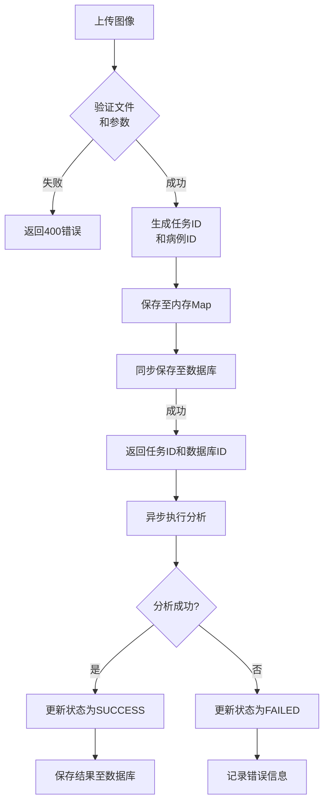
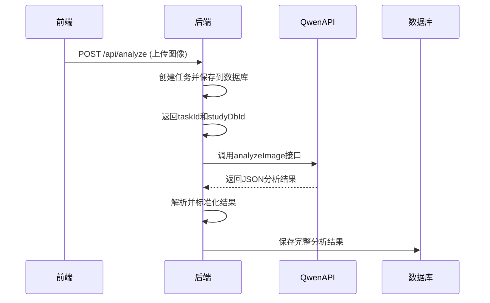

# AI分析API

> **本文档引用的文件**  
> - [analyze.js](file://server/routes/analyze.js) - *已重构以先保存数据库再返回响应*
> - [AnalysisTask.js](file://server/models/AnalysisTask.js) - *分析任务数据模型*
> - [Study.js](file://server/models/Study.js) - *病例数据模型*
> - [AnalysisResult.js](file://server/models/AnalysisResult.js) - *分析结果数据模型*
> - [apiService.ts](file://src/services/apiService.ts) - *前端API服务*
> - [analysisStore.ts](file://src/stores/analysisStore.ts) - *前端状态管理*

## 更新摘要
**变更内容**  
- 更新了`/api/analyze`端点的响应结构，新增`studyDbId`字段以返回数据库中的数字ID
- 重构了`analyze.js`文件中的任务创建流程，确保先将任务数据同步保存到数据库后再返回响应
- 更新了异步任务处理流程图，反映新的同步创建机制
- 更新了查询任务状态和根据studyId查询结果的响应示例
- 增加了对数据库同步机制的详细说明

## 目录
1. [简介](#简介)
2. [核心API端点](#核心api端点)
3. [异步任务处理流程](#异步任务处理流程)
4. [通义千问视觉大模型集成](#通义千问视觉大模型集成)
5. [状态同步机制](#状态同步机制)
6. [前端轮询实现](#前端轮询实现)
7. [诊断结果结构](#诊断结果结构)

## 简介
CervixDetectAI系统提供了一套完整的AI图像分析API，用于宫颈细胞学图像的自动化病理分析。该API支持上传医学图像、创建分析任务、查询任务状态以及获取最终诊断结果。整个分析过程采用异步处理模式，确保高并发场景下的系统稳定性与响应性能。近期更新重构了任务创建流程，现在系统会先将任务数据同步保存到数据库，然后再返回响应，同时在响应中增加了`studyDbId`字段以提供数据库中的数字ID。

**Section sources**
- [analyze.js](file://server/routes/analyze.js#L1-L378)
- [index.js](file://server/index.js#L1-L94)

## 核心API端点

### 上传图像并创建分析任务
- **端点**: `POST /api/analyze`
- **方法**: POST
- **内容类型**: `multipart/form-data`

#### 请求参数（form-data）
| 参数名 | 类型 | 必填 | 说明 |
|--------|------|------|------|
| image | File | 是 | 宫颈细胞学图像文件（JPG/PNG/TIFF） |
| patientName | String | 是 | 患者姓名 |
| patientId | String | 是 | 患者唯一标识 |
| studyDate | String | 是 | 检查日期（ISO格式） |
| modality | String | 是 | 检查类型（如：宫颈细胞学检查） |
| description | String | 否 | 检查描述 |

#### 成功响应（200 OK）
```json
{
  "taskId": "task_123e4567-e89b-12d3-a456-426614174000",
  "studyId": "study_123e4567-e89b-12d3-a456-426614174001",
  "studyDbId": 12345,
  "status": "PENDING",
  "estimatedTime": 30
}
```

#### 错误响应
- **400 Bad Request**: 缺少必填字段或文件格式不支持
- **500 Internal Server Error**: 服务器内部错误

**Section sources**
- [analyze.js](file://server/routes/analyze.js#L44-L121)

### 查询任务状态
- **端点**: `GET /api/analyze/:taskId`
- **方法**: GET

#### 响应数据结构
```json
{
  "taskId": "string",
  "studyId": "string",
  "studyDbId": "number",
  "status": "PENDING|PROCESSING|SUCCESS|FAILED",
  "progress": 0-100,
  "result": { /* 诊断结果 */ },
  "error": "string"
}
```

#### 状态码
- **200 OK**: 成功返回任务状态
- **404 Not Found**: 任务不存在

**Section sources**
- [analyze.js](file://server/routes/analyze.js#L127-L155)

### 根据studyId查询分析结果
- **端点**: `GET /api/analyze/study/:studyId`
- **方法**: GET

#### 响应数据结构
包含完整的任务信息、检查信息和诊断结果，包括新增的`studyDbId`字段。

#### 状态码
- **200 OK**: 找到对应分析结果
- **404 Not Found**: 未找到该病例的分析任务

**Section sources**
- [analyze.js](file://server/routes/analyze.js#L344-L375)

## 异步任务处理流程



**Diagram sources**
- [analyze.js](file://server/routes/analyze.js#L51-L338)

**Section sources**
- [analyze.js](file://server/routes/analyze.js#L44-L338)

## 通义千问视觉大模型集成



**Diagram sources**
- [qwenService.js](file://server/services/qwenService.js#L35-L255)
- [analyze.js](file://server/routes/analyze.js#L263-L265)

**Section sources**
- [qwenService.js](file://server/services/qwenService.js#L35-L255)

## 状态同步机制

### 内存与数据库双层存储
系统采用内存Map与数据库相结合的方式管理任务状态：

1. **内存Map**: 用于快速查询，提高响应速度
2. **数据库**: 用于持久化存储，保证数据可靠性

```javascript
// 内存存储示例
const tasks = new Map();
tasks.set(taskId, {
  taskId,
  studyId,
  studyDbId: 12345,
  status: 'PENDING',
  progress: 0,
  createdAt: new Date().toISOString(),
  dbIds: {
    patientId: 1001,
    studyId: 12345,
    analysisTaskId: 5001
  }
});
```

### 状态转换规则
| 当前状态 | 可转换状态 | 触发条件 |
|----------|------------|----------|
| PENDING | PROCESSING | 开始处理图像 |
| PROCESSING | SUCCESS | AI分析成功 |
| PROCESSING | FAILED | 分析过程出错 |
| SUCCESS | - | 终态 |
| FAILED | - | 终态 |

**Section sources**
- [analyze.js](file://server/routes/analyze.js#L45-L338)
- [AnalysisTask.js](file://server/models/AnalysisTask.js#L1-L109)

## 前端轮询实现

### 轮询函数
```typescript
export async function pollTaskStatus(
  taskId: string,
  onProgress?: (status: TaskStatusResponse) => void,
  interval = 2000,
  maxAttempts = 150
): Promise<TaskStatusResponse>
```

### 使用示例
```typescript
import { pollTaskStatus } from 'src/services/apiService';

try {
  const result = await pollTaskStatus('task_123', (status) => {
    console.log(`进度: ${status.progress}%`);
    console.log(`数据库ID: ${status.studyDbId}`);
  });
  console.log('分析完成:', result);
} catch (error) {
  console.error('分析失败:', error);
}
```

### Pinia状态管理
`analysisStore` 提供了完整的任务状态管理功能，包括：
- 任务轮询
- 状态更新
- 错误处理
- 本地缓存
- `studyDbId`字段的同步管理

**Section sources**
- [apiService.ts](file://src/services/apiService.ts#L1-L198)
- [analysisStore.ts](file://src/stores/analysisStore.ts#L1-L194)

## 诊断结果结构

### 最终诊断结果
```json
{
  "diagnosis": "HSIL (高度鳞状上皮内病变)",
  "confidence": 0.96,
  "risk_level": "high",
  "suspiciousAreas": [
    "宫颈转化区可见异型细胞聚集"
  ],
  "biomarkers": {
    "HPV": "阳性",
    "p16": "强阳性",
    "Ki67": "高表达"
  },
  "recommendations": [
    "建议进行阴道镜检查",
    "考虑宫颈活检以明确诊断",
    "定期随访监测病情变化"
  ],
  "detailedReport": "详细病理分析报告..."
}
```

### 数据库模型
| 字段 | 类型 | 说明 |
|------|------|------|
| diagnosis | STRING | 诊断结论 |
| confidence | DECIMAL(5,4) | 置信度（0-1） |
| risk_level | ENUM | 风险等级（low/medium/high/critical） |
| recommendations | JSON | 医疗建议列表 |
| suspicious_areas | JSON | 可疑区域坐标数据 |
| biomarkers | JSON | 生物标志物数据 |

**Section sources**
- [AnalysisResult.js](file://server/models/AnalysisResult.js#L1-L127)
- [qwenService.js](file://server/services/qwenService.js#L163-L177)