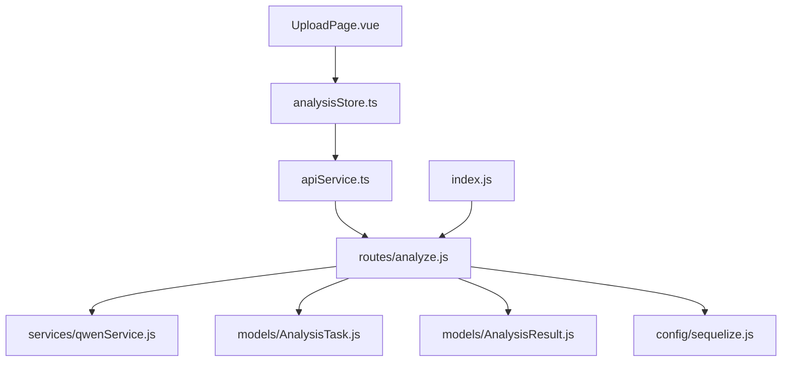
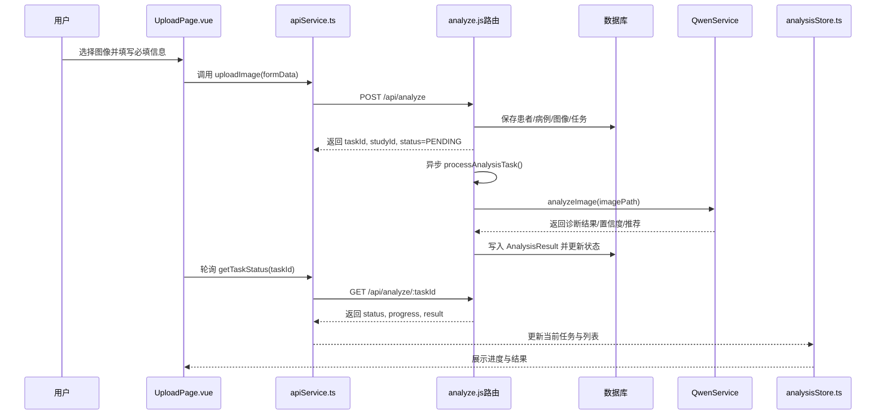
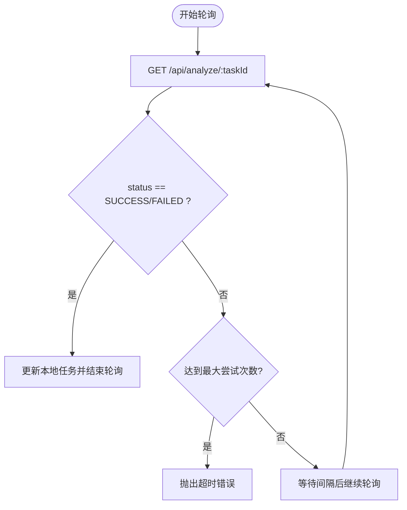
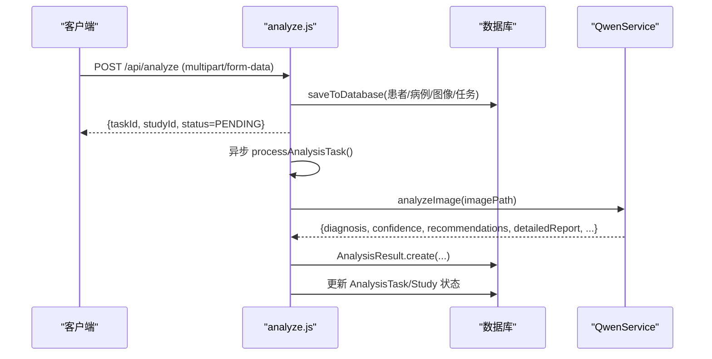
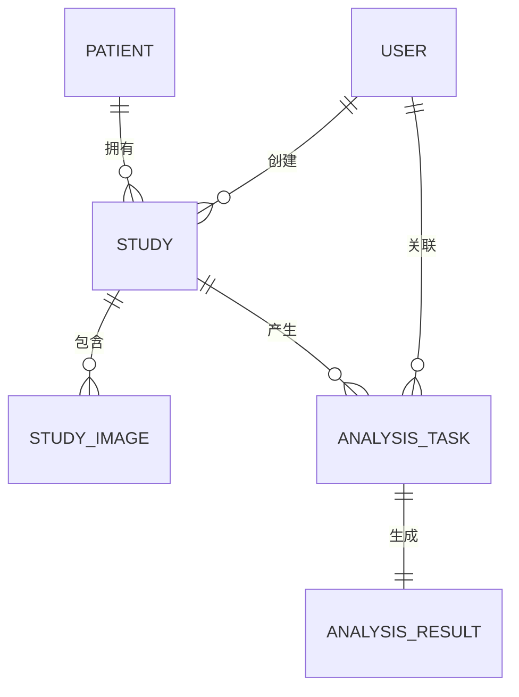
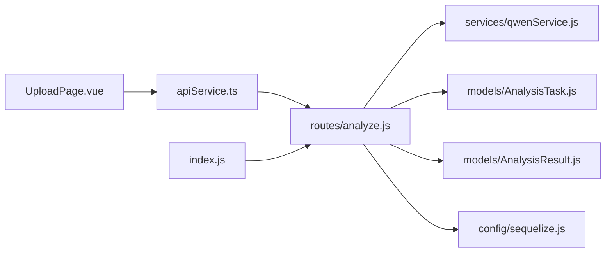

# AI分析同步创建说明

> **本文引用的文件**
> - [server/index.js](file://server/index.js)
> - [server/routes/analyze.js](file://server/routes/analyze.js)
> - [server/services/qwenService.js](file://server/services/qwenService.js)
> - [src/services/apiService.ts](file://src/services/apiService.ts)
> - [src/stores/analysisStore.ts](file://src/stores/analysisStore.ts)
> - [src/pages/UploadPage.vue](file://src/pages/UploadPage.vue)
> - [src/router/routes.ts](file://src/router/routes.ts)
> - [server/models/AnalysisTask.js](file://server/models/AnalysisTask.js)
> - [server/models/AnalysisResult.js](file://server/models/AnalysisResult.js)
> - [server/config/sequelize.js](file://server/config/sequelize.js)
> - [wiki/后端架构/业务逻辑层/AI分析服务.md](file://wiki/后端架构/业务逻辑层/AI分析服务.md)
> - [wiki/后端架构/外部集成/通义千问AI集成.md](file://wiki/后端架构/外部集成/通义千问AI集成.md)

## 目录
1. [简介](#简介)
2. [项目结构](#项目结构)
3. [核心组件](#核心组件)
4. [架构总览](#架构总览)
5. [详细组件分析](#详细组件分析)
6. [依赖关系分析](#依赖关系分析)
7. [性能考量](#性能考量)
8. [故障排查指南](#故障排查指南)
9. [结论](#结论)
10. [附录](#附录)

## 简介
本文件聚焦“AI分析同步创建”能力，即从前端上传图像并创建分析任务，到后端异步执行AI分析并将结果持久化与状态反馈的完整流程。该流程在后端通过路由层接收请求、在内存中登记任务、同步写入数据库并异步调用通义千问AI服务进行分析，随后将结果写回数据库并更新任务状态；前端通过状态轮询与Pinia状态管理实时展示进度与结果。

## 项目结构
- 前端(src)：Vue + Quasar + Pinia，负责用户界面、API调用与状态轮询。
- 后端(server)：Express + Sequelize，负责路由、业务逻辑、数据库与AI服务集成。
- Wiki：提供后端架构与外部集成的详细说明文档。

图表来源
- [server/index.js](file://server/index.js#L43-L56)
- [server/routes/analyze.js](file://server/routes/analyze.js#L1-L40)
- [server/services/qwenService.js](file://server/services/qwenService.js#L35-L52)
- [src/services/apiService.ts](file://src/services/apiService.ts#L1-L39)
- [src/stores/analysisStore.ts](file://src/stores/analysisStore.ts#L1-L37)
- [server/models/AnalysisTask.js](file://server/models/AnalysisTask.js#L1-L30)
- [server/models/AnalysisResult.js](file://server/models/AnalysisResult.js#L1-L30)
- [server/config/sequelize.js](file://server/config/sequelize.js#L1-L23)

章节来源
- [server/index.js](file://server/index.js#L43-L56)
- [src/router/routes.ts](file://src/router/routes.ts#L1-L20)

## 核心组件
- 前端
  - UploadPage.vue：负责图像选择、必填信息校验与调用上传接口。
  - apiService.ts：封装Axios请求、上传接口、任务状态轮询。
  - analysisStore.ts：Pinia状态管理，维护任务列表、当前任务、轮询定时器与状态更新。
- 后端
  - analyze.js：接收上传请求、保存任务到内存Map、同步写入数据库、异步执行AI分析、更新数据库与任务状态。
  - qwenService.js：封装通义千问API调用、图像Base64编码、响应解析与重试。
  - AnalysisTask/AnalysisResult：Sequelize模型，持久化任务与分析结果。
  - sequelize.js：数据库连接与同步工具。
- Wiki
  - AI分析服务.md、通义千问AI集成.md：提供流程图与实现要点说明。

章节来源
- [src/pages/UploadPage.vue](file://src/pages/UploadPage.vue#L300-L400)
- [src/services/apiService.ts](file://src/services/apiService.ts#L92-L141)
- [src/stores/analysisStore.ts](file://src/stores/analysisStore.ts#L48-L106)
- [server/routes/analyze.js](file://server/routes/analyze.js#L52-L144)
- [server/services/qwenService.js](file://server/services/qwenService.js#L84-L191)
- [server/models/AnalysisTask.js](file://server/models/AnalysisTask.js#L1-L30)
- [server/models/AnalysisResult.js](file://server/models/AnalysisResult.js#L1-L30)
- [server/config/sequelize.js](file://server/config/sequelize.js#L1-L23)
- [wiki/后端架构/业务逻辑层/AI分析服务.md](file://wiki/后端架构/业务逻辑层/AI分析服务.md#L1-L208)
- [wiki/后端架构/外部集成/通义千问AI集成.md](file://wiki/后端架构/外部集成/通义千问AI集成.md#L1-L242)

## 架构总览
AI分析同步创建涉及“前端上传 -> 后端接收与落库 -> 异步AI分析 -> 结果落库与状态更新 -> 前端轮询与展示”的闭环。

图表来源
- [src/pages/UploadPage.vue](file://src/pages/UploadPage.vue#L330-L407)
- [src/services/apiService.ts](file://src/services/apiService.ts#L92-L141)
- [server/routes/analyze.js](file://server/routes/analyze.js#L52-L144)
- [server/services/qwenService.js](file://server/services/qwenService.js#L84-L191)
- [server/models/AnalysisTask.js](file://server/models/AnalysisTask.js#L1-L30)
- [server/models/AnalysisResult.js](file://server/models/AnalysisResult.js#L1-L30)
- [src/stores/analysisStore.ts](file://src/stores/analysisStore.ts#L108-L166)

## 详细组件分析

### 前端：上传与轮询
- UploadPage.vue
  - 负责文件选择、必填字段校验、调用上传接口并跳转至病例详情页。
  - 成功后启动轮询，依据后端返回的taskId持续拉取状态。
- apiService.ts
  - uploadImage：构造FormData并POST到 /api/analyze。
  - getTaskStatus：按taskId查询任务状态。
  - pollTaskStatus：以固定间隔轮询直至完成或超时。
- analysisStore.ts
  - 维护任务列表、当前任务、轮询定时器。
  - 提供轮询完成后的最终状态更新与错误处理。

图表来源
- [src/services/apiService.ts](file://src/services/apiService.ts#L143-L192)
- [src/stores/analysisStore.ts](file://src/stores/analysisStore.ts#L108-L166)

章节来源
- [src/pages/UploadPage.vue](file://src/pages/UploadPage.vue#L330-L407)
- [src/services/apiService.ts](file://src/services/apiService.ts#L92-L141)
- [src/stores/analysisStore.ts](file://src/stores/analysisStore.ts#L108-L166)

### 后端：任务创建与异步分析
- analyze.js
  - POST /api/analyze：校验文件与必填字段，生成taskId/studyId，保存到内存Map，同步写入数据库，返回任务信息并异步执行分析。
  - GET /api/analyze/:taskId：查询任务状态（含progress/result/error）。
  - GET /api/analyze/study/:studyId：优先从数据库查询最新任务与结果，若数据库无则回退到内存Map或默认PENDING。
  - saveToDatabase：创建/查找患者、创建病例、创建StudyImage、创建AnalysisTask，并将数据库ID写回任务对象。
  - processAnalysisTask：更新任务状态为PROCESSING，调用QwenService进行分析，保存AnalysisResult，更新任务与Study状态。
- qwenService.js
  - analyzeImage：读取图像为Base64，构造消息数组，调用通义千问API，解析JSON响应，标准化字段，支持重试与错误格式化。
- Sequelize模型
  - AnalysisTask：任务主表，包含状态、进度、开始/完成时间、错误信息等。
  - AnalysisResult：分析结果表，包含诊断、置信度、风险等级、推荐、可疑区域、生物标志物、详细报告等。

图表来源
- [server/routes/analyze.js](file://server/routes/analyze.js#L52-L144)
- [server/routes/analyze.js](file://server/routes/analyze.js#L187-L259)
- [server/routes/analyze.js](file://server/routes/analyze.js#L265-L363)
- [server/services/qwenService.js](file://server/services/qwenService.js#L84-L191)
- [server/models/AnalysisTask.js](file://server/models/AnalysisTask.js#L1-L30)
- [server/models/AnalysisResult.js](file://server/models/AnalysisResult.js#L1-L30)

章节来源
- [server/routes/analyze.js](file://server/routes/analyze.js#L52-L144)
- [server/routes/analyze.js](file://server/routes/analyze.js#L187-L259)
- [server/routes/analyze.js](file://server/routes/analyze.js#L265-L363)
- [server/services/qwenService.js](file://server/services/qwenService.js#L84-L191)
- [server/models/AnalysisTask.js](file://server/models/AnalysisTask.js#L1-L30)
- [server/models/AnalysisResult.js](file://server/models/AnalysisResult.js#L1-L30)

### 数据模型与关系
- AnalysisTask
  - 主键id，关联Study与User，枚举状态(PENDING/PROCESSING/SUCCESS/FAILED)，进度0-100，时间戳与错误信息。
- AnalysisResult
  - 唯一关联AnalysisTask与Study，包含诊断、置信度、风险等级、推荐、可疑区域、生物标志物、详细报告、原始输出等。
- 关系
  - 一个Study可对应多个AnalysisTask（按时间排序取最新），AnalysisResult唯一对应一个AnalysisTask。

图表来源
- [server/models/AnalysisTask.js](file://server/models/AnalysisTask.js#L1-L30)
- [server/models/AnalysisResult.js](file://server/models/AnalysisResult.js#L1-L30)

章节来源
- [server/models/AnalysisTask.js](file://server/models/AnalysisTask.js#L1-L30)
- [server/models/AnalysisResult.js](file://server/models/AnalysisResult.js#L1-L30)

## 依赖关系分析
- 前端依赖
  - apiService.ts依赖Axios，封装上传、查询与轮询。
  - analysisStore.ts依赖apiService.ts与路由，维护轮询定时器与任务状态。
  - UploadPage.vue依赖analysisStore与apiService，触发上传与跳转。
- 后端依赖
  - index.js注册路由、静态资源与错误处理。
  - analyze.js依赖multer、uuid、qwenService、models与auth中间件。
  - qwenService.js依赖axios与fs，封装通义千问调用。
  - models依赖sequelize，sequelize.js提供连接与同步。

图表来源
- [src/pages/UploadPage.vue](file://src/pages/UploadPage.vue#L330-L407)
- [src/services/apiService.ts](file://src/services/apiService.ts#L92-L141)
- [server/index.js](file://server/index.js#L43-L56)
- [server/routes/analyze.js](file://server/routes/analyze.js#L1-L40)
- [server/services/qwenService.js](file://server/services/qwenService.js#L35-L52)
- [server/models/AnalysisTask.js](file://server/models/AnalysisTask.js#L1-L30)
- [server/models/AnalysisResult.js](file://server/models/AnalysisResult.js#L1-L30)
- [server/config/sequelize.js](file://server/config/sequelize.js#L1-L23)

章节来源
- [src/pages/UploadPage.vue](file://src/pages/UploadPage.vue#L330-L407)
- [src/services/apiService.ts](file://src/services/apiService.ts#L92-L141)
- [server/index.js](file://server/index.js#L43-L56)
- [server/routes/analyze.js](file://server/routes/analyze.js#L1-L40)
- [server/services/qwenService.js](file://server/services/qwenService.js#L35-L52)
- [server/models/AnalysisTask.js](file://server/models/AnalysisTask.js#L1-L30)
- [server/models/AnalysisResult.js](file://server/models/AnalysisResult.js#L1-L30)
- [server/config/sequelize.js](file://server/config/sequelize.js#L1-L23)

## 性能考量
- 上传与解析
  - 前端使用FormData上传，后端multer限制文件大小与MIME类型，避免过大或非图像文件占用资源。
- 轮询策略
  - 前端默认每2秒轮询一次，最大尝试150次（约5分钟），可根据需求调整间隔与上限。
- AI调用
  - QwenService内置重试与指数退避延迟，减少网络抖动与限流影响。
- 数据库
  - AnalysisTask/AnalysisResult建立索引，查询最新任务与结果效率较高。
- I/O与并发
  - 任务状态Map仅用于快速查询，生产环境建议替换为Redis等持久化缓存以提升可靠性与并发能力。

章节来源
- [src/services/apiService.ts](file://src/services/apiService.ts#L143-L192)
- [server/routes/analyze.js](file://server/routes/analyze.js#L36-L43)
- [server/services/qwenService.js](file://server/services/qwenService.js#L182-L191)
- [server/models/AnalysisTask.js](file://server/models/AnalysisTask.js#L80-L97)
- [server/models/AnalysisResult.js](file://server/models/AnalysisResult.js#L103-L124)

## 故障排查指南
- 常见错误与定位
  - 上传失败：检查必填字段、文件格式与大小限制；确认后端静态目录存在且可写。
  - 数据库连接失败：检查数据库配置与连接字符串；运行测试连接。
  - AI调用失败：检查QWEN_API_KEY、QWEN_API_URL与模型名称；关注重试与超时。
  - 轮询超时：增大最大尝试次数或缩短轮询间隔；检查后端任务是否进入PROCESSING。
- 日志与可观测性
  - 后端在关键节点打印日志（创建任务、保存数据库、AI调用、状态更新）。
  - 前端在上传、轮询与错误时弹出通知，便于用户感知。
- 重试与降级
  - QwenService对网络错误、限流与5xx错误进行重试；若仍失败，返回格式化错误信息。
  - 若数据库写入失败，删除已上传文件并返回错误；前端提示重试或检查服务状态。

章节来源
- [server/index.js](file://server/index.js#L63-L75)
- [server/routes/analyze.js](file://server/routes/analyze.js#L120-L144)
- [server/services/qwenService.js](file://server/services/qwenService.js#L199-L249)
- [src/pages/UploadPage.vue](file://src/pages/UploadPage.vue#L448-L476)

## 结论
“AI分析同步创建”在本项目中通过“前端上传 + 后端落库 + 异步AI分析 + 结果回写 + 前端轮询”的闭环实现，具备清晰的职责划分与良好的错误处理与重试机制。生产环境中建议引入持久化缓存与更严格的监控告警，以进一步提升稳定性与用户体验。

## 附录
- 关键流程图与序列图详见Wiki文档：
  - [AI分析服务.md](file://wiki/后端架构/业务逻辑层/AI分析服务.md#L1-L208)
  - [通义千问AI集成.md](file://wiki/后端架构/外部集成/通义千问AI集成.md#L1-L242)