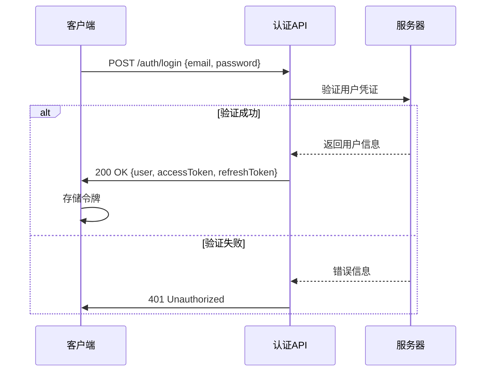
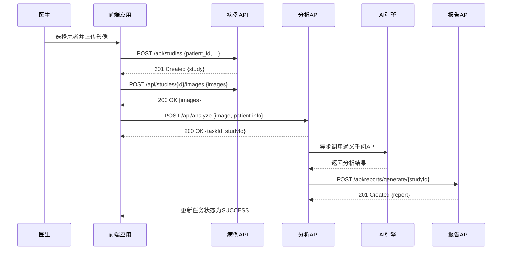
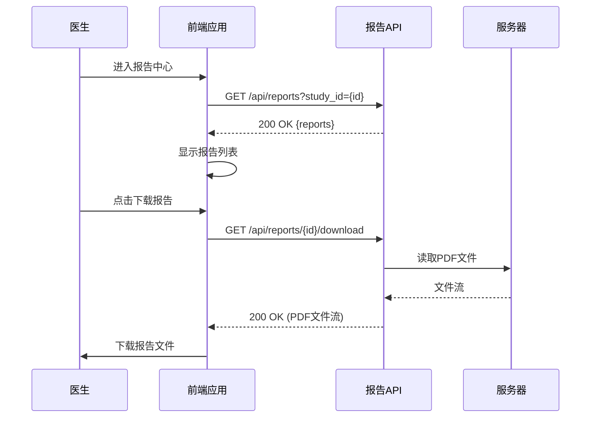

# API端点参考

> **Referenced Files in This Document**   
> - [auth.js](file://server/routes/auth.js)
> - [sms-auth.js](file://server/routes/sms-auth.js)
> - [studies.js](file://server/routes/studies.js)
> - [analyze.js](file://server/routes/analyze.js)
> - [chat.js](file://server/routes/chat.js)
> - [reports.js](file://server/routes/reports.js)
> - [authStore.ts](file://src/stores/authStore.ts)
> - [api.ts](file://src/services/api.ts)
> - [studyStore.ts](file://src/stores/studyStore.ts)
> - [ReportsPage.vue](file://src/pages/ReportsPage.vue)

## 目录
1. [简介](#简介)
2. [认证端点](#认证端点)
   - [/auth/login](#authlogin)
   - [/api/auth/sms/login](#apiauthsmslogin)
   - [/api/auth/sms/register](#apiauthsmsregister)
   - [/api/auth/refresh](#apiauthrefresh)
3. [病例管理端点](#病例管理端点)
   - [/api/studies](#apistudies)
   - [/api/studies/:id](#apistudiesid)
   - [/api/studies/:id/images](#apistudiesidimages)
4. [AI分析端点](#ai分析端点)
   - [/api/analyze](#apianalyze)
   - [/api/analyze/:taskId](#apianalyzetaskid)
   - [/api/chat](#apichat)
5. [报告管理端点](#报告管理端点)
   - [/api/reports](#apireports)
   - [/api/reports/generate/:studyId](#apireportsgeneratestudyid)
   - [/api/reports/:id/download](#apireportsiddownload)
6. [业务流程集成](#业务流程集成)

## 简介
CervixDetectAI后端API提供了一套完整的RESTful接口，用于支持宫颈癌AI辅助诊断系统的各项功能。本参考文档详细说明了核心API端点的使用方法，包括HTTP方法、URL路径、请求参数、响应格式、状态码和认证要求。API设计遵循标准的REST原则，使用JSON作为数据交换格式，并通过JWT（JSON Web Token）进行安全认证。

系统的核心业务流程包括用户登录、病例上传、AI分析触发和报告获取。用户首先通过邮箱密码或短信验证码登录系统，然后上传宫颈细胞学检查影像，系统会自动触发AI分析流程，最终生成诊断报告供医生查看和下载。

**Section sources**
- [auth.js](file://server/routes/auth.js#L1-L306)
- [sms-auth.js](file://server/routes/sms-auth.js#L1-L492)
- [studies.js](file://server/routes/studies.js#L1-L530)
- [analyze.js](file://server/routes/analyze.js#L1-L378)
- [reports.js](file://server/routes/reports.js#L1-L488)

## 认证端点
认证端点负责用户的身份验证和会话管理。系统支持两种登录方式：传统的邮箱密码登录和基于短信验证码的登录。所有需要认证的API端点都要求在请求头中包含有效的JWT访问令牌。

### /auth/login
此端点用于用户的邮箱密码登录。客户端需要提供注册时使用的邮箱和密码。

- **HTTP方法**: POST
- **URL路径**: `/auth/login`
- **请求头**: 无特殊要求
- **请求参数 (body)**:
  - `email` (string, 必填): 用户注册邮箱
  - `password` (string, 必填): 用户密码
- **响应格式 (JSON)**:
```json
{
  "success": true,
  "message": "登录成功",
  "data": {
    "user": {
      "id": 1,
      "username": "user1",
      "email": "user1@example.com",
      "real_name": "张三",
      "role": "user",
      "status": "active",
      "last_login_at": "2024-01-01T00:00:00.000Z"
    },
    "accessToken": "jwt_access_token",
    "refreshToken": "jwt_refresh_token"
  }
}
```
- **状态码**:
  - `200`: 登录成功
  - `400`: 请求参数错误（邮箱或密码为空）
  - `401`: 认证失败（邮箱或密码错误）
  - `403`: 账号被禁用或未激活
  - `500`: 服务器内部错误
- **认证要求**: 无需认证

**Section sources**
- [auth.js](file://server/routes/auth.js#L112-L189)

### /api/auth/sms/login
此端点用于基于短信验证码的登录。用户输入手机号和收到的验证码即可登录。

- **HTTP方法**: POST
- **URL路径**: `/api/auth/sms/login`
- **请求头**: 无特殊要求
- **请求参数 (body)**:
  - `phone` (string, 必填): 用户手机号
  - `code` (string, 必填): 短信验证码
- **响应格式 (JSON)**:
```json
{
  "success": true,
  "message": "登录成功",
  "data": {
    "user": {
      "id": 1,
      "username": "user1",
      "email": "user1@example.com",
      "real_name": "张三",
      "phone": "13800138000",
      "role": "user",
      "status": "active",
      "last_login_at": "2024-01-01T00:00:00.000Z"
    },
    "accessToken": "jwt_access_token",
    "refreshToken": "jwt_refresh_token"
  }
}
```
- **状态码**:
  - `200`: 登录成功
  - `400`: 请求参数错误或验证码错误/已过期
  - `404`: 手机号未注册
  - `403`: 账号被禁用
  - `500`: 服务器内部错误
- **认证要求**: 无需认证

**Section sources**
- [sms-auth.js](file://server/routes/sms-auth.js#L170-L270)

### /api/auth/sms/register
此端点用于基于短信验证码的用户注册。用户通过手机号和验证码完成注册，无需设置初始密码。

- **HTTP方法**: POST
- **URL路径**: `/api/auth/sms/register`
- **请求头**: 无特殊要求
- **请求参数 (body)**:
  - `phone` (string, 必填): 用户手机号
  - `code` (string, 必填): 短信验证码
  - `username` (string, 可选): 用户名
  - `real_name` (string, 可选): 真实姓名
  - `email` (string, 可选): 邮箱地址
- **响应格式 (JSON)**:
```json
{
  "success": true,
  "message": "注册成功",
  "data": {
    "user": {
      "id": 2,
      "username": "user_13800138000",
      "email": "13800138000@temp.local",
      "real_name": "李四",
      "phone": "13800138000",
      "role": "user",
      "status": "active"
    },
    "accessToken": "jwt_access_token",
    "refreshToken": "jwt_refresh_token"
  }
}
```
- **状态码**:
  - `201`: 注册成功
  - `400`: 请求参数错误
  - `409`: 手机号已被注册
  - `500`: 服务器内部错误
- **认证要求**: 无需认证

**Section sources**
- [sms-auth.js](file://server/routes/sms-auth.js#L276-L404)

### /api/auth/refresh
此端点用于刷新访问令牌。当访问令牌过期时，客户端可以使用刷新令牌获取新的访问令牌，以保持会话的连续性。

- **HTTP方法**: POST
- **URL路径**: `/api/auth/refresh`
- **请求头**: 无特殊要求
- **请求参数 (body)**:
  - `refreshToken` (string, 必填): 刷新令牌
- **响应格式 (JSON)**:
```json
{
  "success": true,
  "message": "令牌刷新成功",
  "data": {
    "accessToken": "new_jwt_access_token"
  }
}
```
- **状态码**:
  - `200`: 令牌刷新成功
  - `400`: 未提供刷新令牌
  - `401`: 刷新令牌无效或已过期
  - `500`: 服务器内部错误
- **认证要求**: 无需认证

**Section sources**
- [auth.js](file://server/routes/auth.js#L195-L249)

## 病例管理端点
病例管理端点负责处理与医学病例相关的所有操作，包括病例的创建、查询、更新和删除，以及影像文件的上传和管理。

### /api/studies
此端点用于创建新的医学病例。每个病例关联一个患者，并包含检查的基本信息。

- **HTTP方法**: POST
- **URL路径**: `/api/studies`
- **请求头**: `Authorization: Bearer <access_token>`
- **请求参数 (body)**:
  - `patient_id` (number, 必填): 患者ID
  - `study_date` (string, 必填): 检查日期 (ISO 8601格式)
  - `study_type` (string, 必填): 检查类型 (如 "宫颈细胞学检查")
  - `description` (string, 可选): 病例描述
  - `department` (string, 可选): 科室
  - `doctor_name` (string, 可选): 医生姓名
  - `clinical_diagnosis` (string, 可选): 临床诊断
  - `symptoms` (string, 可选): 症状
- **响应格式 (JSON)**:
```json
{
  "success": true,
  "message": "病例创建成功",
  "data": {
    "study": {
      "id": 1,
      "study_id": "study_abc123",
      "patient_id": 1,
      "user_id": 1,
      "study_date": "2024-01-01T00:00:00.000Z",
      "study_type": "宫颈细胞学检查",
      "description": "常规检查",
      "status": "pending",
      "patient": {
        "id": 1,
        "patient_id": "pat_001",
        "name": "王女士",
        "gender": "female"
      },
      "creator": {
        "id": 1,
        "username": "doctor1",
        "real_name": "张医生"
      }
    }
  }
}
```
- **状态码**:
  - `201`: 病例创建成功
  - `400`: 请求参数错误
  - `403`: 无权为该患者创建病例
  - `404`: 患者不存在
  - `500`: 服务器内部错误
- **认证要求**: 必需 (JWT访问令牌)

**Section sources**
- [studies.js](file://server/routes/studies.js#L46-L118)

### /api/studies/:id
此端点用于获取指定ID的病例详情，包括病例的基本信息、患者信息、创建者信息、影像列表和分析任务。

- **HTTP方法**: GET
- **URL路径**: `/api/studies/:id`
- **请求头**: `Authorization: Bearer <access_token>`
- **请求参数 (path)**:
  - `id` (number, 必填): 病例ID
- **响应格式 (JSON)**:
```json
{
  "success": true,
  "data": {
    "study": {
      "id": 1,
      "study_id": "study_abc123",
      "patient_id": 1,
      "user_id": 1,
      "study_date": "2024-01-01T00:00:00.000Z",
      "study_type": "宫颈细胞学检查",
      "description": "常规检查",
      "status": "completed",
      "patient": {
        "id": 1,
        "patient_id": "pat_001",
        "name": "王女士",
        "gender": "female"
      },
      "creator": {
        "id": 1,
        "username": "doctor1",
        "real_name": "张医生"
      },
      "images": [
        {
          "id": 1,
          "file_path": "/uploads/studies/study-123.jpg",
          "original_filename": "cervix.jpg",
          "created_at": "2024-01-01T00:00:00.000Z"
        }
      ],
      "analysis_tasks": [
        {
          "id": 1,
          "task_id": "task_xyz789",
          "status": "SUCCESS",
          "progress": 100,
          "result": {
            "diagnosis": "HSIL",
            "confidence": 0.95
          }
        }
      ]
    }
  }
}
```
- **状态码**:
  - `200`: 获取成功
  - `403`: 无权访问该病例
  - `404`: 病例不存在
  - `500`: 服务器内部错误
- **认证要求**: 必需 (JWT访问令牌)

**Section sources**
- [studies.js](file://server/routes/studies.js#L306-L349)

### /api/studies/:id/images
此端点用于向指定病例上传影像文件。系统支持JPEG、PNG、TIFF和BMP格式的医学影像。

- **HTTP方法**: POST
- **URL路径**: `/api/studies/:id/images`
- **请求头**: 
  - `Authorization: Bearer <access_token>`
  - `Content-Type: multipart/form-data`
- **请求参数 (path)**:
  - `id` (number, 必填): 病例ID
- **请求参数 (form-data)**:
  - `images` (file array, 必填): 影像文件，最多10个，每个不超过20MB
- **响应格式 (JSON)**:
```json
{
  "success": true,
  "message": "成功上传 2 个影像文件",
  "data": {
    "images": [
      {
        "id": 1,
        "file_path": "/uploads/studies/study-123.jpg",
        "original_filename": "cervix1.jpg",
        "file_size": 153600,
        "mime_type": "image/jpeg",
        "created_at": "2024-01-01T00:00:00.000Z"
      },
      {
        "id": 2,
        "file_path": "/uploads/studies/study-456.png",
        "original_filename": "cervix2.png",
        "file_size": 204800,
        "mime_type": "image/png",
        "created_at": "2024-01-01T00:00:00.000Z"
      }
    ]
  }
}
```
- **状态码**:
  - `200`: 上传成功
  - `400`: 请求参数错误或缺少文件
  - `403`: 无权上传影像
  - `404`: 病例不存在
  - `500`: 服务器内部错误
- **认证要求**: 必需 (JWT访问令牌)

**Section sources**
- [studies.js](file://server/routes/studies.js#L132-L186)

## AI分析端点
AI分析端点负责处理AI分析任务的创建和状态查询。系统使用通义千问API对上传的宫颈细胞学影像进行AI分析。

### /api/analyze
此端点用于上传图像并创建AI分析任务。客户端上传图像文件和病例相关信息，服务器会立即返回任务ID，分析过程在后台异步执行。

- **HTTP方法**: POST
- **URL路径**: `/api/analyze`
- **请求头**: 
  - `Authorization: Bearer <access_token>` (可选，用于记录用户)
  - `Content-Type: multipart/form-data`
- **请求参数 (form-data)**:
  - `image` (file, 必填): 宫颈细胞学影像文件
  - `patientName` (string, 必填): 患者姓名
  - `patientId` (string, 必填): 患者ID
  - `studyDate` (string, 必填): 检查日期
  - `modality` (string, 必填): 检查方式
  - `description` (string, 可选): 描述
- **响应格式 (JSON)**:
```json
{
  "taskId": "task_abc123",
  "studyId": "study_xyz789",
  "status": "PENDING",
  "estimatedTime": 30
}
```
- **状态码**:
  - `200`: 任务创建成功
  - `400`: 请求参数错误或缺少文件
  - `500`: 服务器内部错误
- **认证要求**: 可选 (JWT访问令牌)

**Section sources**
- [analyze.js](file://server/routes/analyze.js#L51-L107)

### /api/analyze/:taskId
此端点用于查询指定AI分析任务的状态。客户端可以轮询此端点以获取任务的最新状态和分析结果。

- **HTTP方法**: GET
- **URL路径**: `/api/analyze/:taskId`
- **请求头**: 无特殊要求
- **请求参数 (path)**:
  - `taskId` (string, 必填): 任务ID
- **响应格式 (JSON)**:
```json
{
  "taskId": "task_abc123",
  "studyId": "study_xyz789",
  "status": "SUCCESS",
  "progress": 100,
  "result": {
    "diagnosis": "HSIL",
    "confidence": 0.95,
    "recommendations": ["建议进行阴道镜检查", "建议进行宫颈活检"],
    "suspiciousAreas": [[100, 200], [300, 400]]
  },
  "createdAt": "2024-01-01T00:00:00.000Z",
  "completedAt": "2024-01-01T00:00:30.000Z"
}
```
- **状态码**:
  - `200`: 查询成功
  - `404`: 任务不存在
  - `500`: 服务器内部错误
- **认证要求**: 无需认证

**Section sources**
- [analyze.js](file://server/routes/analyze.js#L127-L155)

### /api/chat
此端点用于在病例详情中进行 AI 对话追问，采用 SSE 流式返回。服务端会结合病例分析结果构建系统上下文，并按阶段返回思考过程与正式回答。

- **HTTP方法**: POST
- **URL路径**: `/api/chat`
- **请求头**:
  - `Content-Type: application/json`
  - `Authorization: Bearer <access_token>` (可选)
- **请求参数 (body)**:
  - `studyId` (number, 可选): 病例ID
  - `message` (string, 必填): 用户输入内容
  - `history` (array, 可选): 对话历史，元素为 `{ role, content }`
  - `enableThinking` (boolean, 可选): 是否启用深度思考，默认 `true`
- **响应格式**: `text/event-stream`
- **SSE分片示例**:
```json
{"type":"reasoning","content":"..."}
{"type":"content","content":"..."}
{"type":"error","content":"..."}
```
- **结束标记**: `data: [DONE]`
- **状态码**:
  - `200`: 流式对话建立成功
  - `400`: 请求参数错误
  - `500`: 服务器内部错误
- **认证要求**: 可选 (JWT访问令牌)

**Section sources**
- [chat.js](file://server/routes/chat.js#L90-L252)

## 报告管理端点
报告管理端点负责处理医疗报告的生成、查询、更新和下载。报告可以基于AI分析结果自动生成，也可以由医生手动创建和编辑。

### /api/reports
此端点用于创建新的医疗报告。报告可以是手动创建的，也可以是基于AI分析结果生成的。

- **HTTP方法**: POST
- **URL路径**: `/api/reports`
- **请求头**: `Authorization: Bearer <access_token>`
- **请求参数 (body)**:
  - `study_id` (number, 必填): 关联的病例ID
  - `report_type` (string, 必填): 报告类型 (如 "ai_analysis", "manual")
  - `content` (string, 可选): 报告内容 (JSON字符串)
  - `doctor_name` (string, 可选): 医生姓名
  - `doctor_title` (string, 可选): 医生职称
- **响应格式 (JSON)**:
```json
{
  "success": true,
  "message": "报告创建成功",
  "data": {
    "report": {
      "id": 1,
      "report_id": "rep_001",
      "study_id": 1,
      "generated_by": 1,
      "report_type": "ai_analysis",
      "content": "{...}",
      "doctor_name": "张医生",
      "status": "draft",
      "study": {
        "id": 1,
        "study_id": "study_abc123",
        "study_date": "2024-01-01T00:00:00.000Z",
        "patient": {
          "id": 1,
          "name": "王女士"
        }
      }
    }
  }
}
```
- **状态码**:
  - `201`: 报告创建成功
  - `400`: 请求参数错误
  - `403`: 无权为该病例创建报告
  - `404`: 病例不存在
  - `500`: 服务器内部错误
- **认证要求**: 必需 (JWT访问令牌)

**Section sources**
- [reports.js](file://server/routes/reports.js#L14-L76)

### /api/reports/generate/:studyId
此端点用于基于指定病例的AI分析结果自动生成医疗报告。系统会查找最新的分析结果，并根据结果生成结构化的报告内容。

- **HTTP方法**: POST
- **URL路径**: `/api/reports/generate/:studyId`
- **请求头**: `Authorization: Bearer <access_token>`
- **请求参数 (path)**:
  - `studyId` (number, 必填): 病例ID
- **响应格式 (JSON)**:
```json
{
  "success": true,
  "message": "报告生成成功",
  "data": {
    "report": {
      "id": 1,
      "report_id": "rep_001",
      "study_id": 1,
      "generated_by": 1,
      "report_type": "ai_analysis",
      "content": "{\"patient_info\":{...},\"analysis_result\":{\"risk_level\":\"high\",\"confidence_score\":0.95}}",
      "doctor_name": "张医生",
      "status": "draft"
    }
  }
}
```
- **状态码**:
  - `201`: 报告生成成功
  - `400`: 未找到分析结果
  - `403`: 无权为该病例生成报告
  - `404`: 病例不存在
  - `500`: 服务器内部错误
- **认证要求**: 必需 (JWT访问令牌)

**Section sources**
- [reports.js](file://server/routes/reports.js#L90-L193)

### /api/reports/:id/download
此端点用于下载指定的医疗报告PDF文件。报告文件以附件形式返回，客户端可以直接下载。

- **HTTP方法**: GET
- **URL路径**: `/api/reports/:id/download`
- **请求头**: `Authorization: Bearer <access_token>`
- **请求参数 (path)**:
  - `id` (number, 必填): 报告ID
- **响应格式**: PDF文件流
- **响应头**:
  - `Content-Type: application/pdf`
  - `Content-Disposition: attachment; filename="report_id.pdf"`
- **状态码**:
  - `200`: 下载成功
  - `403`: 无权下载该报告
  - `404`: 报告不存在或PDF文件未生成
  - `500`: 服务器内部错误
- **认证要求**: 必需 (JWT访问令牌)

**Section sources**
- [reports.js](file://server/routes/reports.js#L387-L429)

## 业务流程集成
CervixDetectAI系统的业务流程涉及多个API端点的协同工作。以下是一个完整的用户操作流程示例，从登录到获取最终报告。

### 用户登录流程
用户可以通过邮箱密码或短信验证码登录系统。登录成功后，服务器返回访问令牌和刷新令牌，客户端需要将这些令牌存储在本地（如localStorage），并在后续请求中通过`Authorization`头发送。



**Diagram sources**
- [auth.js](file://server/routes/auth.js#L112-L189)
- [authStore.ts](file://src/stores/authStore.ts#L64-L84)

### 病例上传与AI分析流程
医生上传宫颈细胞学影像后，系统会自动创建病例并触发AI分析流程。此流程涉及多个API端点的调用。



**Diagram sources**
- [studies.js](file://server/routes/studies.js#L46-L186)
- [analyze.js](file://server/routes/analyze.js#L51-L107)
- [reports.js](file://server/routes/reports.js#L90-L193)

### 报告获取与下载流程
AI分析完成后，医生可以查看和下载生成的诊断报告。前端应用会查询报告列表，并提供下载功能。



**Diagram sources**
- [reports.js](file://server/routes/reports.js#L207-L305)
- [reports.js](file://server/routes/reports.js#L387-L429)
- [ReportsPage.vue](file://src/pages/ReportsPage.vue#L1-L42)
