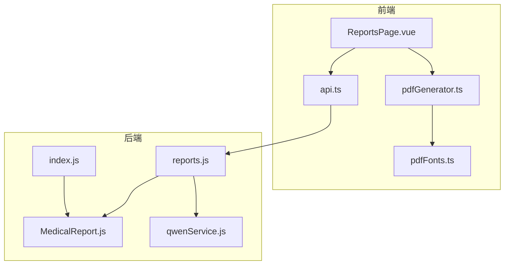
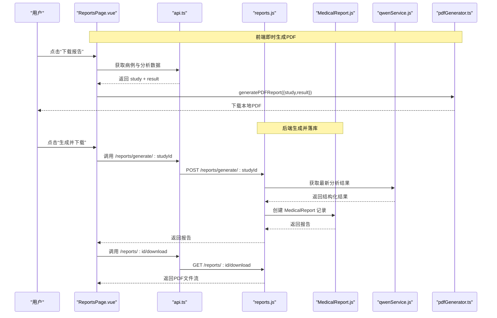
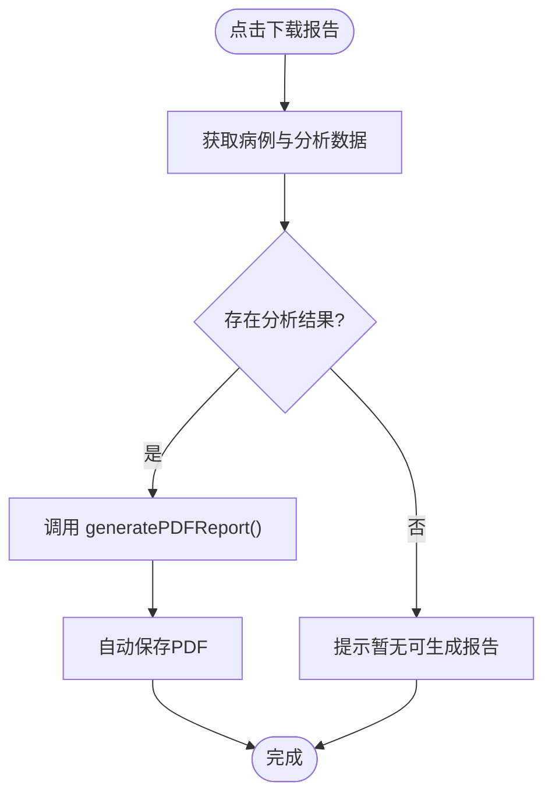
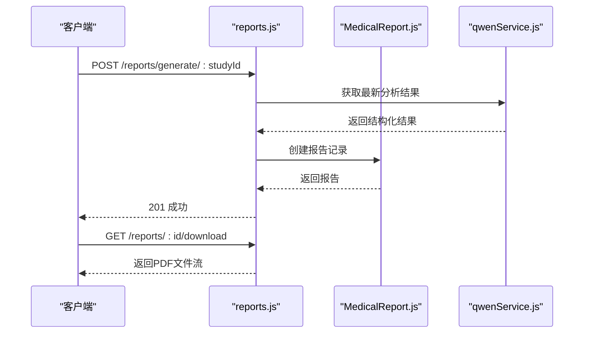
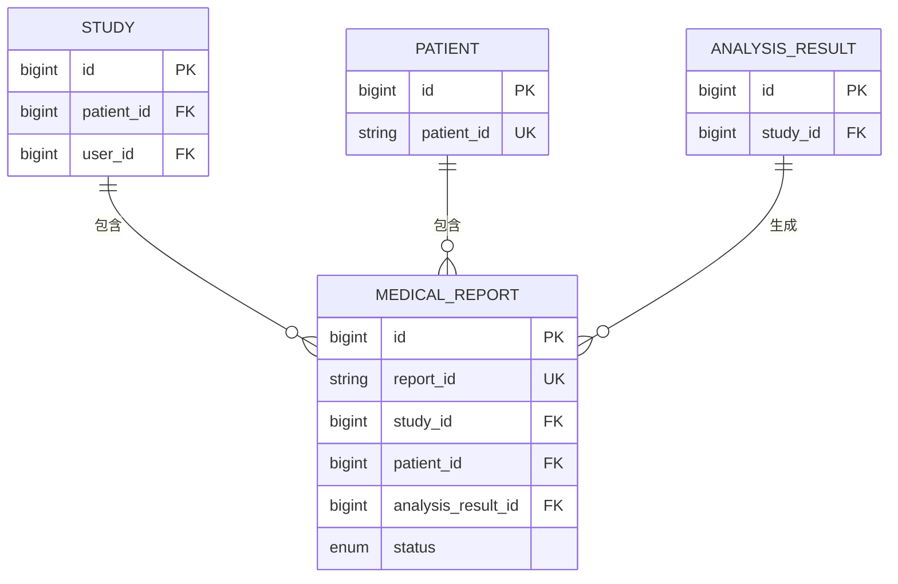
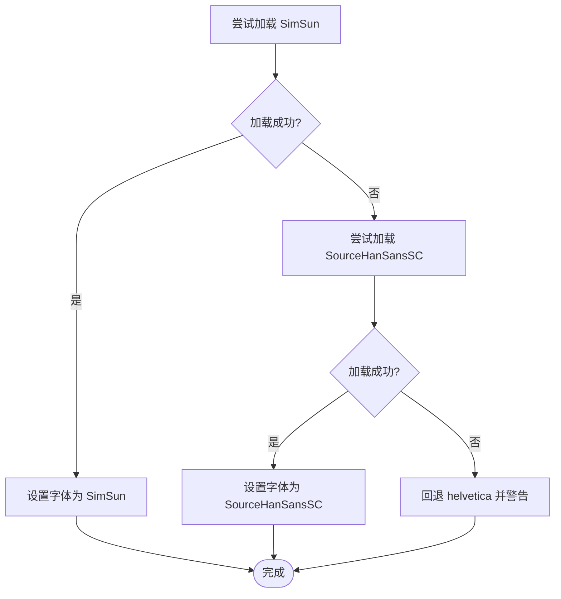
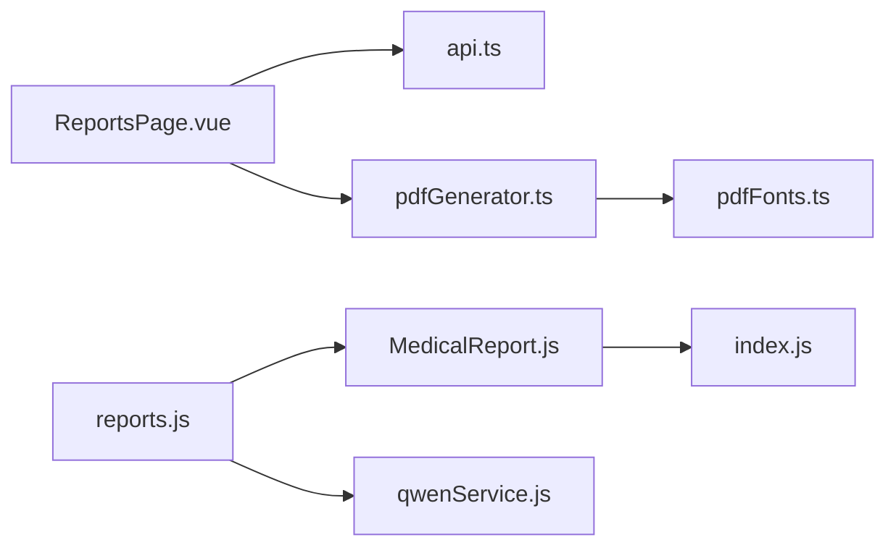

# PDF报告生成说明

> **本文引用的文件**
> - [pdfGenerator.ts](file://src/utils/pdfGenerator.ts)
> - [pdfFonts.ts](file://src/utils/pdfFonts.ts)
> - [ReportsPage.vue](file://src/pages/ReportsPage.vue)
> - [reports.js](file://server/routes/reports.js)
> - [MedicalReport.js](file://server/models/MedicalReport.js)
> - [index.js](file://server/models/index.js)
> - [qwenService.js](file://server/services/qwenService.js)
> - [api.ts](file://src/services/api.ts)
> - [报告管理API.md](file://wiki/后端架构/API端点参考/报告管理API.md)
> - [报告生成服务.md](file://wiki/后端架构/业务逻辑层/报告生成服务.md)

## 目录
1. [简介](#简介)
2. [项目结构](#项目结构)
3. [核心组件](#核心组件)
4. [架构总览](#架构总览)
5. [详细组件分析](#详细组件分析)
6. [依赖分析](#依赖分析)
7. [性能考量](#性能考量)
8. [故障排查指南](#故障排查指南)
9. [结论](#结论)
10. [附录](#附录)

## 简介
本文件聚焦于“PDF 报告生成”功能，覆盖从前端触发、后端生成、AI分析、数据库落盘到 PDF 下载的完整链路。系统支持两种报告生成路径：
- 在线即时生成：前端直接调用 PDF 工具生成本地 PDF 并自动下载。
- 后端生成并落库：后端基于 AI 分析结果生成结构化报告并持久化，随后可下载。

## 项目结构
围绕 PDF 报告生成的关键文件与职责如下：
- 前端
  - ReportsPage.vue：展示已完成的病例列表，提供“下载报告”入口，调用 PDF 工具生成并下载。
  - pdfGenerator.ts：统一的 PDF 报告生成器，负责布局、中文字体、分页与页脚。
  - pdfFonts.ts：中文字体加载与降级策略。
  - api.ts：前端 API 客户端，封装后端接口调用。
- 后端
  - reports.js：报告相关 API（创建、生成、查询、更新、下载、删除）。
  - MedicalReport.js：报告数据模型，含 report_id 自动编号、状态与归档字段。
  - index.js：模型关系定义，明确报告与病例、患者、分析结果的关联。
  - qwenService.js：AI 分析服务，对接通义千问，返回结构化诊断结果。
- Wiki
  - 报告管理API.md：后端接口规范与下载机制说明。
  - 报告生成服务.md：整体架构与流程说明。

图表来源
- [ReportsPage.vue](file://src/pages/ReportsPage.vue#L103-L148)
- [pdfGenerator.ts](file://src/utils/pdfGenerator.ts#L42-L276)
- [pdfFonts.ts](file://src/utils/pdfFonts.ts#L10-L75)
- [reports.js](file://server/routes/reports.js#L90-L201)
- [MedicalReport.js](file://server/models/MedicalReport.js#L1-L170)
- [index.js](file://server/models/index.js#L1-L79)
- [qwenService.js](file://server/services/qwenService.js#L1-L255)

章节来源
- [ReportsPage.vue](file://src/pages/ReportsPage.vue#L1-L226)
- [pdfGenerator.ts](file://src/utils/pdfGenerator.ts#L1-L277)
- [pdfFonts.ts](file://src/utils/pdfFonts.ts#L1-L89)
- [reports.js](file://server/routes/reports.js#L1-L488)
- [MedicalReport.js](file://server/models/MedicalReport.js#L1-L170)
- [index.js](file://server/models/index.js#L1-L79)
- [qwenService.js](file://server/services/qwenService.js#L1-L255)

## 核心组件
- 前端 PDF 生成器
  - 职责：接收“病例 + AI 分析结果”数据，动态生成 PDF，自动保存并下载。
  - 特性：A4 页面、中文字体支持、分页、页眉页脚、免责声明页。
- 中文字体支持
  - 职责：优先加载 SimSun；失败则尝试 SourceHanSansSC；均失败则回退至 helvetica 并提示乱码风险。
- 报告路由与模型
  - 路由：提供创建、生成、查询、更新、下载、删除报告的 API。
  - 模型：MedicalReport 定义报告结构、状态、外键关联；report_id 自动生成。
- AI 分析服务
  - 职责：将图像转为 Base64，调用通义千问 API，解析并标准化返回结果。
- 前端报告页面
  - 职责：拉取已完成的病例与分析结果，触发 PDF 生成与下载。

章节来源
- [pdfGenerator.ts](file://src/utils/pdfGenerator.ts#L42-L276)
- [pdfFonts.ts](file://src/utils/pdfFonts.ts#L10-L75)
- [reports.js](file://server/routes/reports.js#L90-L201)
- [MedicalReport.js](file://server/models/MedicalReport.js#L1-L170)
- [qwenService.js](file://server/services/qwenService.js#L1-L255)
- [ReportsPage.vue](file://src/pages/ReportsPage.vue#L103-L148)

## 架构总览
PDF 报告生成涉及两条主线：
- 在线即时生成（前端直连 PDF 工具）
- 后端生成落库（后端生成 JSON 报告并持久化）

图表来源
- [ReportsPage.vue](file://src/pages/ReportsPage.vue#L103-L148)
- [api.ts](file://src/services/api.ts#L288-L298)
- [reports.js](file://server/routes/reports.js#L90-L201)
- [MedicalReport.js](file://server/models/MedicalReport.js#L1-L170)
- [qwenService.js](file://server/services/qwenService.js#L1-L255)
- [pdfGenerator.ts](file://src/utils/pdfGenerator.ts#L42-L276)

## 详细组件分析

### 前端即时 PDF 生成流程
- 触发：用户在“报告中心”点击“下载报告”。
- 数据准备：调用前端 API 获取指定病例的 study 信息与分析结果。
- 生成与下载：动态导入 pdfGenerator.ts，传入 study 与 result，生成并自动保存 PDF。

图表来源
- [ReportsPage.vue](file://src/pages/ReportsPage.vue#L103-L148)
- [pdfGenerator.ts](file://src/utils/pdfGenerator.ts#L42-L276)

章节来源
- [ReportsPage.vue](file://src/pages/ReportsPage.vue#L103-L148)
- [pdfGenerator.ts](file://src/utils/pdfGenerator.ts#L42-L276)

### 后端生成与下载流程
- 生成：POST /api/reports/generate/:studyId，校验权限与分析结果，组装结构化报告内容，创建 MedicalReport 记录。
- 下载：GET /api/reports/:id/download，校验权限与文件存在性，设置 Content-Type 与 Content-Disposition，返回 PDF 文件流。

图表来源
- [reports.js](file://server/routes/reports.js#L90-L201)
- [reports.js](file://server/routes/reports.js#L387-L437)
- [MedicalReport.js](file://server/models/MedicalReport.js#L1-L170)
- [qwenService.js](file://server/services/qwenService.js#L1-L255)

章节来源
- [reports.js](file://server/routes/reports.js#L90-L201)
- [reports.js](file://server/routes/reports.js#L387-L437)
- [MedicalReport.js](file://server/models/MedicalReport.js#L1-L170)
- [qwenService.js](file://server/services/qwenService.js#L1-L255)

### 报告模型与外键关系
- MedicalReport 与 Study、Patient、AnalysisResult 存在外键关联，确保报告与病例、患者、分析结果的强绑定。
- report_id 自动生成，避免重复与冲突。

图表来源
- [MedicalReport.js](file://server/models/MedicalReport.js#L1-L170)
- [index.js](file://server/models/index.js#L1-L79)

章节来源
- [MedicalReport.js](file://server/models/MedicalReport.js#L1-L170)
- [index.js](file://server/models/index.js#L1-L79)

### 中文字体加载与降级策略
- 优先加载 SimSun；若失败尝试 SourceHanSansSC；最终回退 helvetica 并输出警告，避免中文乱码。

图表来源
- [pdfFonts.ts](file://src/utils/pdfFonts.ts#L10-L75)

章节来源
- [pdfFonts.ts](file://src/utils/pdfFonts.ts#L10-L75)

## 依赖分析
- 前端
  - ReportsPage.vue 依赖 api.ts 获取数据，依赖 pdfGenerator.ts 生成 PDF。
  - pdfGenerator.ts 依赖 pdfFonts.ts 提供中文字体。
- 后端
  - reports.js 依赖 MedicalReport 模型、Study/Patient/AnalysisResult 关联、qwenService.js。
  - MedicalReport.js 通过 index.js 建立与 Study、Patient、AnalysisResult 的关系。
- 外部依赖
  - qwenService.js 依赖 axios 与通义千问 API，受环境变量控制。

图表来源
- [ReportsPage.vue](file://src/pages/ReportsPage.vue#L103-L148)
- [api.ts](file://src/services/api.ts#L288-L298)
- [pdfGenerator.ts](file://src/utils/pdfGenerator.ts#L42-L276)
- [pdfFonts.ts](file://src/utils/pdfFonts.ts#L10-L75)
- [reports.js](file://server/routes/reports.js#L90-L201)
- [MedicalReport.js](file://server/models/MedicalReport.js#L1-L170)
- [index.js](file://server/models/index.js#L1-L79)
- [qwenService.js](file://server/services/qwenService.js#L1-L255)

章节来源
- [ReportsPage.vue](file://src/pages/ReportsPage.vue#L103-L148)
- [api.ts](file://src/services/api.ts#L288-L298)
- [pdfGenerator.ts](file://src/utils/pdfGenerator.ts#L42-L276)
- [pdfFonts.ts](file://src/utils/pdfFonts.ts#L10-L75)
- [reports.js](file://server/routes/reports.js#L90-L201)
- [MedicalReport.js](file://server/models/MedicalReport.js#L1-L170)
- [index.js](file://server/models/index.js#L1-L79)
- [qwenService.js](file://server/services/qwenService.js#L1-L255)

## 性能考量
- AI 分析调用
  - qwenService.js 内置最多 3 次重试与递增延迟策略，降低网络波动与限流影响。
- 数据库查询
  - MedicalReport、Study 等模型在关键字段建立索引，提升查询效率。
- 报告内容存储
  - 报告内容以 JSON 字符串形式存储，避免复杂 JOIN，提高读取性能。
- 前端生成
  - 仅在浏览器侧生成 PDF，避免服务器存储 PDF 文件，减少 IO 压力。

章节来源
- [qwenService.js](file://server/services/qwenService.js#L194-L251)
- [MedicalReport.js](file://server/models/MedicalReport.js#L117-L147)
- [ReportsPage.vue](file://src/pages/ReportsPage.vue#L103-L148)

## 故障排查指南
- 前端下载失败
  - 确认已获取到分析结果；若无结果，前端会提示“暂无可生成报告”。
  - 若 PDF 未生成，检查后端生成接口是否成功创建 MedicalReport 记录。
- 后端下载失败
  - 检查 /api/reports/:id/download 是否返回“报告不存在/PDF 未生成/文件不存在”。
  - 确认 report.pdf_path 是否存在且文件系统中对应路径存在。
- AI 分析失败
  - 检查 QWEN_API_KEY、QWEN_API_URL 环境变量是否配置正确。
  - 查看 qwenService.js 的错误日志，区分网络超时、API 限流、服务不可用等情况。
- 权限问题
  - 非管理员仅能操作自己的报告；若返回 403，请确认登录用户与报告生成人匹配。

章节来源
- [reports.js](file://server/routes/reports.js#L387-L437)
- [reports.js](file://server/routes/reports.js#L90-L201)
- [qwenService.js](file://server/services/qwenService.js#L1-L255)
- [ReportsPage.vue](file://src/pages/ReportsPage.vue#L103-L148)

## 结论
本系统提供了两条高效稳定的 PDF 报告生成路径：前端即时生成与后端生成落库。前端 PDF 工具与中文字体加载策略确保中文显示质量；后端通过严格的权限校验、AI 分析服务与结构化报告模型，保障报告的准确性与可追溯性。整体架构清晰、扩展性强，满足临床场景下的报告生成与分发需求。

## 附录
- 接口参考（节选）
  - 创建报告：POST /api/reports
  - 自动生成报告：POST /api/reports/generate/:studyId
  - 获取报告列表：GET /api/reports
  - 获取报告详情：GET /api/reports/:id
  - 更新报告：PUT /api/reports/:id
  - 下载报告 PDF：GET /api/reports/:id/download
  - 删除报告：DELETE /api/reports/:id

章节来源
- [报告管理API.md](file://wiki/后端架构/API端点参考/报告管理API.md#L87-L149)
- [报告管理API.md](file://wiki/后端架构/API端点参考/报告管理API.md#L293-L342)
- [报告生成服务.md](file://wiki/后端架构/业务逻辑层/报告生成服务.md#L27-L121)