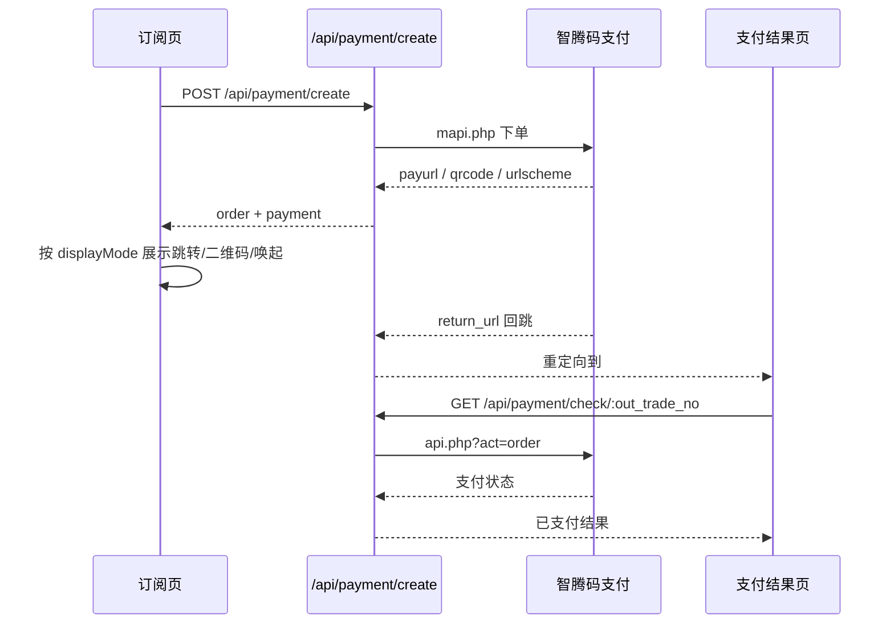

# 支付 API

> **本文档引用文件**
> - `server/routes/payment.js`
> - `server/services/paymentService.js`
> - `server/models/Order.js`
> - `src/services/api.ts`

## 概述

支付模块负责订阅套餐购买、订单状态查询与支付结果回跳。当前真实支付链路已切换为服务端调用智腾码支付 `mapi.php` 下单，再由前端根据返回的支付地址、二维码或唤起链接完成跳转。`bank` 方式继续保留为本地演示支付，不会请求第三方网关。

## 数据模型

### Order 订单表

| 字段 | 类型 | 说明 |
|------|------|------|
| id | BIGINT | 主键 |
| user_id | BIGINT | 用户ID |
| out_trade_no | STRING(64) | 商户订单号（唯一） |
| trade_no | STRING(64) | 支付平台交易号 |
| type | STRING(20) | 支付方式 (`alipay/wxpay/bank`) |
| name | STRING(127) | 商品名称 |
| money | DECIMAL(10,2) | 订单金额 |
| plan_type | STRING(50) | 套餐编码 |
| credits | INTEGER | 发放积分数 |
| status | ENUM | 订单状态 (`pending/paid/failed/expired`) |
| pay_time | DATE | 支付时间 |
| notify_data | TEXT | 异步通知原始数据 |

## API 端点

### POST /api/payment/create

创建支付订单。

**请求头**：需要 Bearer Token 认证

**请求体**：

```json
{
  "planType": "premium-monthly-auto",
  "paymentMethod": "alipay",
  "device": "pc"
}
```

**请求参数**

- `planType`：套餐编码
- `paymentMethod`：支付方式
- `device`：可选，终端类型提示，常见值为 `pc` 或 `mobile`

**套餐编码（planType）**

| 值 | 名称 | 价格 | 权益类型 |
|-----|------|------|---------|
| test | 测试套餐 | ¥0.01 | 1次积分 |
| package-10 | 10次AI分析包 | ¥158.00 | 10次积分 |
| package-30 | 30次AI分析包 | ¥438.00 | 30次积分 |
| package-50 | 50次AI分析包 | ¥649.00 | 50次积分 |
| monthly | 月度订阅会员 | ¥270.00 | 30天订阅 + 20次积分 |
| yearly | 年度订阅会员 | ¥2700.00 | 365天订阅 + 300次积分 |
| basic-trial-once | 基础套餐按次体验 | ¥0.10 | 1次积分 |
| basic-formal-once | 基础套餐单次版 | ¥9.90 | 1次积分 |
| basic-monthly-auto | 基础套餐连续包月 | ¥888.00 | 30天订阅 |
| basic-monthly | 基础套餐一月版 | ¥980.00 | 30天订阅 |
| basic-half-year | 基础套餐半年版 | ¥5199.00 | 180天订阅 |
| basic-yearly | 基础套餐一年版 | ¥9888.00 | 365天订阅 |
| premium-monthly-auto | 顶级套餐连续包月 | ¥999.00 | 30天订阅 |
| premium-monthly | 顶级套餐一月版 | ¥1280.00 | 30天订阅 |
| premium-half-year | 顶级套餐半年版 | ¥6699.00 | 180天订阅 |
| premium-yearly | 顶级套餐一年版 | ¥12699.00 | 365天订阅 |

**支付方式（paymentMethod）**

| 值 | 说明 |
|-----|------|
| alipay | 支付宝真实支付 |
| wxpay | 微信真实支付 |
| bank | 本地演示支付，后端直接标记成功 |

**响应**

```json
{
  "success": true,
  "message": "订单创建成功",
  "data": {
    "order": {
      "out_trade_no": "1769535136337887",
      "type": "alipay",
      "name": "顶级套餐连续包月",
      "money": 999,
      "plan_type": "premium-monthly-auto",
      "status": "pending"
    },
    "payUrl": "https://render.alipay.com/...",
    "payment": {
      "outTradeNo": "1769535136337887",
      "tradeNo": "20260326220738486110",
      "payurl": null,
      "qrcode": "https://render.alipay.com/...",
      "urlscheme": "alipayqr://platformapi/...",
      "displayMode": "qrcode",
      "resultUrl": "https://hpvsc.icu/#/payment/result?out_trade_no=1769535136337887"
    }
  }
}
```

**返回字段说明**

- `payUrl`：兼容字段，优先返回可直接打开的支付地址
- `payment.outTradeNo`：前端后续轮询订单状态的主键
- `payment.payurl`：可直接跳转的支付页地址
- `payment.qrcode`：二维码内容或渲染地址
- `payment.urlscheme`：支付应用唤起链接
- `payment.displayMode`：前端展示方式，当前可能为 `redirect/qrcode/scheme/result/unknown`
- `payment.resultUrl`：支付完成后落到的前端结果页

### GET /api/payment/check/:out_trade_no

公开接口，查询订单状态，供支付结果页和支付弹窗轮询使用。

**无需认证**

**响应**

```json
{
  "success": true,
  "message": "获取成功",
  "data": {
    "out_trade_no": "1769535136337887",
    "status": "paid",
    "name": "顶级套餐连续包月",
    "money": 999,
    "plan_type": "premium-monthly-auto",
    "credits": 0,
    "pay_time": "2026-03-26T14:08:13.000Z"
  }
}
```

### GET /api/payment/status/:out_trade_no

查询订单详细状态（需认证，校验订单归属）。

### GET /api/payment/orders

获取当前用户的订单列表。

**查询参数**

- `page`：页码，默认 `1`
- `limit`：每页数量，默认 `10`

### GET /api/payment/notify

支付异步通知（GET 方式）。

### POST /api/payment/notify

支付异步通知（POST 方式）。

### GET /api/payment/return

支付同步跳转，中转到前端支付结果页。

## 支付流程



### 当前链路说明

- 真实支付方式统一由后端向第三方网关发起下单，前端不直接拼接签名。
- 支付成功后的权益确认，当前主要依赖支付结果页与支付弹窗的查单轮询。
- `bank` 仍为本地演示链路，适用于演示或测试。

## 特殊行为

### `notify_url` 白名单降级

当前实现包含一层兼容逻辑：当智腾码支付返回“域名不在白名单”且问题来自 `notify_url` 时，后端会自动降级为“仅保留 `return_url` 再次下单”，以保证支付主流程仍能继续。

这意味着：

- 支付地址仍可成功获取
- 支付完成后仍可回跳到前端结果页
- 但异步通知链路要等支付平台将 `notify_url` 白名单补齐后，才能完全恢复

### 幂等权益发放

- 回调处理与查单补偿最终都走同一套事务发放逻辑
- 订单会先加行锁再检查 `status`
- 若订单已是 `paid`，不会重复增加积分或重复叠加订阅时长

## 权益发放

支付成功后自动发放权益：

1. **积分包**：增加用户 `remaining_credits`
2. **订阅套餐**：
   - 更新 `subscription_type`
   - 计算并设置 `subscription_expires_at`
   - 如果原订阅尚未到期，则在当前到期时间基础上顺延

## 环境配置

```env
# 智腾码支付配置
EPAY_PID=10002
EPAY_KEY=your_merchant_key
EPAY_API_URL=https://mpay.qzz.io/xpay/epay/
EPAY_NOTIFY_URL=https://your-domain.com/api/payment/notify
EPAY_RETURN_URL=https://your-domain.com/api/payment/return
FRONTEND_RESULT_URL=https://your-domain.com/#/payment/result
```

## 安全与稳定性要点

1. **签名验证**：回调必须校验 MD5 签名
2. **金额校验**：订单金额与回调金额必须一致
3. **幂等控制**：事务内加锁，避免重复发放权益
4. **网关隔离**：签名、密钥与回调地址均由后端托管
5. **白名单兼容**：`notify_url` 未完全放通时，自动降级保障支付链路可用
