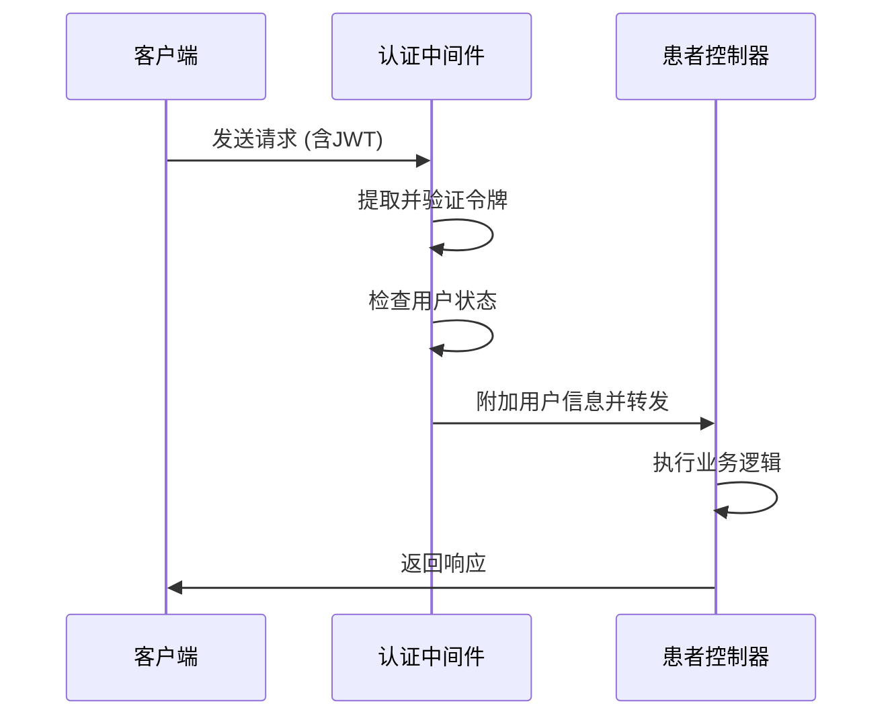
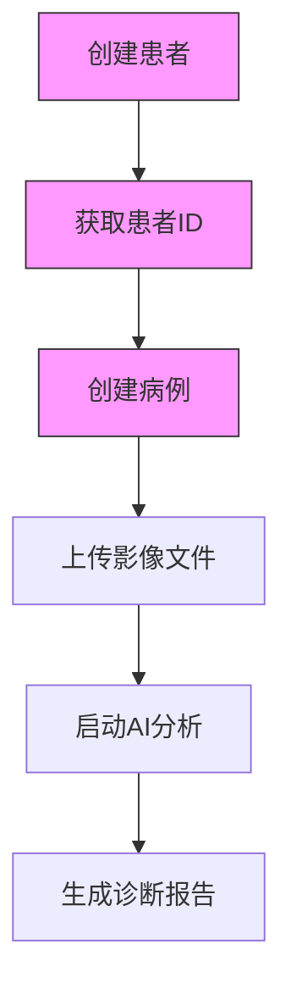

# 患者API

<cite>
**本文档中引用的文件**  
- [patients.js](file://server/routes/patients.js)
- [Patient.js](file://server/models/Patient.js)
- [auth.js](file://server/middleware/auth.js)
- [studies.js](file://server/routes/studies.js)
</cite>

## 目录
1. [简介](#简介)
2. [端点概览](#端点概览)
3. [权限与验证机制](#权限与验证机制)
4. [患者数据模型](#患者数据模型)
5. [端点详细说明](#端点详细说明)
6. [患者与病例关联流程](#患者与病例关联流程)
7. [错误处理](#错误处理)

## 简介
CervixDetectAI系统提供了一套完整的患者管理API，支持患者信息的创建、查询、更新和删除操作。本API遵循RESTful设计原则，通过JWT进行身份验证，并实现了细粒度的权限控制。所有患者数据均与创建者关联，确保数据隔离和安全性。系统还支持通过身份证号进行唯一性校验，防止重复录入。

**Section sources**
- [patients.js](file://server/routes/patients.js#L1-L358)

## 端点概览
患者API提供以下核心端点：

| 端点 | HTTP方法 | 描述 |
|------|---------|------|
| `/api/patients` | POST | 创建新患者 |
| `/api/patients` | GET | 获取患者列表（支持分页和搜索） |
| `/api/patients/:id` | GET | 获取患者详情 |
| `/api/patients/:id` | PUT | 更新患者信息 |
| `/api/patients/:id` | DELETE | 删除患者（软删除） |
| `/api/patients/:id/studies` | GET | 获取患者所有病例 |

所有端点均需要有效的JWT认证令牌，且非管理员用户只能操作自己创建的患者记录。

## 权限与验证机制
系统通过中间件实现多层次的安全控制：

1. **身份验证**：所有请求必须包含有效的JWT访问令牌
2. **角色授权**：管理员可访问所有患者数据，普通用户仅限访问自己创建的患者
3. **数据验证**：对必填字段和身份证号唯一性进行严格校验



**Diagram sources**
- [auth.js](file://server/middleware/auth.js#L7-L64)
- [patients.js](file://server/routes/patients.js#L13-L357)

## 患者数据模型
患者实体包含以下核心字段：

```mermaid
erDiagram
PATIENT {
bigint id PK
string patient_id UK
string name NN
enum gender NN
date birth_date
string phone
string id_card UK
string address
string emergency_contact
string emergency_phone
text medical_history
text allergies
bigint created_by FK
timestamp created_at
timestamp updated_at
}
USER {
bigint id PK
string username
string real_name
}
PATIENT ||--|| USER : created_by::id
```

**Diagram sources**
- [Patient.js](file://server/models/Patient.js#L4-L88)

## 端点详细说明

### 创建患者 (POST /api/patients)
创建新的患者记录。

**请求头**
- `Authorization: Bearer <JWT>`

**请求体**
```json
{
  "name": "张三",
  "gender": "female",
  "birth_date": "1990-01-01",
  "id_card": "123456789012345678",
  "phone": "13800138000",
  "address": "北京市朝阳区",
  "emergency_contact": "李四",
  "emergency_phone": "13900139000",
  "medical_history": "无",
  "allergies": "无"
}
```

**验证规则**
- 姓名和性别为必填字段
- 身份证号必须唯一
- 自动为患者生成全局唯一的`patient_id`

**响应格式**
```json
{
  "success": true,
  "message": "患者创建成功",
  "data": {
    "patient": { /* 患者对象 */ }
  }
}
```

**状态码**
- 201 Created: 创建成功
- 400 Bad Request: 必填字段缺失
- 409 Conflict: 身份证号已存在
- 401 Unauthorized: 未认证
- 403 Forbidden: 账号被禁用

**Section sources**
- [patients.js](file://server/routes/patients.js#L13-L74)

### 获取患者列表 (GET /api/patients)
获取分页的患者列表。

**查询参数**
- `page`: 页码（默认1）
- `limit`: 每页数量（默认10）
- `search`: 搜索关键字
- `gender`: 性别筛选

**响应格式**
```json
{
  "success": true,
  "data": {
    "patients": [/* 患者数组 */],
    "pagination": {
      "total": 100,
      "page": 1,
      "limit": 10,
      "pages": 10
    }
  }
}
```

**权限控制**
- 管理员：可查看所有患者
- 普通用户：仅可查看自己创建的患者

**Section sources**
- [patients.js](file://server/routes/patients.js#L81-L140)

### 获取患者详情 (GET /api/patients/:id)
获取指定患者详情。

**路径参数**
- `id`: 患者ID

**响应格式**
```json
{
  "success": true,
  "data": {
    "patient": { /* 患者对象 */ }
  }
}
```

**状态码**
- 404 Not Found: 患者不存在
- 403 Forbidden: 无权访问该患者

**Section sources**
- [patients.js](file://server/routes/patients.js#L147-L185)

### 更新患者信息 (PUT /api/patients/:id)
更新患者信息。

**路径参数**
- `id`: 患者ID

**请求体**
支持部分更新，仅提供需要修改的字段。

**特殊处理**
- 更新身份证号时会检查唯一性
- 保留原始身份证号不变时不进行重复检查

**Section sources**
- [patients.js](file://server/routes/patients.js#L192-L271)

### 删除患者 (DELETE /api/patients/:id)
删除患者记录（软删除）。

**路径参数**
- `id`: 患者ID

**删除策略**
- 实现软删除，保留数据用于审计
- 仅允许删除自己创建的患者

**Section sources**
- [patients.js](file://server/routes/patients.js#L278-L311)

### 获取患者所有病例 (GET /api/patients/:id/studies)
获取患者的所有病例记录。

**路径参数**
- `id`: 患者ID

**响应格式**
```json
{
  "success": true,
  "data": {
    "studies": [/* 病例数组 */]
  }
}
```

**权限验证**
- 验证用户是否有权访问该患者
- 病例按检查日期倒序排列

**Section sources**
- [patients.js](file://server/routes/patients.js#L318-L354)

## 患者与病例关联流程
创建患者后，可通过以下流程关联新病例：



1. 首先调用`POST /api/patients`创建患者，获取返回的患者ID
2. 使用该ID调用`POST /api/studies`创建关联病例
3. 通过`POST /api/studies/:id/images`上传医学影像
4. 系统自动启动AI分析任务
5. 生成最终的诊断报告

此流程确保了患者-病例-影像的完整数据链路，所有操作均受权限控制保护。

**Diagram sources**
- [patients.js](file://server/routes/patients.js#L13-L74)
- [studies.js](file://server/routes/studies.js#L46-L117)

## 错误处理
系统采用统一的错误响应格式：

```json
{
  "success": false,
  "message": "错误描述",
  "error": "详细错误信息（仅在开发环境返回）"
}
```

常见错误类型：
- **400 Bad Request**: 输入验证失败
- **401 Unauthorized**: 认证失败
- **403 Forbidden**: 权限不足
- **404 Not Found**: 资源不存在
- **409 Conflict**: 数据冲突（如身份证号重复）
- **500 Internal Server Error**: 服务器内部错误

所有错误均记录到服务器日志，便于排查问题。

**Section sources**
- [patients.js](file://server/routes/patients.js#L67-L73)
- [patients.js](file://server/routes/patients.js#L134-L139)
- [patients.js](file://server/routes/patients.js#L179-L184)