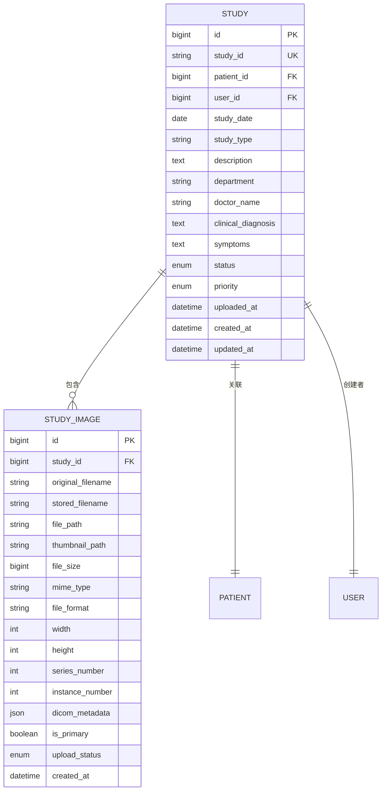
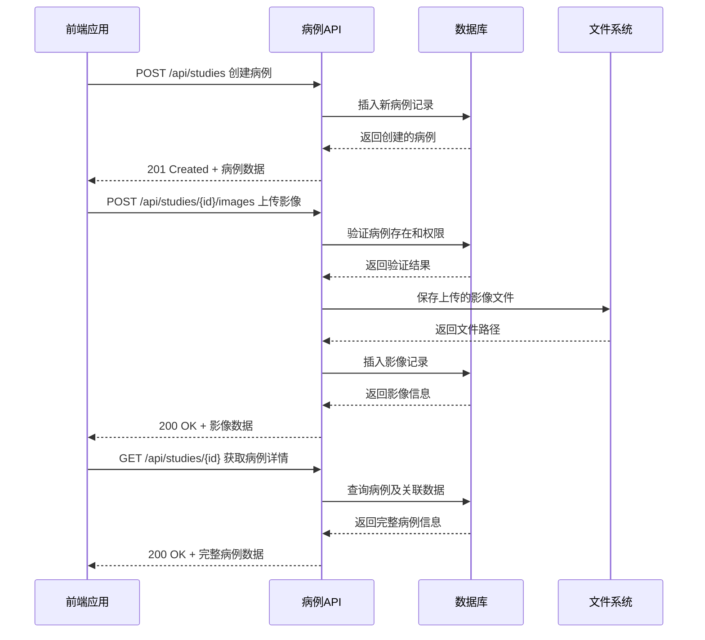

# 病例API

<cite>
**本文档中引用的文件**  
- [api.ts](file://src\services\api.ts)
- [studies.js](file://server\routes\studies.js)
- [Study.js](file://server\models\Study.js)
- [StudyImage.js](file://server\models\StudyImage.js)
- [auth.js](file://server\middleware\auth.js)
- [studyStore.ts](file://src\stores\studyStore.ts)
</cite>

## 目录
1. [简介](#简介)
2. [API端点参考](#api端点参考)
   - [创建病例 (/api/studies)](#创建病例-apistudies)
   - [上传影像 (/api/studies/:id/images)](#上传影像-apistudiesidimages)
   - [获取病例列表 (/api/studies)](#获取病例列表-apistudies)
   - [获取病例详情 (/api/studies/:id)](#获取病例详情-apistudiesid)
   - [更新病例信息 (/api/studies/:id)](#更新病例信息-apistudiesid)
   - [删除病例 (/api/studies/:id)](#删除病例-apistudiesid)
   - [删除影像 (/api/studies/:id/images/:imageId)](#删除影像-apistudiesidimagesimageid)
3. [数据模型与关联关系](#数据模型与关联关系)
4. [业务流程示例](#业务流程示例)

## 简介
CervixDetectAI病例API提供了一套完整的病例管理功能，支持创建、查询、更新和删除宫颈检测相关的医学病例。每个病例与患者信息、影像文件和分析任务紧密关联，形成完整的医疗数据链。所有API端点均需通过JWT认证，确保数据安全。本API支持分页查询和多条件筛选，便于在大量病例中快速定位目标数据。

## API端点参考

### 创建病例 (/api/studies)
创建一个新的医学病例，关联指定患者并初始化病例状态。

**HTTP方法**  
POST

**URL路径**  
`/api/studies`

**请求头**  
- `Authorization: Bearer <JWT令牌>` - 必填，通过`auth.js`中间件`authenticate`函数验证

**请求参数**  
| 参数 | 位置 | 类型 | 必填 | 说明 |
|------|------|------|------|------|
| patient_id | body | number | 是 | 患者ID，需存在且当前用户有权限访问 |
| study_date | body | string (date) | 是 | 检查日期，ISO 8601格式 |
| study_type | body | string | 是 | 检查类型，如"宫颈细胞学检查" |
| description | body | string | 否 | 病例描述 |
| department | body | string | 否 | 检查科室 |
| doctor_name | body | string | 否 | 医生姓名 |
| clinical_diagnosis | body | string | 否 | 临床诊断 |
| symptoms | body | string | 否 | 症状描述 |

**响应格式 (JSON)**  
```json
{
  "success": true,
  "message": "病例创建成功",
  "data": {
    "study": {
      "id": 123,
      "study_id": "S20240101000001",
      "patient_id": 456,
      "user_id": 789,
      "study_date": "2024-01-01T00:00:00.000Z",
      "study_type": "宫颈细胞学检查",
      "description": "常规筛查",
      "department": "妇科",
      "doctor_name": "张医生",
      "clinical_diagnosis": "疑似宫颈炎",
      "symptoms": "白带增多",
      "status": "pending",
      "priority": "normal",
      "uploaded_at": "2024-01-01T10:30:00.000Z",
      "created_at": "2024-01-01T10:30:00.000Z",
      "updated_at": "2024-01-01T10:30:00.000Z",
      "patient": {
        "id": 456,
        "patient_id": "P20240101001",
        "name": "患者姓名",
        "gender": "女",
        "birth_date": "1980-01-01"
      },
      "creator": {
        "id": 789,
        "username": "doctor_zhang",
        "real_name": "张医生"
      }
    }
  }
}
```

**状态码**  
- `201 Created` - 病例创建成功
- `400 Bad Request` - 缺少必填字段
- `401 Unauthorized` - 未提供或无效的JWT令牌
- `403 Forbidden` - 无权为该患者创建病例
- `404 Not Found` - 患者不存在
- `500 Internal Server Error` - 服务器内部错误

**业务规则**  
- `study_id`由系统自动生成，格式为`SYYYYMMDDXXXXXX`，其中`XXXXXX`为当日序列号
- 非管理员用户只能为自己创建的患者创建病例
- 病例初始状态为`pending`

**代码示例**  
```javascript
// 使用studyAPI创建病例
const response = await studyAPI.createStudy({
  patient_id: 456,
  study_date: '2024-01-01',
  study_type: '宫颈细胞学检查',
  description: '年度体检'
});
```

**节来源**  
- [studies.js](file://server\routes\studies.js#L42-L126)
- [Study.js](file://server\models\Study.js#L13-L86)
- [api.ts](file://src\services\api.ts#L186-L191)

### 上传影像 (/api/studies/:id/images)
为指定病例上传一个或多个医学影像文件。

**HTTP方法**  
POST

**URL路径**  
`/api/studies/:id/images`

**路径参数**  
| 参数 | 类型 | 必填 | 说明 |
|------|------|------|------|
| id | number | 是 | 病例ID |

**请求头**  
- `Authorization: Bearer <JWT令牌>` - 必填
- `Content-Type: multipart/form-data` - 必填，用于文件上传

**请求参数**  
| 参数 | 位置 | 类型 | 必填 | 说明 |
|------|------|------|------|------|
| images | body | File[] | 是 | 影像文件数组，最多10个 |

**响应格式 (JSON)**  
```json
{
  "success": true,
  "message": "成功上传 2 个影像文件",
  "data": {
    "images": [
      {
        "id": 101,
        "study_id": 123,
        "file_path": "/uploads/studies/study-1704085800000-123456789.jpg",
        "original_filename": "cervix1.jpg",
        "stored_filename": "study-1704085800000-123456789.jpg",
        "file_size": 153600,
        "mime_type": "image/jpeg",
        "file_format": "JPEG",
        "created_at": "2024-01-01T10:30:00.000Z"
      }
    ]
  }
}
```

**状态码**  
- `200 OK` - 影像上传成功
- `400 Bad Request` - 未上传文件
- `401 Unauthorized` - 未提供或无效的JWT令牌
- `403 Forbidden` - 无权上传影像
- `404 Not Found` - 病例不存在
- `500 Internal Server Error` - 服务器内部错误

**业务规则**  
- 支持JPEG、PNG、TIFF、BMP格式
- 单个文件大小限制为20MB
- 文件存储在`/uploads/studies/`目录下
- 上传失败时会自动清理已上传的临时文件

**代码示例**  
```javascript
// 上传影像文件
const formData = new FormData();
formData.append('images', file1);
formData.append('images', file2);
const response = await studyAPI.uploadImages(123, [file1, file2]);
```

**节来源**  
- [studies.js](file://server\routes\studies.js#L128-L202)
- [StudyImage.js](file://server\models\StudyImage.js#L13-L86)
- [api.ts](file://src\services\api.ts#L224-L233)

### 获取病例列表 (/api/studies)
获取符合条件的病例列表，支持分页和多条件筛选。

**HTTP方法**  
GET

**URL路径**  
`/api/studies`

**请求头**  
- `Authorization: Bearer <JWT令牌>` - 必填

**查询参数**  
| 参数 | 类型 | 必填 | 说明 |
|------|------|------|------|
| page | number | 否 | 页码，从1开始，默认1 |
| limit | number | 否 | 每页数量，最大100，默认10 |
| patient_id | number | 否 | 患者ID筛选 |
| status | string | 否 | 状态筛选，可选值：pending, uploaded, processing, completed, failed |
| study_type | string | 否 | 检查类型筛选 |
| search | string | 否 | 搜索关键词，匹配病例ID、描述或临床诊断 |

**响应格式 (JSON)**  
```json
{
  "success": true,
  "data": {
    "studies": [
      {
        "id": 123,
        "study_id": "S20240101000001",
        "patient_id": 456,
        "study_date": "2024-01-01T00:00:00.000Z",
        "study_type": "宫颈细胞学检查",
        "status": "completed",
        "uploaded_at": "2024-01-01T10:30:00.000Z",
        "patient": {
          "id": 456,
          "patient_id": "P20240101001",
          "name": "患者姓名",
          "gender": "女",
          "birth_date": "1980-01-01"
        },
        "creator": {
          "id": 789,
          "username": "doctor_zhang",
          "real_name": "张医生"
        },
        "images": [
          {
            "id": 101,
            "file_path": "/uploads/studies/study-1704085800000-123456789.jpg",
            "original_filename": "cervix1.jpg",
            "created_at": "2024-01-01T10:30:00.000Z"
          }
        ]
      }
    ],
    "pagination": {
      "total": 1,
      "page": 1,
      "limit": 10,
      "pages": 1
    }
  }
}
```

**状态码**  
- `200 OK` - 请求成功
- `401 Unauthorized` - 未提供或无效的JWT令牌
- `500 Internal Server Error` - 服务器内部错误

**业务规则**  
- 非管理员用户只能查看自己创建的病例
- 结果按检查日期降序排列
- 支持通过`search`参数进行模糊搜索

**代码示例**  
```javascript
// 获取病例列表
const response = await studyAPI.getStudies({
  page: 1,
  limit: 10,
  status: 'completed',
  search: '宫颈'
});
```

**节来源**  
- [studies.js](file://server\routes\studies.js#L204-L292)
- [api.ts](file://src\services\api.ts#L193-L207)

### 获取病例详情 (/api/studies/:id)
获取指定病例的详细信息，包括患者信息、影像列表和分析任务。

**HTTP方法**  
GET

**URL路径**  
`/api/studies/:id`

**路径参数**  
| 参数 | 类型 | 必填 | 说明 |
|------|------|------|------|
| id | number | 是 | 病例ID |

**请求头**  
- `Authorization: Bearer <JWT令牌>` - 必填

**响应格式 (JSON)**  
```json
{
  "success": true,
  "data": {
    "study": {
      "id": 123,
      "study_id": "S20240101000001",
      "patient_id": 456,
      "study_date": "2024-01-01T00:00:00.000Z",
      "study_type": "宫颈细胞学检查",
      "description": "常规筛查",
      "status": "completed",
      "uploaded_at": "2024-01-01T10:30:00.000Z",
      "patient": {
        "id": 456,
        "patient_id": "P20240101001",
        "name": "患者姓名",
        "gender": "女",
        "birth_date": "1980-01-01",
        "phone": "13800138000",
        "address": "北京市朝阳区",
        "created_at": "2024-01-01T09:00:00.000Z",
        "updated_at": "2024-01-01T09:00:00.000Z"
      },
      "creator": {
        "id": 789,
        "username": "doctor_zhang",
        "real_name": "张医生",
        "email": "zhang@example.com",
        "role": "doctor",
        "status": "active"
      },
      "images": [
        {
          "id": 101,
          "study_id": 123,
          "file_path": "/uploads/studies/study-1704085800000-123456789.jpg",
          "original_filename": "cervix1.jpg",
          "file_size": 153600,
          "mime_type": "image/jpeg",
          "file_format": "JPEG",
          "created_at": "2024-01-01T10:30:00.000Z"
        }
      ],
      "analysis_tasks": [
        {
          "id": 201,
          "study_id": 123,
          "model_name": "cervix-detection-v1",
          "status": "completed",
          "progress": 100,
          "created_at": "2024-01-01T10:35:00.000Z",
          "updated_at": "2024-01-01T10:40:00.000Z"
        }
      ]
    }
  }
}
```

**状态码**  
- `200 OK` - 请求成功
- `401 Unauthorized` - 未提供或无效的JWT令牌
- `403 Forbidden` - 无权访问该病例
- `404 Not Found` - 病例不存在
- `500 Internal Server Error` - 服务器内部错误

**业务规则**  
- 非管理员用户只能查看自己创建的病例
- 返回数据包含关联的患者、创建者、影像和分析任务信息

**节来源**  
- [studies.js](file://server\routes\studies.js#L302-L357)
- [api.ts](file://src\services\api.ts#L209-L212)

### 更新病例信息 (/api/studies/:id)
更新指定病例的基本信息。

**HTTP方法**  
PUT

**URL路径**  
`/api/studies/:id`

**路径参数**  
| 参数 | 类型 | 必填 | 说明 |
|------|------|------|------|
| id | number | 是 | 病例ID |

**请求头**  
- `Authorization: Bearer <JWT令牌>` - 必填

**请求参数**  
| 参数 | 位置 | 类型 | 必填 | 说明 |
|------|------|------|------|------|
| study_date | body | string (date) | 否 | 检查日期 |
| study_type | body | string | 否 | 检查类型 |
| description | body | string | 否 | 病例描述 |
| department | body | string | 否 | 检查科室 |
| doctor_name | body | string | 否 | 医生姓名 |
| clinical_diagnosis | body | string | 否 | 临床诊断 |
| symptoms | body | string | 否 | 症状描述 |
| status | body | string | 否 | 状态，可选值：pending, uploaded, processing, completed, failed |

**响应格式 (JSON)**  
```json
{
  "success": true,
  "message": "更新成功",
  "data": {
    "study": {
      "id": 123,
      "study_id": "S20240101000001",
      "patient_id": 456,
      "study_date": "2024-01-02T00:00:00.000Z",
      "study_type": "阴道镜检查",
      "description": "复查",
      "status": "processing",
      "updated_at": "2024-01-02T14:00:00.000Z"
    }
  }
}
```

**状态码**  
- `200 OK` - 更新成功
- `400 Bad Request` - 无效的请求数据
- `401 Unauthorized` - 未提供或无效的JWT令牌
- `403 Forbidden` - 无权更新该病例
- `404 Not Found` - 病例不存在
- `500 Internal Server Error` - 服务器内部错误

**业务规则**  
- 非管理员用户只能更新自己创建的病例
- 只更新提供的字段，其他字段保持不变

**代码示例**  
```javascript
// 更新病例信息
const response = await studyAPI.updateStudy(123, {
  study_type: '阴道镜检查',
  status: 'processing'
});
```

**节来源**  
- [studies.js](file://server\routes\studies.js#L359-L432)
- [api.ts](file://src\services\api.ts#L214-L217)

### 删除病例 (/api/studies/:id)
删除指定病例（软删除）。

**HTTP方法**  
DELETE

**URL路径**  
`/api/studies/:id`

**路径参数**  
| 参数 | 类型 | 必填 | 说明 |
|------|------|------|------|
| id | number | 是 | 病例ID |

**请求头**  
- `Authorization: Bearer <JWT令牌>` - 必填

**响应格式 (JSON)**  
```json
{
  "success": true,
  "message": "病例已删除"
}
```

**状态码**  
- `200 OK` - 删除成功
- `401 Unauthorized` - 未提供或无效的JWT令牌
- `403 Forbidden` - 无权删除该病例
- `404 Not Found` - 病例不存在
- `500 Internal Server Error` - 服务器内部错误

**业务规则**  
- 非管理员用户可以删除自己创建的病例以及未分配用户的匿名病例
- 采用软删除，数据不会从数据库中物理删除
- 删除病例时会级联删除关联的影像文件和分析任务

**节来源**  
- [studies.js](file://server\routes\studies.js#L434-L472)
- [api.ts](file://src\services\api.ts#L219-L222)

### 删除影像 (/api/studies/:id/images/:imageId)
删除指定病例中的某个影像文件。

**HTTP方法**  
DELETE

**URL路径**  
`/api/studies/:id/images/:imageId`

**路径参数**  
| 参数 | 类型 | 必填 | 说明 |
|------|------|------|------|
| id | number | 是 | 病例ID |
| imageId | number | 是 | 影像ID |

**请求头**  
- `Authorization: Bearer <JWT令牌>` - 必填

**响应格式 (JSON)**  
```json
{
  "success": true,
  "message": "影像已删除"
}
```

**状态码**  
- `200 OK` - 删除成功
- `401 Unauthorized` - 未提供或无效的JWT令牌
- `403 Forbidden` - 无权删除影像
- `404 Not Found` - 病例或影像不存在
- `500 Internal Server Error` - 服务器内部错误

**业务规则**  
- 非管理员用户只能删除自己创建的病例中的影像
- 删除时会同时从文件系统和数据库中移除影像
- 删除后无法恢复

**节来源**  
- [studies.js](file://server\routes\studies.js#L474-L527)
- [api.ts](file://src\services\api.ts#L235-L238)

## 数据模型与关联关系
病例API的核心数据模型包括病例(Study)和影像(StudyImage)两个主要实体，它们之间存在一对多的关联关系。



**图来源**  
- [Study.js](file://server\models\Study.js#L8-L86)
- [StudyImage.js](file://server\models\StudyImage.js#L8-L86)

**关联关系说明**：
1. **病例与患者**：一个病例属于一个患者，一个患者可以有多个病例（1:N关系）
2. **病例与影像**：一个病例可以包含多个影像，一个影像只属于一个病例（1:N关系）
3. **病例与用户**：一个病例由一个用户创建，一个用户可以创建多个病例（1:N关系）

**数据完整性约束**：
- `study_id`在病例表中具有唯一性约束
- `patient_id`和`user_id`为外键，引用患者表和用户表
- 影像表的`study_id`为外键，启用级联删除（CASCADE）
- 病例表的外键设置为RESTRICT，防止误删患者或用户

## 业务流程示例
创建新病例并上传宫颈图像的完整业务流程如下：



**图来源**  
- [api.ts](file://src\services\api.ts#L186-L238)
- [studies.js](file://server\routes\studies.js#L42-L527)
- [studyStore.ts](file://src\stores\studyStore.ts#L142-L176)

**流程说明**：
1. **创建病例**：前端调用`createStudy`方法，传入患者ID、检查日期和检查类型等必要信息
2. **上传影像**：使用返回的病例ID，调用`uploadImages`方法上传一个或多个宫颈图像文件
3. **获取详情**：调用`getStudy`方法获取包含影像信息的完整病例详情

**节来源**  
- [studyStore.ts](file://src\stores\studyStore.ts#L142-L176)
- [api.ts](file://src\services\api.ts#L186-L238)