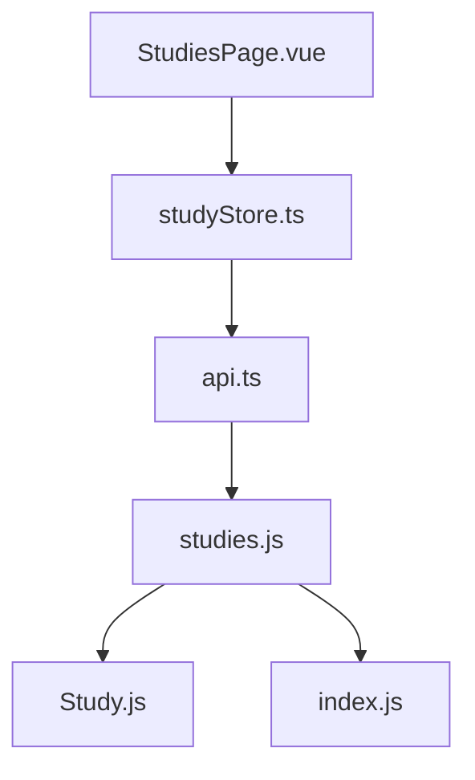
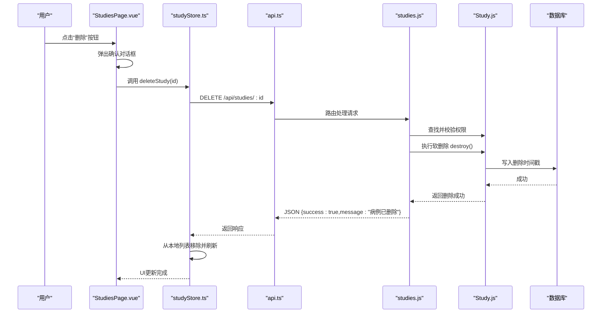
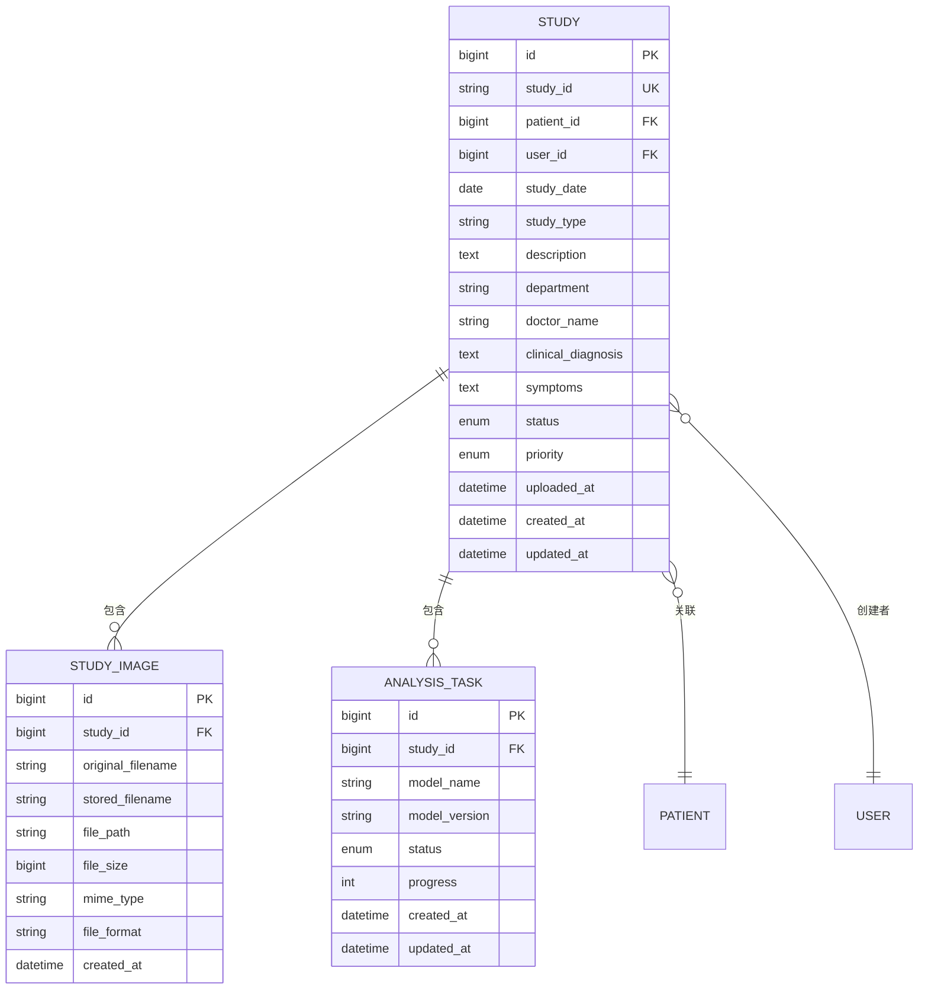
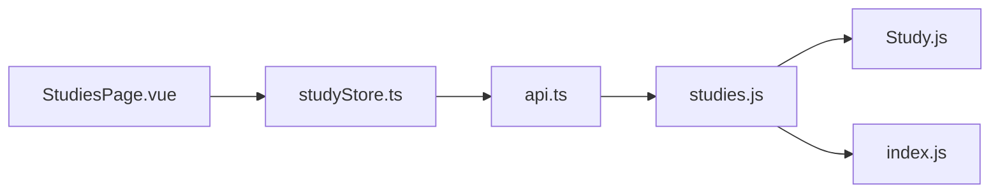

# 病例删除功能

> **本文引用的文件**
> - [studies.js](file://server/routes/studies.js)
> - [Study.js](file://server/models/Study.js)
> - [index.js](file://server/models/index.js)
> - [api.ts](file://src/services/api.ts)
> - [studyStore.ts](file://src/stores/studyStore.ts)
> - [StudiesPage.vue](file://src/pages/StudiesPage.vue)
> - [病例API.md](file://wiki/后端架构/API端点参考/病例管理API/病例API.md)

## 目录
1. [简介](#简介)
2. [项目结构](#项目结构)
3. [核心组件](#核心组件)
4. [架构总览](#架构总览)
5. [详细组件分析](#详细组件分析)
6. [依赖分析](#依赖分析)
7. [性能考虑](#性能考虑)
8. [故障排查指南](#故障排查指南)
9. [结论](#结论)

## 简介
本章节聚焦“病例删除”功能，覆盖从前端交互到后端路由、模型与数据库的完整链路。该功能采用软删除策略，即通过标记删除时间戳的方式实现逻辑删除，避免物理删除带来的数据不可恢复风险；同时，系统在删除主记录时会级联删除其关联的影像与分析任务，确保数据一致性与完整性。

## 项目结构
围绕“病例删除”的前后端协作涉及以下关键文件：
- 前端
  - 页面组件：StudiesPage.vue（触发删除对话框与刷新列表）
  - 状态管理：studyStore.ts（封装删除动作并同步UI）
  - API封装：api.ts（定义studyAPI.deleteStudy接口）
- 后端
  - 路由：studies.js（定义DELETE /api/studies/:id端点）
  - 模型：Study.js（定义Study模型与索引）
  - 模型关系：index.js（定义Study与StudyImage、AnalysisTask等的关联）

图表来源
- [StudiesPage.vue](file://src/pages/StudiesPage.vue#L214-L258)
- [studyStore.ts](file://src/stores/studyStore.ts#L273-L287)
- [api.ts](file://src/services/api.ts#L219-L222)
- [studies.js](file://server/routes/studies.js#L434-L475)
- [Study.js](file://server/models/Study.js#L8-L108)
- [index.js](file://server/models/index.js#L34-L41)

章节来源
- [StudiesPage.vue](file://src/pages/StudiesPage.vue#L214-L258)
- [studyStore.ts](file://src/stores/studyStore.ts#L273-L287)
- [api.ts](file://src/services/api.ts#L219-L222)
- [studies.js](file://server/routes/studies.js#L434-L475)
- [Study.js](file://server/models/Study.js#L8-L108)
- [index.js](file://server/models/index.js#L34-L41)

## 核心组件
- 前端页面组件 StudiesPage.vue
  - 在“操作”列提供删除按钮，点击后弹出二次确认对话框，确认后调用studyStore.deleteStudy。
- 前端状态管理 studyStore.ts
  - deleteStudy动作：调用studyAPI.deleteStudy，成功后从本地列表移除对应项，并在finally中刷新列表。
- 前端API封装 api.ts
  - studyAPI.deleteStudy：封装DELETE /api/studies/:id请求。
- 后端路由 studies.js
  - DELETE /api/studies/:id：鉴权、权限校验、软删除Study记录。
- 后端模型 Study.js
  - 定义Study模型字段、索引与beforeCreate钩子（自动生成study_id）。
- 后端模型关系 index.js
  - Study与StudyImage、AnalysisTask存在一对多关系，删除Study时会级联删除这些关联记录。

章节来源
- [StudiesPage.vue](file://src/pages/StudiesPage.vue#L45-L71)
- [studyStore.ts](file://src/stores/studyStore.ts#L273-L287)
- [api.ts](file://src/services/api.ts#L219-L222)
- [studies.js](file://server/routes/studies.js#L434-L475)
- [Study.js](file://server/models/Study.js#L8-L108)
- [index.js](file://server/models/index.js#L34-L41)

## 架构总览
下面的序列图展示了“病例删除”的端到端流程，从页面交互到后端处理再到数据库变更。

图表来源
- [StudiesPage.vue](file://src/pages/StudiesPage.vue#L214-L258)
- [studyStore.ts](file://src/stores/studyStore.ts#L273-L287)
- [api.ts](file://src/services/api.ts#L219-L222)
- [studies.js](file://server/routes/studies.js#L434-L475)
- [Study.js](file://server/models/Study.js#L8-L108)

## 详细组件分析

### 前端：StudiesPage.vue
- 触发删除
  - 在表格“操作”列提供删除按钮，点击后弹出确认对话框，确认后调用deleteStudy。
- 删除流程
  - 显示加载提示，调用studyStore.deleteStudy，成功后通知提示“病例已成功删除”，随后刷新studyStore.fetchStudies。
- UI反馈
  - 删除成功后立即从本地列表移除对应行，提升交互体验。

章节来源
- [StudiesPage.vue](file://src/pages/StudiesPage.vue#L45-L71)
- [StudiesPage.vue](file://src/pages/StudiesPage.vue#L214-L258)

### 前端：studyStore.ts
- deleteStudy动作
  - 调用studyAPI.deleteStudy(id)，成功后从本地studies数组中移除该项；若当前查看的currentStudy等于该id，则清空currentStudy。
  - finally中调用fetchStudies刷新列表，保证UI与后端一致。
- 与后端API的契约
  - 仅依赖studyAPI.deleteStudy返回的success字段判断是否成功，不关心具体message内容。

章节来源
- [studyStore.ts](file://src/stores/studyStore.ts#L273-L287)

### 前端：api.ts
- studyAPI.deleteStudy
  - 封装DELETE /api/studies/:id请求，返回后端响应。
- 与路由层的对应
  - 与后端studies.js的DELETE /api/studies/:id端点一一对应。

章节来源
- [api.ts](file://src/services/api.ts#L219-L222)
- [studies.js](file://server/routes/studies.js#L434-L475)

### 后端：studies.js
- DELETE /api/studies/:id
  - 鉴权：使用authenticate中间件校验JWT。
  - 权限校验：非管理员仅能删除自己创建的病例；匿名上传的未分配用户也可删除。
  - 软删除：调用study.destroy()执行逻辑删除。
  - 返回：返回JSON {success:true,message:"病例已删除"}。
- 关联删除
  - 由于模型关系定义了Study与StudyImage、AnalysisTask的一对多关系，删除Study时会级联删除这些关联记录（由模型关系与数据库约束共同保障）。

章节来源
- [studies.js](file://server/routes/studies.js#L434-L475)
- [index.js](file://server/models/index.js#L34-L41)

### 后端：Study.js
- 字段与索引
  - 定义study_id唯一索引、patient_id与user_id索引，以及study_id的唯一性约束。
- 自动生成study_id
  - beforeCreate钩子根据日期与当日计数生成唯一study_id，确保数据完整性。
- 软删除
  - 通过destroy()实现软删除（逻辑删除），配合数据库层面的级联删除策略，确保关联数据一并清理。

章节来源
- [Study.js](file://server/models/Study.js#L8-L108)
- [Study.js](file://server/models/Study.js#L110-L131)

### 后端：模型关系 index.js
- Study与StudyImage
  - Study.hasMany(StudyImage)与StudyImage.belongsTo(Study)，删除Study时会级联删除StudyImage。
- Study与AnalysisTask
  - Study.hasMany(AnalysisTask)与AnalysisTask.belongsTo(Study)，删除Study时会级联删除AnalysisTask。
- 其他关联
  - Study还与Patient、User、AnalysisResult、MedicalReport等存在关联，但删除Study时主要关注上述两个级联删除。

章节来源
- [index.js](file://server/models/index.js#L34-L41)

### 数据模型与关系图

图表来源
- [Study.js](file://server/models/Study.js#L8-L108)
- [StudyImage.js](file://server/models/StudyImage.js#L8-L86)
- [AnalysisTask.js](file://server/models/AnalysisTask.js#L8-L86)
- [index.js](file://server/models/index.js#L34-L41)

## 依赖分析
- 前端依赖
  - StudiesPage.vue依赖studyStore.ts与Quasar UI组件。
  - studyStore.ts依赖studyAPI（来自api.ts）。
  - api.ts依赖Axios与环境变量配置。
- 后端依赖
  - studies.js依赖Study、Patient、StudyImage、User、AnalysisTask模型与authenticate中间件。
  - Study.js依赖sequelize与Sequelize常量。
  - index.js导出所有模型并定义关系，为studies.js提供模型上下文。

图表来源
- [StudiesPage.vue](file://src/pages/StudiesPage.vue#L214-L258)
- [studyStore.ts](file://src/stores/studyStore.ts#L273-L287)
- [api.ts](file://src/services/api.ts#L219-L222)
- [studies.js](file://server/routes/studies.js#L434-L475)
- [Study.js](file://server/models/Study.js#L8-L108)
- [index.js](file://server/models/index.js#L34-L41)

章节来源
- [StudiesPage.vue](file://src/pages/StudiesPage.vue#L214-L258)
- [studyStore.ts](file://src/stores/studyStore.ts#L273-L287)
- [api.ts](file://src/services/api.ts#L219-L222)
- [studies.js](file://server/routes/studies.js#L434-L475)
- [Study.js](file://server/models/Study.js#L8-L108)
- [index.js](file://server/models/index.js#L34-L41)

## 性能考虑
- 删除性能
  - 软删除仅写入删除时间戳，复杂度低；级联删除StudyImage与AnalysisTask由数据库执行，避免多次往返。
- 前端刷新
  - 删除后立即从本地列表移除，减少渲染压力；最后统一调用fetchStudies刷新，避免重复请求。
- 并发与一致性
  - 删除操作为单条记录级联处理，通常耗时极短；建议在高并发场景下结合后端事务与前端乐观更新策略，确保一致性与用户体验。

## 故障排查指南
- 常见错误与定位
  - 401 未授权：检查本地是否持有有效的访问令牌，确认api.ts请求拦截器已注入Authorization头。
  - 403 无权删除：确认当前用户角色与被删除病例的user_id关系；非管理员仅能删除自己创建的病例。
  - 404 病例不存在：确认传入的id正确；检查前端传参与后端路由参数绑定。
  - 500 服务器错误：查看后端控制台日志，定位studies.js中delete路由的异常堆栈。
- 前端调试
  - 在StudiesPage.vue中确认confirmDelete与deleteStudy的调用链路；在studyStore.ts中确认deleteStudy成功分支与finally中的fetchStudies调用。
- 后端调试
  - 在studies.js的DELETE路由中增加日志输出，确认鉴权、权限校验与destroy()执行情况；核对index.js中模型关系是否正确。

章节来源
- [studies.js](file://server/routes/studies.js#L434-L475)
- [api.ts](file://src/services/api.ts#L18-L29)
- [studyStore.ts](file://src/stores/studyStore.ts#L273-L287)
- [StudiesPage.vue](file://src/pages/StudiesPage.vue#L214-L258)

## 结论
“病例删除”功能通过前后端协同实现了安全、可靠的软删除机制。前端提供直观的删除交互与即时UI反馈，后端在鉴权与权限校验的基础上执行软删除，并通过模型关系确保关联数据的级联清理。该设计兼顾了数据安全性与用户体验，适合在生产环境中稳定运行。