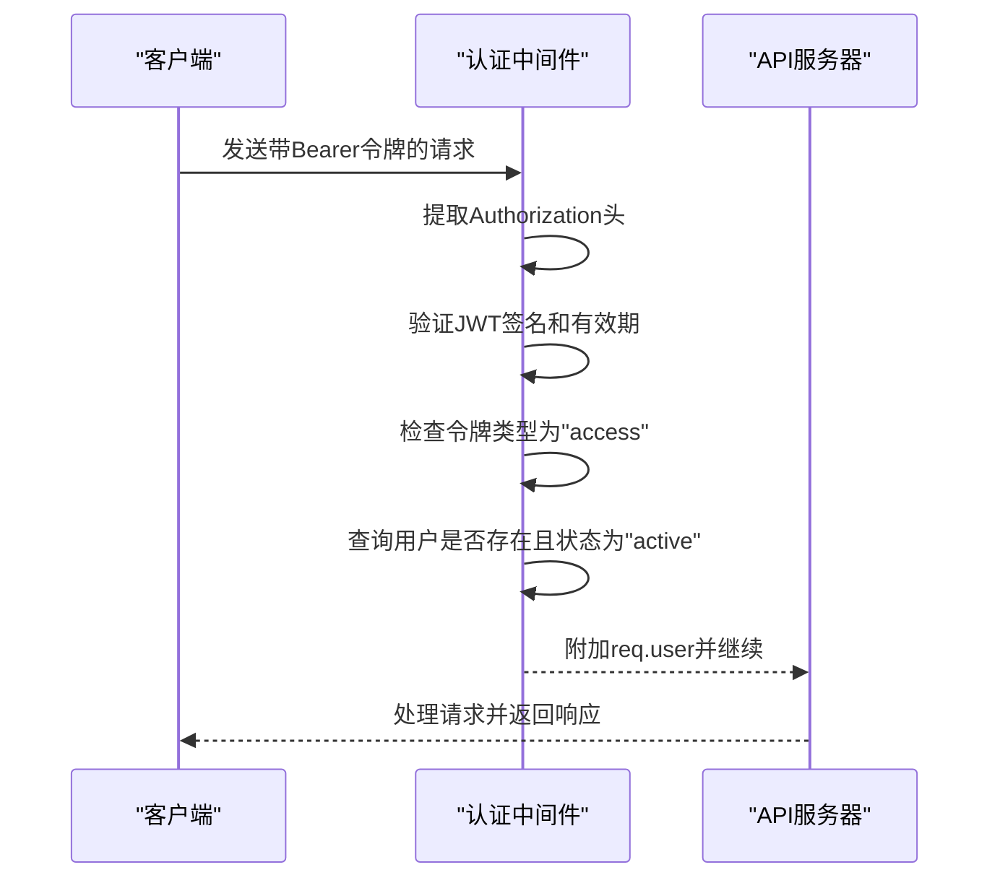
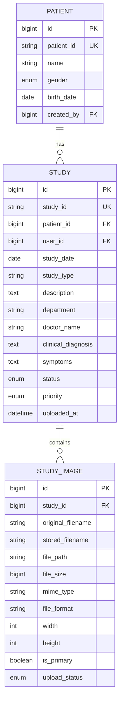
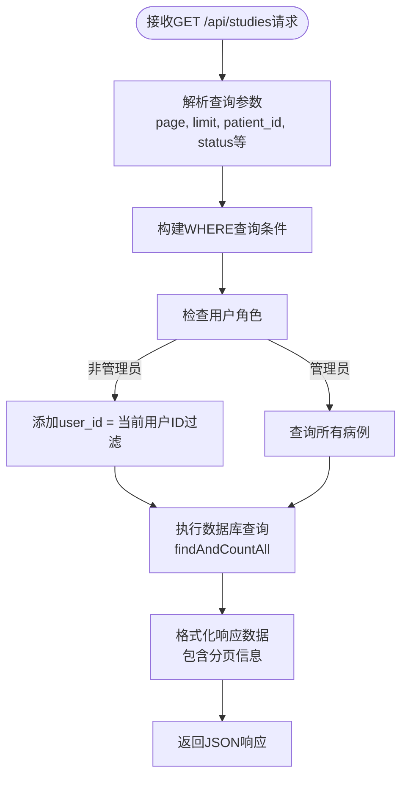
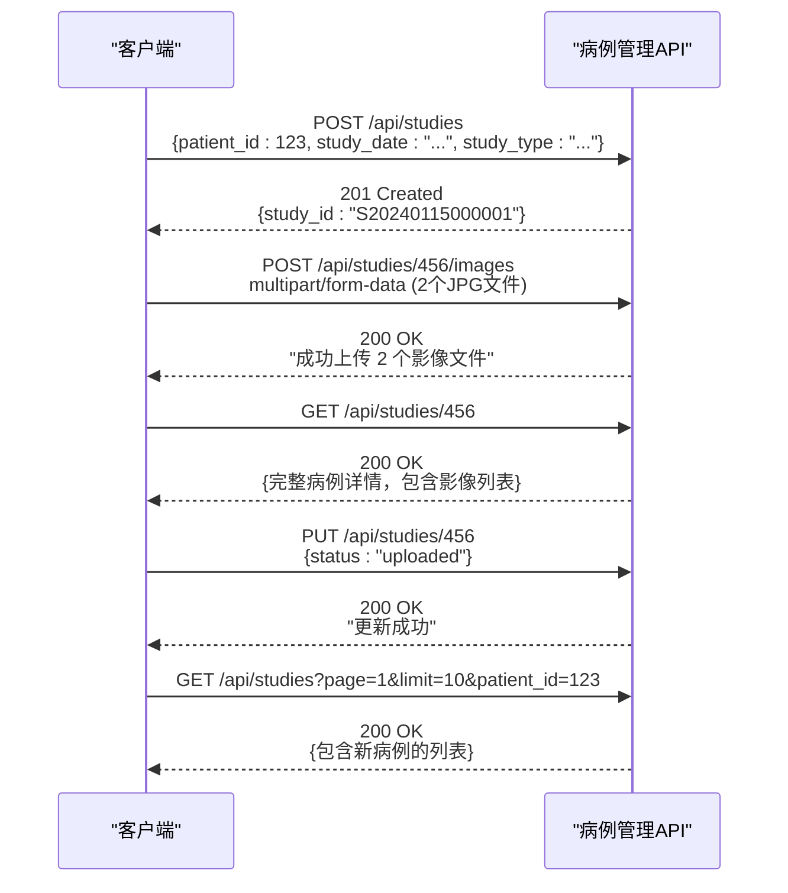

# 病例管理API

> **本文档中引用的文件**  
> - [studies.js](file://server/routes/studies.js)
> - [Study.js](file://server/models/Study.js)
> - [StudyImage.js](file://server/models/StudyImage.js)
> - [Patient.js](file://server/models/Patient.js)
> - [auth.js](file://server/middleware/auth.js)
> - [jwt.js](file://server/utils/jwt.js)

## 目录
1. [简介](#简介)
2. [API端点概览](#api端点概览)
3. [认证机制](#认证机制)
4. [核心数据模型](#核心数据模型)
5. [详细端点说明](#详细端点说明)
6. [分页与筛选](#分页与筛选)
7. [完整业务流程示例](#完整业务流程示例)
8. [错误处理](#错误处理)

## 简介

病例管理API是CervixDetectAI系统的核心模块，负责管理宫颈疾病检测相关的医疗病例数据。该API提供了创建、查询、更新和删除病例及其影像文件的完整功能，支持多条件筛选和分页查询，确保医生和管理员能够高效地管理患者检查记录。

本API严格遵循RESTful设计原则，所有敏感操作均需通过JWT身份验证，并根据用户角色实施细粒度权限控制。每个病例与患者信息、影像文件紧密关联，形成完整的临床数据链。

## API端点概览

| 端点 | 方法 | 描述 |
|------|------|------|
| `/api/studies` | `POST` | 创建新病例 |
| `/api/studies` | `GET` | 获取病例列表（支持分页和筛选） |
| `/api/studies/:id` | `GET` | 获取指定病例的详细信息 |
| `/api/studies/:id` | `PUT` | 更新病例信息 |
| `/api/studies/:id` | `DELETE` | 删除病例（软删除） |
| `/api/studies/:id/images` | `POST` | 上传病例影像文件 |
| `/api/studies/:id/images/:imageId` | `DELETE` | 删除指定影像文件 |

**Section sources**
- [studies.js](file://server/routes/studies.js#L42-L527)

## 认证机制

所有病例管理API端点均需通过JWT（JSON Web Token）进行身份验证。客户端必须在HTTP请求头中包含有效的访问令牌。

### 请求头要求
```
Authorization: Bearer <your-jwt-token>
```

### 认证流程
1. 用户登录后获取访问令牌（access token）
2. 每次请求时在`Authorization`头中携带该令牌
3. 服务器通过`authenticate`中间件验证令牌有效性
4. 验证通过后将用户信息附加到请求对象中

### 权限控制
- **普通用户**：只能操作自己创建的病例和患者
- **管理员**：可以访问系统中所有病例数据
- 非法访问将返回403状态码



**Diagram sources**
- [auth.js](file://server/middleware/auth.js#L8-L64)
- [jwt.js](file://server/utils/jwt.js#L43-L48)

## 核心数据模型

### 病例(Study)模型
病例是系统的核心实体，记录一次宫颈检测的完整信息。

**字段说明**
- `study_id`: 系统自动生成的唯一病例编号（格式：SYYYYMMDDXXXXXX）
- `patient_id`: 关联的患者ID（外键）
- `user_id`: 创建该病例的医生ID（外键）
- `study_date`: 检查日期
- `study_type`: 检查类型（如：宫颈细胞学检查、阴道镜检查）
- `status`: 病例状态（pending, uploaded, processing, completed, failed）
- `priority`: 优先级（normal, urgent, emergency）

**Section sources**
- [Study.js](file://server/models/Study.js#L5-L86)

### 患者(Patient)模型
患者信息与病例关联，确保临床数据的完整性。

**字段说明**
- `patient_id`: 系统自动生成的唯一患者编号
- `name`: 患者姓名
- `gender`: 性别
- `birth_date`: 出生日期
- `created_by`: 创建该患者记录的医生ID

**Section sources**
- [Patient.js](file://server/models/Patient.js#L5-L69)

### 影像(StudyImage)模型
存储病例关联的医学影像文件元数据。

**字段说明**
- `study_id`: 所属病例ID（外键，级联删除）
- `file_path`: 文件存储路径（相对于服务器根目录）
- `original_filename`: 原始文件名
- `stored_filename`: 存储文件名（唯一标识）
- `file_size`: 文件大小（字节）
- `mime_type`: MIME类型
- `file_format`: 文件格式（JPEG, PNG, TIFF, BMP）

**Section sources**
- [StudyImage.js](file://server/models/StudyImage.js#L5-L86)



**Diagram sources**
- [Study.js](file://server/models/Study.js#L5-L86)
- [Patient.js](file://server/models/Patient.js#L5-L69)
- [StudyImage.js](file://server/models/StudyImage.js#L5-L86)

## 详细端点说明

### 创建病例 (`POST /api/studies`)

创建新的宫颈检测病例记录。

**请求参数**
- **方法**: `POST`
- **URL**: `/api/studies`
- **认证**: 必需（Bearer Token）
- **Content-Type**: `application/json`

**请求体 (JSON)**
```json
{
  "patient_id": 123,
  "study_date": "2024-01-15",
  "study_type": "宫颈细胞学检查",
  "description": "常规筛查",
  "department": "妇科",
  "doctor_name": "张医生",
  "clinical_diagnosis": "宫颈炎",
  "symptoms": "白带增多，轻微出血"
}
```

**必填字段**: `patient_id`, `study_date`, `study_type`

**响应格式**
```json
{
  "success": true,
  "message": "病例创建成功",
  "data": {
    "study": {
      "id": 456,
      "study_id": "S20240115000001",
      "patient_id": 123,
      "user_id": 789,
      "study_date": "2024-01-15T00:00:00.000Z",
      "study_type": "宫颈细胞学检查",
      "status": "pending",
      "patient": {
        "id": 123,
        "patient_id": "P170528000000123",
        "name": "李女士",
        "gender": "female",
        "birth_date": "1985-06-20"
      },
      "creator": {
        "id": 789,
        "username": "zhangdoc",
        "real_name": "张医生"
      }
    }
  }
}
```

**状态码**
- `201 Created`: 病例创建成功
- `400 Bad Request`: 必填字段缺失
- `404 Not Found`: 患者不存在
- `403 Forbidden`: 无权为该患者创建病例
- `500 Internal Server Error`: 服务器内部错误

**Section sources**
- [studies.js](file://server/routes/studies.js#L46-L126)

### 上传影像 (`POST /api/studies/:id/images`)

为指定病例上传宫颈医学影像文件。

**请求参数**
- **方法**: `POST`
- **URL**: `/api/studies/{id}/images`
- **认证**: 必需（Bearer Token）
- **Content-Type**: `multipart/form-data`

**路径参数**
- `id`: 病例ID

**表单字段**
- `images`: 文件数组（最多10个）
- 支持格式: JPEG, PNG, TIFF, BMP
- 单文件大小限制: 20MB

**响应格式**
```json
{
  "success": true,
  "message": "成功上传 2 个影像文件",
  "data": {
    "images": [
      {
        "id": 101,
        "study_id": 456,
        "file_path": "/uploads/studies/study-1705280000123.jpg",
        "original_filename": "cervix1.jpg",
        "stored_filename": "study-1705280000123.jpg",
        "file_size": 1572864,
        "mime_type": "image/jpeg",
        "file_format": "JPEG",
        "created_at": "2024-01-15T10:30:00.000Z"
      }
    ]
  }
}
```

**状态码**
- `200 OK`: 影像上传成功
- `404 Not Found`: 病例不存在
- `403 Forbidden`: 无权上传影像
- `400 Bad Request`: 未上传文件或文件格式不支持
- `500 Internal Server Error`: 上传失败

**Section sources**
- [studies.js](file://server/routes/studies.js#L132-L202)

### 获取病例列表 (`GET /api/studies`)

获取符合条件的病例列表，支持分页和多条件筛选。

**请求参数**
- **方法**: `GET`
- **URL**: `/api/studies`
- **认证**: 必需（Bearer Token）

**查询参数**
- `page`: 页码（默认: 1）
- `limit`: 每页数量（默认: 10）
- `patient_id`: 患者ID筛选
- `status`: 状态筛选（pending, uploaded, processing, completed, failed）
- `study_type`: 检查类型筛选
- `search`: 全文搜索关键词（匹配病例ID、描述、临床诊断）

**响应格式**
```json
{
  "success": true,
  "data": {
    "studies": [
      {
        "id": 456,
        "study_id": "S20240115000001",
        "study_date": "2024-01-15T00:00:00.000Z",
        "study_type": "宫颈细胞学检查",
        "status": "uploaded",
        "patient": {
          "id": 123,
          "patient_id": "P170528000000123",
          "name": "李女士",
          "gender": "female"
        },
        "creator": {
          "id": 789,
          "real_name": "张医生"
        },
        "images": [
          {
            "id": 101,
            "file_path": "/uploads/studies/study-1705280000123.jpg",
            "original_filename": "cervix1.jpg"
          }
        ]
      }
    ],
    "pagination": {
      "total": 25,
      "page": 1,
      "limit": 10,
      "pages": 3
    }
  }
}
```

**状态码**
- `200 OK`: 获取成功
- `500 Internal Server Error`: 查询失败

**Section sources**
- [studies.js](file://server/routes/studies.js#L208-L300)

### 获取病例详情 (`GET /api/studies/:id`)

获取指定病例的完整详细信息。

**请求参数**
- **方法**: `GET`
- **URL**: `/api/studies/{id}`
- **认证**: 必需（Bearer Token）

**路径参数**
- `id`: 病例ID

**响应格式**
```json
{
  "success": true,
  "data": {
    "study": {
      "id": 456,
      "study_id": "S20240115000001",
      "study_date": "2024-01-15T00:00:00.000Z",
      "study_type": "宫颈细胞学检查",
      "description": "常规筛查",
      "department": "妇科",
      "doctor_name": "张医生",
      "clinical_diagnosis": "宫颈炎",
      "symptoms": "白带增多，轻微出血",
      "status": "uploaded",
      "patient": {
        "id": 123,
        "patient_id": "P170528000000123",
        "name": "李女士",
        "gender": "female",
        "birth_date": "1985-06-20",
        "phone": "13800138000"
      },
      "creator": {
        "id": 789,
        "username": "zhangdoc",
        "real_name": "张医生"
      },
      "images": [
        {
          "id": 101,
          "file_path": "/uploads/studies/study-1705280000123.jpg",
          "original_filename": "cervix1.jpg",
          "file_size": 1572864,
          "created_at": "2024-01-15T10:30:00.000Z"
        }
      ],
      "analysis_tasks": [
        {
          "id": 201,
          "task_type": "AI分析",
          "status": "completed",
          "result": "阴性"
        }
      ]
    }
  }
}
```

**状态码**
- `200 OK`: 获取成功
- `404 Not Found`: 病例不存在
- `403 Forbidden`: 无权访问该病例
- `500 Internal Server Error`: 查询失败

**Section sources**
- [studies.js](file://server/routes/studies.js#L306-L357)

### 更新病例信息 (`PUT /api/studies/:id`)

更新指定病例的基本信息。

**请求参数**
- **方法**: `PUT`
- **URL**: `/api/studies/{id}`
- **认证**: 必需（Bearer Token）
- **Content-Type**: `application/json`

**路径参数**
- `id`: 病例ID

**请求体 (JSON)**
```json
{
  "study_date": "2024-01-16",
  "description": "复查",
  "clinical_diagnosis": "疑似CIN1",
  "status": "processing"
}
```

**响应格式**
```json
{
  "success": true,
  "message": "更新成功",
  "data": {
    "study": {
      "id": 456,
      "study_id": "S20240115000001",
      "study_date": "2024-01-16T00:00:00.000Z",
      "description": "复查",
      "clinical_diagnosis": "疑似CIN1",
      "status": "processing"
    }
  }
}
```

**状态码**
- `200 OK`: 更新成功
- `404 Not Found`: 病例不存在
- `403 Forbidden`: 无权更新该病例
- `500 Internal Server Error`: 更新失败

**Section sources**
- [studies.js](file://server/routes/studies.js#L363-L432)

### 删除病例 (`DELETE /api/studies/:id`)

删除指定病例（软删除）。

**请求参数**
- **方法**: `DELETE`
- **URL**: `/api/studies/{id}`
- **认证**: 必需（Bearer Token）

**路径参数**
- `id`: 病例ID

**响应格式**
```json
{
  "success": true,
  "message": "病例已删除"
}
```

**状态码**
- `200 OK`: 删除成功
- `404 Not Found`: 病例不存在
- `403 Forbidden`: 无权删除该病例
- `500 Internal Server Error`: 删除失败

**Section sources**
- [studies.js](file://server/routes/studies.js#L438-L472)

### 删除影像 (`DELETE /api/studies/:id/images/:imageId`)

删除病例中的指定影像文件。

**请求参数**
- **方法**: `DELETE`
- **URL**: `/api/studies/{id}/images/{imageId}`
- **认证**: 必需（Bearer Token）

**路径参数**
- `id`: 病例ID
- `imageId`: 影像ID

**响应格式**
```json
{
  "success": true,
  "message": "影像已删除"
}
```

**状态码**
- `200 OK`: 删除成功
- `404 Not Found`: 病例或影像不存在
- `403 Forbidden`: 无权删除影像
- `500 Internal Server Error`: 删除失败

**Section sources**
- [studies.js](file://server/routes/studies.js#L478-L527)

## 分页与筛选

### 分页实现
所有列表查询均支持标准分页：
- 使用`page`和`limit`参数控制分页
- 响应中包含完整的分页元数据
- 默认每页10条记录，最多可设置为100条

### 多条件筛选
支持以下筛选条件的组合查询：
- **患者ID筛选**: 精确匹配特定患者的病例
- **状态筛选**: 按病例处理状态过滤
- **检查类型筛选**: 按检查类型分类
- **全文搜索**: 在病例ID、描述和临床诊断中搜索关键词



**Diagram sources**
- [studies.js](file://server/routes/studies.js#L213-L272)

## 完整业务流程示例

以下是创建新病例并上传宫颈图像的完整业务流程：



**流程说明**
1. **创建病例**: 首先创建病例记录，获取系统分配的`study_id`
2. **上传影像**: 使用返回的病例ID上传宫颈图像文件
3. **验证结果**: 获取病例详情确认影像已正确关联
4. **更新状态**: 将病例状态更新为"uploaded"
5. **查询验证**: 通过列表查询确认病例出现在患者记录中

**Section sources**
- [studies.js](file://server/routes/studies.js#L46-L527)

## 错误处理

### 标准错误响应格式
所有错误响应均采用统一格式：
```json
{
  "success": false,
  "message": "错误描述信息",
  "error": "错误详情（仅开发环境）"
}
```

### 常见错误场景
- **400 Bad Request**: 请求参数缺失或格式错误
- **401 Unauthorized**: 未提供或无效的认证令牌
- **403 Forbidden**: 用户权限不足
- **404 Not Found**: 请求的资源不存在
- **500 Internal Server Error**: 服务器内部错误

### 特殊错误处理
- **文件上传失败**: 自动清理已上传的部分文件
- **数据库操作失败**: 记录详细错误日志用于排查
- **权限验证失败**: 返回明确的权限不足提示

**Section sources**
- [studies.js](file://server/routes/studies.js#L119-L124)
- [studies.js](file://server/routes/studies.js#L187-L201)
- [auth.js](file://server/middleware/auth.js#L13-L16)