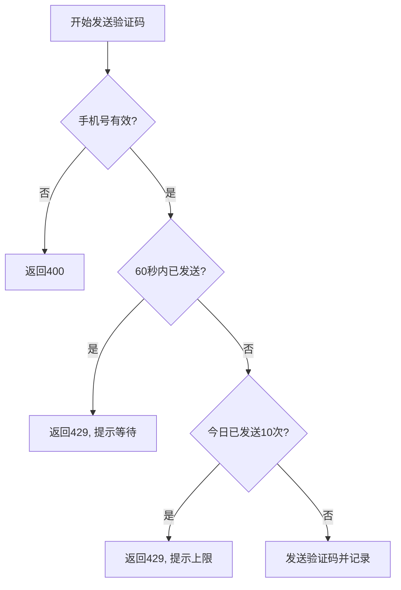
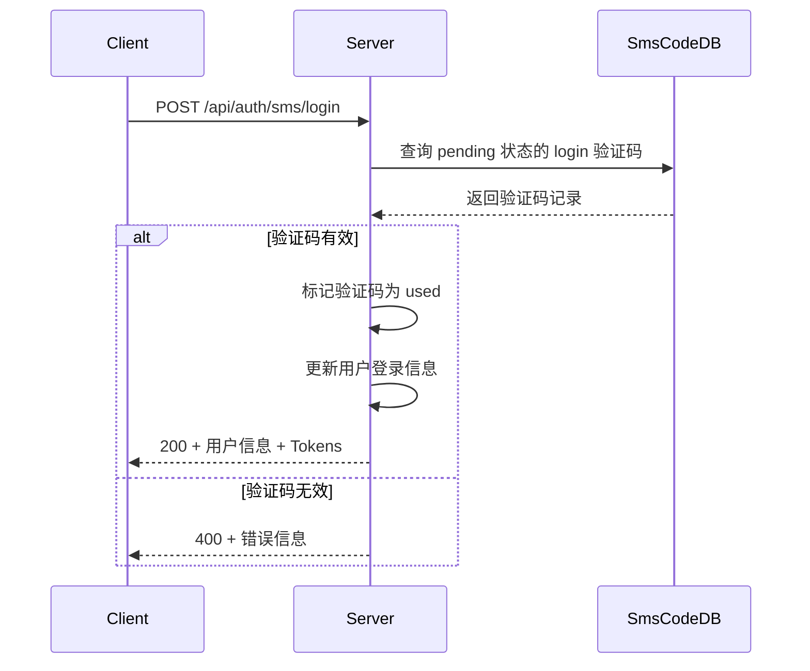
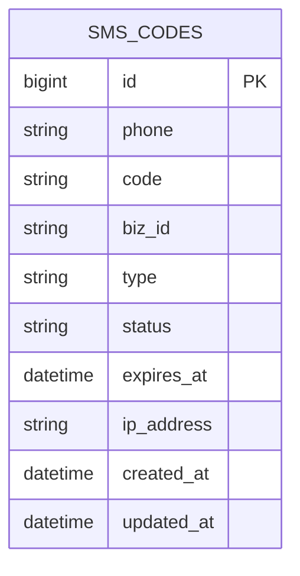
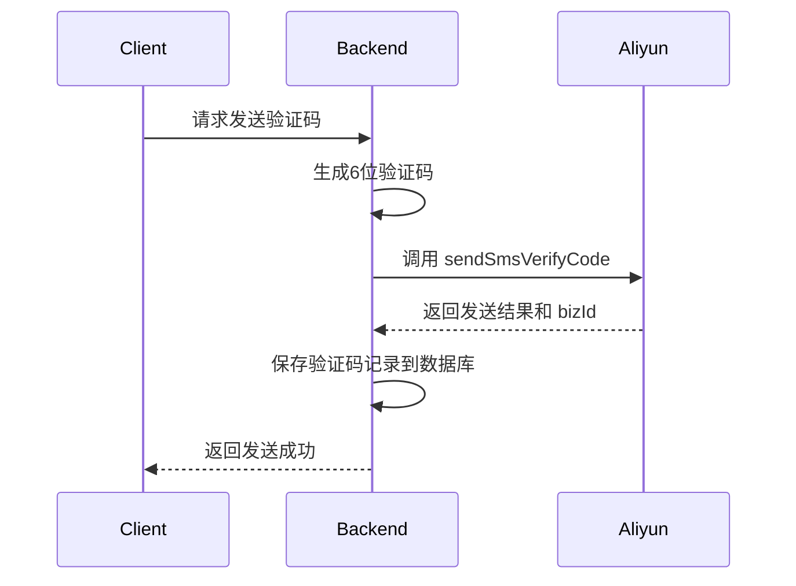

# 短信认证API

<cite>
**本文档引用文件**  
- [sms-auth.js](file://server/routes/sms-auth.js)
- [sms.service.js](file://server/services/sms.service.js)
- [SmsCode.js](file://server/models/SmsCode.js)
- [create-sms-table.js](file://server/scripts/create-sms-table.js)
- [api.ts](file://src/services/api.ts)
- [LoginPage.vue](file://src/pages/LoginPage.vue)
</cite>

## 目录
1. [简介](#简介)
2. [API端点概览](#api端点概览)
3. [验证码发送策略](#验证码发送策略)
4. [业务类型与校验逻辑](#业务类型与校验逻辑)
5. [数据模型与存储](#数据模型与存储)
6. [阿里云短信服务集成](#阿里云短信服务集成)
7. [安全与审计](#安全与审计)
8. [客户端调用示例](#客户端调用示例)
9. [异常处理建议](#异常处理建议)

## 简介
CervixDetectAI系统提供基于短信验证码的用户身份验证机制，支持短信登录、注册及密码重置功能。本API通过阿里云短信服务实现验证码的生成与发送，并结合后端数据库进行状态管理与安全控制。系统设计兼顾用户体验与安全性，包含频率限制、用途区分、临时邮箱生成等机制。

**Section sources**
- [sms-auth.js](file://server/routes/sms-auth.js#L1-L492)

## API端点概览

### 发送短信验证码 (/api/auth/sms/send-code)
- **HTTP方法**: POST
- **请求参数 (body)**:
  - `phone` (string, 必填): 接收验证码的手机号
  - `type` (string, 可选): 验证码用途，可选值为 `login`, `register`, `reset_password`，默认为 `login`
- **响应数据结构 (JSON)**:
```json
{
  "success": true,
  "message": "验证码已发送",
  "data": {
    "expiresIn": 300
  }
}
```
- **状态码**:
  - `200`: 发送成功
  - `400`: 手机号格式错误或参数缺失
  - `409`: 手机号已被注册（注册场景）
  - `429`: 发送过于频繁或当日已达上限
  - `500`: 短信服务异常

**Section sources**
- [sms-auth.js](file://server/routes/sms-auth.js#L26-L164)

### 短信登录 (/api/auth/sms/login)
- **HTTP方法**: POST
- **请求参数 (body)**:
  - `phone` (string, 必填): 用户手机号
  - `code` (string, 必填): 收到的验证码
- **响应数据结构 (JSON)**:
```json
{
  "success": true,
  "message": "登录成功",
  "data": {
    "user": {
      "id": 1,
      "username": "user_13800138000",
      "email": "13800138000@temp.local",
      "real_name": null,
      "phone": "13800138000",
      "role": "user",
      "status": "active",
      "last_login_at": "2024-01-01T00:00:00.000Z"
    },
    "accessToken": "jwt_token_string",
    "refreshToken": "refresh_token_string"
  }
}
```
- **状态码**:
  - `200`: 登录成功
  - `400`: 验证码错误或已过期
  - `404`: 手机号未注册
  - `403`: 账号被禁用
  - `500`: 服务器内部错误

**Section sources**
- [sms-auth.js](file://server/routes/sms-auth.js#L170-L270)

### 短信注册 (/api/auth/sms/register)
- **HTTP方法**: POST
- **请求参数 (body)**:
  - `phone` (string, 必填): 用户手机号
  - `code` (string, 必填): 收到的验证码
  - `username` (string, 可选): 自定义用户名
  - `real_name` (string, 可选): 真实姓名
  - `email` (string, 可选): 电子邮箱
- **响应数据结构 (JSON)**:
```json
{
  "success": true,
  "message": "注册成功",
  "data": {
    "user": {
      "id": 2,
      "username": "custom_user",
      "email": "user@example.com",
      "real_name": "张三",
      "phone": "13800138001",
      "role": "user",
      "status": "active"
    },
    "accessToken": "jwt_token_string",
    "refreshToken": "refresh_token_string"
  }
}
```
- **状态码**:
  - `201`: 注册成功
  - `400`: 参数缺失或格式错误
  - `409`: 手机号/邮箱/用户名已存在
  - `500`: 服务器内部错误

**Section sources**
- [sms-auth.js](file://server/routes/sms-auth.js#L276-L404)

### 短信重置密码 (/api/auth/sms/reset-password)
- **HTTP方法**: POST
- **请求参数 (body)**:
  - `phone` (string, 必填): 用户手机号
  - `code` (string, 必填): 收到的验证码
  - `newPassword` (string, 必填): 新密码（至少6位）
- **响应数据结构 (JSON)**:
```json
{
  "success": true,
  "message": "密码重置成功"
}
```
- **状态码**:
  - `200`: 重置成功
  - `400`: 验证码错误、密码过短或参数缺失
  - `404`: 手机号未注册
  - `500`: 服务器内部错误

**Section sources**
- [sms-auth.js](file://server/routes/sms-auth.js#L410-L489)

## 验证码发送策略

### 频率限制
系统实施双重频率控制策略以防止滥用：

1. **时间间隔限制**：同一手机号60秒内不可重复发送。
   - 若违反，返回 `429` 状态码，并提示剩余等待时间。
   - 实现方式：查询最近60秒内是否有发送记录。

2. **每日次数限制**：同一手机号每日最多发送10次。
   - 若达到上限，返回 `429` 状态码，提示“今日发送次数已达上限”。
   - 实现方式：统计当日（00:00至今）的发送次数。



**Diagram sources**
- [sms-auth.js](file://server/routes/sms-auth.js#L53-L92)

**Section sources**
- [sms-auth.js](file://server/routes/sms-auth.js#L16-L20)

## 业务类型与校验逻辑

### 验证码用途区分
系统通过 `type` 字段区分不同业务场景的验证码：
- `login`: 用于登录和注册（通用）
- `register`: 预留，当前注册使用 `login` 类型
- `reset_password`: 专用于密码重置

### 校验逻辑差异
不同业务在验证码校验时有特定逻辑：

| 业务类型 | 额外校验逻辑 |
|---------|-------------|
| 登录 | 检查用户是否存在、账号是否被禁用 |
| 注册 | 检查手机号是否未注册、邮箱是否唯一 |
| 重置密码 | 检查手机号是否已注册、新密码长度≥6位 |



**Diagram sources**
- [sms-auth.js](file://server/routes/sms-auth.js#L207-L227)
- [sms-auth.js](file://server/routes/sms-auth.js#L447-L467)

**Section sources**
- [sms-auth.js](file://server/routes/sms-auth.js#L46-L51)
- [sms-auth.js](file://server/routes/sms-auth.js#L95-L114)

## 数据模型与存储

### SmsCode 模型
验证码存储于 `sms_codes` 表，核心字段如下：

| 字段名 | 类型 | 说明 |
|-------|------|------|
| phone | STRING(20) | 手机号 |
| code | STRING(6) | 验证码 |
| biz_id | STRING(100) | 阿里云短信业务ID |
| type | ENUM | 验证码类型 (login/register/reset_password) |
| status | ENUM | 状态 (pending/used/expired) |
| expires_at | DATE | 过期时间（5分钟后） |
| ip_address | STRING(45) | 请求来源IP |



**Diagram sources**
- [SmsCode.js](file://server/models/SmsCode.js#L4-L70)

**Section sources**
- [SmsCode.js](file://server/models/SmsCode.js#L1-L74)
- [create-sms-table.js](file://server/scripts/create-sms-table.js#L1-L38)

## 阿里云短信服务集成

### 集成流程
1. 初始化阿里云短信客户端，使用环境变量中的 `ALIYUN_ACCESS_KEY_ID` 和 `ALIYUN_ACCESS_KEY_SECRET`。
2. 调用 `sendSmsVerifyCode` API 发送验证码。
3. 将阿里云返回的 `bizId` 和自生成的验证码存入数据库。

### 配置项
- `ALIYUN_ACCESS_KEY_ID`: 阿里云访问密钥ID
- `ALIYUN_ACCESS_KEY_SECRET`: 阿里云访问密钥
- `ALIYUN_SMS_SIGN_NAME`: 短信签名名称
- `ALIYUN_SMS_TEMPLATE_CODE`: 短信模板CODE



**Diagram sources**
- [sms.service.js](file://server/services/sms.service.js#L49-L112)

**Section sources**
- [sms.service.js](file://server/services/sms.service.js#L1-L128)

## 安全与审计

### 过期时间管理
所有验证码具有 **5分钟** 有效期，由常量 `CODE_EXPIRE_MINUTES = 5` 控制。系统在验证时检查 `expires_at > NOW()`。

### 安全审计
- **IP地址追踪**：记录每次发送和验证请求的客户端IP，用于安全审计。
- **状态标记**：验证码使用后立即标记为 `used`，防止重复使用。
- **日志记录**：关键操作（发送、登录、注册）均输出详细日志，包含手机号、用户ID等信息。

**Section sources**
- [sms-auth.js](file://server/routes/sms-auth.js#L118-L120)
- [sms-auth.js](file://server/routes/sms-auth.js#L228-L229)
- [sms-auth.js](file://server/routes/sms-auth.js#L142-L143)

## 客户端调用示例

### 前端调用封装
在 `src/services/api.ts` 中提供了封装好的API方法：

```typescript
// 发送验证码
await authAPI.sendSmsCode(phone.value, 'login');

// 短信登录
await authAPI.smsLogin(phone, code);

// 短信注册
await authAPI.smsRegister(phone, code, { username, real_name, email });

// 重置密码
await authAPI.resetPassword(phone, code, newPassword);
```

### 临时邮箱生成
短信注册时，若未提供邮箱，系统自动生成临时邮箱：`${phone}@temp.local`。

### 随机密码设置
注册用户初始密码为随机生成的哈希值，用户可后续修改。

**Section sources**
- [api.ts](file://src/services/api.ts#L98-L121)
- [LoginPage.vue](file://src/pages/LoginPage.vue#L185-L240)
- [sms-auth.js](file://server/routes/sms-auth.js#L363-L364)

## 异常处理建议

### 用户端建议
- **429错误**：提示用户等待指定时间或次日再试。
- **400错误**：检查手机号格式、验证码输入是否正确。
- **404错误**：确认手机号是否已注册（重置密码时）。
- **409错误**：更换手机号或邮箱。

### 开发者建议
- 在发送验证码前，前端应先进行手机号格式校验（`/^1[3-9]\d{9}$/`）。
- 实现倒计时功能，避免用户频繁点击发送按钮。
- 捕获网络异常，提供友好的错误提示。

**Section sources**
- [LoginPage.vue](file://src/pages/LoginPage.vue#L190-L197)
- [LoginPage.vue](file://src/pages/LoginPage.vue#L222-L237)