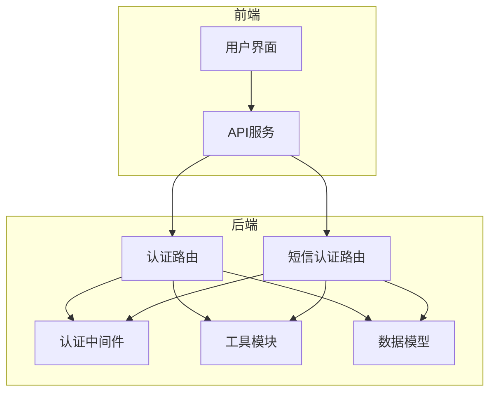
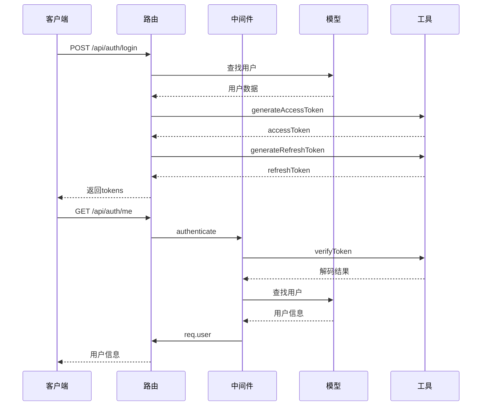
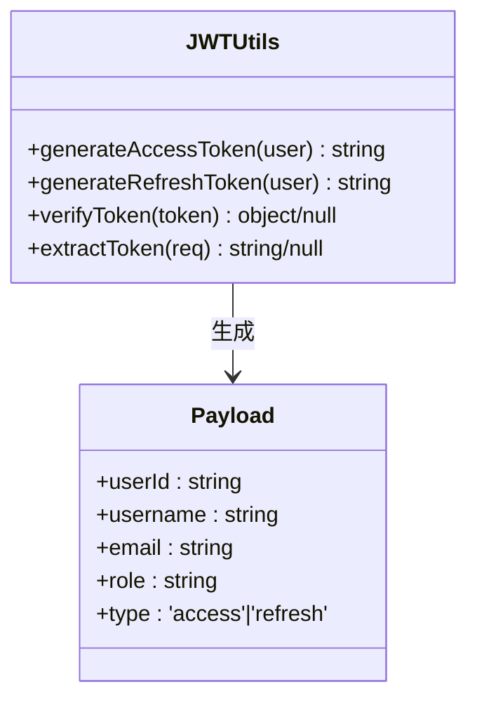
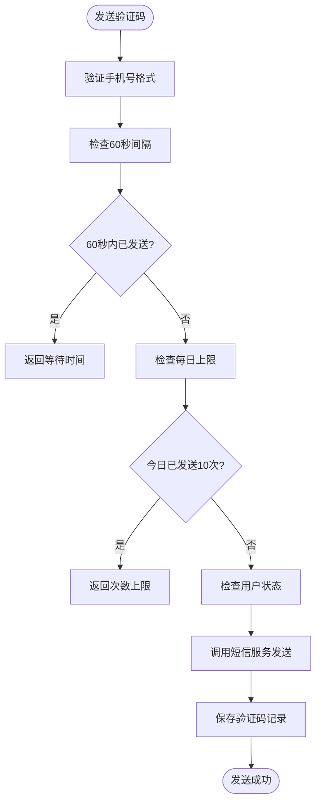
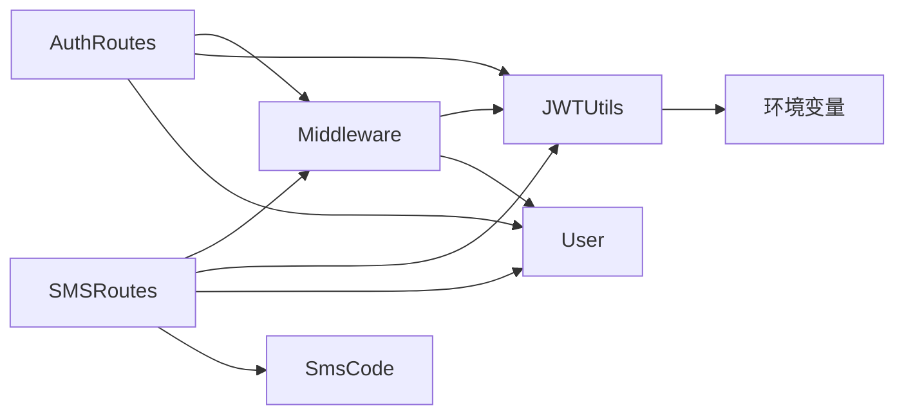

# 认证API

<cite>
**本文档中引用的文件**  
- [auth.js](file://server/routes/auth.js)
- [sms-auth.js](file://server/routes/sms-auth.js)
- [auth.js](file://server/middleware/auth.js)
- [jwt.js](file://server/utils/jwt.js)
- [User.js](file://server/models/User.js)
- [SmsCode.js](file://server/models/SmsCode.js)
</cite>

## 目录
1. [简介](#简介)
2. [项目结构](#项目结构)
3. [核心组件](#核心组件)
4. [架构概述](#架构概述)
5. [详细组件分析](#详细组件分析)
6. [依赖分析](#依赖分析)
7. [性能考虑](#性能考虑)
8. [故障排除指南](#故障排除指南)
9. [结论](#结论)

## 简介
本API文档详细说明了CervixDetectAI系统中的用户认证机制，涵盖基于邮箱和短信验证码的注册、登录、令牌刷新、密码重置等功能。重点描述了JWT双令牌机制（accessToken和refreshToken）的安全实现，以及短信验证码的频率控制策略（60秒内不可重复发送，每日上限10次）。文档为开发者提供完整的端点参考、请求响应结构、状态码说明及调用示例。

## 项目结构
认证功能主要分布在服务器端的路由、中间件、工具和模型模块中。前端通过API调用与后端交互，认证逻辑集中于`server/routes/auth.js`和`server/routes/sms-auth.js`两个路由文件。

**图示来源**  
- [auth.js](file://server/routes/auth.js#L1-L306)
- [sms-auth.js](file://server/routes/sms-auth.js#L1-L492)
- [middleware/auth.js](file://server/middleware/auth.js#L1-L125)
- [utils/jwt.js](file://server/utils/jwt.js#L1-L69)

**本节来源**  
- [server/routes/auth.js](file://server/routes/auth.js#L1-L306)
- [server/routes/sms-auth.js](file://server/routes/sms-auth.js#L1-L492)

## 核心组件
认证系统由多个核心组件构成：JWT工具模块负责令牌生成与验证；认证中间件处理请求的身份验证；用户模型定义账户数据结构；短信验证码模型记录验证码发送状态；短信服务集成第三方发送接口。

**本节来源**  
- [jwt.js](file://server/utils/jwt.js#L1-L69)
- [auth.js](file://server/middleware/auth.js#L1-L125)
- [User.js](file://server/models/User.js#L1-L109)
- [SmsCode.js](file://server/models/SmsCode.js#L1-L74)

## 架构概述
系统采用标准的RESTful API设计，结合JWT双令牌机制保障安全性。用户通过邮箱或手机号获取认证令牌，后续请求携带accessToken进行身份验证，过期后使用refreshToken获取新令牌。短信验证码功能通过独立路由实现，具备严格的频率限制和状态管理。

**图示来源**  
- [auth.js](file://server/routes/auth.js#L112-L188)
- [middleware/auth.js](file://server/middleware/auth.js#L8-L65)
- [jwt.js](file://server/utils/jwt.js#L12-L38)

## 详细组件分析

### JWT双令牌机制分析
系统采用accessToken和refreshToken双令牌机制提升安全性。accessToken有效期较短（默认1小时），用于常规API访问；refreshToken有效期较长（默认7天），仅用于获取新的accessToken。

**图示来源**  
- [jwt.js](file://server/utils/jwt.js#L12-L68)
- [auth.js](file://server/middleware/auth.js#L29-L34)

**本节来源**  
- [jwt.js](file://server/utils/jwt.js#L1-L69)
- [middleware/auth.js](file://server/middleware/auth.js#L1-L125)

### 短信验证码业务规则分析
短信验证码功能实现了严格的频率控制策略，防止滥用。系统记录每次验证码发送的详细信息，并在数据库中维护状态。

**图示来源**  
- [sms-auth.js](file://server/routes/sms-auth.js#L54-L92)
- [SmsCode.js](file://server/models/SmsCode.js#L1-L74)

**本节来源**  
- [sms-auth.js](file://server/routes/sms-auth.js#L1-L492)
- [SmsCode.js](file://server/models/SmsCode.js#L1-L74)

## 依赖分析
认证系统各组件之间存在明确的依赖关系，确保功能解耦和代码复用。

**图示来源**  
- [auth.js](file://server/routes/auth.js#L1-L306)
- [sms-auth.js](file://server/routes/sms-auth.js#L1-L492)
- [middleware/auth.js](file://server/middleware/auth.js#L1-L125)
- [jwt.js](file://server/utils/jwt.js#L1-L69)

**本节来源**  
- [server/routes/auth.js](file://server/routes/auth.js#L1-L306)
- [server/routes/sms-auth.js](file://server/routes/sms-auth.js#L1-L492)
- [server/middleware/auth.js](file://server/middleware/auth.js#L1-L125)
- [server/utils/jwt.js](file://server/utils/jwt.js#L1-L69)

## 性能考虑
- JWT验证为无状态操作，不涉及数据库查询，提升API响应速度
- 短信验证码查询使用复合索引优化性能
- 用户信息查询排除密码字段，减少数据传输量
- 频率限制检查使用数据库原生时间比较，避免应用层计算

## 故障排除指南
常见问题及解决方案：

| 问题现象 | 可能原因 | 解决方案 |
|--------|--------|--------|
| 401 未授权 | Token缺失或格式错误 | 检查Authorization头是否以"Bearer "开头 |
| 401 令牌过期 | accessToken已过期 | 调用refresh接口获取新令牌 |
| 429 发送频繁 | 60秒内重复发送 | 等待指定时间后重试 |
| 429 次数上限 | 每日发送超过10次 | 次日再试或联系管理员 |
| 409 用户名冲突 | 用户名已存在 | 更换用户名或使用系统生成 |
| 404 手机未注册 | 手机号未注册 | 先完成注册流程 |

**本节来源**  
- [auth.js](file://server/routes/auth.js#L1-L306)
- [sms-auth.js](file://server/routes/sms-auth.js#L1-L492)
- [middleware/auth.js](file://server/middleware/auth.js#L1-L125)

## 结论
CervixDetectAI的认证API提供了安全、可靠的用户身份验证机制。通过JWT双令牌设计和短信验证码频率控制，系统在用户体验和安全性之间取得了良好平衡。建议客户端妥善管理令牌生命周期，合理处理各种错误状态，确保流畅的用户认证体验。