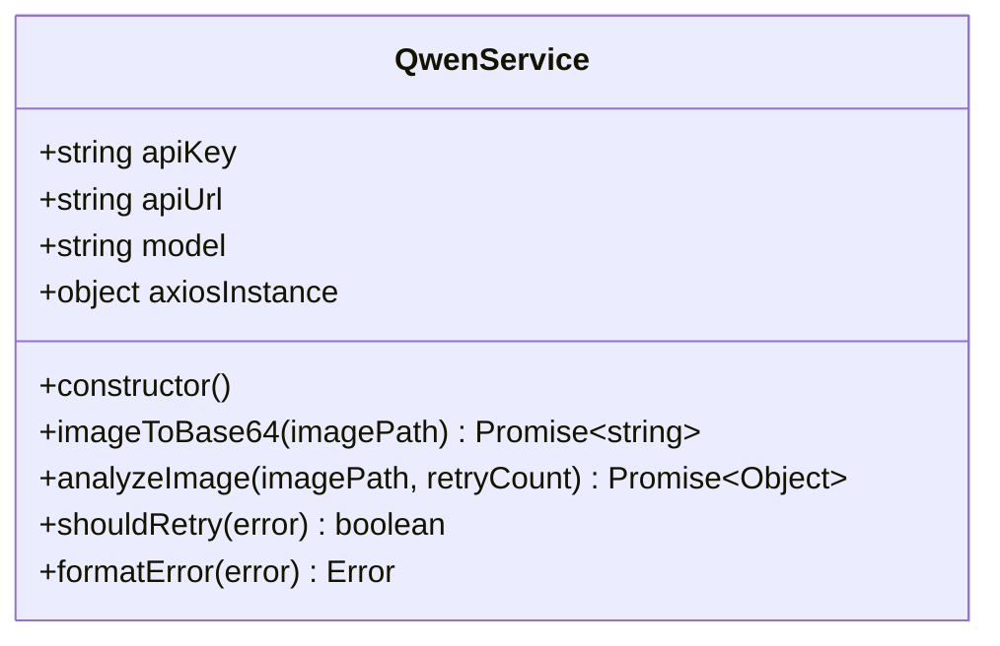
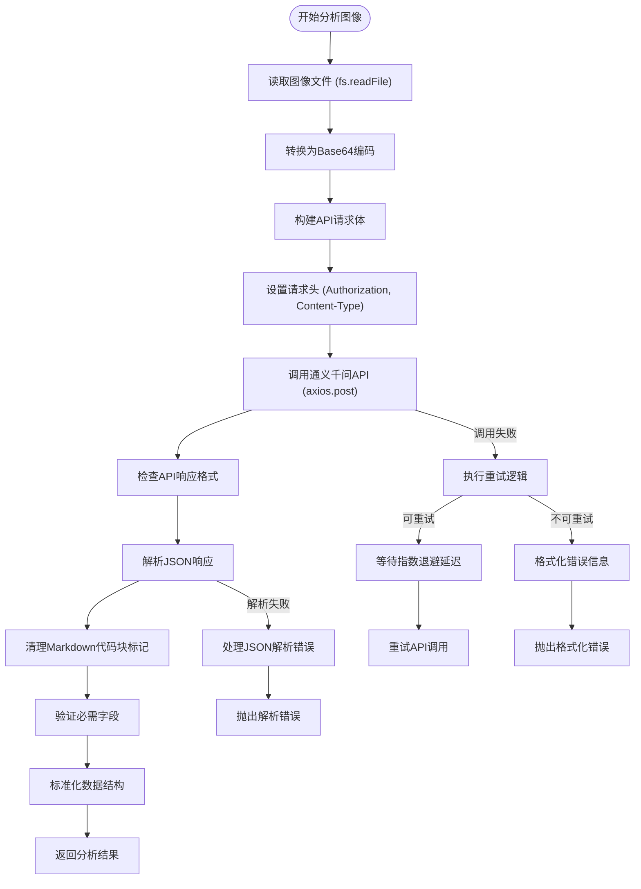
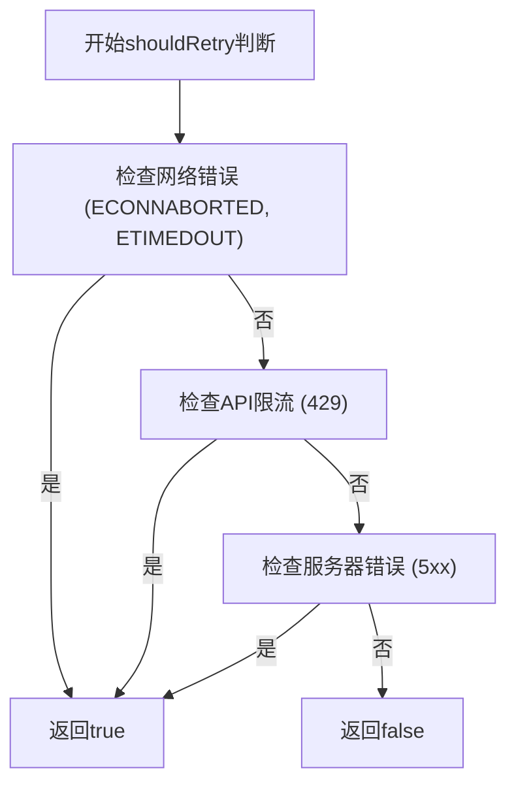
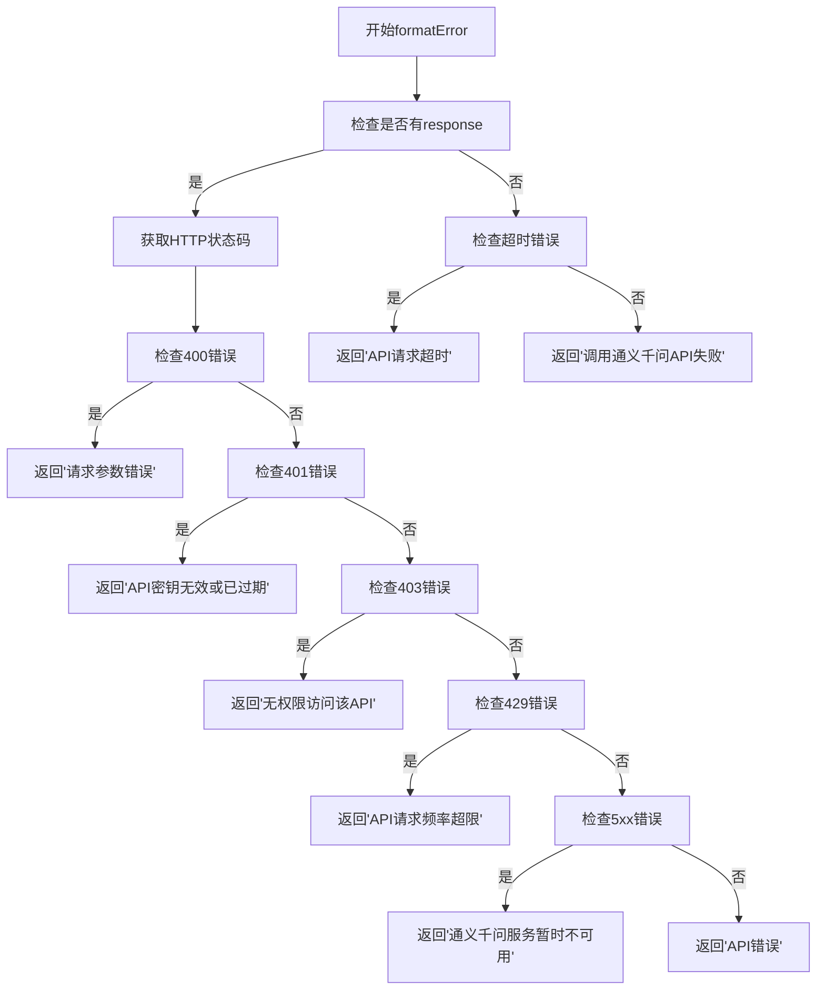
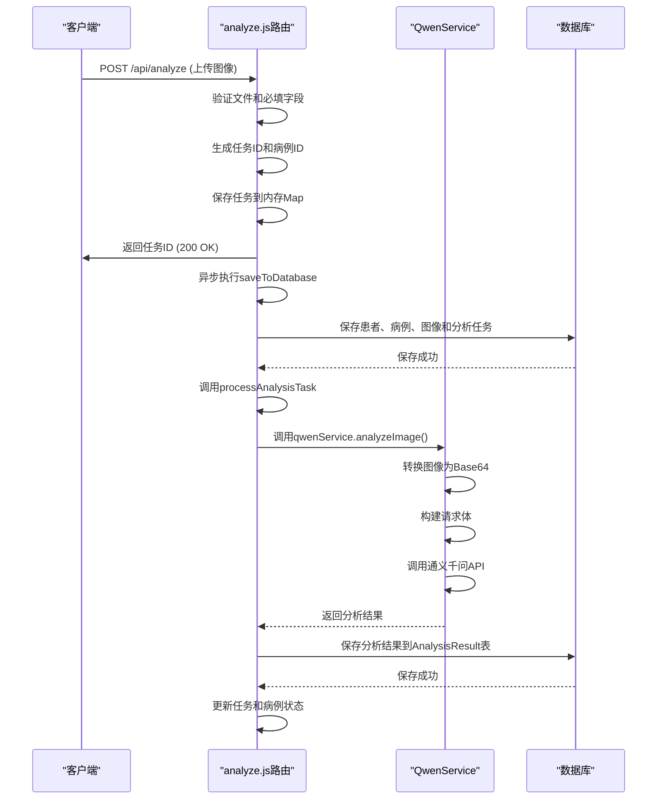
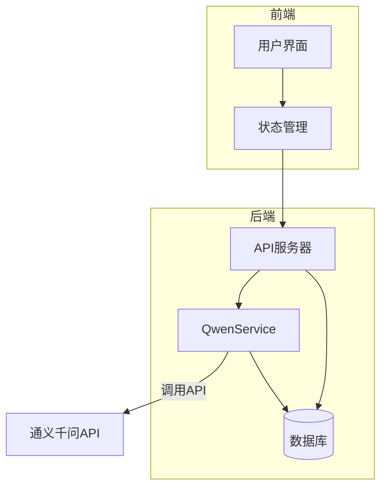

# AI分析服务

<cite>
**Referenced Files in This Document**   
- [qwenService.js](file://server/services/qwenService.js)
- [analyze.js](file://server/routes/analyze.js)
- [.env](file://server/.env)
- [AnalysisTask.js](file://server/models/AnalysisTask.js)
- [AnalysisResult.js](file://server/models/AnalysisResult.js)
- [index.js](file://server/index.js)
</cite>

## 目录
1. [简介](#简介)
2. [核心组件](#核心组件)
3. [QwenService类设计与实现](#qwenservice类设计与实现)
4. [AI分析流程详解](#ai分析流程详解)
5. [错误处理与重试机制](#错误处理与重试机制)
6. [服务层与控制器层交互](#服务层与控制器层交互)
7. [系统架构与数据流](#系统架构与数据流)

## 简介
本文档深入解析CervixDetectAI项目中AI分析服务的设计与实现。该服务基于通义千问视觉语言模型，为宫颈细胞学图像提供专业的病理分析。文档详细阐述了QwenService类的构造函数初始化过程、analyzeImage方法的完整执行流程、重试机制和错误处理策略，以及服务层与控制器层的交互方式。

## 核心组件

**Section sources**
- [qwenService.js](file://server/services/qwenService.js)
- [analyze.js](file://server/routes/analyze.js)

## QwenService类设计与实现

### 构造函数初始化
QwenService类的构造函数负责初始化通义千问API客户端，包括API密钥、模型配置和Axios实例设置。构造函数从环境变量中读取必要的配置信息，并创建一个预配置的Axios实例用于API调用。

**Diagram sources **
- [qwenService.js](file://server/services/qwenService.js#L35-L52)

**Section sources**
- [qwenService.js](file://server/services/qwenService.js#L35-L52)
- [.env](file://server/.env#L1-L4)

## AI分析流程详解

### analyzeImage方法执行流程
analyzeImage方法是AI分析服务的核心，其完整执行流程包括图像文件读取、Base64编码转换、请求体构建、API调用到响应解析等步骤。

**Diagram sources **
- [qwenService.js](file://server/services/qwenService.js#L84-L191)

**Section sources**
- [qwenService.js](file://server/services/qwenService.js#L84-L191)

## 错误处理与重试机制

### 重试机制
QwenService实现了智能的重试机制，通过shouldRetry方法判断是否应该重试。该方法会检查网络错误、超时、API限流和服务器错误等可恢复的错误类型。

**Diagram sources **
- [qwenService.js](file://server/services/qwenService.js#L199-L215)

### 错误格式化
formatError方法将原始错误转换为用户友好的错误信息，针对不同类型的错误提供具体的错误描述。

**Diagram sources **
- [qwenService.js](file://server/services/qwenService.js#L223-L249)

**Section sources**
- [qwenService.js](file://server/services/qwenService.js#L199-L249)

## 服务层与控制器层交互

### 分析任务处理流程
analyze.js路由文件展示了服务层与控制器层的交互方式，包括任务创建、状态更新和结果保存的完整流程。

**Diagram sources **
- [analyze.js](file://server/routes/analyze.js#L240-L337)
- [qwenService.js](file://server/services/qwenService.js#L264-L264)

**Section sources**
- [analyze.js](file://server/routes/analyze.js#L240-L337)

## 系统架构与数据流

### 系统架构图
展示了AI分析服务在整个系统中的位置和与其他组件的交互关系。

**Diagram sources **
- [index.js](file://server/index.js#L8-L15)
- [qwenService.js](file://server/services/qwenService.js)
- [analyze.js](file://server/routes/analyze.js)

**Section sources**
- [index.js](file://server/index.js#L8-L15)
- [qwenService.js](file://server/services/qwenService.js)
- [analyze.js](file://server/routes/analyze.js)