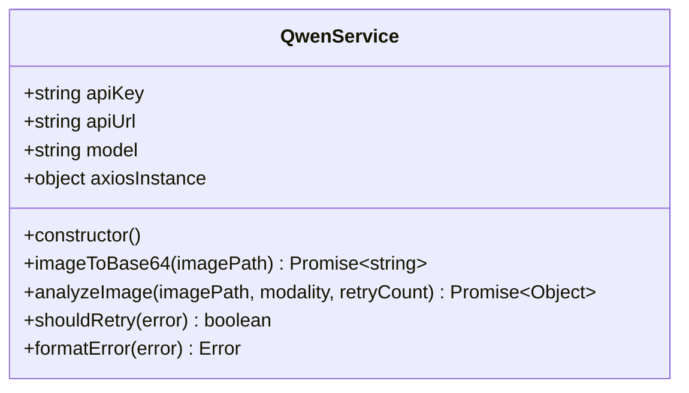
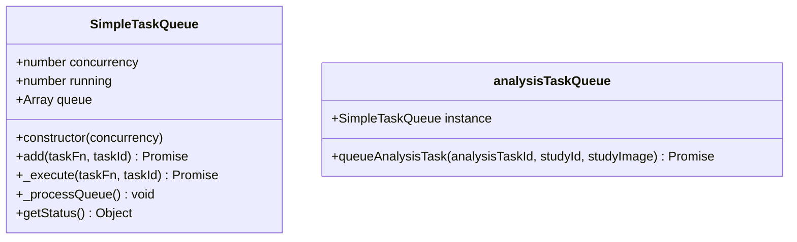
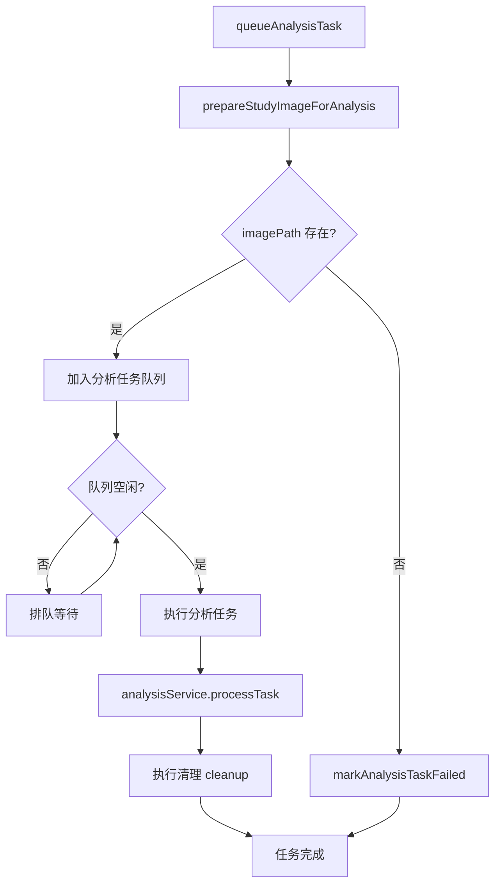
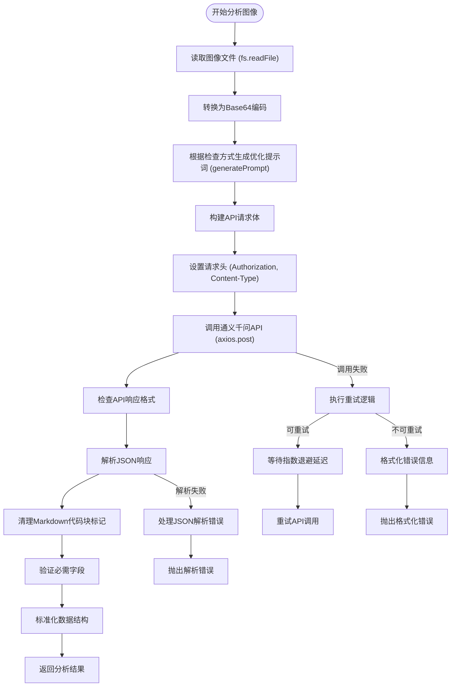
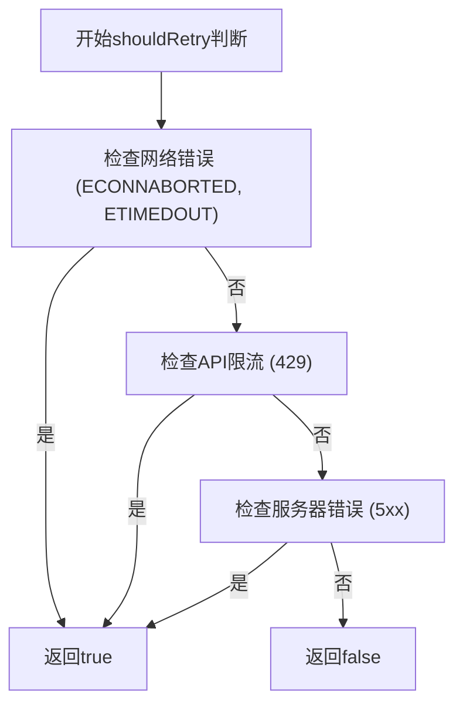
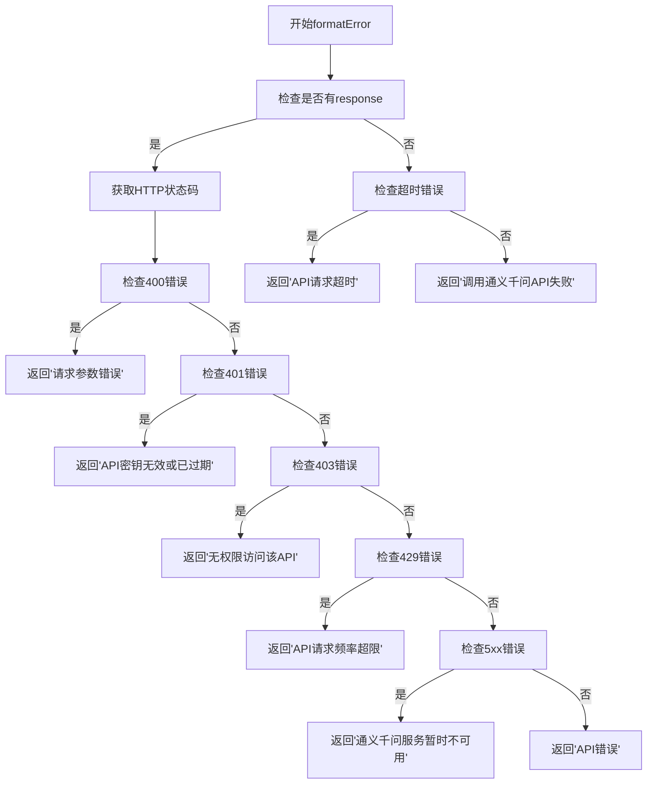
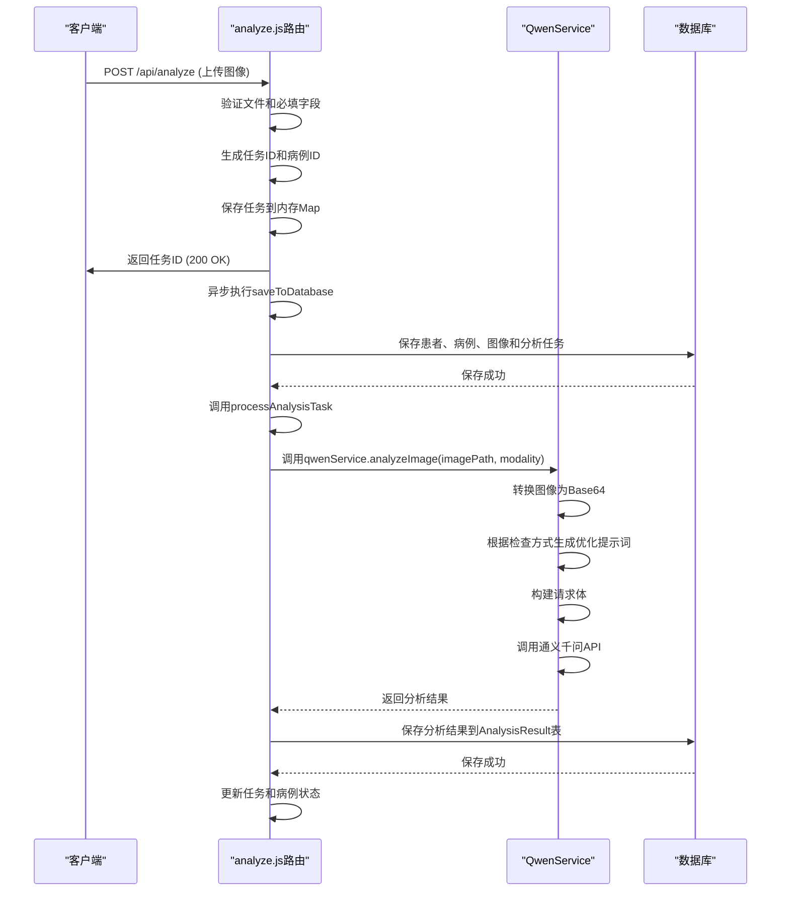
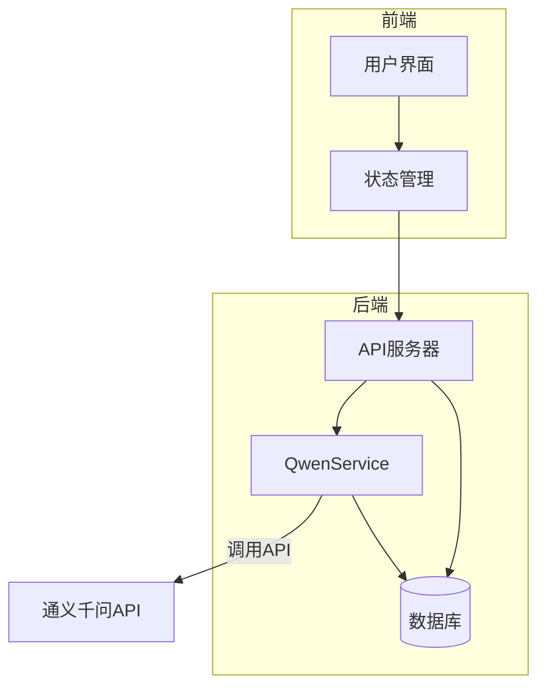

# AI分析服务

> **本文档引用的文件**   
> - [qwenService.js](file://server/services/qwenService.js) - *新增generatePrompt功能，根据检查方式生成优化提示词*
> - [analyze.js](file://server/routes/analyze.js) - *更新以支持传递检查方式参数*
> - [.env](file://server/.env) - *环境变量配置*
> - [AnalysisTask.js](file://server/models/AnalysisTask.js) - *分析任务模型*
> - [AnalysisResult.js](file://server/models/AnalysisResult.js) - *分析结果模型*
> - [index.js](file://server/index.js) - *应用入口文件*

## 更新摘要
**主要变更**
- 新增 `generatePrompt` 功能，根据检查方式（如巴氏染色、TCT、HE染色等）动态生成优化的提示词
- 增强对非细胞学图像的识别与处理能力，在提示词中明确要求判断图像类型
- 更新 `analyzeImage` 方法以接收 `modality` 参数并调用 `generatePrompt`
- 调整分析流程以支持多种检查方式的差异化分析指导
- 更新服务层与控制器层交互逻辑，确保检查方式参数正确传递

### 2026-03-20 任务队列化重构

- **新增任务队列服务** `simpleAnalysisQueue.service.js`：轻量级内存队列，支持并发控制（默认 3），无需 Redis
- **通义千问超时延长**：默认从 60s 调整为 **180s**，可通过 `QWEN_API_TIMEOUT_MS` 环境变量配置
- **重试延迟优化**：递增延迟从 `1s/2s/3s` 调整为 **3s/6s/9s**
- **日志增强**：请求阶段输出图像来源（远程 URL / 本地文件）、检查方式、超时配置；错误日志分阶段详细输出

## 目录
1. [简介](#简介)
2. [核心组件](#核心组件)
3. [QwenService类设计与实现](#qwenservice类设计与实现)
4. [任务队列服务](#任务队列服务)
5. [AI分析流程详解](#ai分析流程详解)
6. [错误处理与重试机制](#错误处理与重试机制)
7. [服务层与控制器层交互](#服务层与控制器层交互)
8. [系统架构与数据流](#系统架构与数据流)

## 简介
本文档深入解析CervixDetectAI项目中AI分析服务的设计与实现。该服务基于通义千问视觉语言模型，为宫颈细胞学图像提供专业的病理分析。文档详细阐述了QwenService类的构造函数初始化过程、analyzeImage方法的完整执行流程、重试机制和错误处理策略，以及服务层与控制器层的交互方式。重点更新了新增的`generatePrompt`功能，该功能可根据不同的检查方式（如巴氏染色、TCT、HE染色等）生成针对性的优化提示词，并增强了对非细胞学图像的识别与处理能力。

## 核心组件

**Section sources**
- [qwenService.js](file://server/services/qwenService.js)
- [simpleAnalysisQueue.service.js](file://server/services/simpleAnalysisQueue.service.js)
- [analyze.js](file://server/routes/analyze.js)

## QwenService类设计与实现

### 构造函数初始化
QwenService类的构造函数负责初始化通义千问API客户端，包括API密钥、模型配置和Axios实例设置。构造函数从环境变量中读取必要的配置信息，并创建一个预配置的Axios实例用于API调用。



**Section sources**
- [qwenService.js](file://server/services/qwenService.js#L203-L220)
- [.env](file://server/.env#L1-L4)

### generatePrompt功能实现
`generatePrompt`函数是本次更新的核心，它根据传入的检查方式（modality）生成针对性的优化提示词，指导AI模型进行更精准的分析。

```javascript
function generatePrompt(modality = '巴氏染色涂片（Pap Smear）') {
  let modalityGuidance = '';
  let diagnosisOptions = '';
  
  if (modality.includes('巴氏染色') || modality.includes('Pap Smear')) {
    modalityGuidance = `
本次分析的图像类型为：**巴氏染色涂片（Pap Smear）**

关键识别要点：
- 细胞核染色：细胞核呈蓝紫色或深蓝色
- 细胞质染色：细胞质呈粉红色、橙红色或淡蓝色
- 关注核质比例、核形态、染色质分布
- 识别鳞状上皮细胞、柱状上皮细胞、化生细胞
- 注意核异型性、核增大、核浆比增加等病变特征`;
    
    diagnosisOptions = `
诊断分类选项（TBS系统）：
- NILM（未见上皮内病变或恶性病变）
- ASC-US（意义不明确的不典型鳞状细胞）
- ASC-H（不排除HSIL的不典型鳞状细胞）
- LSIL（低度鳞状上皮内病变）
- HSIL（高度鳞状上皮内病变）
- SCC（鳞状细胞癌）
- AGC（不典型腺细胞）
- 无法诊断（图像质量不佳、非细胞学图像等）`;
  } else if (modality.includes('液基细胞学') || modality.includes('TCT') || modality.includes('LCT')) {
    // TCT/LCT 检查方式处理逻辑
    modalityGuidance = `
本次分析的图像类型为：**液基细胞学（TCT/LCT）**

关键识别要点：
- 细胞分布均匀，背景干净清晰
- 细胞形态保存良好，核结构清晰
- 关注细胞核大小、形态、染色质分布
- 识别异常细胞的核质比、核轮廓、核仁
- 注意细胞簇的排列方式和极性`;
    
    diagnosisOptions = `
诊断分类选项（TBS系统）：
- NILM（未见上皮内病变或恶性病变）
- ASC-US（意义不明确的不典型鳞状细胞）
- ASC-H（不排除HSIL的不典型鳞状细胞）
- LSIL（低度鳞状上皮内病变）
- HSIL（高度鳞状上皮内病变）
- SCC（鳞状细胞癌）
- AGC（不典型腺细胞）
- 无法诊断（图像质量不佳、非细胞学图像等）`;
  } else if (modality.includes('活检切片') || modality.includes('HE染色')) {
    // HE染色组织学检查方式处理逻辑
    modalityGuidance = `
本次分析的图像类型为：**宫颈活检切片（HE染色）**

关键识别要点：
- 细胞核：苏木精染色呈蓝紫色
- 细胞质和基质：伊红染色呈粉红色
- 评估组织结构：上皮层次、基底膜完整性
- 识别细胞极性丢失、核异型性、病理性核分裂
- 观察浸润深度、间质反应`;
    
    diagnosisOptions = `
诊断分类选项（组织病理学）：
- 正常宫颈组织
- 慢性宫颈炎
- CIN 1（宫颈上皮内瘤变1级）
- CIN 2（宫颈上皮内瘤变2级）
- CIN 3（宫颈上皮内瘤变3级）
- 原位癌
- 浸润性鳞状细胞癌
- 腺癌
- 无法诊断（图像质量不佳、非组织学图像等）`;
  } else if (modality.includes('HPV')) {
    // HPV分型检测处理逻辑
    modalityGuidance = `
本次分析的图像类型为：**HPV分型检测图像**

关键识别要点：
- 识别HPV感染相关的细胞学改变
- 核周空晕（Koilocytosis）
- 双核或多核细胞
- 核异型性、核增大
- 结合分子标记物表达`;
    
    diagnosisOptions = `
诊断分类选项：
- HPV阴性
- 低危型HPV感染
- 高危型HPV感染
- HPV16/18型感染
- 无法诊断（图像质量不佳）`;
  } else if (modality.includes('p16') || modality.includes('Ki67')) {
    // p16/Ki67双染处理逻辑
    modalityGuidance = `
本次分析的图像类型为：**p16/Ki67双染图像**

关键识别要点：
- p16：细胞核和细胞质呈棕褐色阳性染色
- Ki67：细胞核呈棕褐色阳性染色
- 双阳性细胞：同时表达p16和Ki67的细胞
- 评估阳性细胞比例和分布模式`;
    
    diagnosisOptions = `
诊断分类选项：
- 阴性（双染阴性）
- 阳性（双染阳性，提示HSIL）
- 可疑（部分阳性）
- 无法诊断（图像质量不佳）`;
  } else if (modality.includes('阴道镜')) {
    // 阴道镜检查处理逻辑
    modalityGuidance = `
本次分析的图像类型为：**阴道镜检查图像**

关键识别要点：
- 转化区的可见性和类型
- 醋酸白上皮的范围和密度
- 异常血管形态
- 碘染色反应
- 病变边界的清晰度`;
    
    diagnosisOptions = `
诊断分类选项：
- 正常表现
- 低度病变（Minor Changes）
- 高度病变（Major Changes）
- 可疑浸润癌
- 无法诊断（图像质量不佳）`;
  } else {
    // 默认处理逻辑
    modalityGuidance = `
本次分析的图像类型为：**${modality}**

请根据图像的实际特征进行分析，如果图像不符合宫颈细胞学检查的特征，请在诊断中说明"无法诊断"并给出原因。`;
    
    diagnosisOptions = `
诊断分类选项：
- 请根据实际图像类型选择合适的诊断分类
- 如无法识别为宫颈细胞学图像，请选择"无法诊断"`;
  }

  return `- Role: 宫颈细胞学病理专家
- Background: 用户需要对宫颈细胞学图像进行专业分析，以确定是否存在病变，并提供详细的诊断报告。用户可能是一位病理学研究人员、临床医生或相关领域的专业人士，需要准确的诊断信息来指导后续的治疗或研究。
- Profile: 你是一位在宫颈细胞学病理领域拥有多年经验的专家，精通各类宫颈细胞学检查方法（巴氏染色、液基细胞学、HE染色组织学、免疫组化、阴道镜等）。你对宫颈细胞的形态学变化、病变特征以及相关生物标志物有着深入的理解和丰富的实践经验。
${modalityGuidance}

- Skills: 你具备以下关键能力：
  - 精准识别不同类型的宫颈细胞学图像（巴氏染色、TCT、HE染色、免疫组化等）
  - 准确解读细胞形态学特征和组织结构变化
  - 根据细胞学特征和生物标志物状态，准确判断病变类型
  - 提供详细的病理分析报告，包括诊断分类、置信度、可疑区域描述、生物标志物评估以及临床建议
  - 能够识别非细胞学图像并给出"无法诊断"的明确反馈

- Goals:
  1. **首先判断**：图像是否为宫颈细胞学相关检查图像，如果不是（如CT、MRI、X光等影像学图像），应诊断为"无法诊断"并说明原因。
  2. 分析宫颈细胞学图像的类型和染色方法。
  3. 识别细胞形态学特征或组织结构特征。
  4. 确定诊断分类并评估置信度。
  5. 描述图像中异常区域的位置和特征。
  6. 推测HPV、p16、Ki67的状态（如适用）。
  7. 提供具体的临床建议。
  8. 生成完整的病理分析报告。

${diagnosisOptions}

- Constrains: 
  - 诊断报告应基于图像分析和现有知识，确保信息的准确性和客观性
  - 诊断分类必须从上述给定选项中选择
  - 置信度应以0到1之间的小数表示（0.0-1.0）
  - **如果图像不是细胞学或组织学图像（如CT、MRI、超声等），必须诊断为"无法诊断"**
  - **如果图像质量过差无法判读，必须诊断为"无法诊断"并说明原因**

- OutputFormat: 必须以严格的JSON格式返回结果，包含以下字段：
  {
    "diagnosis": "诊断分类（从上述选项中选择）",
    "confidence": 0.85,
    "suspiciousAreas": ["异常区域1的描述", "异常区域2的描述"],
    "biomarkers": {
      "HPV": "阳性/阴性/未检测/不适用",
      "p16": "阳性/阴性/未检测/不适用",
      "Ki67": "阳性/阴性/未检测/不适用"
    },
    "recommendations": ["建议1", "建议2"],
    "detailedReport": "完整的病理分析报告文字描述"
  }

- Workflow:
  1. **图像类型判断**：首先确认这是否为宫颈细胞学相关检查图像（巴氏染色、TCT、HE染色、免疫组化、阴道镜等），如果是CT、MRI、X光等非细胞学图像，立即返回"无法诊断"。
  2. **图像质量评估**：评估图像清晰度、染色质量、细胞分布等，如质量过差无法判读，返回"无法诊断"。
  3. **细胞形态学观察**：仔细观察细胞或组织的形态学特征，识别关键病理改变。
  4. **诊断分类**：根据观察到的特征，从给定的诊断选项中选择最合适的分类，并评估诊断置信度。
  5. **异常区域定位**：描述图像中可疑或异常区域的具体位置和特征。
  6. **生物标志物推测**：结合细胞学特征，推测HPV、p16、Ki67的可能状态（如适用）。
  7. **临床建议**：根据诊断结果，提供具体的后续检查或治疗建议。
  8. **生成报告**：整合所有分析结果，生成完整的、结构化的病理分析报告。`;
}
```

**Diagram sources**
- [qwenService.js](file://server/services/qwenService.js#L9-L196) - *新增generatePrompt函数*

**Section sources**
- [qwenService.js](file://server/services/qwenService.js#L9-L196) - *新增generatePrompt函数*

## 任务队列服务

### SimpleTaskQueue 类设计
`simpleAnalysisQueue.service.js` 提供了一个轻量级的内存任务队列，适用于小型部署或开发环境，无需 Redis 等外部依赖。



**Section sources**
- [simpleAnalysisQueue.service.js](file://server/services/simpleAnalysisQueue.service.js)

### 队列配置

| 环境变量 | 默认值 | 说明 |
| :--- | :---: | :--- |
| `MAX_CONCURRENT_ANALYSIS` | `3` | 分析任务最大并发数 |

### queueAnalysisTask 执行流程



**Section sources**
- [simpleAnalysisQueue.service.js](file://server/services/simpleAnalysisQueue.service.js#L88-L122)

### 与路由层的交互

`analysis-tasks.js` 的 `POST /` 和 `POST /batch` 接口统一调用 `queueAnalysisTask`：

```javascript
const { queueAnalysisTask } = require('../services/simpleAnalysisQueue.service.js');

// 单任务接口
await queueAnalysisTask(task.id, study.id, studyImage);

// 批量任务接口（.catch 降级处理）
queueAnalysisTask(task.id, study.id, image).catch((error) => {
    void markAnalysisTaskFailed({ analysisTaskId: task.id, studyId: study.id, error, ... });
});
```

**Section sources**
- [analysis-tasks.js](file://server/routes/analysis-tasks.js)

## AI分析流程详解

### analyzeImage方法执行流程
analyzeImage方法是AI分析服务的核心，其完整执行流程包括图像文件读取、Base64编码转换、请求体构建、API调用到响应解析等步骤。本次更新增加了根据检查方式生成优化提示词的环节。



**Diagram sources**
- [qwenService.js](file://server/services/qwenService.js#L253-L348)

**Section sources**
- [qwenService.js](file://server/services/qwenService.js#L253-L348)

## 错误处理与重试机制

### 重试机制
QwenService实现了智能的重试机制，通过shouldRetry方法判断是否应该重试。该方法会检查网络错误、超时、API限流和服务器错误等可恢复的错误类型。



**Diagram sources**
- [qwenService.js](file://server/services/qwenService.js#L369-L386)

### 错误格式化
formatError方法将原始错误转换为用户友好的错误信息，针对不同类型的错误提供具体的错误描述。



**Diagram sources**
- [qwenService.js](file://server/services/qwenService.js#L394-L421)

**Section sources**
- [qwenService.js](file://server/services/qwenService.js#L369-L421)

## 服务层与控制器层交互

### 分析任务处理流程
analyze.js路由文件展示了服务层与控制器层的交互方式，包括任务创建、状态更新和结果保存的完整流程。控制器层现在会将检查方式（modality）参数传递给服务层。



**Diagram sources**
- [analyze.js](file://server/routes/analyze.js#L240-L337)
- [qwenService.js](file://server/services/qwenService.js#L253-L348)

**Section sources**
- [analyze.js](file://server/routes/analyze.js#L240-L337)

## 系统架构与数据流

### 系统架构图
展示了AI分析服务在整个系统中的位置和与其他组件的交互关系。



**Diagram sources**
- [index.js](file://server/index.js#L8-L15)
- [qwenService.js](file://server/services/qwenService.js)
- [analyze.js](file://server/routes/analyze.js)

**Section sources**
- [index.js](file://server/index.js#L8-L15)
- [qwenService.js](file://server/services/qwenService.js)
- [analyze.js](file://server/routes/analyze.js)