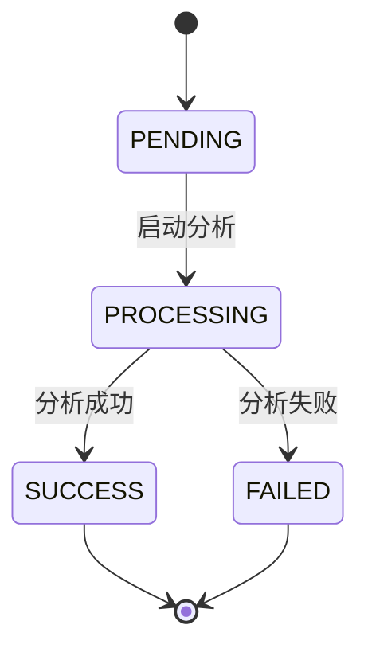
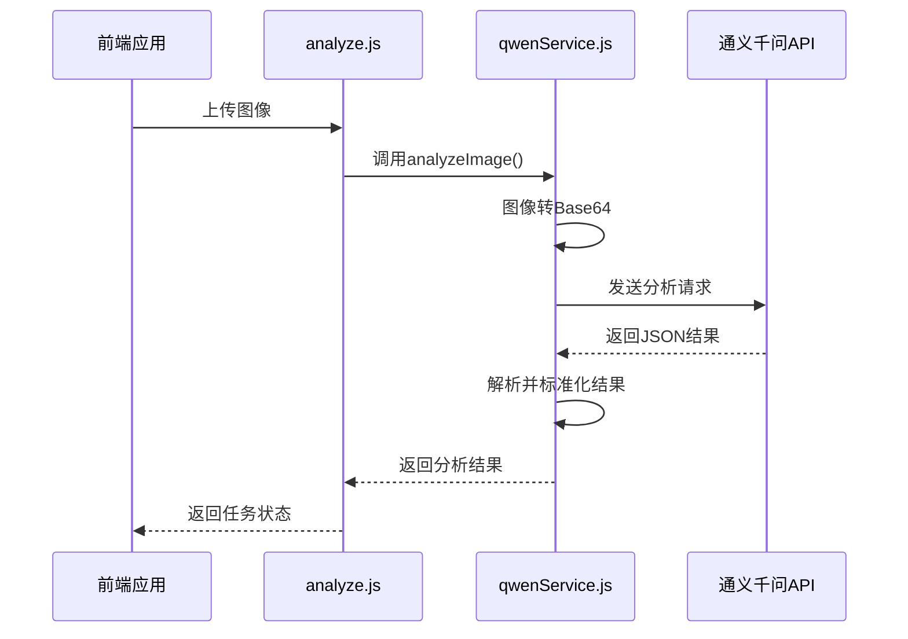
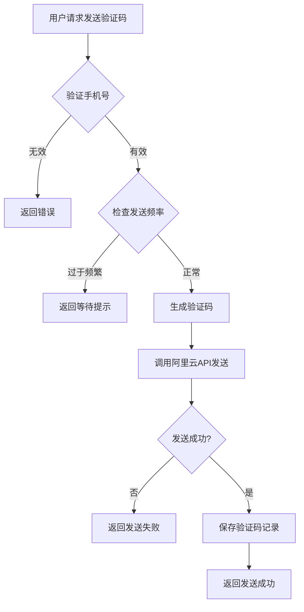
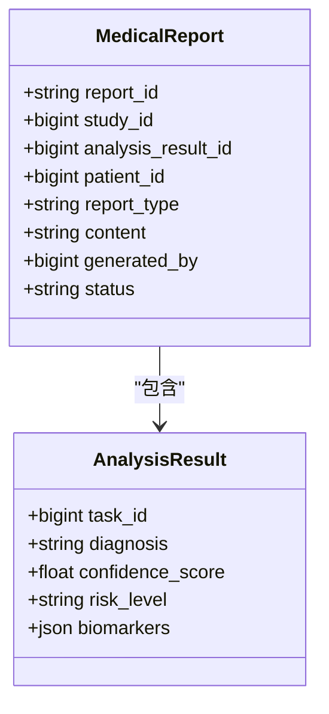

# 业务逻辑层

<cite>
**Referenced Files in This Document**   
- [qwenService.js](file://server/services/qwenService.js)
- [sms.service.js](file://server/services/sms.service.js)
- [analyze.js](file://server/routes/analyze.js)
- [analysis-tasks.js](file://server/routes/analysis-tasks.js)
- [reports.js](file://server/routes/reports.js)
- [AnalysisTask.js](file://server/models/AnalysisTask.js)
- [AnalysisResult.js](file://server/models/AnalysisResult.js)
- [MedicalReport.js](file://server/models/MedicalReport.js)
- [SmsCode.js](file://server/models/SmsCode.js)
- [sms-auth.js](file://server/routes/sms-auth.js)
</cite>

## 目录
1. [服务层核心功能](#服务层核心功能)
2. [AI分析任务管理](#ai分析任务管理)
3. [通义千问视觉模型调用](#通义千问视觉模型调用)
4. [阿里云短信服务](#阿里云短信服务)
5. [医疗报告生成](#医疗报告生成)
6. [关键业务流程执行路径](#关键业务流程执行路径)

## 服务层核心功能

CervixDetectAI后端的服务层（services）封装了系统的核心业务流程，通过模块化设计实现了高内聚、低耦合的架构。服务层位于路由层与数据模型层之间，负责协调业务逻辑的执行，包括AI分析任务的创建与状态管理、通义千问视觉模型的调用、阿里云短信验证码的发送与验证，以及医疗报告的生成等关键功能。服务层通过调用数据模型（models）进行数据库操作，并为路由层（routes）提供清晰的API接口，确保了业务逻辑的集中管理和可维护性。

**Section sources**
- [qwenService.js](file://server/services/qwenService.js)
- [sms.service.js](file://server/services/sms.service.js)

## AI分析任务管理

AI分析任务的管理是系统的核心业务流程之一，由`analysis-tasks.js`路由和`AnalysisTask`模型共同实现。当用户上传宫颈细胞学图像后，系统会创建一个分析任务，该任务的状态在处理过程中会经历`PENDING`（待处理）、`PROCESSING`（处理中）、`SUCCESS`（成功）或`FAILED`（失败）等状态。

**Diagram sources**
- [AnalysisTask.js](file://server/models/AnalysisTask.js#L39-L41)

**Section sources**
- [analysis-tasks.js](file://server/routes/analysis-tasks.js)
- [AnalysisTask.js](file://server/models/AnalysisTask.js)

## 通义千问视觉模型调用

通义千问视觉模型的调用逻辑封装在`qwenService.js`服务中。该服务通过`QwenService`类实现，负责与通义千问API进行交互。调用流程包括：将上传的图像文件转换为Base64编码，构建包含系统提示词（SYSTEM_PROMPT）和图像数据的请求体，通过HTTP POST请求发送至API，并对返回的JSON响应进行解析和错误处理。

**Diagram sources**
- [qwenService.js](file://server/services/qwenService.js#L84-L191)
- [analyze.js](file://server/routes/analyze.js#L264-L265)

**Section sources**
- [qwenService.js](file://server/services/qwenService.js)
- [analyze.js](file://server/routes/analyze.js)

## 阿里云短信服务

阿里云短信服务的发送与验证功能由`sms.service.js`和`sms-auth.js`共同实现。`AliyunSmsService`类封装了与阿里云Dypnsapi SDK的交互，负责生成6位数字验证码、创建API客户端、发送短信以及处理响应。`sms-auth.js`路由则处理发送验证码、短信登录、注册和密码重置等业务逻辑，包括验证手机号格式、检查发送频率限制、验证验证码有效性等。

**Diagram sources**
- [sms.service.js](file://server/services/sms.service.js#L48-L112)
- [sms-auth.js](file://server/routes/sms-auth.js#L121-L121)

**Section sources**
- [sms.service.js](file://server/services/sms.service.js)
- [sms-auth.js](file://server/routes/sms-auth.js)
- [SmsCode.js](file://server/models/SmsCode.js)

## 医疗报告生成

医疗报告的生成规则基于已完成的AI分析结果。当系统调用`/api/reports/generate/:studyId`接口时，服务层会查询指定病例（study）的最新分析结果（`AnalysisResult`），并将其与患者信息、病例信息整合，生成结构化的报告内容。报告内容以JSON格式存储在`MedicalReport`模型的`content`字段中，并自动生成唯一的`report_id`。

**Diagram sources**
- [MedicalReport.js](file://server/models/MedicalReport.js#L18-L37)
- [AnalysisResult.js](file://server/models/AnalysisResult.js#L58-L68)

**Section sources**
- [reports.js](file://server/routes/reports.js)
- [MedicalReport.js](file://server/models/MedicalReport.js)

## 关键业务流程执行路径

以下是对图像上传→启动AI分析→结果保存→报告生成这一关键业务流程的代码级执行路径分析：

1.  **图像上传与任务创建**：前端通过`/api/analyze`接口上传图像。`analyze.js`路由接收到请求后，使用`multer`中间件处理文件上传，并在内存中创建一个任务对象，立即返回`taskId`和`studyId`给前端。
2.  **异步分析处理**：`analyze.js`调用`saveToDatabase()`函数，将患者、病例、图像和分析任务记录异步保存到数据库。
3.  **调用AI模型**：`saveToDatabase()`完成后，触发`processAnalysisTask(taskId)`函数。该函数调用`qwenService.analyzeImage()`，将图像路径传递给通义千问服务进行分析。
4.  **结果保存**：AI分析完成后，`processAnalysisTask`函数将结果（包括诊断、置信度、生物标志物等）保存到`AnalysisResult`表中，并更新`AnalysisTask`和`Study`的状态为`SUCCESS`。
5.  **报告生成**：用户或系统可以调用`/api/reports/generate/:studyId`接口。`reports.js`路由查询该病例的最新分析结果，将其与病例和患者信息整合，创建一份新的`MedicalReport`。

此流程确保了用户上传后能快速得到响应，而耗时的AI分析在后台异步执行，提升了用户体验。

**Section sources**
- [analyze.js](file://server/routes/analyze.js#L109-L112)
- [analyze.js](file://server/routes/analyze.js#L240-L337)
- [reports.js](file://server/routes/reports.js#L90-L135)