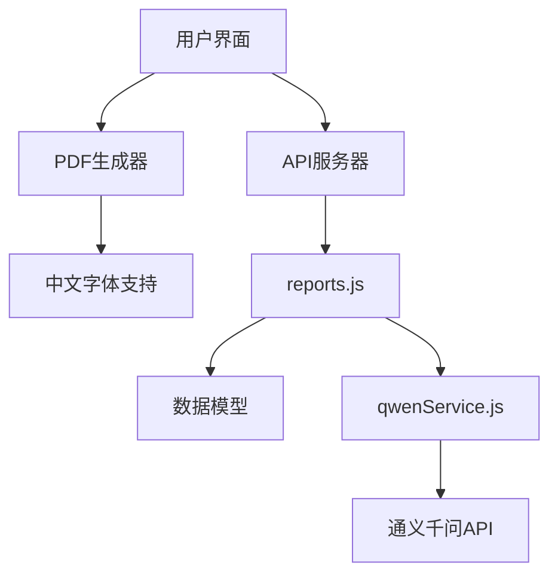
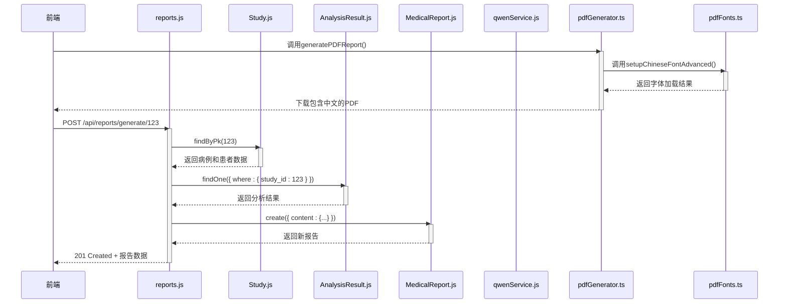
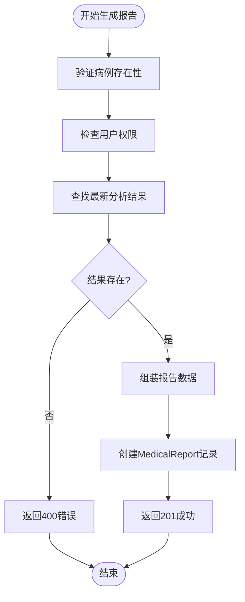
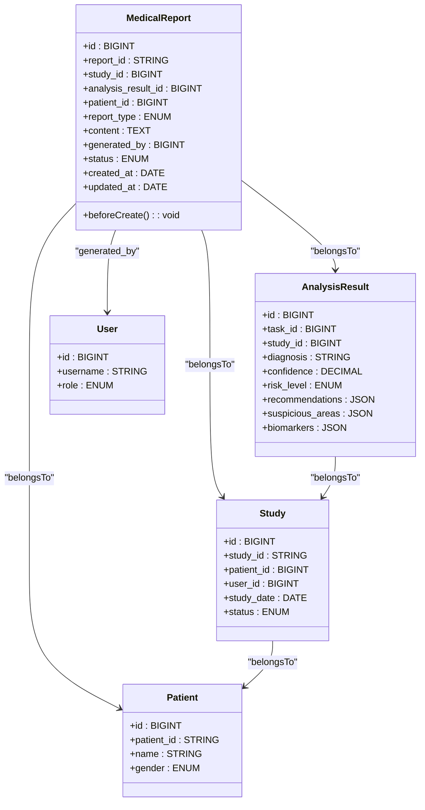
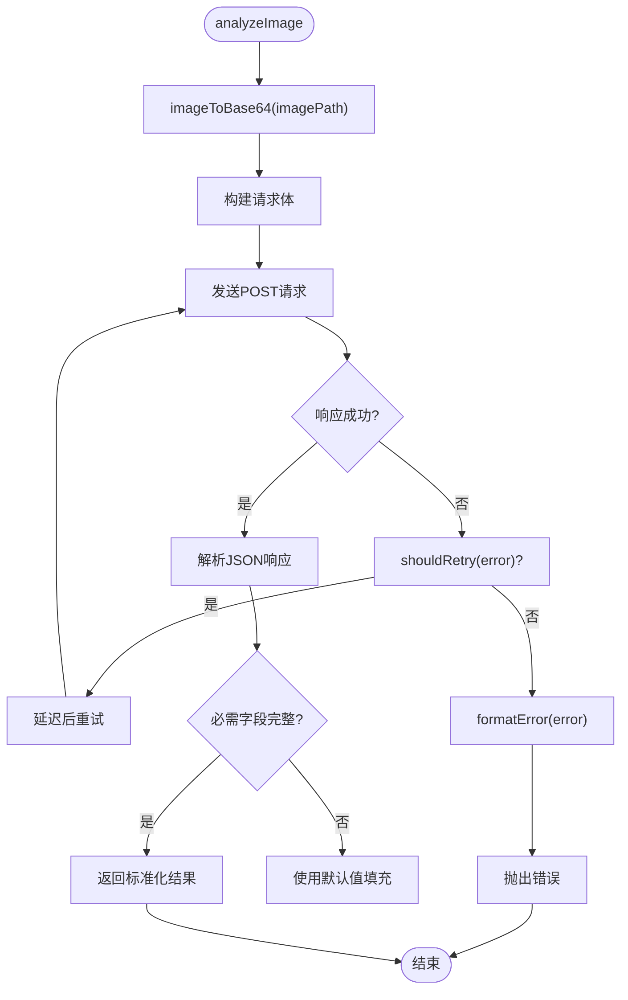
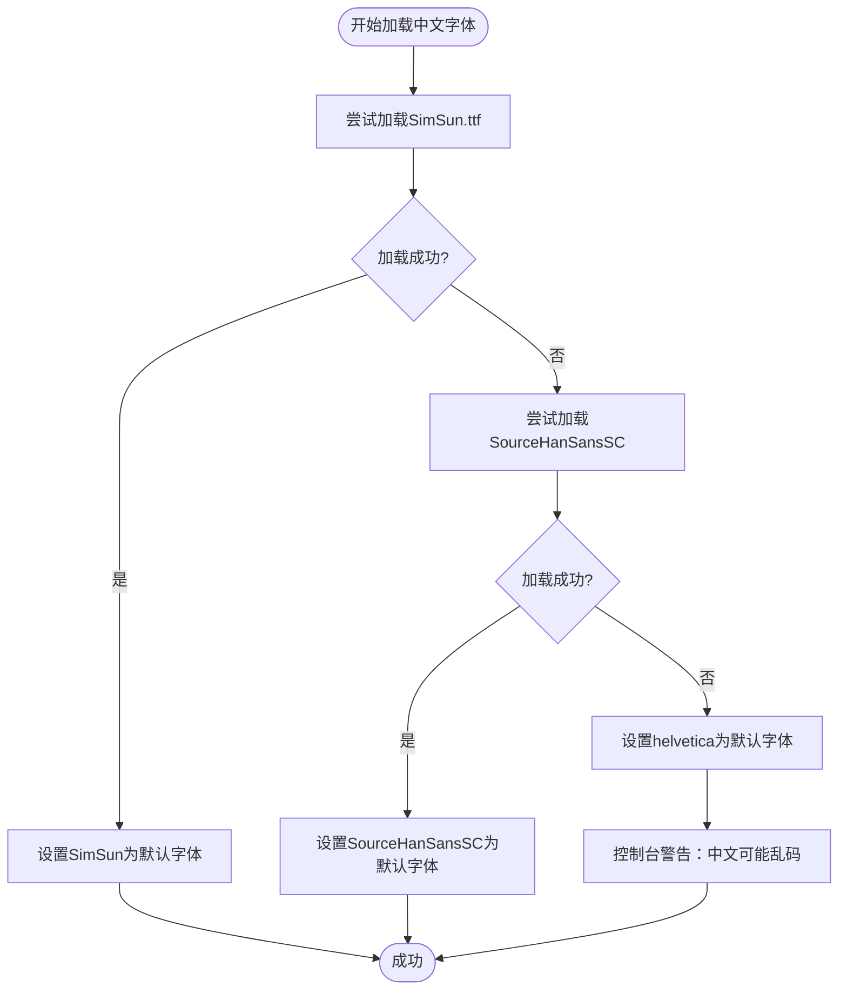
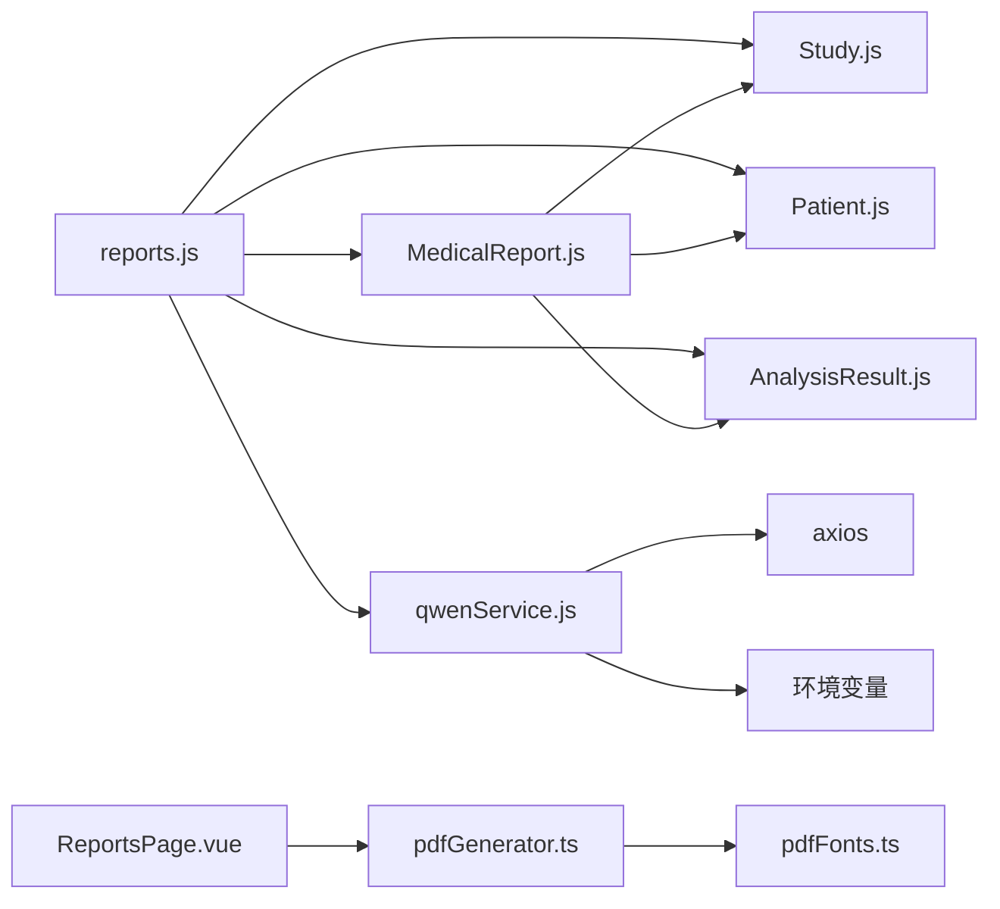

# 报告生成服务

> **本文档中引用的文件**
> - [reports.js](file://server/routes/reports.js)
> - [MedicalReport.js](file://server/models/MedicalReport.js)
> - [Patient.js](file://server/models/Patient.js)
> - [Study.js](file://server/models/Study.js)
> - [AnalysisResult.js](file://server/models/AnalysisResult.js)
> - [qwenService.js](file://server/services/qwenService.js)
> - [pdfGenerator.ts](file://src/utils/pdfGenerator.ts) - *新增，支持中文PDF生成*
> - [pdfFonts.ts](file://src/utils/pdfFonts.ts) - *新增，提供SimSun中文字体支持*

## 更新摘要
**变更内容**
- 在“架构概述”和“详细组件分析”中新增了关于前端PDF中文支持的说明。
- 新增“PDF中文字符支持”章节，详细描述`pdfFonts.ts`和`pdfGenerator.ts`的实现逻辑。
- 更新了“依赖分析”以包含新的前端工具文件。
- 所有文件引用标题已按要求转换为中文。

**新增章节**
- ### PDF中文字符支持

**更新的源文件**
- [pdfGenerator.ts](file://src/utils/pdfGenerator.ts#L42-L276) - *新增文件，实现PDF生成*
- [pdfFonts.ts](file://src/utils/pdfFonts.ts#L10-L75) - *新增文件，解决中文字体问题*

## 目录
1. [简介](#简介)
2. [项目结构](#项目结构)
3. [核心组件](#核心组件)
4. [架构概述](#架构概述)
5. [详细组件分析](#详细组件分析)
6. [PDF中文字符支持](#pdf中文字符支持)
7. [依赖分析](#依赖分析)
8. [性能考虑](#性能考虑)
9. [故障排除指南](#故障排除指南)
10. [结论](#结论)

## 简介
本系统为宫颈癌AI辅助诊断平台，核心功能是基于AI分析结果自动生成结构化医疗报告。系统整合患者信息、病例数据和AI分析结果，生成符合临床规范的诊断报告，并支持PDF下载与数据库持久化。报告生成服务是连接AI分析与临床应用的关键环节，确保诊断结果的可读性、可追溯性和合规性。本次更新重点增强了PDF报告的中文字符渲染能力，通过引入`pdfFonts.ts`和`pdfGenerator.ts`，确保包含中文的报告能够正确显示。

## 项目结构
系统采用前后端分离架构，后端基于Express框架实现RESTful API，前端使用Vue3与Quasar构建用户界面。后端`server/routes`目录下的`reports.js`为核心路由文件，负责处理所有报告相关的HTTP请求。`server/models`目录定义了`MedicalReport`、`Patient`、`Study`和`AnalysisResult`等Sequelize模型，建立了数据持久化的基础。`server/services`中的`qwenService.js`封装了与通义千问大模型的交互逻辑，是AI分析能力的来源。前端`src/utils`目录新增了`pdfGenerator.ts`和`pdfFonts.ts`，专门用于解决PDF生成中的中文乱码问题。



**图表来源**
- [reports.js](file://server/routes/reports.js)
- [qwenService.js](file://server/services/qwenService.js)
- [pdfGenerator.ts](file://src/utils/pdfGenerator.ts)
- [pdfFonts.ts](file://src/utils/pdfFonts.ts)

**本节来源**
- [reports.js](file://server/routes/reports.js)
- [MedicalReport.js](file://server/models/MedicalReport.js)

## 核心组件
核心组件包括`MedicalReport`模型、`reports.js`路由处理器、`qwenService.js`服务以及新增的`pdfGenerator.ts`和`pdfFonts.ts`。`MedicalReport`模型定义了报告的结构化数据格式，包含与`Study`、`Patient`和`AnalysisResult`的外键关联。`reports.js`提供了创建、生成、查询、更新和下载报告的完整API集。`qwenService.js`作为AI能力的桥梁，负责将图像数据转换为Base64并调用大模型API进行分析，返回结构化的诊断结果。`pdfGenerator.ts`和`pdfFonts.ts`共同构成了前端PDF中文支持的核心，确保报告在下载时中文内容能正确渲染。

**本节来源**
- [MedicalReport.js](file://server/models/MedicalReport.js)
- [reports.js](file://server/routes/reports.js)
- [qwenService.js](file://server/services/qwenService.js)
- [pdfGenerator.ts](file://src/utils/pdfGenerator.ts)
- [pdfFonts.ts](file://src/utils/pdfFonts.ts)

## 架构概述
系统采用分层架构，从下至上分别为数据层（Sequelize模型）、服务层（`qwenService.js`）、路由层（`reports.js`）和表现层（前端Vue应用）。报告生成流程始于用户在前端触发“生成报告”操作，后端`reports.js`中的`/generate/:studyId`路由接收请求，通过`Study`模型获取病例和患者信息，再通过`AnalysisTask`和`AnalysisResult`模型获取最新的AI分析结果。这些数据被组装后，由`MedicalReport.create()`方法持久化到数据库，并最终返回给前端。此外，前端`ReportsPage.vue`可直接调用`pdfGenerator.ts`，结合`pdfFonts.ts`提供的中文字体支持，即时生成并下载包含中文的PDF报告。



**图表来源**
- [reports.js](file://server/routes/reports.js#L90-L201)
- [Study.js](file://server/models/Study.js)
- [AnalysisResult.js](file://server/models/AnalysisResult.js)
- [MedicalReport.js](file://server/models/MedicalReport.js)
- [pdfGenerator.ts](file://src/utils/pdfGenerator.ts#L42-L276)
- [pdfFonts.ts](file://src/utils/pdfFonts.ts#L10-L75)

## 详细组件分析

### 报告生成逻辑分析
该组件负责将分散的患者、病例和AI分析数据整合为一份完整的医疗报告。当接收到生成报告的请求时，首先验证病例是否存在及用户权限。随后，查询与该病例关联的最新已完成的分析任务及其结果。将`Study`中的`patient`信息、`study`信息与`AnalysisResult`中的诊断结果（如风险等级、置信度、可疑区域、生物标志物、建议等）进行结构化组装，形成JSON格式的报告内容。最后，调用`MedicalReport.create()`方法将报告存入数据库。

#### 对于API/服务组件：


**图表来源**
- [reports.js](file://server/routes/reports.js#L90-L201)

**本节来源**
- [reports.js](file://server/routes/reports.js#L90-L201)

### 报告数据模型分析
`MedicalReport`模型是报告数据的核心载体，通过外键与`Study`、`Patient`、`AnalysisResult`和`User`等模型建立关联。`report_id`字段由`beforeCreate`钩子自动生成，格式为`RYYYYMMDDXXXXXX`，确保全局唯一性。`content`字段存储了报告的详细内容，包括患者信息、病例信息和AI分析结果。`status`字段管理报告的生命周期（草稿、待审核、已批准、已拒绝）。该模型的设计确保了报告的可追溯性，任何报告都能关联到原始病例、患者、分析结果和生成者。

#### 对于对象导向组件：


**图表来源**
- [MedicalReport.js](file://server/models/MedicalReport.js)
- [Study.js](file://server/models/Study.js)
- [Patient.js](file://server/models/Patient.js)
- [AnalysisResult.js](file://server/models/AnalysisResult.js)
- [User.js](file://server/models/User.js)

**本节来源**
- [MedicalReport.js](file://server/models/MedicalReport.js)

### AI分析服务分析
`qwenService.js`封装了与通义千问视觉大模型的交互。其核心是`analyzeImage`方法，接收图像文件路径，将其转换为Base64编码的Data URL，并构建符合API要求的请求体。请求体中包含一个精心设计的`SYSTEM_PROMPT`，将AI模型的角色定义为“宫颈细胞学病理专家”，并规定了输出必须为包含诊断、置信度、可疑区域、生物标志物和建议的JSON格式。服务还实现了重试机制和错误处理，以应对网络波动或API限流，确保服务的健壮性。

#### 对于复杂逻辑组件：


**图表来源**
- [qwenService.js](file://server/services/qwenService.js)

**本节来源**
- [qwenService.js](file://server/services/qwenService.js)

## PDF中文字符支持
为了解决PDF报告中中文乱码的问题，系统新增了`src/utils/pdfFonts.ts`和`src/utils/pdfGenerator.ts`两个文件，实现了完整的前端中文PDF生成解决方案。

### 中文字体加载机制
`pdfFonts.ts`文件中的`setupChineseFontAdvanced`函数是解决中文乱码的核心。该函数通过`fetch`异步加载项目中预置的`SimSun.ttf`字体文件，将其转换为Base64编码后，使用`jsPDF`的`addFileToVFS`和`addFont`方法注入到PDF文档的虚拟文件系统中，并将文档的默认字体设置为`SimSun`。此过程确保了后续所有文本绘制操作都能正确渲染中文字符。

该函数具备完善的容错和备选机制：
1.  **主字体加载**：优先尝试加载`SimSun.ttf`。
2.  **备选字体**：若主字体加载失败，则尝试加载`SourceHanSansSC-Regular.ttf`。
3.  **降级处理**：若所有中文字体均加载失败，则回退到`helvetica`字体，并在控制台发出警告，提示中文可能显示为乱码。



**图表来源**
- [pdfFonts.ts](file://src/utils/pdfFonts.ts#L10-L75)

**本节来源**
- [pdfFonts.ts](file://src/utils/pdfFonts.ts#L10-L75)

### PDF报告生成流程
`pdfGenerator.ts`文件中的`generatePDFReport`函数负责生成最终的PDF报告。在创建`jsPDF`实例后，它首先调用`setupChineseFontAdvanced(doc)`来确保中文字体可用。随后，按照预设的模板，依次绘制页眉、报告信息、患者信息、AI分析结果、生物标志物、临床建议和免责声明等部分。

关键代码片段显示了中文字体的应用：
```typescript
// 添加中文字体支持
await setupChineseFontAdvanced(doc);

// 页眉中的中文标题
doc.text('宫颈癌AI筛查报告', margin, 22);

// 患者信息中的中文标签
const patientInfo = [
  `患者姓名: ${data.study.patientName}`,
  `患者ID: ${data.study.patientId}`,
  `检查日期: ${new Date(data.study.studyDate).toLocaleDateString()}`,
];

// 诊断结果可能包含中文
doc.text(data.result.diagnosis || 'N/A', margin + 5, diagnosisBoxY + 18);
```
此流程确保了从标题到具体内容的所有中文文本都能被正确显示。

**本节来源**
- [pdfGenerator.ts](file://src/utils/pdfGenerator.ts#L42-L276)

## 依赖分析
系统内部依赖清晰，`reports.js`路由依赖`MedicalReport`、`Study`、`Patient`和`AnalysisResult`模型进行数据操作，同时依赖`qwenService.js`获取AI分析能力。`MedicalReport`模型通过外键依赖`Study`、`Patient`和`AnalysisResult`表。外部依赖主要为通义千问API，通过`axios`库进行HTTP通信。环境变量`QWEN_API_KEY`和`QWEN_API_URL`是服务正常运行的必要条件。前端方面，`ReportsPage.vue`依赖`pdfGenerator.ts`生成报告，而`pdfGenerator.ts`又依赖`pdfFonts.ts`提供中文字体支持，形成了一个完整的前端PDF生成依赖链。



**图表来源**
- [go.mod](file://server/package.json)
- [reports.js](file://server/routes/reports.js)
- [ReportsPage.vue](file://src/pages/ReportsPage.vue)
- [pdfGenerator.ts](file://src/utils/pdfGenerator.ts)
- [pdfFonts.ts](file://src/utils/pdfFonts.ts)

**本节来源**
- [reports.js](file://server/routes/reports.js)
- [qwenService.js](file://server/services/qwenService.js)

## 性能考虑
报告生成的性能瓶颈主要在于调用通义千问API的网络延迟。`qwenService.js`中的重试机制（最多3次）和递增延迟策略（1s, 2s, 3s）可以在保证最终成功的同时，避免对API造成过大压力。数据库层面，`MedicalReport`、`Study`等模型在关键字段上建立了索引（如`report_id`、`study_id`、`status`），确保了查询效率。报告内容以JSON字符串形式存储在`content`字段中，避免了复杂的表连接查询，提升了读取性能。对于前端PDF生成，字体文件的加载是额外的网络请求，但`SimSun.ttf`作为常用字体，通常会被浏览器缓存，对性能影响较小。

## 故障排除指南
常见问题包括报告生成失败、AI分析超时和PDF下载失败。若报告生成失败，首先检查`reports.js`中的日志，确认是权限问题、病例不存在还是分析结果缺失。若AI分析超时，检查`qwenService.js`的错误日志，确认是网络问题、API密钥无效还是请求频率超限。若PDF下载失败，检查`MedicalReport`记录中的`pdf_path`字段是否为空，以及文件系统中对应路径的文件是否存在。确保`QWEN_API_KEY`环境变量已正确配置。对于中文乱码问题，请检查浏览器控制台日志：若出现“⚠️ SimSun.ttf 字体文件未找到或无法访问”或“⚠️ 未找到中文字体，中文可能显示为乱码”等警告，则表明字体文件路径错误或文件缺失，需检查`public/fonts/`目录下是否存在`SimSun.ttf`文件。

**本节来源**
- [reports.js](file://server/routes/reports.js)
- [qwenService.js](file://server/services/qwenService.js)

## 结论
本报告生成服务成功地将AI分析结果转化为临床可用的结构化医疗报告。通过清晰的路由设计、稳健的数据模型和可靠的AI服务集成，实现了从原始图像到最终报告的自动化流程。系统具备良好的可扩展性和可维护性，为宫颈癌的AI辅助诊断提供了坚实的技术支持。本次更新通过引入`pdfFonts.ts`和`pdfGenerator.ts`，有效解决了PDF报告中的中文乱码问题，显著提升了系统的本地化支持能力和用户体验。未来可进一步优化报告模板，支持更多格式的导出，并增强与医院信息系统的集成能力。