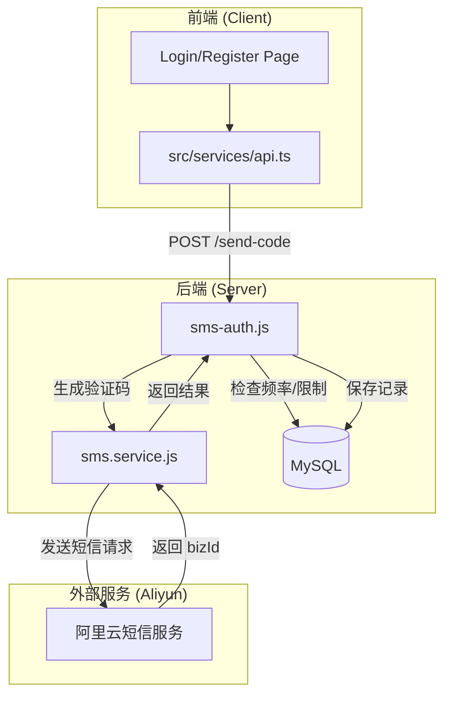

# 短信认证服务

<cite>
**Referenced Files in This Document**
- [sms.service.js](file://server/services/sms.service.js)
- [sms-auth.js](file://server/routes/sms-auth.js)
- [SmsCode.js](file://server/models/SmsCode.js)
</cite>

## 目录
1. [简介](#简介)
2. [核心组件](#核心组件)
3. [架构概述](#架构概述)
4. [详细组件分析](#详细组件分析)
5. [业务流程详解](#业务流程详解)
6. [配置与依赖](#配置与依赖)

## 简介
本项目实现了一套完整的短信认证服务系统，基于 **阿里云短信服务 (Dypnsapi)** 为用户提供短信验证码的发送与验证功能。系统支持登录、注册和密码重置三种场景，通过严格的手机号格式验证、频率限制和业务逻辑控制，确保了认证过程的安全性和可靠性。

## 核心组件

短信认证服务的核心由以下部分构成：

1.  **AliyunSmsService (`server/services/sms.service.js`)**
    *   封装阿里云 SDK (`@alicloud/dypnsapi20170525`)。
    *   负责客户端初始化。
    *   **本地生成验证码**：使用 `Math.random` 生成6位数字验证码，而非依赖阿里云生成。
    *   通过模板参数将验证码发送至阿里云。

2.  **SmsAuthRouter (`server/routes/sms-auth.js`)**
    *   处理 HTTP 请求 (`/send-code`, `/login`, `/register`, `/reset-password`)。
    *   实施频率限制（60秒间隔，每日10次）。
    *   管理 `SmsCode` 数据库记录。
    *   处理用户创建与 Token 生成。

3.  **SmsCode Model (`server/models/SmsCode.js`)**
    *   数据库模型，用于持久化存储验证码及其状态（pending, used）。

## 架构概述



## 详细组件分析

### 1. 验证码发送流程 (`sms.service.js`)
不同于部分托管服务，本系统采用**本地生成策略**：
1.  **生成**: 服务端生成 6 位随机数字字符串。
2.  **发送**: 将验证码作为 `templateParam` (JSON格式 `{"code":"123456"}`) 发送给阿里云。
3.  **存储**: 将生成的验证码、手机号、过期时间、阿里云返回的 `bizId` 存储到本地数据库 `sms_codes` 表。

### 2. 频率控制策略 (`sms-auth.js`)
为防止短信接口被滥用，实现了多层防护：
*   **格式校验**: 正则表达式校验手机号格式。
*   **发送间隔**: 同一手机号 60 秒内只能发送一次 (`SEND_INTERVAL_SECONDS = 60`)。
*   **每日上限**: 同一手机号每天最多发送 10 条 (`MAX_DAILY_SEND_COUNT = 10`)。
*   **IP 记录**: 记录请求 IP 以备审计。

## 业务流程详解

### 短信验证码发送
*   **端点**: `POST /api/auth/sms/send-code`
*   **逻辑**:
    1.  校验手机号格式。
    2.  校验 `type` (login, register, reset_password)。
    3.  检查数据库中最近 60 秒是否有记录。
    4.  检查当天发送总数。
    5.  根据 `type` 检查用户是否存在（注册时要求不存在，重置密码时要求存在）。
    6.  调用 `smsService.sendVerifyCode`。
    7.  写入 `SmsCode` 表。

### 短信注册
*   **端点**: `POST /api/auth/sms/register`
*   **逻辑**:
    1.  校验手机号、验证码必填。
    2.  检查手机号、邮箱、用户名唯一性。
    3.  **验证码校验**: 查询状态为 `pending` 且未过期的验证码。
        *   *注意*: 目前代码逻辑中，注册接口会复用 `login` 类型的验证码进行查找验证 (代码实现细节)。
    4.  创建用户:
        *   生成临时邮箱 (`phone@temp.local`)。
        *   生成随机密码 hash。
    5.  标记验证码为 `used`。
    6.  自动登录 (返回 Access/Refresh Tokens)。

### 短信登录
*   **端点**: `POST /api/auth/sms/login`
*   **逻辑**:
    1.  校验手机号存在且未禁用。
    2.  校验验证码有效性。
    3.  更新最后登录时间/IP。
    4.  返回 Tokens。

## 与阿里云短信服务的集成

### 环境变量配置
系统依赖以下环境变量 (`.env`):
```bash
ALIYUN_ACCESS_KEY_ID=xxx
ALIYUN_ACCESS_KEY_SECRET=xxx
ALIYUN_SMS_SIGN_NAME=速通互联验证码
ALIYUN_SMS_TEMPLATE_CODE=SMS_xxxxxx
```

### 依赖包
*   `@alicloud/dypnsapi20170525`: 阿里云号码认证服务 SDK。
*   `@alicloud/openapi-client`: 阿里云 OpenAPI 核心库。
