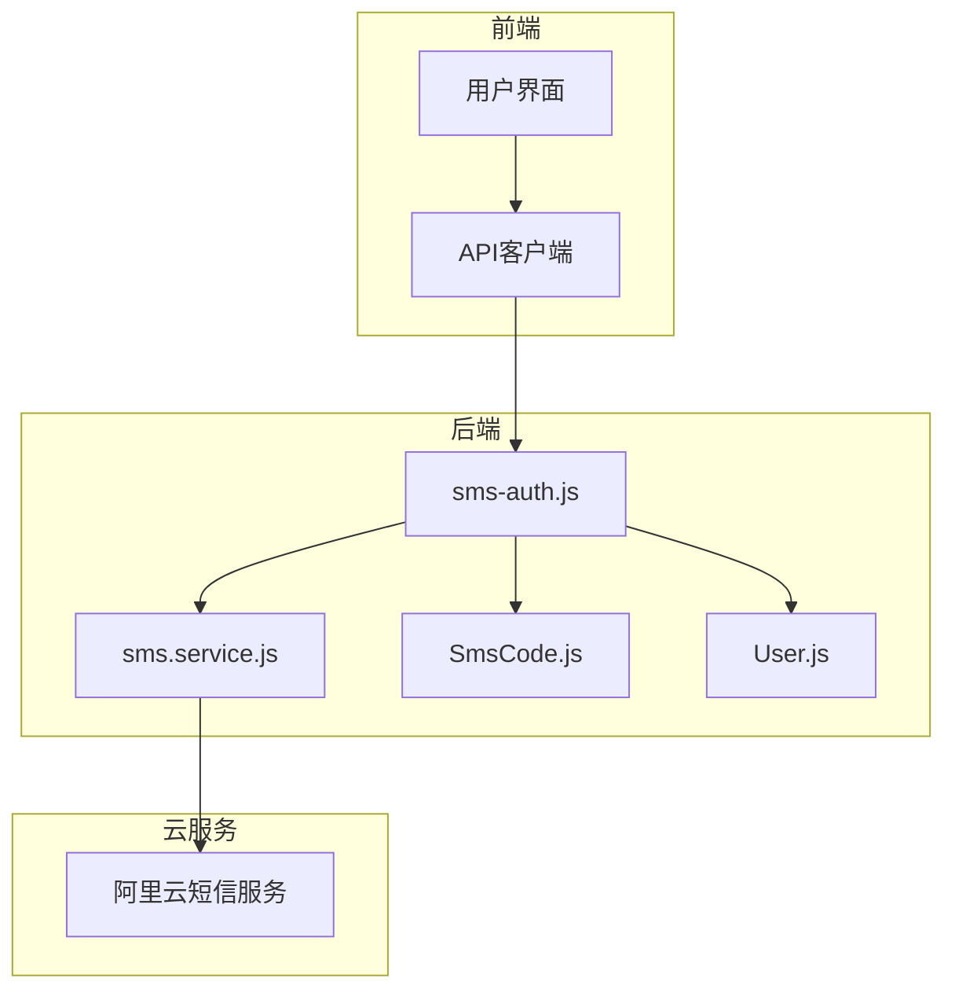
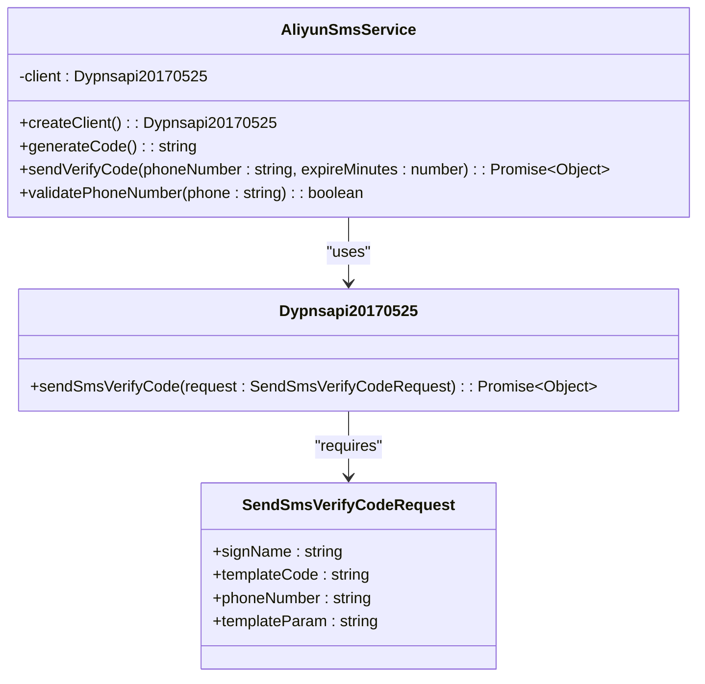
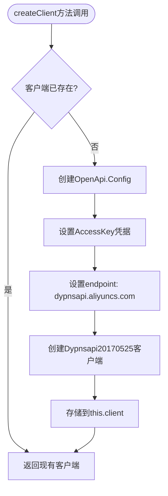
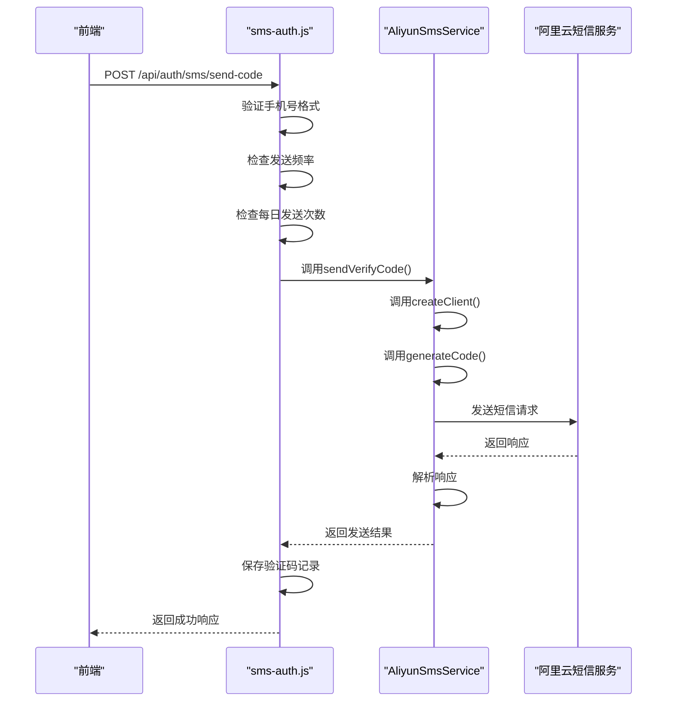
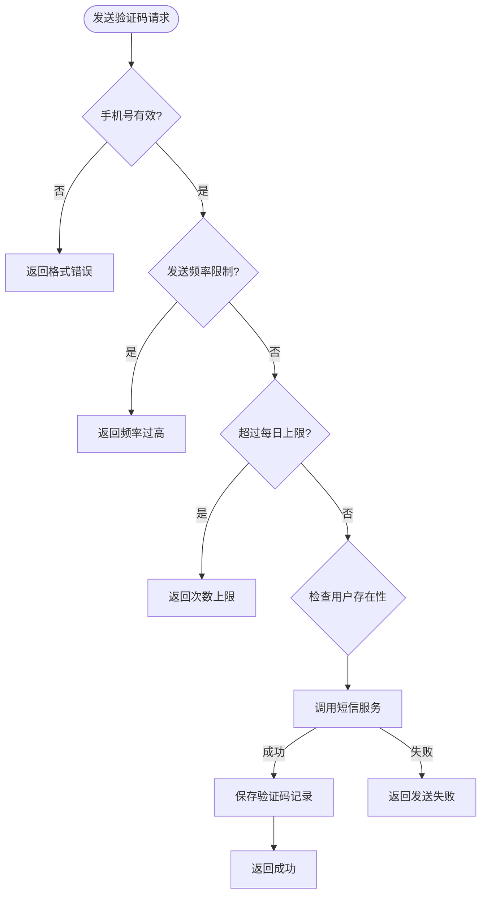
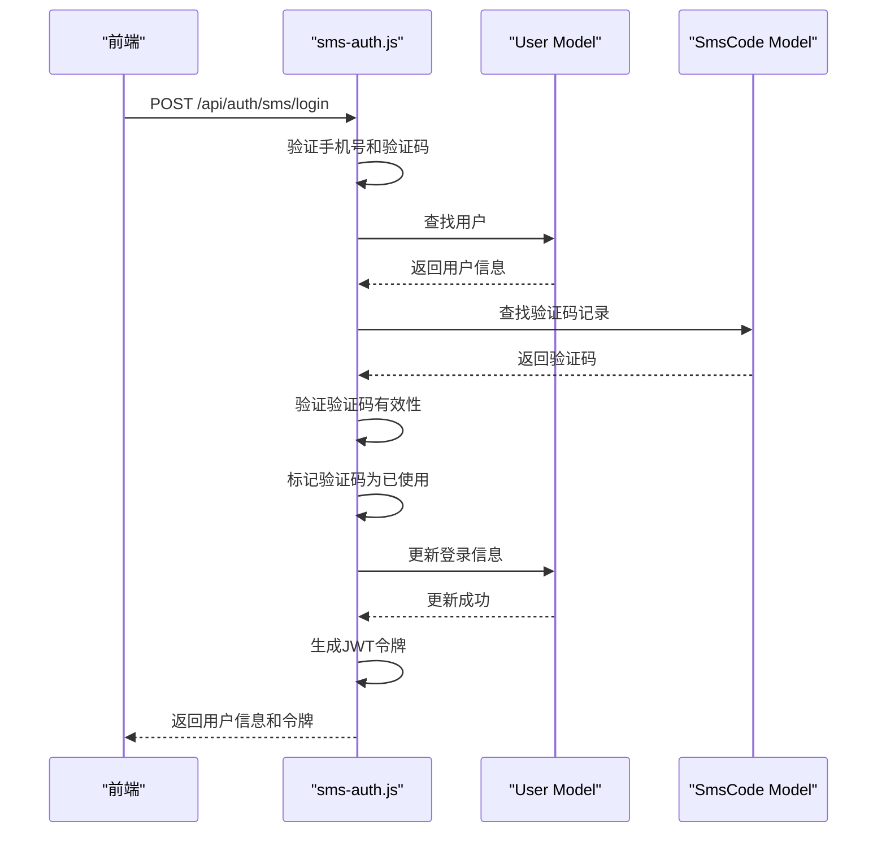

# 短信认证服务

<cite>
**Referenced Files in This Document**   
- [sms.service.js](file://server/services/sms.service.js)
- [sms-auth.js](file://server/routes/sms-auth.js)
- [SmsCode.js](file://server/models/SmsCode.js)
- [create-sms-table.js](file://server/scripts/create-sms-table.js)
</cite>

## 目录
1. [简介](#简介)
2. [核心组件](#核心组件)
3. [架构概述](#架构概述)
4. [详细组件分析](#详细组件分析)
5. [依赖分析](#依赖分析)
6. [性能考虑](#性能考虑)
7. [故障排除指南](#故障排除指南)
8. [结论](#结论)

## 简介
本项目实现了一套完整的短信认证服务系统，基于阿里云短信服务（Dypnsapi）为用户提供短信验证码的发送与验证功能。系统支持登录、注册和密码重置三种场景，通过严格的手机号格式验证、频率限制和业务逻辑控制，确保了认证过程的安全性和可靠性。服务通过环境变量配置阿里云凭据，实现了配置与代码的分离，便于部署和管理。

## 核心组件

短信认证服务的核心由阿里云短信服务工具类（AliyunSmsService）和短信认证路由（sms-auth.js）构成。AliyunSmsService封装了与阿里云API的交互，包括客户端初始化、验证码生成和短信发送。sms-auth.js则定义了具体的HTTP接口，处理来自前端的请求，并协调用户、验证码等模型进行业务逻辑处理。

**Section sources**
- [sms.service.js](file://server/services/sms.service.js#L1-L127)
- [sms-auth.js](file://server/routes/sms-auth.js#L1-L492)

## 架构概述



**Diagram sources**
- [sms.service.js](file://server/services/sms.service.js#L1-L127)
- [sms-auth.js](file://server/routes/sms-auth.js#L1-L492)
- [SmsCode.js](file://server/models/SmsCode.js#L1-L73)

## 详细组件分析

### 阿里云短信服务分析

#### 类图


**Diagram sources**
- [sms.service.js](file://server/services/sms.service.js#L10-L127)

#### 客户端初始化流程


**Diagram sources**
- [sms.service.js](file://server/services/sms.service.js#L19-L33)

#### 验证码发送流程


**Diagram sources**
- [sms.service.js](file://server/services/sms.service.js#L49-L113)
- [sms-auth.js](file://server/routes/sms-auth.js#L26-L164)

### 短信认证路由分析

#### 发送验证码流程


**Diagram sources**
- [sms-auth.js](file://server/routes/sms-auth.js#L26-L164)

#### 短信登录流程


**Diagram sources**
- [sms-auth.js](file://server/routes/sms-auth.js#L170-L270)

## 依赖分析

```mermaid
graph LR
sms-auth.js --> sms.service.js
sms-auth.js --> SmsCode.js
sms-auth.js --> User.js
sms.service.js --> @alicloud/dypnsapi20170525
sms.service.js --> @alicloud/openapi-client
create-sms-table.js --> SmsCode.js
```

**Diagram sources**
- [sms.service.js](file://server/services/sms.service.js#L7-L8)
- [sms-auth.js](file://server/routes/sms-auth.js#L9-L10)
- [create-sms-table.js](file://server/scripts/create-sms-table.js#L7)

**Section sources**
- [sms.service.js](file://server/services/sms.service.js#L1-L127)
- [sms-auth.js](file://server/routes/sms-auth.js#L1-L492)
- [SmsCode.js](file://server/models/SmsCode.js#L1-L73)
- [create-sms-table.js](file://server/scripts/create-sms-table.js#L1-L37)

## 性能考虑

系统在设计时考虑了多项性能和安全因素。通过在`AliyunSmsService`中缓存客户端实例，避免了每次发送短信都重新创建连接的开销。在`sms-auth.js`中实现了发送频率限制和每日发送次数限制，防止了短信服务被滥用。数据库表`sms_codes`在`phone`、`status`和`expires_at`字段上建立了索引，确保了查询验证码记录的效率。

## 故障排除指南

当短信发送失败时，应首先检查环境变量`ALIYUN_ACCESS_KEY_ID`和`ALIYUN_ACCESS_KEY_SECRET`是否正确配置。其次，查看服务端日志中的完整响应，根据阿里云返回的错误码进行排查。常见的错误包括模板参数不匹配、签名未审核通过等。此外，应确保`SmsCode`表已正确创建，可以通过运行`create-sms-table.js`脚本来初始化数据库表。

**Section sources**
- [sms.service.js](file://server/services/sms.service.js#L103-L111)
- [create-sms-table.js](file://server/scripts/create-sms-table.js#L1-L37)

## 结论

本短信认证服务实现了一套完整、安全且易于维护的短信验证码系统。通过合理的分层设计，将短信服务封装与业务逻辑处理分离，提高了代码的可读性和可维护性。系统充分考虑了用户体验和安全性，通过多种校验和限制机制，确保了服务的稳定运行。未来可考虑增加更多监控和日志记录，以便更好地追踪和分析服务的使用情况。