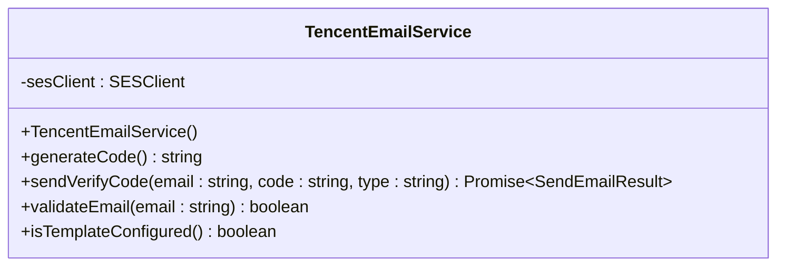

# 邮箱认证服务

<cite>
**本文档引用的文件**
- [email.service.js](file://server/services/email.service.js)
</cite>

## 目录
1. [服务概述](#服务概述)
2. [类结构](#类结构)
3. [核心方法](#核心方法)
4. [使用示例](#使用示例)
5. [配置说明](#配置说明)
6. [依赖关系](#依赖关系)

## 服务概述

`TencentEmailService` 是腾讯云 SES 邮件推送服务的封装类，负责发送邮箱验证码邮件。该服务类提供了验证码生成、邮箱格式校验、邮件发送等核心功能，是邮箱认证系统的核心组件。



**Diagram sources**
- [email.service.js](file://server/services/email.service.js#L26-L117)

**Section sources**
- [email.service.js](file://server/services/email.service.js#L26-L117)

## 类结构

### 导入依赖

```typescript
const tencentcloud = require('tencentcloud-sdk-nodejs');
const SESClient = tencentcloud.ses.v20201002.Client;
```

### 类属性

| 属性名 | 类型 | 说明 |
|--------|------|------|
| `sesClient` | SESClient | 腾讯云 SES 客户端实例（单例） |

### 方法列表

| 方法名 | 返回类型 | 说明 |
|--------|---------|------|
| `generateCode()` | `string` | 生成 6 位数字验证码 |
| `validateEmail(email)` | `boolean` | 验证邮箱格式是否正确 |
| `sendVerifyCode(email, code, type)` | `Promise<Object>` | 发送验证码邮件 |
| `isTemplateConfigured()` | `boolean` | 检查模板是否已配置 |

## 核心方法

### 1. generateCode()

生成 6 位随机数字验证码。

**返回值**：`string` - 6 位数字字符串

**实现原理**：
```javascript
Math.floor(100000 + Math.random() * 900000).toString()
```

**范围说明**：生成的验证码在 `100000` 到 `999999` 之间，确保始终为 6 位数，避免前导零问题。

**Section sources**
- [email.service.js](file://server/services/email.service.js#L34-L41)

### 2. validateEmail(email)

验证邮箱地址格式是否正确。

**参数**：
- `email` (`string`) - 待验证的邮箱地址

**返回值**：`boolean` - 格式是否有效

**校验规则**：
```javascript
/^[^\s@]+@[^\s@]+\.[^\s]+$/
```

**规则说明**：
- 必须包含 `@` 符号
- `@` 前后至少有一个字符
- `@` 后必须包含 `.` 域名分隔符
- 不允许包含空格

**Section sources**
- [email.service.js](file://server/services/email.service.js#L43-L46)

### 3. sendVerifyCode(email, code, type)

向指定邮箱发送验证码邮件。

**参数**：
- `email` (`string`) - 收件人邮箱地址
- `code` (`string`) - 6 位验证码
- `type` (`string`) - 验证码类型，可选值：`register`、`reset_password`，默认为 `register`

**返回值**：`Promise<Object>` - 发送结果对象

**返回格式**：
```typescript
{
  success: boolean;       // 是否成功
  bizId?: string;        // 腾讯云RequestId
  message: string;       // 提示消息
}
```

**实现步骤**：

1. **邮箱格式校验**：验证邮箱地址格式
2. **获取模板 ID**：根据类型获取对应的邮件模板 ID
3. **构建请求参数**：创建 SendEmail 请求对象
4. **发送邮件**：调用腾讯云 SES API
5. **处理响应**：解析返回结果并处理错误

**请求参数结构**：
```typescript
{
  FromEmailAddress: string;        // 发件人地址（格式：别名 <邮箱>）
  Destination: string[];          // 收件人邮箱列表
  Template: {
    TemplateID: number;          // 模板ID
    TemplateData: string;        // 模板数据（JSON字符串）
  };
  Subject: string;                // 邮件主题
  TriggerType: 1;                 // 1=触发类（验证码）
}
```

**错误处理**：

系统会捕获以下常见错误并返回用户友好的提示：

| 错误码 | 返回消息 |
|--------|----------|
| `FailedOperation.InvalidTemplateID` | 邮件模板未配置或审核未通过 |
| `FailedOperation.FrequencyLimit` | 发送过于频繁，请稍后再试 |
| `FailedOperation.ExceedSendLimit` | 超出今日发送上限 |
| `FailedOperation.EmailAddrInBlacklist` | 邮箱地址在黑名单中 |

**Section sources**
- [email.service.js](file://server/services/email.service.js#L55-L116)

## 使用示例

### 示例 1：发送注册验证码

```typescript
// 服务端代码
const emailService = require('./services/email.service');

async function sendRegisterCode(email) {
  // 生成验证码
  const code = emailService.generateCode();

  // 发送邮件
  const result = await emailService.sendVerifyCode(
    email,
    code,
    'register'
  );

  if (result.success) {
    console.log('验证码已发送');
    // 保存验证码到数据库
  } else {
    console.error('发送失败:', result.message);
  }
}

// 调用示例
await sendRegisterCode('user@example.com');
```

### 示例 2：发送重置密码验证码

```typescript
async function sendResetCode(email) {
  const code = emailService.generateCode();

  const result = await emailService.sendVerifyCode(
    email,
    code,
    'reset_password'
  );

  if (result.success) {
    console.log('重置密码验证码已发送');
  }
}
```

### 示例 3：验证邮箱格式

```typescript
const emailService = require('./services/email.service');

function isValidEmail(email) {
  return emailService.validateEmail(email);
}

// 测试
console.log(isValidEmail('user@example.com'));  // true
console.log(isValidEmail('invalid-email'));    // false
```

## 配置说明

### 环境变量配置

在 `server/.env` 文件中添加以下配置：

```bash
# 腾讯云 SES 邮件推送配置
TENCENT_SECRET_ID=your_secret_id_here
TENCENT_SECRET_KEY=your_secret_key_here
TENCENT_SES_REGION=ap-guangzhou
TENCENT_SES_FROM_EMAIL=no-reply@hpvsc.icu

# 邮件模板ID
TEMPLATE_ID_REGISTER=42424
TEMPLATE_ID_RESET_PASSWORD=42423
```

### 配置项说明

| 配置项 | 必填 | 默认值 | 说明 |
|--------|------|--------|------|
| `TENCENT_SECRET_ID` | 是 | - | 腾讯云访问密钥 ID |
| `TENCENT_SECRET_KEY` | 是 | - | 腾讯云访问密钥 Key |
| `TENCENT_SES_REGION` | 否 | ap-guangzhou | SES 服务地域 |
| `TENCENT_SES_FROM_EMAIL` | 否 | no-reply@hpvsc.icu | 发信人邮箱地址 |
| `TEMPLATE_ID_REGISTER` | 是 | - | 注册验证码模板 ID |
| `TEMPLATE_ID_RESET_PASSWORD` | 是 | - | 重置密码模板 ID |

### 发信地址配置

发信人邮箱地址采用以下格式：

```
CervixDetectAI <no-reply@hpvsc.icu>
```

- **CervixDetectAI**：显示在邮件中的发件人名称
- **no-reply@hpvsc.icu**：实际的发信邮箱地址
- **中间必须有空格**：别名和邮箱之间用一个空格分隔

**Section sources**
- [email.service.js](file://server/services/email.service.js#L76-L77)

## 依赖关系

### 内部依赖

- `@alicloud/dypnsapi20170525`：阿里云号码认证服务（用于 AI 验证）
- `tencentcloud-sdk-nodejs`：腾讯云 SES SDK

### 被依赖文件

- [email-auth.js](file://server/routes/email-auth.js) - 邮箱验证路由
- [auth.js](file://server/routes/auth.js) - 注册接口

### 数据模型

- [EmailCode.js](file://server/models/EmailCode.js) - 邮箱验证码数据模型

## 注意事项

1. **模板审核**：邮件模板必须在腾讯云控制台审核通过后才能使用
2. **发信域名**：发信域名 `hpvsc.icu` 必须在腾讯云控制台配置并验证
3. **发信地址**：发信地址 `no-reply@hpvsc.icu` 必须在腾讯云控制台创建
4. **密钥安全**：SecretId 和 SecretKey 需妥善保管，不要提交到代码仓库
5. **频率限制**：腾讯云对发送频率有限制，系统已实现 60 秒间隔和每日 10 次上限

**Section sources**
- [email.service.js](file://server/services/email.service.js#L1-L142)
