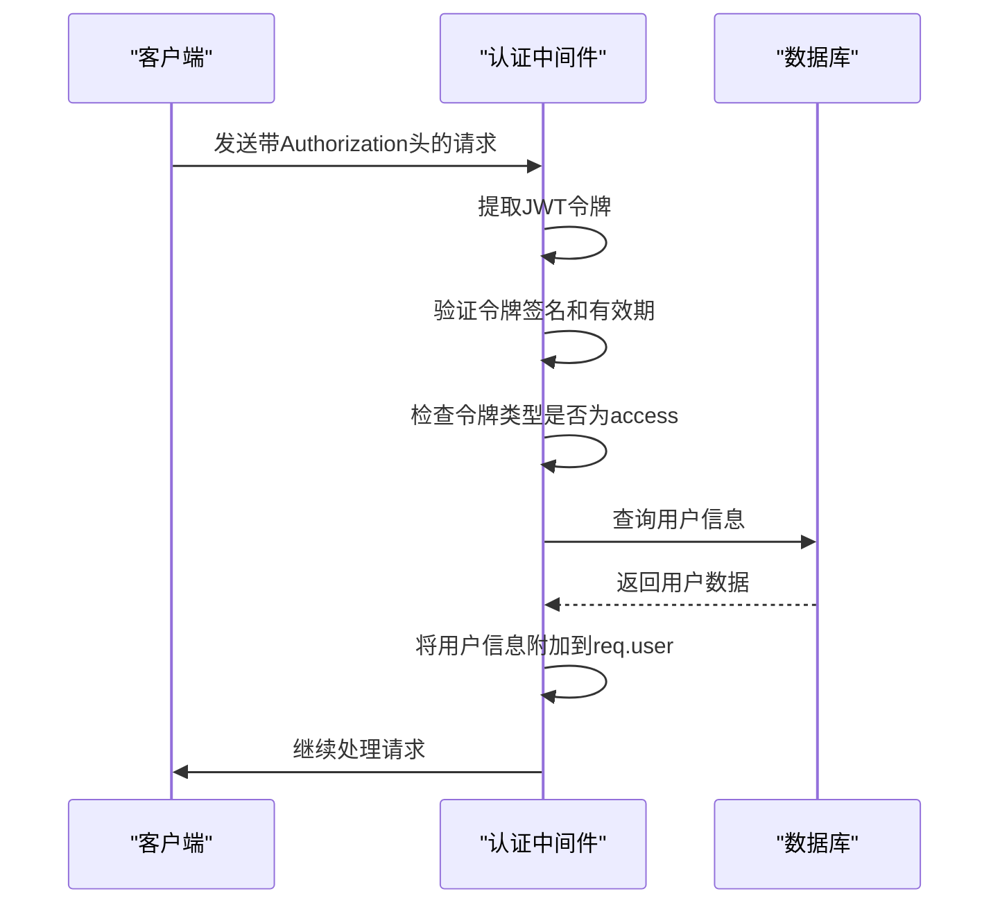
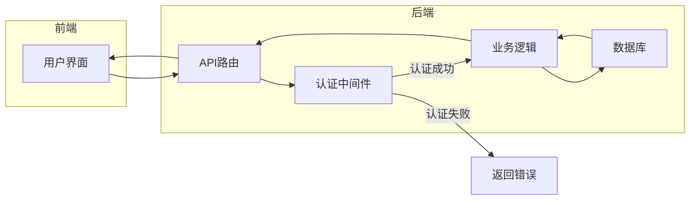
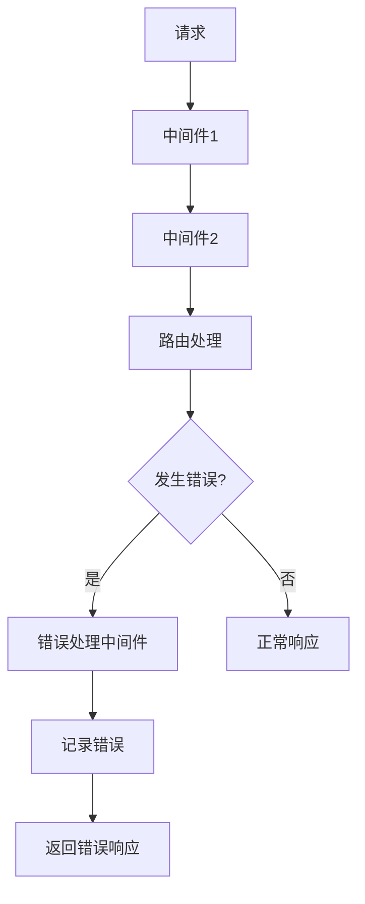
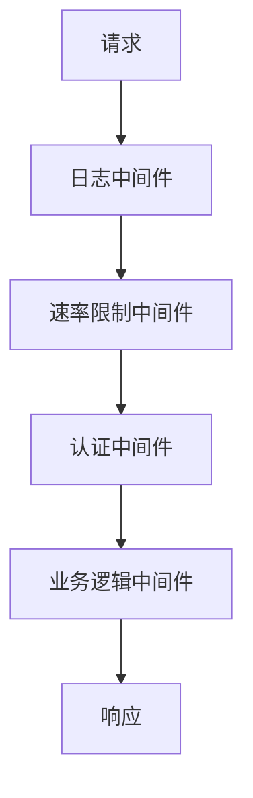

# 中间件机制

<cite>
**本文档引用的文件**   
- [auth.js](file://server/middleware/auth.js)
- [jwt.js](file://server/utils/jwt.js)
- [studies.js](file://server/routes/studies.js)
- [analyze.js](file://server/routes/analyze.js)
- [index.js](file://server/index.js)
</cite>

## 目录
1. [JWT认证中间件](#jwt认证中间件)
2. [中间件执行流程](#中间件执行流程)
3. [受保护的API端点](#受保护的api端点)
4. [错误处理中间件](#错误处理中间件)
5. [可扩展的中间件设计](#可扩展的中间件设计)

## JWT认证中间件

CervixDetectAI系统使用JWT（JSON Web Token）认证中间件来保护API端点，确保只有经过身份验证的用户才能访问敏感资源。该中间件位于`server/middleware/auth.js`文件中，主要包含三个核心函数：`authenticate`、`authorize`和`optionalAuth`。

`authenticate`函数是主要的认证中间件，负责验证JWT令牌的有效性。它首先从请求头中提取Authorization头，然后验证令牌的签名、过期时间和类型。如果验证成功，它会将用户信息附加到请求对象的`req.user`属性上，以便后续的路由处理函数使用。

```mermaid
flowchart TD
A[开始] --> B{请求头中<br/>包含Authorization?}
B --> |否| C[返回401未授权]
B --> |是| D[提取Bearer Token]
D --> E{验证JWT签名<br/>和过期时间?}
E --> |否| F[返回401无效令牌]
E --> |是| G{令牌类型为access?}
G --> |否| H[返回401令牌类型错误]
G --> |是| I[查询用户信息]
I --> J{用户存在且<br/>状态为active?}
J --> |否| K[返回401/403错误]
J --> |是| L[附加用户信息到req.user]
L --> M[调用next()继续执行]
```

**Diagram sources**
- [auth.js](file://server/middleware/auth.js#L8-L64)

**Section sources**
- [auth.js](file://server/middleware/auth.js#L8-L64)

## 中间件执行流程

在CervixDetectAI系统中，中间件按照特定的顺序在请求处理管道中执行。当客户端发送一个请求时，Express框架会按照注册的顺序依次调用中间件函数。每个中间件都有机会修改请求和响应对象，或者终止请求-响应周期。

认证中间件的执行流程如下：首先，系统从请求头中提取JWT令牌；然后，使用`jsonwebtoken`库验证令牌的签名和有效期；接着，检查令牌类型是否为"access"；最后，从数据库中查询用户信息并将其附加到请求对象上。如果任何步骤失败，中间件会立即返回相应的错误响应。



**Diagram sources**
- [auth.js](file://server/middleware/auth.js#L8-L64)
- [jwt.js](file://server/utils/jwt.js#L43-L48)

**Section sources**
- [auth.js](file://server/middleware/auth.js#L8-L64)
- [jwt.js](file://server/utils/jwt.js#L43-L48)

## 受保护的API端点

系统中的多个API端点都使用了JWT认证中间件来保护敏感数据。例如，在`studies.js`路由文件中，创建、读取、更新和删除病例的端点都需要经过身份验证。这通过在路由定义中将`authenticate`中间件作为参数传递来实现。



**Diagram sources**
- [studies.js](file://server/routes/studies.js#L46-L47)
- [analyze.js](file://server/routes/analyze.js#L51-L52)

**Section sources**
- [studies.js](file://server/routes/studies.js#L46-L47)
- [analyze.js](file://server/routes/analyze.js#L51-L52)

## 错误处理中间件

系统在`server/index.js`文件中定义了全局错误处理中间件，用于捕获和处理应用程序中发生的任何错误。这个中间件位于所有路由之后，能够捕获前面中间件和路由处理函数抛出的异常。

当发生错误时，错误处理中间件会记录错误信息，并向客户端返回适当的错误响应。在开发环境中，它还会返回错误堆栈信息，帮助开发者调试问题。这种全局错误处理机制确保了即使发生未预期的错误，系统也能以优雅的方式响应，而不是崩溃。



**Diagram sources**
- [index.js](file://server/index.js#L64-L70)

**Section sources**
- [index.js](file://server/index.js#L64-L70)

## 可扩展的中间件设计

CervixDetectAI系统的中间件架构设计具有良好的可扩展性。除了现有的JWT认证中间件外，系统还预留了添加其他中间件的位置，如日志记录、速率限制和输入验证等。

例如，可以轻松添加一个日志中间件来记录所有请求的详细信息，或者添加一个速率限制中间件来防止API被滥用。这种模块化的设计使得系统能够根据需要灵活地添加新的功能，而不会影响现有的代码结构。



**Diagram sources**
- [index.js](file://server/index.js#L34-L42)

**Section sources**
- [index.js](file://server/index.js#L34-L42)