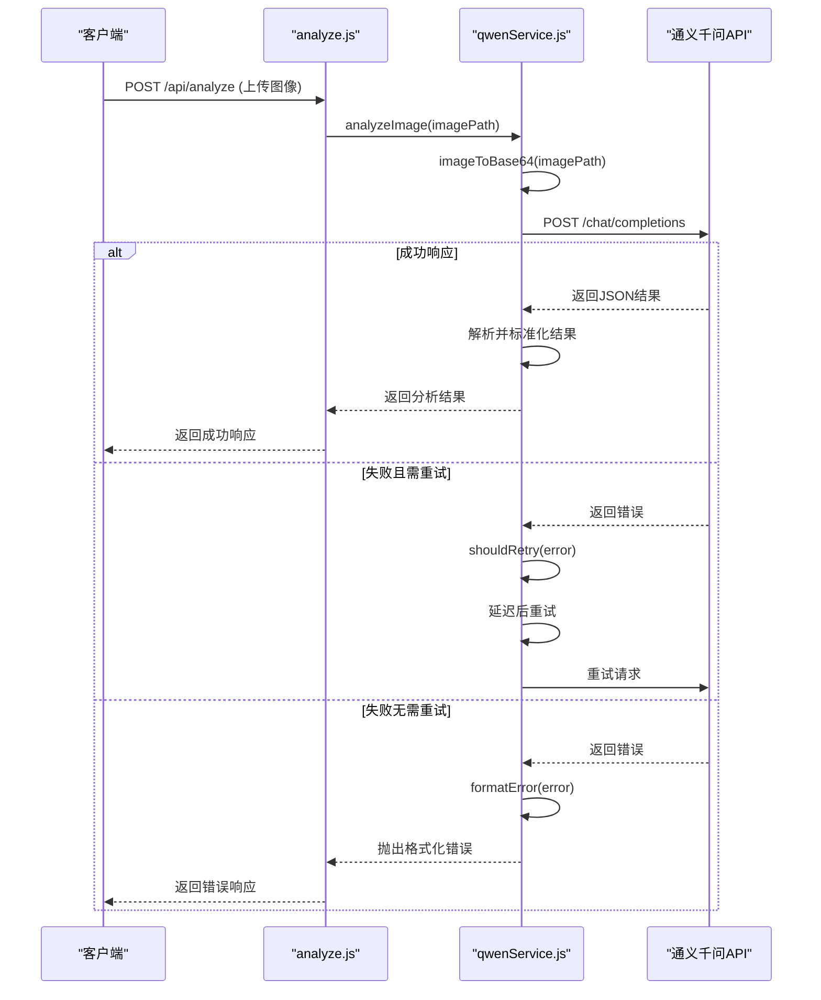
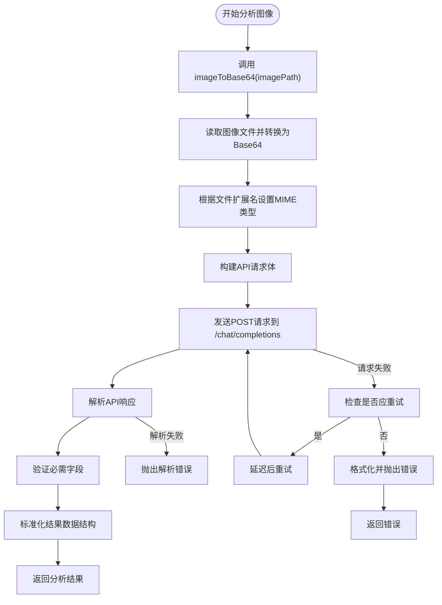
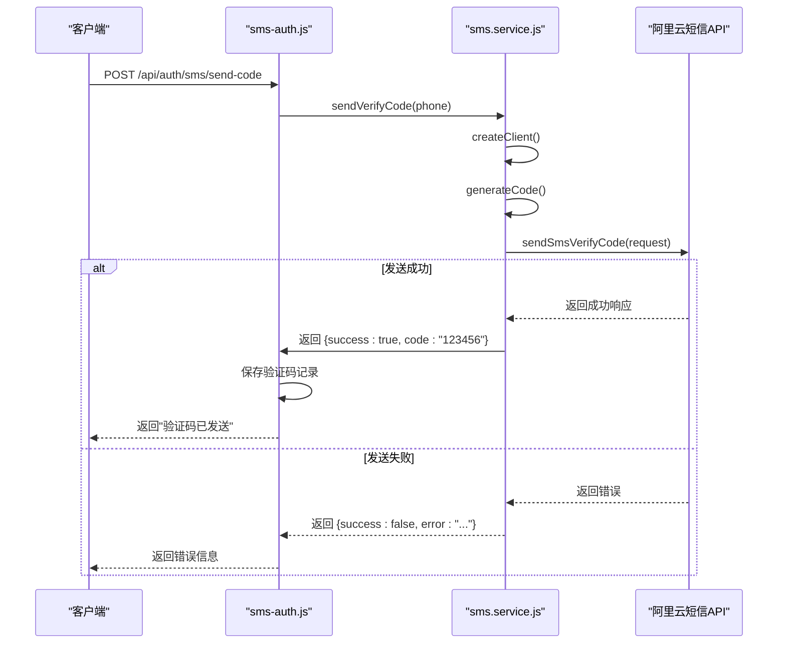
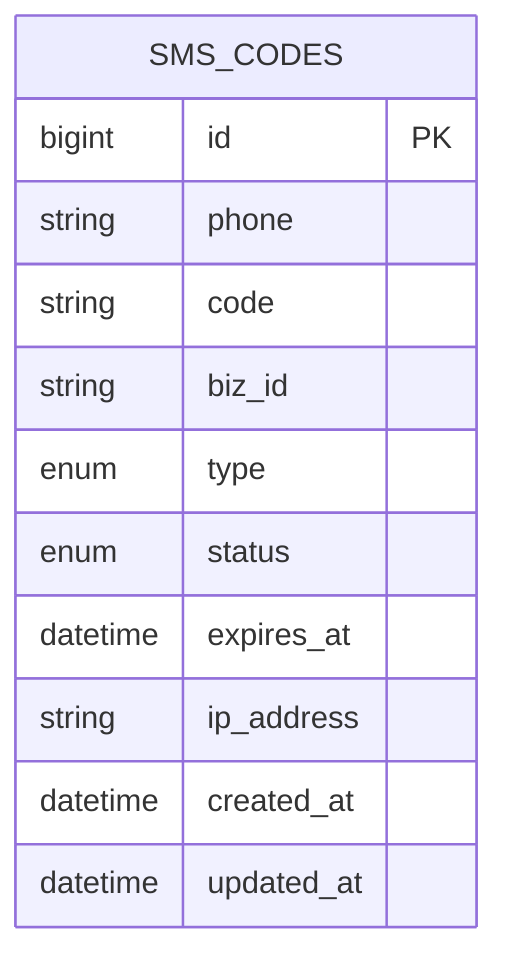

# 外部集成

<cite>
**Referenced Files in This Document**   
- [qwenService.js](file://server/services/qwenService.js)
- [sms.service.js](file://server/services/sms.service.js)
- [.env](file://server/.env)
- [analyze.js](file://server/routes/analyze.js)
- [sms-auth.js](file://server/routes/sms-auth.js)
- [SmsCode.js](file://server/models/SmsCode.js)
</cite>

## 目录
1. [通义千问视觉大模型API集成](#通义千问视觉大模型api集成)
2. [阿里云短信服务集成](#阿里云短信服务集成)
3. [环境变量与安全配置](#环境变量与安全配置)

## 通义千问视觉大模型API集成

通义千问视觉大模型API通过`qwenService.js`服务类进行集成，为系统提供宫颈细胞学图像的AI分析能力。该服务封装了API调用的完整流程，包括请求构造、图像编码、结果解析和错误处理。



**Diagram sources**
- [qwenService.js](file://server/services/qwenService.js#L34-L251)
- [analyze.js](file://server/routes/analyze.js#L264-L264)

**Section sources**
- [qwenService.js](file://server/services/qwenService.js#L34-L251)
- [analyze.js](file://server/routes/analyze.js#L264-L264)

### 请求构造与图像编码

`qwenService.js`中的`analyzeImage`方法负责构造符合通义千问API要求的请求。首先，`imageToBase64`方法将本地图像文件读取并转换为Base64编码的Data URL，同时根据文件扩展名设置正确的MIME类型（如`image/jpeg`, `image/png`）。



**Diagram sources**
- [qwenService.js](file://server/services/qwenService.js#L55-L177)

**Section sources**
- [qwenService.js](file://server/services/qwenService.js#L55-L177)

### 结果解析与错误重试

API响应的解析是关键步骤。服务会检查响应中是否存在`choices`字段，然后提取`message.content`中的JSON字符串。由于API可能返回带有markdown代码块标记（```json）的文本，服务会先清理这些标记，再进行JSON解析。解析后，服务会验证`diagnosis`, `confidence`, `recommendations`, `detailedReport`等必需字段，并对缺失字段进行警告。

错误重试机制由`shouldRetry`和`formatError`方法实现。`shouldRetry`方法判断错误类型，对网络超时（ECONNABORTED, ETIMEDOUT）、API限流（429）和服务器错误（5xx）进行重试。重试采用递增延迟策略（1s, 2s, 3s）。`formatError`方法则将底层错误转换为用户友好的错误信息。

## 阿里云短信服务集成

阿里云短信服务通过`sms.service.js`服务类进行集成，用于实现短信验证码的发送与验证功能。该服务封装了阿里云DYPNSAPI的SDK调用。



**Diagram sources**
- [sms.service.js](file://server/services/sms.service.js#L10-L123)
- [sms-auth.js](file://server/routes/sms-auth.js#L121-L121)

**Section sources**
- [sms.service.js](file://server/services/sms.service.js#L10-L123)
- [sms-auth.js](file://server/routes/sms-auth.js#L121-L121)

### SDK初始化与验证码发送

`AliyunSmsService`类的`createClient`方法使用环境变量中的`ALIYUN_ACCESS_KEY_ID`和`ALIYUN_ACCESS_KEY_SECRET`来初始化阿里云API客户端。`sendVerifyCode`方法首先调用`generateCode`生成一个6位随机数字验证码，然后构建`SendSmsVerifyCodeRequest`请求对象。请求中使用`ALIYUN_SMS_SIGN_NAME`作为签名名称，`ALIYUN_SMS_TEMPLATE_CODE`作为模板CODE，并将验证码和过期时间作为模板参数传入。

### 验证逻辑与短信模板管理

验证码的验证逻辑主要在`sms-auth.js`路由中实现。当用户提交验证码时，系统会查询`SmsCode`数据库表，检查是否存在状态为`pending`、未过期且匹配手机号和验证码的记录。验证成功后，该记录的状态会被更新为`used`。

短信模板的管理通过环境变量`ALIYUN_SMS_TEMPLATE_CODE`和`ALIYUN_SMS_SIGN_NAME`进行配置。系统使用预定义的模板，其中包含`code`和`min`两个参数，分别代表验证码和过期时间（分钟）。



**Diagram sources**
- [SmsCode.js](file://server/models/SmsCode.js#L5-L71)

**Section sources**
- [SmsCode.js](file://server/models/SmsCode.js#L5-L71)
- [sms-auth.js](file://server/routes/sms-auth.js#L54-L62)

## 环境变量与安全配置

所有第三方服务的密钥和配置都通过`.env`文件进行管理，确保了配置的灵活性和安全性。

### 所需环境变量

| 环境变量 | 用途 | 示例值 |
| :--- | :--- | :--- |
| `QWEN_API_KEY` | 通义千问API的认证密钥 | `sk-f3d24edd4a18...` |
| `QWEN_API_URL` | 通义千问API的基础URL | `https://dashscope.aliyuncs.com/...` |
| `QWEN_MODEL` | 要使用的通义千问模型 | `qwen-vl-max` |
| `ALIYUN_ACCESS_KEY_ID` | 阿里云Access Key ID | `LTAI5tLyMFsuzE9hpGijaz9K` |
| `ALIYUN_ACCESS_KEY_SECRET` | 阿里云Access Key Secret | `XqnPIZ36pux2MPLqxHqaG7NY5lJlIt` |
| `ALIYUN_SMS_SIGN_NAME` | 短信签名名称 | `速通互联验证码` |
| `ALIYUN_SMS_TEMPLATE_CODE` | 短信模板CODE | `100001` |

**Section sources**
- [.env](file://server/.env#L1-L34)

### 安全存储密钥的最佳实践

1.  **使用`.env`文件**：将所有密钥存储在项目根目录下的`.env`文件中，并确保该文件被添加到`.gitignore`中，防止密钥被提交到版本控制系统。
2.  **生产环境使用密钥管理服务**：在生产环境中，应使用云服务商提供的密钥管理服务（如AWS KMS、阿里云KMS）来存储和管理密钥，而不是直接在`.env`文件中明文存储。
3.  **最小权限原则**：为API密钥分配最小必要的权限。例如，通义千问API密钥应仅限于调用视觉模型API，阿里云AccessKey应仅限于DYPNSAPI的短信发送权限。
4.  **定期轮换密钥**：定期更换API密钥和AccessKey，以降低密钥泄露带来的风险。
5.  **避免硬编码**：绝对禁止在代码中硬编码任何密钥或敏感信息。