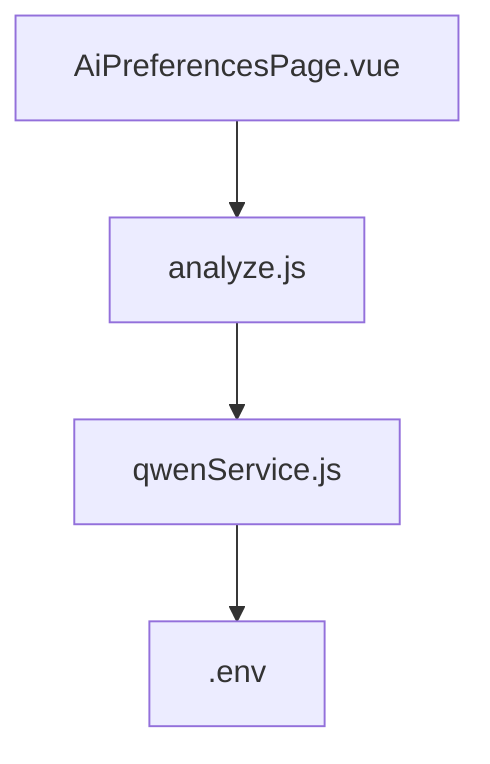
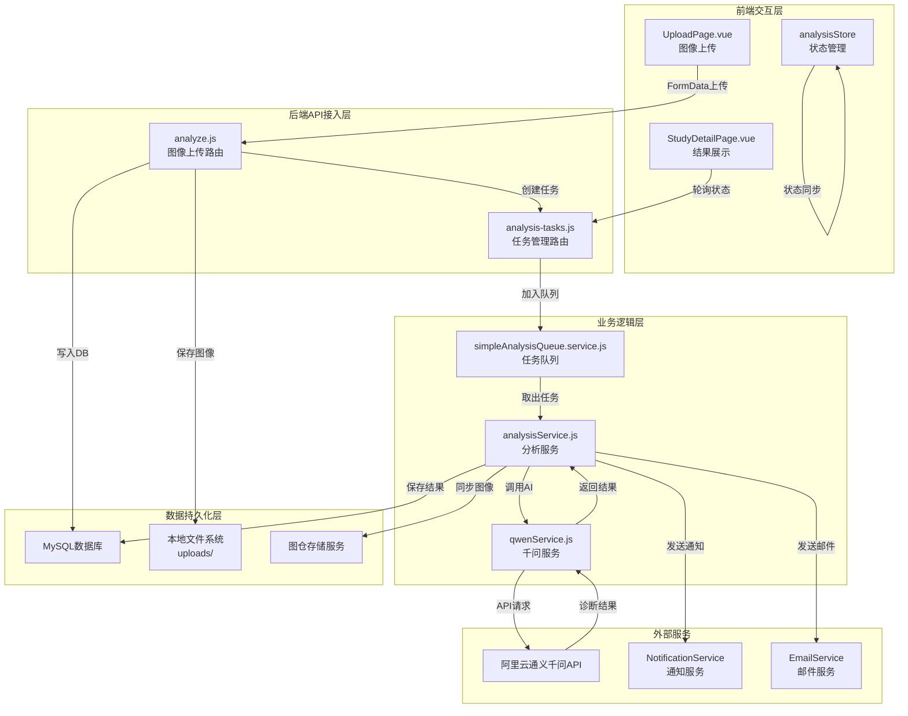
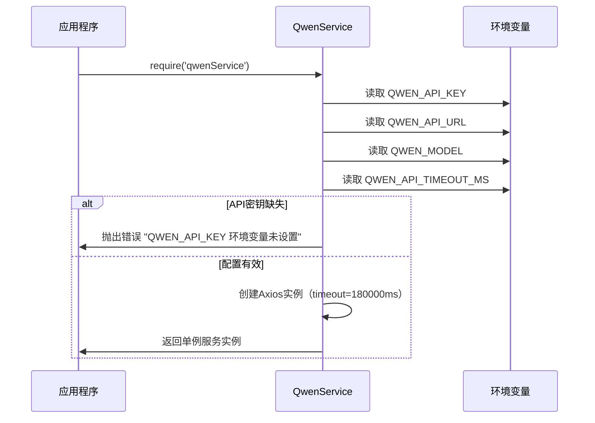
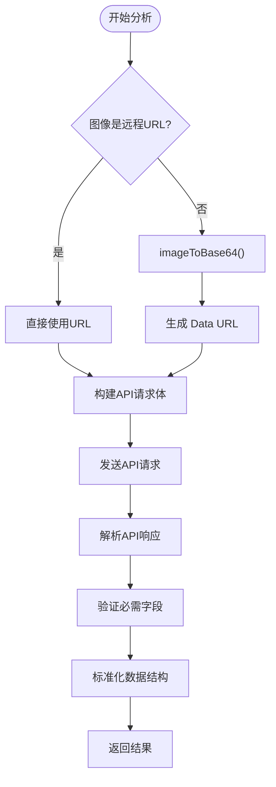
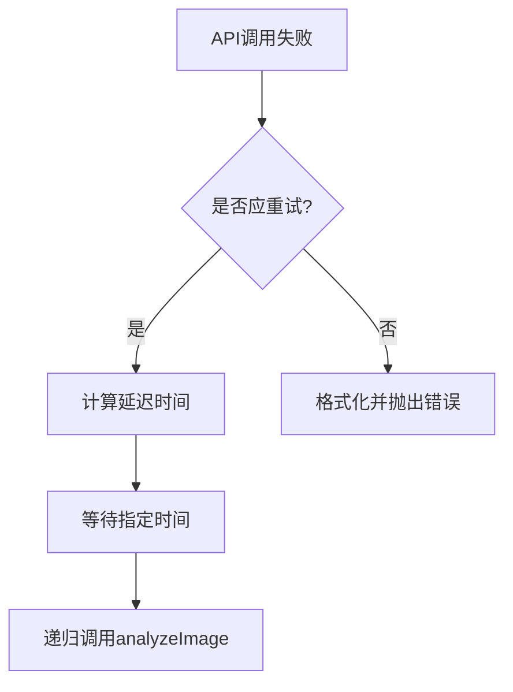
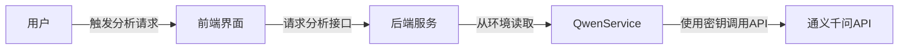

# 通义千问AI集成

> **Referenced Files in This Document**   
> - [qwenService.js](file://server/services/qwenService.js)
> - [.env](file://server/.env)
> - [analyze.js](file://server/routes/analyze.js)
> - [AiPreferencesPage.vue](file://src/pages/AiPreferencesPage.vue)

## 目录
1. [项目结构](#项目结构)
2. [核心组件](#核心组件)
3. [QwenService初始化](#qwenservice初始化)
4. [图像分析流程](#图像分析流程)
5. [错误处理与重试机制](#错误处理与重试机制)
6. [辅助方法](#辅助方法)
7. [流式对话接口](#流式对话接口)
8. [响应结果解析](#响应结果解析)
9. [API调用示例](#api调用示例)
10. [API密钥安全管理](#api密钥安全管理)

## 项目结构
CervixDetectAI项目采用前后端分离架构，通义千问AI集成主要在服务端实现。项目结构清晰地分为`server`（后端服务）和`src`（前端应用）两个主要目录。

后端服务位于`server`目录下，其中`services`子目录中的`qwenService.js`文件是通义千问AI集成的核心实现。该服务通过环境变量配置API连接信息，并提供图像分析功能。`routes`目录下的`analyze.js`文件定义了与AI分析相关的API路由，负责接收前端上传的图像并调用`QwenService`进行处理。

前端应用位于`src`目录下，使用Vue.js框架构建。当前前端仅在 `AiPreferencesPage.vue` 中提供模型版本、阈值、敏感性、通知策略和报告偏好等界面级设置，用于调整本地展示和操作习惯；通义千问 API 的连接信息仍完全由后端环境变量管理。这种分离的架构设计使得AI能力实现与界面偏好配置解耦，便于维护和扩展。



**Diagram sources**
- [qwenService.js](file://server/services/qwenService.js)
- [.env](file://server/.env)
- [analyze.js](file://server/routes/analyze.js)
- [AiPreferencesPage.vue](file://src/pages/AiPreferencesPage.vue)

**Section sources**
- [qwenService.js](file://server/services/qwenService.js)
- [.env](file://server/.env)
- [analyze.js](file://server/routes/analyze.js)
- [AiPreferencesPage.vue](file://src/pages/AiPreferencesPage.vue)

## 核心组件
通义千问AI集成的核心组件是`QwenService`单例服务，位于`server/services/qwenService.js`文件中。该服务封装了与通义千问API交互的所有逻辑，提供了一个简洁的接口供其他模块调用。

`QwenService`的主要职责包括：从环境变量加载API配置、自动判断图像来源类型（公网URL或本地路径）、调用`generatePrompt(modality)`函数根据检查方式生成专业化提示词、构造符合API要求的请求体、处理API调用的错误和重试、以及解析和标准化API响应结果。该服务通过Axios库发送HTTP请求，并实现了完整的错误处理和重试机制，确保在面对网络波动或API限流时仍能稳定运行。

服务还提供`chatStream`方法支持多轮对话的流式输出（SSE），适用于需要深度思考和实时流式返回的交互场景。

前端的 `AiPreferencesPage.vue` 仅承担模型版本、阈值、敏感性与通知/报告偏好的界面配置，不负责写入 `.env` 或管理 API Key。`QwenService` 读取的 `QWEN_API_KEY`、`QWEN_API_URL`、`QWEN_MODEL` 仍由服务端环境变量提供。

### AI 分析服务完整架构图



### 检查方式与诊断分类

系统支持多种宫颈细胞学检查方式的图像分析：

| 检查方式 | 诊断分类（TBS/病理系统） | 关键生物标志物 |
|---------|------------------------|--------------|
| 巴氏染色涂片（Pap Smear） | NILM/ASC-US/ASC-H/LSIL/HSIL/SCC/AGC | HPV状态推测 |
| 液基细胞学（TCT/LCT） | NILM/ASC-US/ASC-H/LSIL/HSIL/SCC/AGC | HPV状态推测 |
| 宫颈活检切片（HE染色） | 正常/CIN 1/2/3/原位癌/浸润癌/腺癌 | p16/Ki67 |
| p16/Ki67双染图像 | 阴性/阳性/可疑 | p16/Ki67双阳性 |
| 阴道镜检查图像 | 正常/低度病变/高度病变/可疑浸润癌 | 醋酸白/碘染色 |

**Section sources**
- [qwenService.js](file://server/services/qwenService.js#L102-L313)
- [qwenService.js](file://server/services/qwenService.js#L318-L600)
- [AiPreferencesPage.vue](file://src/pages/AiPreferencesPage.vue#L55-L560)

## QwenService初始化
`QwenService`采用单例模式导出，实例化过程在模块加载时完成。构造函数主要负责从环境变量加载必要的API配置信息。构造函数首先从`process.env`对象中读取`QWEN_API_KEY`、`QWEN_API_URL`和`QWEN_MODEL`三个环境变量。

```javascript
constructor() {
  this.apiKey = process.env.QWEN_API_KEY;
  this.apiUrl = process.env.QWEN_API_URL;
  this.model = process.env.QWEN_MODEL || 'qwen-vl-max';

  if (!this.apiKey) {
    throw new Error('QWEN_API_KEY 环境变量未设置');
  }

  this.axiosInstance = axios.create({
    baseURL: this.apiUrl,
    timeout: parseInt(process.env.QWEN_API_TIMEOUT_MS || '') || 180000, // 默认 180 秒
    headers: {
      Authorization: `Bearer ${this.apiKey}`,
      'Content-Type': 'application/json',
    },
  });
}

module.exports = new QwenService();
```

如果`QWEN_API_KEY`环境变量未设置，构造函数会立即抛出一个错误，阻止服务的创建。这是为了确保在缺少必要认证信息的情况下，系统不会尝试调用API，从而避免潜在的安全风险和无效请求。

初始化过程中，`QwenService`还会创建一个预配置的Axios实例，该实例设置了基础URL、请求超时时间和必要的请求头。其中，`Authorization`头使用`Bearer`方案携带API密钥，这是通义千问API认证的标准方式。超时时间默认180秒，可通过`QWEN_API_TIMEOUT_MS`环境变量调整。



**Diagram sources**
- [qwenService.js](file://server/services/qwenService.js#L318-L336)
- [qwenService.js](file://server/services/qwenService.js#L603)

**Section sources**
- [qwenService.js](file://server/services/qwenService.js#L35-L52)
- [.env](file://server/.env#L1-L4)

## 图像分析流程
`QwenService`的`analyzeImage`方法实现了完整的图像分析流程，该流程从接收图像路径（本地路径或公网URL）开始，到返回结构化的分析结果结束。

流程的第一步是判断图像来源类型：如果是公网URL（以`http://`或`https://`开头），则直接使用该URL；如果是本地路径，则调用`imageToBase64`方法将图像文件转换为Base64编码的Data URL。`imageToBase64`方法读取图像文件，将其内容转换为Base64字符串，并根据文件扩展名确定正确的MIME类型（支持jpeg、png、tiff格式）。最终生成的Data URL格式为`data:image/jpeg;base64,...`，这符合通义千问API对图像输入的要求。



**Diagram sources**
- [qwenService.js](file://server/services/qwenService.js#L343-L360)
- [qwenService.js](file://server/services/qwenService.js#L369-L401)

**Section sources**
- [qwenService.js](file://server/services/qwenService.js#L369-L401)

构建请求体时，`analyzeImage`方法会调用`generatePrompt(modality)`函数，根据检查方式生成专业化的系统提示词。检查方式支持巴氏染色（Pap Smear）、液基细胞学（TCT/LCT）、活检切片（HE染色）、HPV分型、p16/Ki67双染、阴道镜等多种类型，每种类型有对应的识别要点和诊断分类选项。请求体还设置了`temperature`、`max_tokens`、`top_p`等推理参数，以控制AI生成结果的质量和多样性。

## 错误处理与重试机制
`QwenService`实现了健壮的错误处理和重试机制，以应对网络不稳定和API服务波动等常见问题。`analyzeImage`方法使用try-catch块捕获所有异常，并通过`shouldRetry`方法判断是否应该进行重试。

`shouldRetry`方法根据错误类型决定重试策略：
- 网络错误（`ECONNABORTED`、`ETIMEDOUT`）应重试
- API限流（HTTP 429状态码）应重试
- 服务器错误（HTTP 5xx状态码）应重试

```javascript
shouldRetry(error) {
  if (error.code === 'ECONNABORTED' || error.code === 'ETIMEDOUT') {
    return true;
  }
  if (error.response && error.response.status === 429) {
    return true;
  }
  if (error.response && error.response.status >= 500) {
    return true;
  }
  return false;
}
```

当决定重试时，`analyzeImage`方法会使用递增延迟策略，重试间隔分别为3秒、6秒和9秒。这种策略可以避免在服务恢复时立即发送大量请求，给API服务留出恢复时间。



**Diagram sources**
- [qwenService.js](file://server/services/qwenService.js#L199-L216)
- [qwenService.js](file://server/services/qwenService.js#L182-L187)

**Section sources**
- [qwenService.js](file://server/services/qwenService.js#L179-L191)
- [qwenService.js](file://server/services/qwenService.js#L199-L216)

## 辅助方法
`QwenService`提供了两个辅助方法用于错误处理：`shouldRetry`和`formatError`。

### shouldRetry方法
`shouldRetry`方法根据错误类型判断是否应该进行重试：

```javascript
shouldRetry(error) {
  // 网络错误或超时应该重试
  if (error.code === 'ECONNABORTED' || error.code === 'ETIMEDOUT') {
    return true;
  }
  // API限流应该重试
  if (error.response && error.response.status === 429) {
    return true;
  }
  // 服务器错误应该重试
  if (error.response && error.response.status >= 500) {
    return true;
  }
  return false;
}
```

### formatError方法
`formatError`方法将错误格式化为用户友好的错误消息，根据HTTP状态码返回对应的中文提示：

```javascript
formatError(error) {
  if (error.response) {
    const status = error.response.status;
    const message = error.response.data?.error?.message || error.response.data?.message || '未知错误';
    switch (status) {
      case 400: return new Error(`请求参数错误: ${message}`);
      case 401: return new Error('API密钥无效或已过期');
      case 403: return new Error('无权限访问该API');
      case 429: return new Error('API请求频率超限，请稍后重试');
      case 500:
      case 502:
      case 503: return new Error('通义千问服务暂时不可用');
      default: return new Error(`API错误 (${status}): ${message}`);
    }
  } else if (error.code === 'ECONNABORTED' || error.code === 'ETIMEDOUT') {
    return new Error('API请求超时，请检查网络连接');
  } else {
    return new Error(`调用通义千问API失败: ${error.message}`);
  }
}
```

**Section sources**
- [qwenService.js](file://server/services/qwenService.js#L499-L556)

## 流式对话接口
`QwenService`还提供了`chatStream`方法，用于支持多轮对话的流式输出（SSE，Server-Sent Events）。该方法适用于需要深度思考和实时流式返回的交互场景，如病例讨论、诊断追问等。

```javascript
async chatStream(messages, options = {}) {
  const model = options.model || process.env.QWEN_CHAT_MODEL || 'qwen-plus';
  const enableThinking = options.enableThinking !== false;

  const requestBody = {
    model,
    messages: [...messages],
    stream: true,
    max_tokens: enableThinking ? 16000 : 2000,
    enable_thinking: enableThinking,
  };

  if (!enableThinking) {
    requestBody.temperature = 0.7;
    requestBody.top_p = 0.9;
  }

  // 返回可读流
  const response = await axios({
    method: 'post',
    url: `${this.apiUrl}/chat/completions`,
    data: requestBody,
    headers: {
      Authorization: `Bearer ${this.apiKey}`,
      'Content-Type': 'application/json',
      Accept: 'text/event-stream',
    },
    responseType: 'stream',
    timeout: 120000,
  });

  return response.data;
}
```

`chatStream`方法接受消息数组和选项参数，返回一个Node.js可读流。前端可以通过`fetch + ReadableStream`消费该SSE接口，实现深度思考与正式回答的流式分段展示。选项参数包括`model`（模型名称，默认使用`QWEN_CHAT_MODEL`环境变量）和`enableThinking`（是否启用深度思考，默认true）。

**Section sources**
- [qwenService.js](file://server/services/qwenService.js#L558-L600)

## 响应结果解析
API响应结果的解析是`analyzeImage`方法的关键部分，它将AI返回的原始文本转换为结构化的JSON对象。解析过程首先检查响应格式，确保包含必要的`choices`字段。

由于AI可能返回带有Markdown代码块标记的JSON内容，解析过程会先清理这些标记。`analyzeImage`方法会检查内容是否以```json或```开头，并相应地移除这些前缀。同样，也会移除结尾的```标记。

```javascript
if (cleanContent.startsWith('```json')) {
  cleanContent = cleanContent.replace(/^```json\s*/, '');
} else if (cleanContent.startsWith('```')) {
  cleanContent = cleanContent.replace(/^```\s*/, '');
}
if (cleanContent.endsWith('```')) {
  cleanContent = cleanContent.replace(/\s*```$/, '');
}
```

清理后的文本被解析为JSON对象，并进行字段验证和标准化。`analyzeImage`方法会检查`diagnosis`、`confidence`、`recommendations`、`detailedReport`等必需字段是否存在，并为缺失的字段提供默认值。最终返回的结果对象包含以下标准化字段：

| 字段 | 类型 | 说明 |
|------|------|------|
| `diagnosis` | string | 诊断分类 |
| `confidence` | number | 诊断置信度（0-1之间的小数） |
| `qualityAssessment` | object | 图像质量评估（score、clarity、adequacy、details） |
| `riskAssessment` | object | 风险评估（level、score、rationale） |
| `suspiciousAreas` | array | 可疑区域描述数组（含位置坐标和特征） |
| `biomarkers` | object | 生物标志物评估（HPV、p16、Ki67状态） |
| `recommendations` | array | 临床建议数组 |
| `detailedReport` | string | 详细的病理分析报告 |
| `rawResponse` | string | 原始API响应（用于调试） |

**Section sources**
- [qwenService.js](file://server/services/qwenService.js#L431-L465)

## API调用示例
以下是一个使用`QwenService`的实际调用示例。在`server/routes/analyze.js`文件中，当接收到图像上传请求时，会创建一个分析任务并调用`qwenService.analyzeImage`方法。

```javascript
// 在analyze.js中调用QwenService
const result = await qwenService.analyzeImage(task.studyInfo.imagePath, modality, retryCount);
```

`analyzeImage`方法接受三个参数：图像文件路径（本地路径或公网URL）、检查方式类型（默认为"巴氏染色涂片（Pap Smearch）"）和可选的重试次数（默认为3次）。方法返回一个Promise，解析后得到一个包含分析结果的对象。该对象包含`diagnosis`、`confidence`、`qualityAssessment`、`riskAssessment`、`suspiciousAreas`、`biomarkers`、`recommendations`、`detailedReport`、`rawResponse`等字段。

API请求体结构如下：

```javascript
{
  model: 'qwen-vl-max',
  messages: [
    {
      role: 'user',
      content: [
        { type: 'text', text: systemPrompt },
        { type: 'image_url', image_url: { url: imageDataUrl } }
      ]
    }
  ],
  temperature: 0.1,
  max_tokens: 2000,
  top_p: 0.8
}
```

API调用使用`/chat/completions`端点。

前端通过 API 接口与后端交互，但不会直接改写服务端环境变量。用户在 `AiPreferencesPage.vue` 中调整的是界面级 AI 偏好，`QwenService` 使用的模型接入配置仍来自后端部署环境。

**Section sources**
- [analyze.js](file://server/routes/analyze.js#L264-L265)
- [qwenService.js](file://server/services/qwenService.js#L369-L401)

## API密钥安全管理
API密钥的安全管理是`QwenService`设计中的重要考虑。系统严格禁止在代码中硬编码API密钥，而是通过环境变量`QWEN_API_KEY`来配置。这种方式确保了密钥不会被意外提交到版本控制系统中。

前端页面不会提供 API 密钥录入入口，密钥存储和使用都在服务端完成。这种设计模式遵循了安全最佳实践：敏感信息不暴露给客户端，仅在服务端安全存储和使用。



**Diagram sources**
- [.env](file://server/.env#L2-L4)
- [AiPreferencesPage.vue](file://src/pages/AiPreferencesPage.vue#L78-L145)
- [qwenService.js](file://server/services/qwenService.js#L49-L50)

**Section sources**
- [.env](file://server/.env#L2-L4)
- [AiPreferencesPage.vue](file://src/pages/AiPreferencesPage.vue#L78-L145)
- [qwenService.js](file://server/services/qwenService.js#L37-L43)

建议在生产环境中使用更安全的密钥管理服务，而不是简单的环境变量文件。同时，应定期轮换API密钥，并监控API调用日志，以及时发现和应对潜在的安全威胁。
