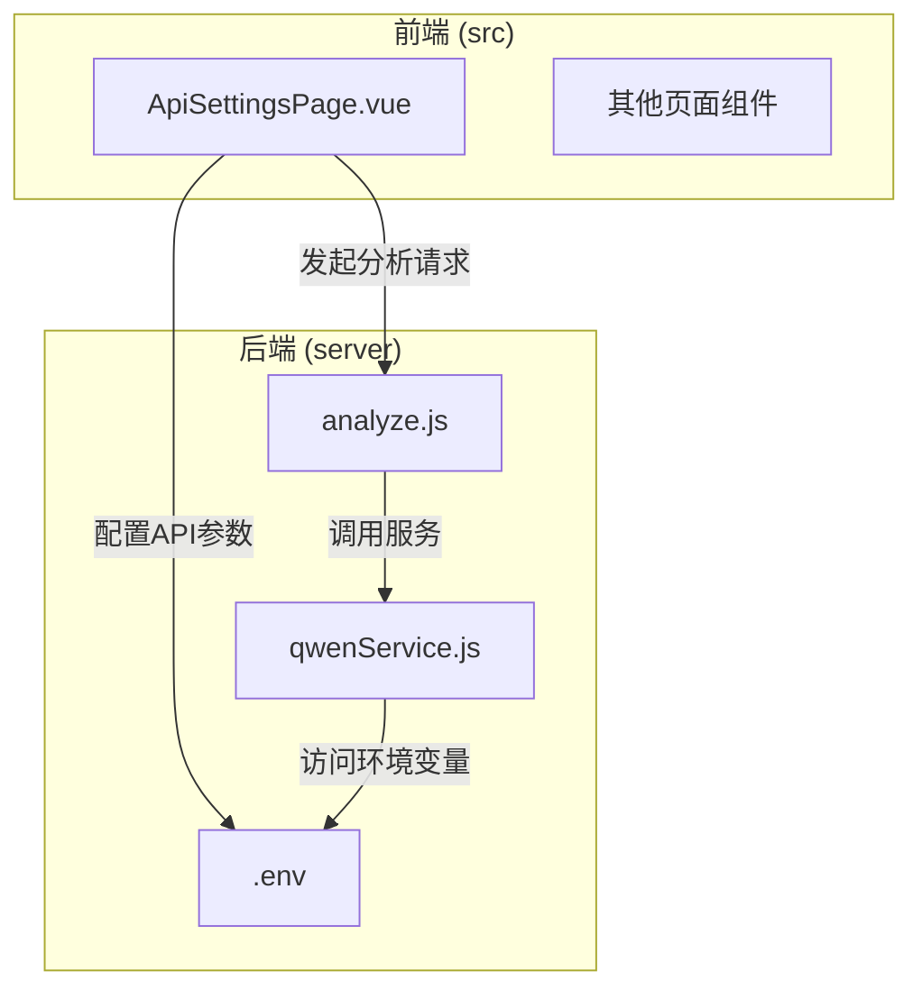
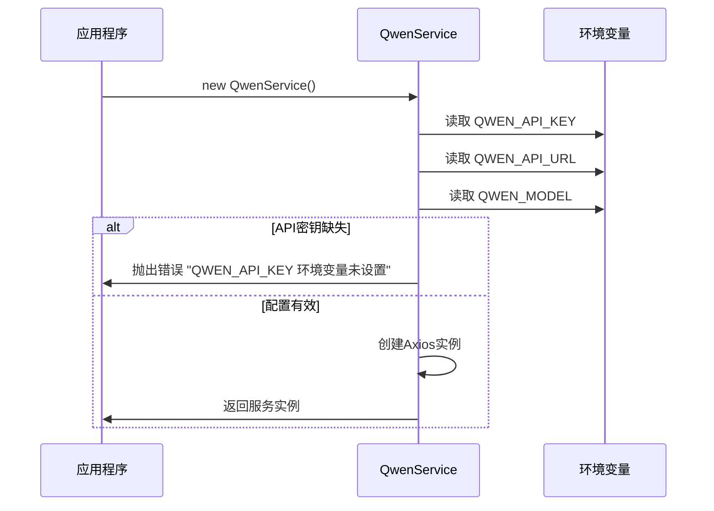
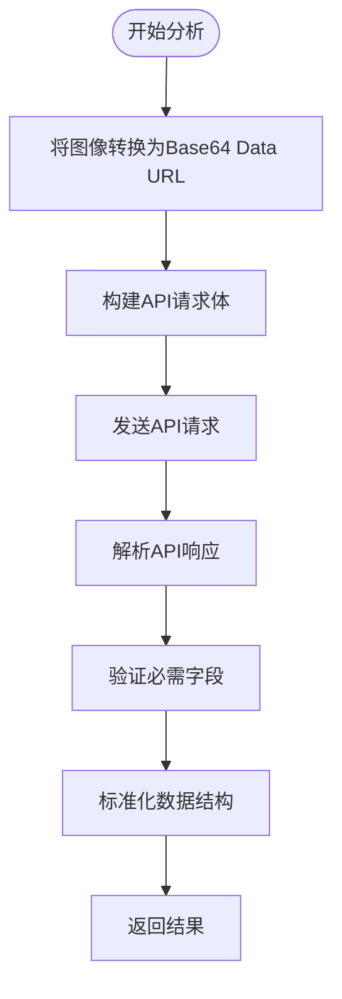
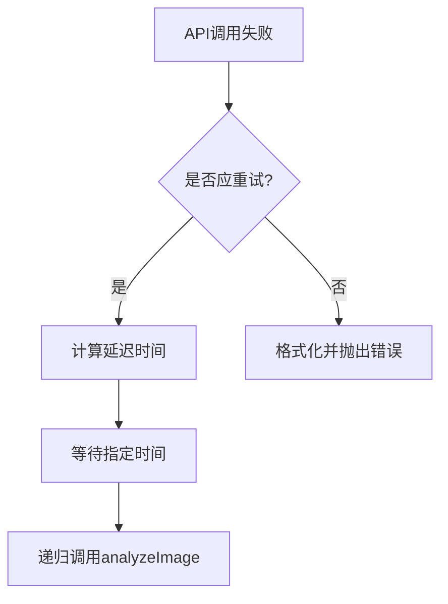
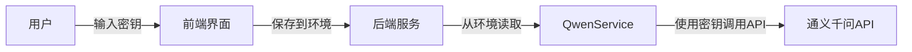

# 通义千问AI集成

> **Referenced Files in This Document**   
> - [qwenService.js](file://server/services/qwenService.js)
> - [.env](file://server/.env)
> - [analyze.js](file://server/routes/analyze.js)
> - [ApiSettingsPage.vue](file://src/pages/ApiSettingsPage.vue)

## 目录
1. [项目结构](#项目结构)
2. [核心组件](#核心组件)
3. [QwenService初始化](#qwenservice初始化)
4. [图像分析流程](#图像分析流程)
5. [错误处理与重试机制](#错误处理与重试机制)
6. [响应结果解析](#响应结果解析)
7. [API调用示例](#api调用示例)
8. [API密钥安全管理](#api密钥安全管理)

## 项目结构
CervixDetectAI项目采用前后端分离架构，通义千问AI集成主要在服务端实现。项目结构清晰地分为`server`（后端服务）和`src`（前端应用）两个主要目录。

后端服务位于`server`目录下，其中`services`子目录中的`qwenService.js`文件是通义千问AI集成的核心实现。该服务通过环境变量配置API连接信息，并提供图像分析功能。`routes`目录下的`analyze.js`文件定义了与AI分析相关的API路由，负责接收前端上传的图像并调用`QwenService`进行处理。

前端应用位于`src`目录下，使用Vue.js框架构建。`pages`子目录中的`ApiSettingsPage.vue`文件提供了用户界面，允许用户配置通义千问API的相关参数。这种分离的架构设计使得AI功能的实现与用户界面解耦，便于维护和扩展。



**Diagram sources**
- [qwenService.js](file://server/services/qwenService.js)
- [.env](file://server/.env)
- [analyze.js](file://server/routes/analyze.js)
- [ApiSettingsPage.vue](file://src/pages/ApiSettingsPage.vue)

**Section sources**
- [qwenService.js](file://server/services/qwenService.js)
- [.env](file://server/.env)
- [analyze.js](file://server/routes/analyze.js)
- [ApiSettingsPage.vue](file://src/pages/ApiSettingsPage.vue)

## 核心组件
通义千问AI集成的核心组件是`QwenService`类，位于`server/services/qwenService.js`文件中。该类封装了与通义千问API交互的所有逻辑，提供了一个简洁的接口供其他模块调用。

`QwenService`类的主要职责包括：从环境变量加载API配置、将本地图像文件转换为API所需的Data URL格式、构造符合API要求的请求体、处理API调用的错误和重试、以及解析和标准化API响应结果。该服务通过Axios库发送HTTP请求，并实现了完整的错误处理和重试机制，确保在面对网络波动或API限流时仍能稳定运行。

前端的`ApiSettingsPage.vue`组件与`QwenService`协同工作，为用户提供了一个配置API参数的界面。用户可以在该页面设置API密钥、端点和模型版本等参数，这些配置最终会保存到`.env`文件中，供`QwenService`读取使用。

**Section sources**
- [qwenService.js](file://server/services/qwenService.js#L35-L254)
- [ApiSettingsPage.vue](file://src/pages/ApiSettingsPage.vue#L264-L276)

## QwenService初始化
`QwenService`类的初始化过程在构造函数中完成，主要负责从环境变量加载必要的API配置信息。构造函数首先从`process.env`对象中读取`QWEN_API_KEY`、`QWEN_API_URL`和`QWEN_MODEL`三个环境变量。

```javascript
constructor() {
  this.apiKey = process.env.QWEN_API_KEY;
  this.apiUrl = process.env.QWEN_API_URL;
  this.model = process.env.QWEN_MODEL || 'qwen-vl-max';
}
```

如果`QWEN_API_KEY`环境变量未设置，构造函数会立即抛出一个错误，阻止服务的创建。这是为了确保在缺少必要认证信息的情况下，系统不会尝试调用API，从而避免潜在的安全风险和无效请求。

初始化过程中，`QwenService`还会创建一个预配置的Axios实例，该实例设置了基础URL、请求超时时间和必要的请求头。其中，`Authorization`头使用`Bearer`方案携带API密钥，这是通义千问API认证的标准方式。



**Diagram sources**
- [qwenService.js](file://server/services/qwenService.js#L35-L52)

**Section sources**
- [qwenService.js](file://server/services/qwenService.js#L35-L52)
- [.env](file://server/.env#L1-L4)

## 图像分析流程
`QwenService`的`analyzeImage`方法实现了完整的图像分析流程，该流程从接收本地图像路径开始，到返回结构化的分析结果结束。

流程的第一步是将本地图像文件转换为Base64编码的Data URL。`imageToBase64`方法读取图像文件，将其内容转换为Base64字符串，并根据文件扩展名确定正确的MIME类型。最终生成的Data URL格式为`data:image/jpeg;base64,...`，这符合通义千问API对图像输入的要求。



**Diagram sources**
- [qwenService.js](file://server/services/qwenService.js#L60-L74)
- [qwenService.js](file://server/services/qwenService.js#L85-L177)

**Section sources**
- [qwenService.js](file://server/services/qwenService.js#L60-L74)
- [qwenService.js](file://server/services/qwenService.js#L85-L177)

构建请求体时，`analyzeImage`方法会创建一个包含系统提示词（`SYSTEM_PROMPT`）和图像输入的消息数组。系统提示词是一个详细的JSON对象，定义了AI作为宫颈细胞学病理专家的角色、背景、技能和工作流程。请求体还设置了`temperature`、`max_tokens`等推理参数，以控制AI生成结果的创造性和长度。

## 错误处理与重试机制
`QwenService`实现了健壮的错误处理和重试机制，以应对网络不稳定和API服务波动等常见问题。`analyzeImage`方法使用try-catch块捕获所有异常，并通过`shouldRetry`方法判断是否应该进行重试。

`shouldRetry`方法根据错误类型决定重试策略：
- 网络错误（`ECONNABORTED`、`ETIMEDOUT`）应重试
- API限流（HTTP 429状态码）应重试
- 服务器错误（HTTP 5xx状态码）应重试

```javascript
shouldRetry(error) {
  if (error.code === 'ECONNABORTED' || error.code === 'ETIMEDOUT') {
    return true;
  }
  if (error.response && error.response.status === 429) {
    return true;
  }
  if (error.response && error.response.status >= 500) {
    return true;
  }
  return false;
}
```

当决定重试时，`analyzeImage`方法会使用递增延迟策略，重试间隔分别为1秒、2秒和3秒。这种策略可以避免在服务恢复时立即发送大量请求，给API服务留出恢复时间。



**Diagram sources**
- [qwenService.js](file://server/services/qwenService.js#L199-L216)
- [qwenService.js](file://server/services/qwenService.js#L182-L187)

**Section sources**
- [qwenService.js](file://server/services/qwenService.js#L179-L191)
- [qwenService.js](file://server/services/qwenService.js#L199-L216)

## 响应结果解析
API响应结果的解析是`analyzeImage`方法的关键部分，它将AI返回的原始文本转换为结构化的JSON对象。解析过程首先检查响应格式，确保包含必要的`choices`字段。

由于AI可能返回带有Markdown代码块标记的JSON内容，解析过程会先清理这些标记。`analyzeImage`方法会检查内容是否以```json或```开头，并相应地移除这些前缀。同样，也会移除结尾的```标记。

```javascript
if (cleanContent.startsWith('```json')) {
  cleanContent = cleanContent.replace(/^```json\s*/, '');
} else if (cleanContent.startsWith('```')) {
  cleanContent = cleanContent.replace(/^```\s*/, '');
}
if (cleanContent.endsWith('```')) {
  cleanContent = cleanContent.replace(/\s*```$/, '');
}
```

清理后的文本被解析为JSON对象，并进行字段验证和标准化。`analyzeImage`方法会检查`diagnosis`、`confidence`等必需字段是否存在，并为缺失的字段提供默认值。最终返回的结果对象包含标准化的诊断信息、置信度、可疑区域、生物标志物评估、临床建议和详细报告。

**Section sources**
- [qwenService.js](file://server/services/qwenService.js#L127-L177)

## API调用示例
以下是一个使用`QwenService`的实际调用示例。在`server/routes/analyze.js`文件中，当接收到图像上传请求时，会创建一个分析任务并调用`qwenService.analyzeImage`方法。

```javascript
// 在analyze.js中调用QwenService
const result = await qwenService.analyzeImage(task.studyInfo.imagePath);
```

`analyzeImage`方法接受两个参数：图像文件路径和可选的重试次数（默认为3次）。方法返回一个Promise，解析后得到一个包含分析结果的对象。该对象包含以下字段：
- `diagnosis`: 诊断分类
- `confidence`: 诊断置信度（0-1之间的小数）
- `suspiciousAreas`: 可疑区域描述数组
- `biomarkers`: 生物标志物评估对象
- `recommendations`: 临床建议数组
- `detailedReport`: 详细的病理分析报告
- `rawResponse`: 原始API响应（用于调试）

前端通过API接口与后端交互，用户在`ApiSettingsPage.vue`中配置的参数会通过环境变量传递给`QwenService`，形成一个完整的配置和调用链。

**Section sources**
- [analyze.js](file://server/routes/analyze.js#L264-L265)
- [qwenService.js](file://server/services/qwenService.js#L85-L177)

## API密钥安全管理
API密钥的安全管理是`QwenService`设计中的重要考虑。系统严格禁止在代码中硬编码API密钥，而是通过环境变量`QWEN_API_KEY`来配置。这种方式确保了密钥不会被意外提交到版本控制系统中。

前端的`ApiSettingsPage.vue`组件提供了用户友好的界面来配置API密钥，但实际的密钥存储和使用仍然在服务端完成。这种设计模式遵循了安全最佳实践：敏感信息在客户端只用于输入，在服务端进行安全存储和使用。



**Diagram sources**
- [.env](file://server/.env#L2-L4)
- [ApiSettingsPage.vue](file://src/pages/ApiSettingsPage.vue#L23-L38)
- [qwenService.js](file://server/services/qwenService.js#L49-L50)

**Section sources**
- [.env](file://server/.env#L2-L4)
- [ApiSettingsPage.vue](file://src/pages/ApiSettingsPage.vue#L23-L38)
- [qwenService.js](file://server/services/qwenService.js#L37-L43)

建议在生产环境中使用更安全的密钥管理服务，而不是简单的环境变量文件。同时，应定期轮换API密钥，并监控API调用日志，以及时发现和应对潜在的安全威胁。