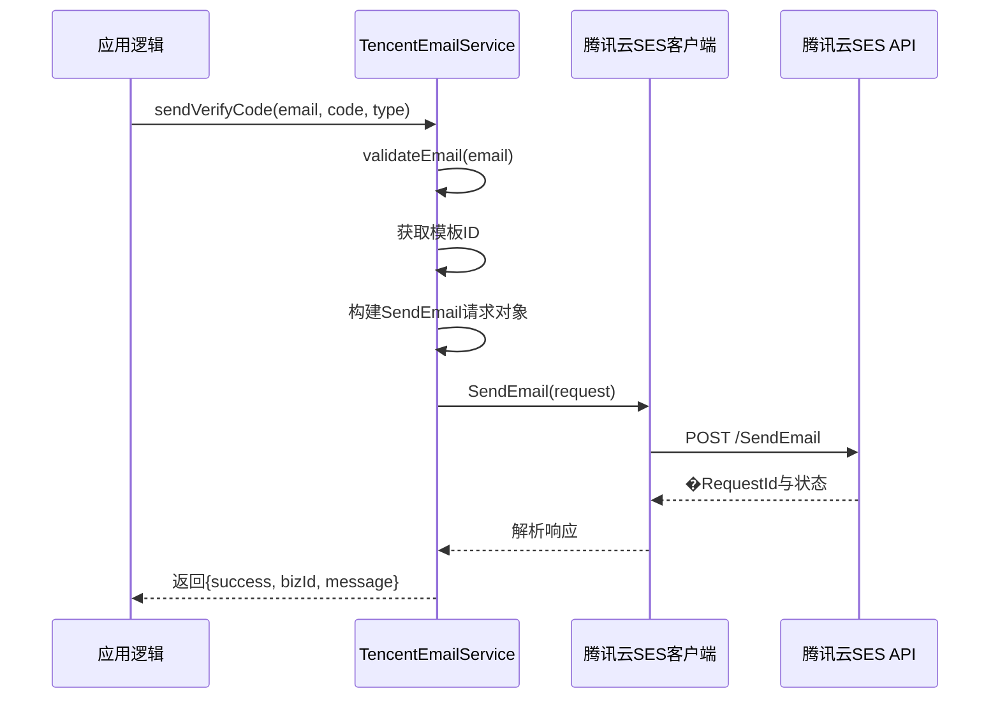

# 邮箱认证服务集成

> **本文档引用文件**
> - [email.service.js](file://server/services/email.service.js)
> - [email-auth.js](file://server/routes/email-auth.js)
> - [EmailCode.js](file://server/models/EmailCode.js)
> - [auth.js](file://server/routes/auth.js)

## 目录
1. [简介](#简介)
2. [核心组件](#核心组件)
3. [服务初始化与认证](#服务初始化与认证)
4. [验证码生成与发送流程](#验证码生成与发送流程)
5. [邮件模板配置](#邮件模板配置)
6. [API响应处理](#api响应处理)
7. [邮箱格式校验](#邮箱格式校验)
8. [错误处理与日志记录](#错误处理与日志记录)
9. [安全最佳实践](#安全最佳实践)

## 简介

本文档全面记录了腾讯云 SES（Simple Email Service）邮件推送服务在项目中的集成方案。重点分析了 `TencentEmailService` 类的实现，详细说明了其如何利用腾讯云 SDK 与环境变量进行安全、高效的邮箱验证码发送。文档涵盖了从服务初始化、验证码生成、请求构建到响应解析的完整流程，并深入探讨了相关的配置、校验和错误处理机制。

## 核心组件

本项目中的腾讯云邮件服务主要由三个核心文件构成：`email.service.js`、`email-auth.js` 和 `EmailCode.js`。前者封装了与腾讯云 API 的直接交互，中间者定义了基于邮箱的验证码发送和验证路由，后者负责验证码数据的持久化存储。

**Section sources**
- [email.service.js](file://server/services/email.service.js#L1-L142)
- [email-auth.js](file://server/routes/email-auth.js#L1-L260)
- [EmailCode.js](file://server/models/EmailCode.js#L1-L130)

## 服务初始化与认证

`TencentEmailService` 类通过腾讯云 SDK 的 `SESClient` 进行初始化。认证凭据（SecretId 和 SecretKey）通过 `process.env` 从环境变量中读取。这种做法将敏感信息与代码分离，是生产环境中的安全最佳实践。

客户端配置还指定了腾讯云 SES 服务的接入点（endpoint）为 `ses.tencentcloudapi.com`，地域（region）默认为 `ap-guangzhou`。

```mermaid
classDiagram
class TencentEmailService {
  -sesClient : SESClient
  +TencentEmailService()
  +generateCode() string
  +sendVerifyCode(email : string, code : string, type : string) Promise~Object~
  +validateEmail(email : string) boolean
}
TencentEmailService --> SESClient : "uses for email sending"
SESClient --> OpenApi.Config : "requires credentials"
OpenApi.Config --> "process.env.TENCENT_SECRET_ID" : "reads SecretId"
OpenApi.Config --> "process.env.TENCENT_SECRET_KEY" : "reads SecretKey"
OpenApi.Config --> "process.env.TENCENT_SES_REGION" : "reads region (default: ap-guangzhou)"
```

**Diagram sources**
- [email.service.js](file://server/services/email.service.js#L5-L16)

## 验证码生成与发送流程

`sendVerifyCode` 方法是发送邮箱验证码的核心，其执行流程如下：

1. **邮箱格式校验**：调用 `validateEmail()` 方法验证邮箱地址格式。
2. **获取模板 ID**：根据验证码类型（register/reset_password）获取对应的邮件模板 ID。
3. **构建请求参数**：创建 SendEmail 请求对象，包含发件人、收件人、模板 ID、模板数据和主题。
4. **发送邮件**：使用腾讯云 SES 客户端的 `SendEmail` 方法异步发送邮件。
5. **返回结果**：根据 API 响应，构造一个包含成功状态、业务 ID（BizId）和消息的 Promise 结果。



**Diagram sources**
- [email.service.js](file://server/services/email.service.js#L55-L116)

## 邮件模板配置

邮件的内容和格式由腾讯云 SES 的邮件模板决定。本系统使用两种不同用途的模板：

| 模板类型 | 模板ID | 用途 |
|---------|--------|------|
| 注册验证码 | TEMPLATE_ID_REGISTER | 用户注册时发送验证码 |
| 重置密码 | TEMPLATE_ID_RESET_PASSWORD | 重置密码时发送验证码 |

### 模板数据格式

腾讯云 SES 要求使用 JSON 格式传递模板变量。本系统使用以下格式：

```json
{
  "code": "123456"
}
```

在邮件模板中使用 `{{code}}` 占位符进行替换。

### 配置说明

| 配置项 | 环境变量 | 默认值 | 说明 |
|--------|----------|--------|------|
| SecretId | TENCENT_SECRET_ID | - | 腾讯云访问密钥 ID |
| SecretKey | TENCENT_SECRET_KEY | - | 腾讯云访问密钥 Key |
| Region | TENCENT_SES_REGION | ap-guangzhou | SES 服务地域 |
| FromEmail | TENCENT_SES_FROM_EMAIL | no-reply@hpvsc.icu | 发信人邮箱地址 |

**Section sources**
- [email.service.js](file://server/services/email.service.js#L20-L24)
- [.env](file://server/.env#L36-L43)

### 发件人地址格式

发件人邮箱地址采用以下格式：

```
CervixDetectAI <no-reply@hpvsc.icu>
```

其中：
- `CervixDetectAI` 是发件人别名（显示名称）
- `no-reply@hpvsc.icu` 是实际的发信邮箱地址
- 别名和邮箱地址之间必须使用一个空格隔开

## API 响应处理

系统对腾讯云返回结果进行结构化解析：

- **成功条件**：API 调用成功且返回 `RequestId`
- **失败处理**：捕获错误并根据错误码返回用户友好的错误消息

### 常见错误码处理

| 错误码 | 用户提示 | 说明 |
|--------|----------|------|
| FailedOperation.InvalidTemplateID | 邮件模板未配置或审核未通过 | 模板 ID 无效或待审核 |
| FailedOperation.FrequencyLimit | 发送过于频繁，请稍后再试 | 短时间内发送过多邮件 |
| FailedOperation.ExceedSendLimit | 超出今日发送上限 | 每日发送次数达到限制 |
| FailedOperation.EmailAddrInBlacklist | 邮箱地址在黑名单中 | 收件邮箱被系统拉黑 |

**Section sources**
- [email.service.js](file://server/services/email.service.js#L95-L115)

## 邮箱格式校验

系统在发送邮件前会严格校验邮箱格式，确保邮件能够成功送达。

### 校验规则

```typescript
const emailRegex = /^[^\s@]+@[^\s@]+\.[^\s@]+$/;
```

### 规则说明

- 必须包含 `@` 符号
- `@` 前后必须至少有一个字符
- `@` 后必须包含 `.` 域名分隔符
- 不允许包含空格

### 有效示例

- `user@example.com` ✅
- `test.name@domain.co.uk` ✅
- `admin@hpvsc.icu` ✅

### 无效示例

- `user@` ❌（缺少域名）
- `@example.com` ❌（缺少用户名）
- `user @example.com` ❌（包含空格）
- `user@example` ❌（缺少顶级域名）

**Section sources**
- [email.service.js](file://server/services/email.service.js#L43-L46)

## 错误处理与日志记录

### 错误日志

所有发送失败的请求都会记录错误日志：

```javascript
console.error('[TencentEmailService] 发送邮件失败:', error);
```

日志包含：
- 错误码（error.code）
- 错误消息（error.message）
- 完整的错误对象（error）

### 错误分类处理

系统将错误分为以下几类进行处理：

1. **参数错误**：邮箱格式不正确、模板 ID 无效等
2. **频率限制**：发送过于频繁、超出每日限额
3. **认证错误**：密钥无效、权限不足
4. **网络错误**：网络超时、连接失败

每种错误类型都有对应的用户友好提示。

**Section sources**
- [email.service.js](file://server/services/email.service.js#L96-L115)

## 安全最佳实践

### 1. 敏感信息管理

- ✅ 密钥存储在环境变量中，不写入代码
- ✅ 使用 `.env` 文件管理本地开发环境配置
- ✅ 生产环境使用专门的密钥管理服务

### 2. 频率限制

- ✅ 60 秒发送间隔（同一邮箱）
- ✅ 每日 10 次发送上限
- ✅ 记录请求 IP 地址用于风控

### 3. 验证码安全

- ✅ 验证码长度固定为 6 位数字
- ✅ 验证码有效期 5 分钟
- ✅ 使用后端生成，不可前端预测
- ✅ 验证后立即标记为已使用

### 4. 发件人配置

- ✅ 使用 `no-reply@hpvsc.icu` 作为发信地址
- ✅ 明确标识为"无需回复"地址
- ✅ 避免用户回复邮件导致系统错误

### 5. 模板管理

- ✅ 所有邮件使用审核通过的模板
- ✅ 模板内容体现实际业务用途
- ✅ 包含安全提示和有效期说明
- ✅ 使用 `{{code}}` 占位符动态替换验证码

## 总结

腾讯云 SES 邮件推送服务的集成，为 CervixDetectAI 项目提供了稳定、高效、安全的邮箱认证机制。通过合理的模板设计、严格的频率控制、完善的错误处理和安全最佳实践，系统实现了与短信认证相并列的邮箱验证码功能。两种认证方式可以独立使用，也可以组合使用，为用户提供灵活的身份验证选择。

**Diagram sources**
- [email.service.js](file://server/services/email.service.js#L1-L142)
