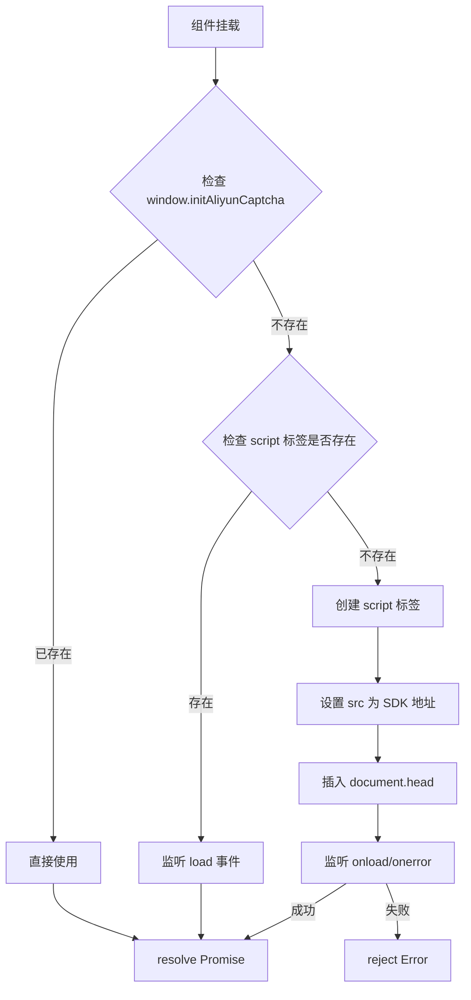
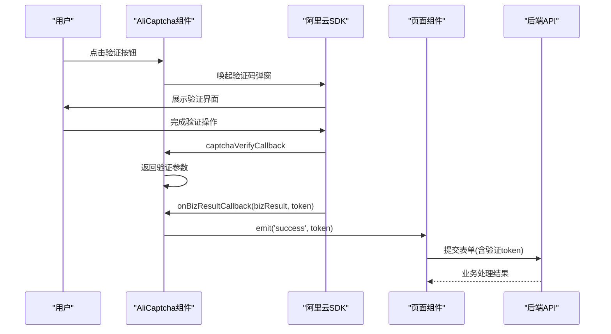

# 阿里云 AI 验证码集成

> **Referenced Files in This Document**
> - [AliCaptcha.vue](file://src/components/common/AliCaptcha.vue)
> - [LoginPage.vue](file://src/pages/LoginPage.vue)
> - [RegisterPage.vue](file://src/pages/RegisterPage.vue)

## 目录
1. [简介](#简介)
2. [核心配置](#核心配置)
3. [前端组件架构](#前端组件架构)
4. [SDK动态加载机制](#sdk动态加载机制)
5. [验证场景配置](#验证场景配置)
6. [验证流程](#验证流程)
7. [组件接口定义](#组件接口定义)
8. [使用示例](#使用示例)
9. [安全最佳实践](#安全最佳实践)

## 简介

本文档详细记录了阿里云 ESA (Edge Security Acceleration) AI 验证码服务在项目中的集成方案。该服务通过边缘安全加速平台提供智能人机验证能力，有效防御自动化攻击和机器人行为。项目在登录、注册、发送短信验证码等敏感操作中使用该服务进行安全验证。

**Section sources**
- [AliCaptcha.vue](file://src/components/common/AliCaptcha.vue#L1-L276)

## 核心配置

项目中使用的阿里云验证码配置信息集中定义在 `AliCaptcha.vue` 组件中：

| 配置项 | 值 | 说明 |
|--------|-----|------|
| **身份标识 (AppKey)** | `esa-mvfh8rnn8x` | 应用唯一标识符 |
| **默认场景ID** | `u1g43fza` | 一点即过验证场景 |
| **图像复原场景ID** | `1dynwu1h` | 短信发送前验证场景 |
| **Region** | `cn` | 服务区域（中国） |
| **Language** | `cn` | 界面语言 |
| **SDK地址** | `https://o.alicdn.com/captcha-frontend/aliyunCaptcha/AliyunCaptcha.js` | 前端JS SDK |

**Section sources**
- [AliCaptcha.vue](file://src/components/common/AliCaptcha.vue#L70-L78)

## 前端组件架构

前端通过封装 `AliCaptcha.vue` 组件实现验证码功能的统一调用。该组件位于 `src/components/common/` 目录，采用 Vue 3 Composition API 编写。

```mermaid
classDiagram
class AliCaptcha {
  -loading : ref~boolean~
  -error : ref~string~
  -captchaInstance : ref~unknown~
  +visible : boolean
  +instanceId : string
  +sceneId : string
  +loadCaptchaScript() Promise~void~
  +initCaptcha() Promise~void~
  +onCaptchaVerify() object
  +onBizResult() void
  +reset() void
  +verify() void
}
AliCaptcha --> "window.initAliyunCaptcha" : "调用"
AliCaptcha --> "emit('success')" : "验证成功"
AliCaptcha --> "emit('fail')" : "验证失败"
AliCaptcha --> "emit('ready')" : "初始化完成"
```

**Diagram sources**
- [AliCaptcha.vue](file://src/components/common/AliCaptcha.vue#L30-L245)

**Section sources**
- [AliCaptcha.vue](file://src/components/common/AliCaptcha.vue#L1-L276)

## SDK动态加载机制

`AliCaptcha.vue` 组件采用动态加载策略引入阿里云验证码 SDK，避免阻塞首屏渲染，并实现了防重复加载机制。



**核心实现代码**：

```typescript
const loadCaptchaScript = (): Promise<void> => {
  return new Promise((resolve, reject) => {
    // 检查是否已加载
    if (window.initAliyunCaptcha) {
      resolve();
      return;
    }

    // 检查是否正在加载
    const existingScript = document.querySelector(
      `script[src="${CAPTCHA_CONFIG.scriptUrl}"]`,
    );
    if (existingScript) {
      existingScript.addEventListener('load', () => resolve());
      existingScript.addEventListener('error', () => reject(new Error('验证码脚本加载失败')));
      return;
    }

    // 创建 script 标签
    const script = document.createElement('script');
    script.src = CAPTCHA_CONFIG.scriptUrl;
    script.async = true;
    script.onload = () => resolve();
    script.onerror = () => reject(new Error('验证码脚本加载失败'));
    document.head.appendChild(script);
  });
};
```

**Diagram sources**
- [AliCaptcha.vue](file://src/components/common/AliCaptcha.vue#L93-L124)

**Section sources**
- [AliCaptcha.vue](file://src/components/common/AliCaptcha.vue#L93-L124)

## 验证场景配置

系统针对不同风险场景配置了差异化的验证策略：

| 场景 | 场景ID (SceneId) | 验证类型 | 触发时机 | 使用页面 |
|------|------------------|----------|----------|----------|
| 登录/注册 | `u1g43fza` | 一点即过 (Smart) | 点击登录/注册按钮前 | LoginPage, RegisterPage |
| 发送短信验证码 | `1dynwu1h` | 图像复原 (Puzzle) | 请求发送验证码前 | LoginPage（手机登录） |

**验证类型说明**：
- **一点即过**：智能风险识别，低风险用户只需点击即可通过，高风险用户需完成滑动验证。
- **图像复原**：需要用户完成拼图操作，防止自动化脚本滥刷短信接口。

**Section sources**
- [LoginPage.vue](file://src/pages/LoginPage.vue#L167-L186)
- [LoginPage.vue](file://src/pages/LoginPage.vue#L204-L212)

## 验证流程



**Diagram sources**
- [AliCaptcha.vue](file://src/components/common/AliCaptcha.vue#L177-L198)
- [LoginPage.vue](file://src/pages/LoginPage.vue#L298-L307)

**Section sources**
- [AliCaptcha.vue](file://src/components/common/AliCaptcha.vue#L177-L198)

## 组件接口定义

### Props

| 属性 | 类型 | 默认值 | 说明 |
|------|------|--------|------|
| `visible` | `boolean` | `true` | 是否显示/激活验证码 |
| `instanceId` | `string` | `'default'` | 实例ID，用于区分页面上多个验证码 |
| `sceneId` | `string` | `''` | 业务场景ID，空则使用默认场景 |

### Events

| 事件 | 参数 | 说明 |
|------|------|------|
| `success` | `token: string` | 验证成功，返回验签凭证 |
| `fail` | `error: string` | 验证失败，返回错误信息 |
| `ready` | - | SDK加载完成，验证码就绪 |

### Expose Methods

| 方法 | 说明 |
|------|------|
| `reset()` | 重置验证码状态 |
| `verify()` | 手动触发验证 |
| `initCaptcha()` | 重新初始化验证码 |

**Section sources**
- [AliCaptcha.vue](file://src/components/common/AliCaptcha.vue#L44-L68)
- [AliCaptcha.vue](file://src/components/common/AliCaptcha.vue#L240-L245)

## 使用示例

### 基础使用（一点即过验证）

```vue
<template>
  <AliCaptcha
    instance-id="login-email"
    @success="onCaptchaSuccess"
    @fail="onCaptchaFail"
  />
</template>

<script setup lang="ts">
import AliCaptcha from 'src/components/common/AliCaptcha.vue';

const onCaptchaSuccess = (token: string) => {
  captchaToken.value = token;
  captchaVerified.value = true;
};

const onCaptchaFail = (error: string) => {
  console.error('验证失败:', error);
};
</script>
```

### 指定场景（图像复原验证）

```vue
<template>
  <q-dialog v-model="showSmsCaptchaDialog" persistent>
    <q-card>
      <q-card-section>
        <AliCaptcha
          v-if="showSmsCaptchaDialog"
          instance-id="login-sms"
          scene-id="1dynwu1h"
          @success="onSmsCaptchaSuccess"
          @fail="onSmsCaptchaFail"
        />
      </q-card-section>
    </q-card>
  </q-dialog>
</template>
```

**Section sources**
- [LoginPage.vue](file://src/pages/LoginPage.vue#L89-L102)
- [LoginPage.vue](file://src/pages/LoginPage.vue#L167-L186)

## 安全最佳实践

本集成方案遵循以下安全最佳实践：

1. **动态加载SDK**：验证码SDK直接从阿里云CDN动态加载，确保使用最新版本，防止本地篡改。
2. **多场景隔离**：不同业务场景使用独立的SceneId，便于风险策略的差异化配置。
3. **双层验证**：短信发送场景采用图像复原验证，登录场景采用一点即过验证，形成双层防护。
4. **条件渲染**：弹窗内的验证码组件使用 `v-if` 条件渲染，避免组件状态残留导致的安全问题。
5. **实例隔离**：通过 `instanceId` 确保同一页面多个验证码实例互不干扰。

**Section sources**
- [LoginPage.vue](file://src/pages/LoginPage.vue#L167-L186)
- [AliCaptcha.vue](file://src/components/common/AliCaptcha.vue#L93-L124)
