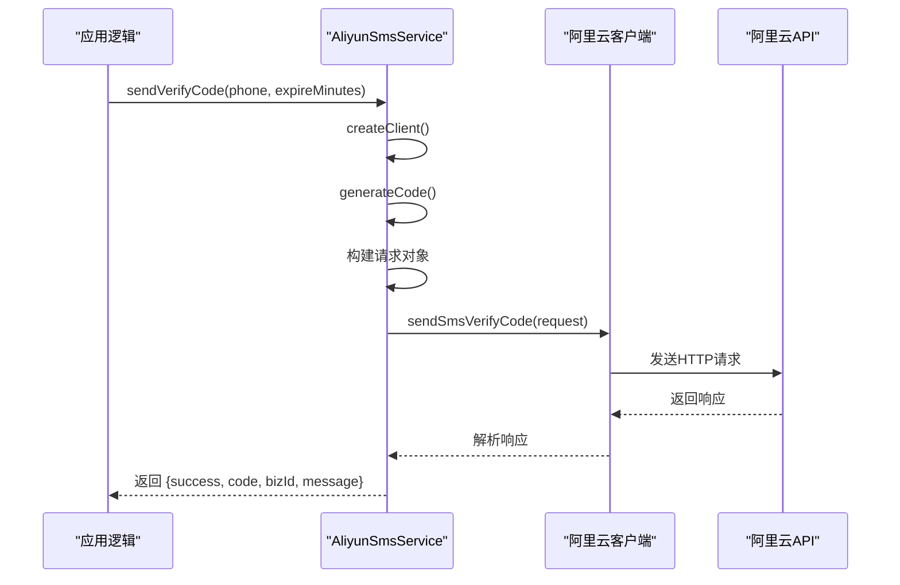

# 阿里云短信服务集成

> **Referenced Files in This Document**   
> - [sms.service.js](file://server/services/sms.service.js)
> - [sms-auth.js](file://server/routes/sms-auth.js)

## 目录
1. [简介](#简介)
2. [核心组件](#核心组件)
3. [服务初始化与认证](#服务初始化与认证)
4. [验证码生成与发送流程](#验证码生成与发送流程)
5. [短信模板与签名配置](#短信模板与签名配置)
6. [API响应处理](#api响应处理)
7. [手机号格式校验](#手机号格式校验)
8. [错误处理与日志记录](#错误处理与日志记录)
9. [安全最佳实践](#安全最佳实践)

## 简介
本文档全面记录了阿里云短信服务在项目中的集成方案。重点分析了`AliyunSmsService`类的实现，详细说明了其如何利用阿里云SDK与环境变量进行安全、高效的短信验证码发送。文档涵盖了从服务初始化、验证码生成、请求构建到响应解析的完整流程，并深入探讨了相关的配置、校验和错误处理机制。

## 核心组件

本项目中的阿里云短信服务主要由两个核心文件构成：`sms.service.js` 和 `sms-auth.js`。前者封装了与阿里云API的直接交互，后者则定义了基于短信的登录、注册和密码重置等业务路由。

**Section sources**
- [sms.service.js](file://server/services/sms.service.js#L1-L128)
- [sms-auth.js](file://server/routes/sms-auth.js#L1-L492)

## 服务初始化与认证

`AliyunSmsService` 类通过 `createClient` 方法初始化阿里云短信客户端。该方法实现了单例模式，确保在整个应用生命周期内只创建一个客户端实例，以提高性能和资源利用率。

认证凭据（AccessKey ID 和 AccessKey Secret）通过 `process.env` 从环境变量 `ALIYUN_ACCESS_KEY_ID` 和 `ALIYUN_ACCESS_KEY_SECRET` 中读取。这种做法将敏感信息与代码分离，是生产环境中的安全最佳实践。客户端配置还指定了阿里云动态认证服务的接入点（endpoint）为 `dypnsapi.aliyuncs.com`。

```mermaid
classDiagram
class AliyunSmsService {
-client : Dypnsapi20170525
+createClient() Dypnsapi20170525
+generateCode() string
+sendVerifyCode(phoneNumber : string, expireMinutes : number) Promise~Object~
+validatePhoneNumber(phone : string) boolean
}
AliyunSmsService --> OpenApi.Config : "uses for credentials"
AliyunSmsService --> Dypnsapi20170525.SendSmsVerifyCodeRequest : "creates request"
OpenApi.Config --> "process.env.ALIYUN_ACCESS_KEY_ID" : "reads"
OpenApi.Config --> "process.env.ALIYUN_ACCESS_KEY_SECRET" : "reads"
```

**Diagram sources**
- [sms.service.js](file://server/services/sms.service.js#L19-L33)

**Section sources**
- [sms.service.js](file://server/services/sms.service.js#L19-L33)

## 验证码生成与发送流程

`sendVerifyCode` 方法是发送短信验证码的核心，其执行流程如下：

1.  **获取客户端**：调用 `createClient()` 获取已初始化的阿里云客户端。
2.  **生成验证码**：调用 `generateCode()` 方法生成一个6位随机数字验证码。
3.  **构建请求**：创建一个 `SendSmsVerifyCodeRequest` 对象，填充必要的参数。
4.  **发送请求**：使用客户端的 `sendSmsVerifyCode` 方法异步发送请求。
5.  **返回结果**：根据API响应，构造一个包含成功状态、验证码、BizId和消息的Promise结果。



**Diagram sources**
- [sms.service.js](file://server/services/sms.service.js#L49-L112)

**Section sources**
- [sms.service.js](file://server/services/sms.service.js#L39-L41)
- [sms.service.js](file://server/services/sms.service.js#L49-L112)

## 短信模板与签名配置

短信的外观由签名（Sign Name）和模板（Template Code）决定。在本实现中，这些配置项通过环境变量进行灵活设置：

*   **签名名称**：通过 `ALIYUN_SMS_SIGN_NAME` 环境变量读取。如果该变量未设置，则使用默认值 `'速通互联验证码'`。
*   **模板代码**：通过 `ALIYUN_SMS_TEMPLATE_CODE` 环境变量读取。如果该变量未设置，则使用默认值 `'100001'`。

此外，`templateParam` 参数被构造成一个JSON字符串，其中包含动态的 `code`（验证码）和 `min`（过期时间）字段，这些字段将被填充到短信模板中。

**Section sources**
- [sms.service.js](file://server/services/sms.service.js#L58-L64)

## API响应处理

`sendVerifyCode` 方法对阿里云API的响应进行了详细的解析和处理。响应体（`response.body`）可能包含以下关键字段：

*   **code**：API返回的状态码，成功时为 `'OK'`。
*   **success**：布尔值，表示请求是否成功。
*   **message**：描述请求结果的文本信息。
*   **model**：包含业务数据的对象，其中 `bizId` 是短信发送的唯一标识，可用于后续查询。

代码通过检查 `success` 为 `true` 且 `code` 为 `'OK'` 来判断发送成功，并返回包含验证码和 `bizId` 的结果对象；否则，返回包含错误信息的对象。

**Section sources**
- [sms.service.js](file://server/services/sms.service.js#L74-L96)

## 手机号格式校验

`validatePhoneNumber` 方法使用正则表达式 `/^1[3-9]\d{9}$/` 对手机号进行格式校验。此正则表达式确保了手机号：
*   以数字 `1` 开头。
*   第二位是 `3` 到 `9` 之间的数字（覆盖了中国大陆所有主流运营商的号段）。
*   总共由11位数字组成。

该方法在 `sms-auth.js` 的多个路由中被调用，以确保只有格式正确的手机号才能请求发送验证码。

**Section sources**
- [sms.service.js](file://server/services/sms.service.js#L120-L122)

## 错误处理与日志记录

`sendVerifyCode` 方法通过 `try-catch` 块捕获所有可能的异常，包括网络连接失败、API调用超时或SDK内部错误。捕获到错误后，会通过 `console.error` 将详细的错误信息输出到日志中，包括错误对象本身、错误消息以及可能的 `error.data` 数据，这极大地便利了问题的排查和调试。最终，方法会返回一个标准化的失败结果对象。

**Section sources**
- [sms.service.js](file://server/services/sms.service.js#L102-L111)

## 安全最佳实践

本集成方案严格遵循了安全最佳实践：
1.  **凭据安全**：访问密钥（AccessKey ID/Secret）绝不硬编码在代码中，而是通过环境变量注入，避免了在代码仓库中泄露的风险。
2.  **输入校验**：在调用短信服务前，对手机号进行严格的格式校验，防止无效或恶意输入。
3.  **频率限制**：在 `sms-auth.js` 中实现了发送频率限制（每60秒一次）和每日最大发送次数限制（10次），有效防止了短信轰炸等滥用行为。
4.  **验证码管理**：验证码的生成、存储、验证和过期均由后端严格控制，确保了认证流程的安全性。