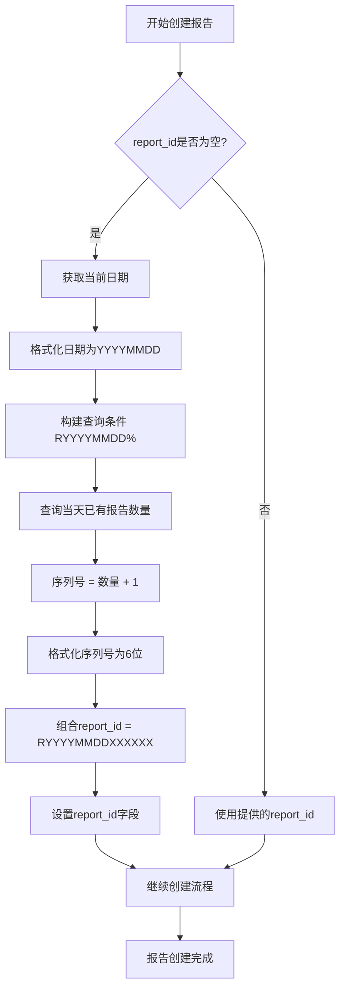

# 医疗报告模型

> **本文档引用文件**   
> - [MedicalReport.js](file://server/models/MedicalReport.js)
> - [Study.js](file://server/models/Study.js)
> - [AnalysisResult.js](file://server/models/AnalysisResult.js)
> - [Patient.js](file://server/models/Patient.js)
> - [User.js](file://server/models/User.js)
> - [index.js](file://server/models/index.js)

## 目录
1. [字段定义](#字段定义)
2. [索引配置](#索引配置)
3. [模型关联关系](#模型关联关系)
4. [创建前钩子逻辑](#创建前钩子逻辑)

## 字段定义

医疗报告模型（MedicalReport）包含以下字段定义，每个字段均具有明确的数据类型、约束条件和默认值：

| 字段名 | 数据类型 | 允许为空 | 约束/默认值 | 说明 |
|--------|--------|--------|------------|------|
| id | BIGINT | 否 | 主键，自增 | 报告的唯一主键标识符 |
| report_id | STRING(50) | 否 | 唯一索引 | 报告唯一标识符，格式为RYYYYMMDDXXXXXX |
| study_id | BIGINT | 否 | 外键引用studies.id，更新级联，删除限制 | 关联的检查记录ID |
| analysis_result_id | BIGINT | 否 | 外键引用analysis_results.id，更新级联，删除限制 | 关联的分析结果ID |
| patient_id | BIGINT | 否 | 外键引用patients.id，更新级联，删除限制 | 关联的患者ID |
| report_type | ENUM('preliminary', 'final', 'supplementary') | 否 | 枚举值 | 报告类型：初步/最终/补充 |
| report_title | STRING(255) | 否 | 无 | 报告标题 |
| file_path | STRING(500) | 否 | 无 | PDF文件存储路径 |
| file_size | BIGINT | 否 | 无 | 文件大小（字节） |
| page_count | INTEGER | 是 | 无 | 页数 |
| template_version | STRING(50) | 是 | 无 | 模板版本号 |
| generated_by | BIGINT | 否 | 外键引用users.id，更新级联，删除限制 | 生成报告的用户ID |
| signed_by | BIGINT | 是 | 外键引用users.id，更新级联，删除置空 | 签署报告的用户ID |
| signed_at | DATE | 是 | 无 | 签署时间 |
| signature_data | TEXT | 是 | 无 | 电子签名数据 |
| status | ENUM('draft', 'pending_review', 'approved', 'rejected') | 否 | 默认值'draft' | 报告状态 |
| download_count | INTEGER | 否 | 默认值0 | 下载次数 |
| last_downloaded_at | DATE | 是 | 无 | 最后下载时间 |

**Section sources**
- [MedicalReport.js](file://server/models/MedicalReport.js#L8-L115)

## 索引配置

医疗报告模型配置了多个索引以优化查询性能，包括唯一索引和复合索引：

```mermaid
erDiagram
medical_reports ||--o{ studies : "study_id → studies.id"
medical_reports ||--o{ analysis_results : "analysis_result_id → analysis_results.id"
medical_reports ||--o{ patients : "patient_id → patients.id"
medical_reports ||--o{ users : "generated_by → users.id"
medical_reports ||--o{ users : "signed_by → users.id"
medical_reports {
BIGINT id PK
STRING(50) report_id UK
BIGINT study_id FK
BIGINT analysis_result_id FK
BIGINT patient_id FK
ENUM report_type
STRING(255) report_title
STRING(500) file_path
BIGINT file_size
INTEGER page_count
STRING(50) template_version
BIGINT generated_by FK
BIGINT signed_by FK
DATE signed_at
TEXT signature_data
ENUM status
INTEGER download_count
DATE last_downloaded_at
}
class IndexConfig {
+唯一索引: report_id
+普通索引: study_id
+普通索引: analysis_result_id
+普通索引: patient_id
+普通索引: generated_by
+普通索引: signed_by
+复合索引: patient_id + created_at
+复合索引: status + created_at
}
```

**Diagram sources**
- [MedicalReport.js](file://server/models/MedicalReport.js#L119-L144)

**Section sources**
- [MedicalReport.js](file://server/models/MedicalReport.js#L119-L144)

## 模型关联关系

医疗报告模型与Study、AnalysisResult、Patient和User模型之间存在明确的关联关系，这些关系在系统中通过外键约束和Sequelize关联定义实现。

```mermaid
classDiagram
class MedicalReport {
+BIGINT id
+STRING report_id
+BIGINT study_id
+BIGINT analysis_result_id
+BIGINT patient_id
+ENUM report_type
+STRING report_title
+STRING file_path
+BIGINT file_size
+INTEGER page_count
+STRING template_version
+BIGINT generated_by
+BIGINT signed_by
+DATE signed_at
+TEXT signature_data
+ENUM status
+INTEGER download_count
+DATE last_downloaded_at
}
class Study {
+BIGINT id
+STRING study_id
+BIGINT patient_id
+BIGINT user_id
+DATE study_date
+STRING study_type
+ENUM status
}
class AnalysisResult {
+BIGINT id
+BIGINT task_id
+BIGINT study_id
+STRING diagnosis
+DECIMAL confidence
+ENUM risk_level
+JSON recommendations
}
class Patient {
+BIGINT id
+STRING patient_id
+STRING name
+ENUM gender
+DATE birth_date
+STRING phone
}
class User {
+BIGINT id
+STRING username
+STRING email
+STRING password_hash
+STRING real_name
+ENUM role
+ENUM status
}
MedicalReport --> Study : "belongsTo<br/>外键 : study_id"
MedicalReport --> AnalysisResult : "belongsTo<br/>外键 : analysis_result_id"
MedicalReport --> Patient : "belongsTo<br/>外键 : patient_id"
MedicalReport --> User : "belongsTo<br/>外键 : generated_by"
MedicalReport --> User : "belongsTo<br/>外键 : signed_by"
Study --> Patient : "belongsTo<br/>外键 : patient_id"
Study --> User : "belongsTo<br/>外键 : user_id"
AnalysisResult --> Study : "belongsTo<br/>外键 : study_id"
AnalysisResult --> User : "belongsTo<br/>外键 : reviewed_by"
Patient --> User : "belongsTo<br/>外键 : created_by"
```

**Diagram sources**
- [MedicalReport.js](file://server/models/MedicalReport.js#L57-L64)
- [index.js](file://server/models/index.js#L57-L64)

**Section sources**
- [MedicalReport.js](file://server/models/MedicalReport.js#L57-L64)
- [index.js](file://server/models/index.js#L57-L64)

## 创建前钩子逻辑

医疗报告模型在创建前通过beforeCreate钩子自动生report_id，该逻辑基于日期生成前缀并查询当天报告数以生成序列号。



该逻辑的具体实现步骤：
1. 检查report_id字段是否已提供
2. 若未提供，则获取当前日期并格式化为YYYYMMDD格式
3. 构建数据库查询条件，查找以RYYYYMMDD开头的现有报告
4. 统计符合条件的报告数量
5. 将数量加1作为当天的序列号
6. 将序列号格式化为6位数字（不足补零）
7. 组合生成最终的report_id：R + 日期 + 6位序列号

**Diagram sources**
- [MedicalReport.js](file://server/models/MedicalReport.js#L150-L166)

**Section sources**
- [MedicalReport.js](file://server/models/MedicalReport.js#L150-L166)