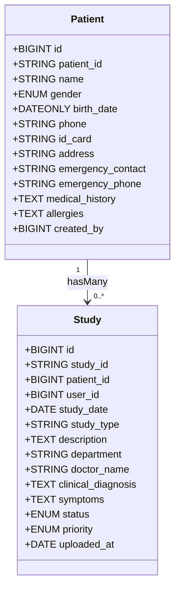
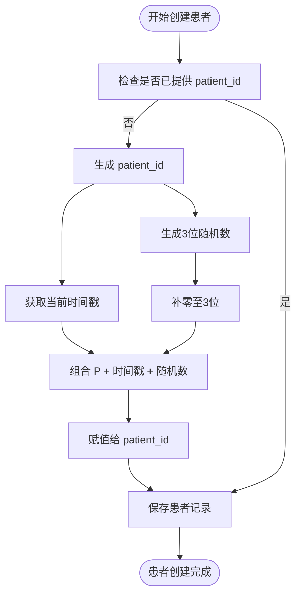

# 患者模型

<cite>
**本文档引用的文件**   
- [Patient.js](file://server/models/Patient.js)
- [Study.js](file://server/models/Study.js)
- [index.js](file://server/models/index.js)
- [patients.js](file://server/routes/patients.js)
- [studies.js](file://server/routes/studies.js)
</cite>

## 目录
1. [字段定义](#字段定义)
2. [索引配置](#索引配置)
3. [模型关联关系](#模型关联关系)
4. [创建钩子逻辑](#创建钩子逻辑)

## 字段定义

患者模型（Patient）包含以下字段定义，每个字段都有明确的数据类型、约束条件和默认值：

- **id**：BIGINT 类型，主键，自动递增。
- **patient_id**：STRING(50) 类型，不允许为空，具有唯一性约束，用于唯一标识患者。
- **name**：STRING(100) 类型，不允许为空，存储患者姓名。
- **gender**：ENUM 枚举类型，取值为 'male'（男）、'female'（女）、'other'（其他），不允许为空。
- **birth_date**：DATEONLY 类型，允许为空，表示患者的出生日期。
- **phone**：STRING(20) 类型，允许为空，存储患者的联系电话。
- **id_card**：STRING(50) 类型，允许为空，注释为“身份证号（加密存储）”，用于安全地保存身份信息。
- **address**：STRING(500) 类型，允许为空，存储患者的详细地址。
- **emergency_contact**：STRING(100) 类型，允许为空，存储紧急联系人姓名。
- **emergency_phone**：STRING(20) 类型，允许为空，存储紧急联系人电话。
- **medical_history**：TEXT 类型，允许为空，用于记录患者的病史信息。
- **allergies**：TEXT 类型，允许为空，注释为“过敏信息”，用于记录过敏情况。
- **created_by**：BIGINT 类型，不允许为空，外键引用 users 表的 id 字段，更新时级联（CASCADE），删除时限制（RESTRICT）。

**Section sources**
- [Patient.js](file://server/models/Patient.js#L8-L69)

## 索引配置

患者模型配置了多个数据库索引以优化查询性能：

- **唯一索引**：在 `patient_id` 字段上创建唯一索引，确保每个患者的唯一标识符不重复。
- **普通索引**：
  - 在 `name` 字段上创建索引，加快按姓名搜索的速度。
  - 在 `phone` 字段上创建索引，便于通过电话号码查找患者。
  - 在 `created_by` 字段上创建索引，优化按创建者查询患者列表的效率。

这些索引在模型定义的 `indexes` 数组中声明，有助于提升系统在大数据量下的检索性能。

**Section sources**
- [Patient.js](file://server/models/Patient.js#L73-L87)

## 模型关联关系

患者模型与病例模型（Study）之间存在一对多的关联关系。具体表现为一个患者可以拥有多个病例记录。

该关系在 `server/models/index.js` 文件中通过 Sequelize 的 `hasMany` 方法进行定义：

```js
Patient.hasMany(Study, { foreignKey: 'patient_id', as: 'studies' });
```

同时，Study 模型通过 `belongsTo` 关联回 Patient 模型：

```js
Study.belongsTo(Patient, { foreignKey: 'patient_id', as: 'patient' });
```

这种双向关联使得可以通过患者获取其所有病例，也可以从病例反向查询所属患者信息，增强了数据访问的灵活性和完整性。



**Diagram sources**
- [index.js](file://server/models/index.js#L31)
- [Study.js](file://server/models/Study.js#L35)

**Section sources**
- [index.js](file://server/models/index.js#L31)
- [Study.js](file://server/models/Study.js#L35)

## 创建钩子逻辑

在创建患者记录之前，系统会自动执行 `beforeCreate` 钩子来生成唯一的 `patient_id`。该逻辑定义在 `Patient.js` 文件中。

生成策略结合了时间戳和随机数：
1. 获取当前时间的时间戳（毫秒级）。
2. 生成一个三位数的随机整数，并用前导零填充至三位。
3. 将前缀 `P` 与时间戳及随机数组合，形成最终的 `patient_id`。

例如：`P171234567890123`

此机制确保了 `patient_id` 的全局唯一性和可追溯性，同时避免了对数据库自增机制的依赖，提高了分布式环境下的兼容性。



**Diagram sources**
- [Patient.js](file://server/models/Patient.js#L92-L99)

**Section sources**
- [Patient.js](file://server/models/Patient.js#L92-L99)