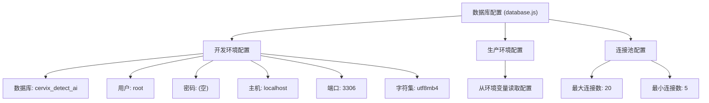
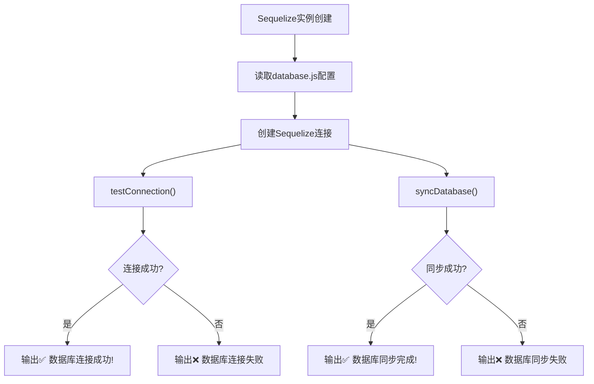
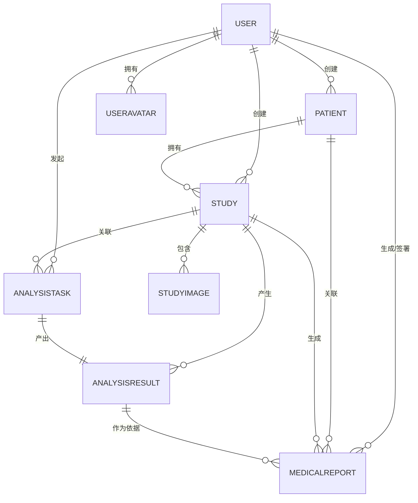

# 数据模型与ORM映射

> **Referenced Files in This Document**   
> - [User.js](file://server/models/User.js)
> - [Patient.js](file://server/models/Patient.js)
> - [Study.js](file://server/models/Study.js)
> - [AnalysisTask.js](file://server/models/AnalysisTask.js)
> - [MedicalReport.js](file://server/models/MedicalReport.js)
> - [AnalysisResult.js](file://server/models/AnalysisResult.js)
> - [StudyImage.js](file://server/models/StudyImage.js)
> - [SmsCode.js](file://server/models/SmsCode.js)
> - [UserAvatar.js](file://server/models/UserAvatar.js)
> - [index.js](file://server/models/index.js)
> - [database.js](file://server/config/database.js)
> - [sequelize.js](file://server/config/sequelize.js)

## 目录
1. [项目结构](#项目结构)
2. [数据库连接与配置](#数据库连接与配置)
3. [Sequelize同步机制](#sequelize同步机制)
4. [核心数据模型](#核心数据模型)
5. [模型关联关系](#模型关联关系)
6. [数据库表结构示意图](#数据库表结构示意图)
7. [ORM到MySQL物理表的映射](#orm到mysql物理表的映射)

## 项目结构
CervixDetectAI项目的后端数据模型位于`server/models/`目录下，采用Sequelize ORM框架进行定义和管理。每个数据模型对应一个独立的JavaScript文件，通过`index.js`文件统一导入和建立关联关系。数据库配置信息分别存储在`config/database.js`和`config/sequelize.js`中。

**Section sources**
- [database.js](file://server/config/database.js#L1-L61)
- [sequelize.js](file://server/config/sequelize.js#L1-L54)
- [index.js](file://server/models/index.js#L1-L78)

## 数据库连接与配置
数据库连接配置在`database.js`文件中定义，支持开发和生产两种环境。配置内容包括数据库名称、用户名、密码、主机地址、端口、方言（MySQL）以及字符集设置。



**Diagram sources**
- [database.js](file://server/config/database.js#L5-L61)

**Section sources**
- [database.js](file://server/config/database.js#L1-L61)
- [sequelize.js](file://server/config/sequelize.js#L1-L54)

## Sequelize同步机制
`sequelize.js`文件负责创建Sequelize实例并管理数据库连接。它提供了`testConnection()`方法用于测试数据库连接，以及`syncDatabase()`方法用于同步模型到数据库。在开发环境中，此机制会自动创建或更新数据库表结构以匹配模型定义。



**Diagram sources**
- [sequelize.js](file://server/config/sequelize.js#L8-L46)

**Section sources**
- [sequelize.js](file://server/config/sequelize.js#L1-L54)

## 核心数据模型
本系统定义了多个核心数据模型，每个模型都通过Sequelize的`define`方法进行声明，包含字段定义、数据类型、默认值、验证规则、索引和约束等元数据。

### User（用户）
`User`模型代表系统用户，包含登录凭证、个人信息和权限角色。

**字段定义:**
- `id`: BIGINT, 主键, 自增
- `username`: STRING(50), 非空, 唯一
- `email`: STRING(100), 非空, 唯一, 邮箱格式验证
- `password_hash`: STRING(255), 非空
- `role`: ENUM('admin', 'doctor', 'user'), 非空, 默认值'user'
- `status`: ENUM('active', 'disabled'), 非空, 默认值'active'

**索引:**
- 唯一索引: `username`
- 唯一索引: `email`
- 普通索引: `status`, `created_at`

**约束:**
- `username`和`email`字段具有唯一性约束

**Section sources**
- [User.js](file://server/models/User.js#L6-L81)

### Patient（患者）
`Patient`模型存储患者的基本信息和医疗历史。

**字段定义:**
- `id`: BIGINT, 主键, 自增
- `patient_id`: STRING(50), 非空, 唯一
- `name`: STRING(100), 非空
- `gender`: ENUM('male', 'female', 'other'), 非空
- `created_by`: BIGINT, 非空, 外键引用`users.id`

**索引:**
- 唯一索引: `patient_id`
- 普通索引: `name`, `phone`, `created_by`

**约束:**
- `patient_id`字段具有唯一性约束
- `created_by`字段为外键，更新时级联，删除时限制

**Section sources**
- [Patient.js](file://server/models/Patient.js#L5-L88)

### Study（检查记录）
`Study`模型代表一次宫颈检查的完整记录。

**字段定义:**
- `id`: BIGINT, 主键, 自增
- `study_id`: STRING(50), 非空, 唯一
- `patient_id`: BIGINT, 非空, 外键引用`patients.id`
- `user_id`: BIGINT, 非空, 外键引用`users.id`
- `status`: ENUM('pending', 'uploaded', 'processing', 'completed', 'failed'), 非空, 默认值'pending'

**索引:**
- 唯一索引: `study_id`
- 普通索引: `patient_id`, `user_id`, `patient_id+study_date`, `status+created_at`

**约束:**
- `study_id`字段具有唯一性约束
- `patient_id`和`user_id`字段为外键，更新时级联，删除时限制

**Section sources**
- [Study.js](file://server/models/Study.js#L5-L107)

### AnalysisTask（分析任务）
`AnalysisTask`模型表示一个AI分析任务。

**字段定义:**
- `id`: BIGINT, 主键, 自增
- `task_id`: STRING(50), 非空, 唯一
- `study_id`: BIGINT, 非空, 外键引用`studies.id`
- `status`: ENUM('PENDING', 'PROCESSING', 'SUCCESS', 'FAILED'), 非空, 默认值'PENDING'
- `progress`: INTEGER, 非空, 默认值0, 验证范围[0,100]

**索引:**
- 唯一索引: `task_id`
- 普通索引: `study_id`, `user_id`, `status+created_at`

**约束:**
- `task_id`字段具有唯一性约束
- `study_id`字段为外键，更新时级联，删除时限制

**Section sources**
- [AnalysisTask.js](file://server/models/AnalysisTask.js#L5-L97)

### MedicalReport（医疗报告）
`MedicalReport`模型存储生成的医疗诊断报告。

**字段定义:**
- `id`: BIGINT, 主键, 自增
- `report_id`: STRING(50), 非空, 唯一
- `study_id`: BIGINT, 非空, 外键引用`studies.id`
- `analysis_result_id`: BIGINT, 非空, 外键引用`analysis_results.id`
- `report_type`: ENUM('preliminary', 'final', 'supplementary'), 非空
- `status`: ENUM('draft', 'pending_review', 'approved', 'rejected'), 非空, 默认值'draft'

**索引:**
- 唯一索引: `report_id`
- 普通索引: `study_id`, `analysis_result_id`, `patient_id`, `generated_by`, `signed_by`, `patient_id+created_at`, `status+created_at`

**约束:**
- `report_id`字段具有唯一性约束
- 多个字段为外键，具有不同的更新和删除行为

**Section sources**
- [MedicalReport.js](file://server/models/MedicalReport.js#L5-L147)

## 模型关联关系
所有模型的关联关系在`models/index.js`文件中集中定义，形成了一个完整的数据关系网络。



**Diagram sources**
- [index.js](file://server/models/index.js#L15-L65)

**Section sources**
- [index.js](file://server/models/index.js#L15-L65)

## 数据库表结构示意图
以下是系统主要数据库表的结构示意图，展示了各表的字段、数据类型和主外键关系。

```mermaid
erDiagram
users {
BIGINT id PK
STRING(50) username UK
STRING(100) email UK
STRING(255) password_hash
STRING(100) real_name
STRING(20) phone
STRING(500) avatar_url
ENUM role
ENUM status
DATE last_login_at
STRING(45) last_login_ip
DATETIME created_at
DATETIME updated_at
DATETIME deleted_at
}
patients {
BIGINT id PK
STRING(50) patient_id UK
STRING(100) name
ENUM gender
DATEONLY birth_date
STRING(20) phone
STRING(50) id_card
STRING(500) address
STRING(100) emergency_contact
STRING(20) emergency_phone
TEXT medical_history
TEXT allergies
BIGINT created_by FK
DATETIME created_at
DATETIME updated_at
DATETIME deleted_at
}
studies {
BIGINT id PK
STRING(50) study_id UK
BIGINT patient_id FK
BIGINT user_id FK
DATE study_date
STRING(50) study_type
TEXT description
STRING(100) department
STRING(100) doctor_name
TEXT clinical_diagnosis
TEXT symptoms
ENUM status
ENUM priority
DATE uploaded_at
DATETIME created_at
DATETIME updated_at
DATETIME deleted_at
}
analysis_tasks {
BIGINT id PK
STRING(50) task_id UK
BIGINT study_id FK
BIGINT user_id FK
ENUM status
INTEGER progress
STRING(50) ai_model_version
INTEGER processing_time
TEXT error_message
INTEGER retry_count
DATE started_at
DATE completed_at
DATETIME created_at
DATETIME updated_at
DATETIME deleted_at
}
analysis_results {
BIGINT id PK
BIGINT task_id UK FK
BIGINT study_id FK
STRING(255) diagnosis
DECIMAL(5,4) confidence
ENUM risk_level
JSON recommendations
JSON suspicious_areas
JSON biomarkers
TEXT detailed_report
STRING(500) heatmap_url
STRING(500) annotated_image_url
JSON raw_output
BIGINT reviewed_by FK
DATE reviewed_at
TEXT review_comments
DATETIME created_at
DATETIME updated_at
DATETIME deleted_at
}
medical_reports {
BIGINT id PK
STRING(50) report_id UK
BIGINT study_id FK
BIGINT analysis_result_id FK
BIGINT patient_id FK
ENUM report_type
STRING(255) report_title
STRING(500) file_path
BIGINT file_size
INTEGER page_count
STRING(50) template_version
BIGINT generated_by FK
BIGINT signed_by FK
DATE signed_at
TEXT signature_data
ENUM status
INTEGER download_count
DATE last_downloaded_at
DATETIME created_at
DATETIME updated_at
DATETIME deleted_at
}
study_images {
BIGINT id PK
BIGINT study_id FK
STRING(255) original_filename
STRING(255) stored_filename
STRING(500) file_path
STRING(500) thumbnail_path
BIGINT file_size
STRING(50) mime_type
STRING(20) file_format
INTEGER width
INTEGER height
INTEGER series_number
INTEGER instance_number
JSON dicom_metadata
BOOLEAN is_primary
ENUM upload_status
DATETIME created_at
}
user_avatars {
BIGINT id PK
BIGINT user_id FK
STRING(500) original_url
STRING(500) thumbnail_url
STRING(500) medium_url
BIGINT file_size
STRING(50) mime_type
INTEGER width
INTEGER height
BOOLEAN is_current
DATETIME created_at
}
sms_codes {
BIGINT id PK
STRING(20) phone
STRING(6) code
STRING(100) biz_id
ENUM type
ENUM status
DATE expires_at
STRING(45) ip_address
DATETIME created_at
}
users ||--o{ patients : "created_by"
users ||--o{ studies : "user_id"
users ||--o{ analysis_tasks : "user_id"
users ||--o{ analysis_results : "reviewed_by"
users ||--o{ medical_reports : "generated_by, signed_by"
users ||--o{ user_avatars : "user_id"
patients ||--o{ studies : "patient_id"
patients ||--o{ medical_reports : "patient_id"
studies ||--o{ study_images : "study_id"
studies ||--o{ analysis_tasks : "study_id"
studies ||--o{ analysis_results : "study_id"
studies ||--o{ medical_reports : "study_id"
analysis_tasks ||--|| analysis_results : "task_id"
analysis_results ||--o{ medical_reports : "analysis_result_id"
```

**Diagram sources**
- [User.js](file://server/models/User.js#L6-L81)
- [Patient.js](file://server/models/Patient.js#L5-L88)
- [Study.js](file://server/models/Study.js#L5-L107)
- [AnalysisTask.js](file://server/models/AnalysisTask.js#L5-L97)
- [AnalysisResult.js](file://server/models/AnalysisResult.js#L5-L124)
- [MedicalReport.js](file://server/models/MedicalReport.js#L5-L147)
- [StudyImage.js](file://server/models/StudyImage.js#L5-L101)
- [UserAvatar.js](file://server/models/UserAvatar.js#L5-L72)
- [SmsCode.js](file://server/models/SmsCode.js#L5-L71)

## ORM到MySQL物理表的映射
Sequelize模型通过约定和配置映射到MySQL物理表，实现了对象关系的透明化。

### 映射规则
1. **模型名到表名**: 默认情况下，模型名（如`User`）会转换为复数形式的表名（如`users`），可通过`tableName`选项自定义。
2. **属性到列名**: 属性名（如`createdAt`）默认转换为下划线命名（如`created_at`），可通过`field`选项自定义。
3. **数据类型映射**: Sequelize数据类型自动映射到相应的MySQL类型（如`DataTypes.STRING` → `VARCHAR`, `DataTypes.BIGINT` → `BIGINT`）。
4. **时间戳字段**: 启用`timestamps`选项后，自动添加`created_at`和`updated_at`字段，`paranoid: true`还会添加`deleted_at`字段实现软删除。

### 自动加载模式
`models/index.js`文件采用自动加载模式，通过`require`语句导入所有模型文件，并在同一个文件中集中定义所有关联关系。这种模式的优点是：
- **集中管理**: 所有关联关系定义在一个地方，便于维护和理解
- **依赖清晰**: 明确展示了模型间的依赖关系
- **初始化简单**: 只需导入`index.js`即可获取所有模型和Sequelize实例

```javascript
// models/index.js中的自动加载模式示例
const User = require('./User');
const Patient = require('./Patient');
// ... 其他模型导入

// 集中定义关联关系
User.hasMany(Patient, { foreignKey: 'created_by', as: 'created_patients' });
Patient.belongsTo(User, { foreignKey: 'created_by', as: 'creator' });
// ... 其他关联定义

// 导出所有模型
module.exports = {
  sequelize,
  User,
  Patient,
  // ... 其他模型
};
```

**Section sources**
- [index.js](file://server/models/index.js#L4-L78)
- [database.js](file://server/config/database.js#L17-L24)
- [User.js](file://server/models/User.js#L62-L81)