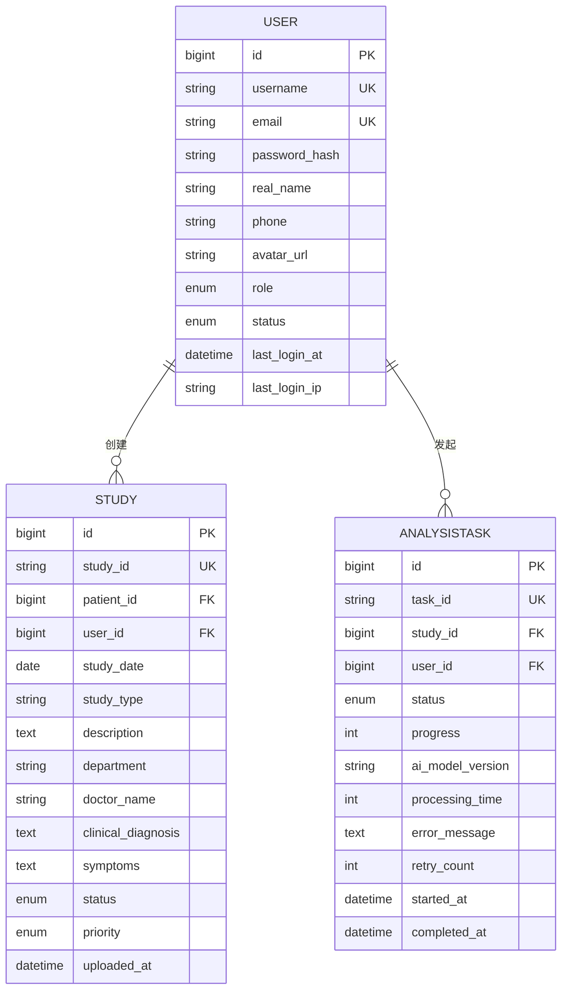
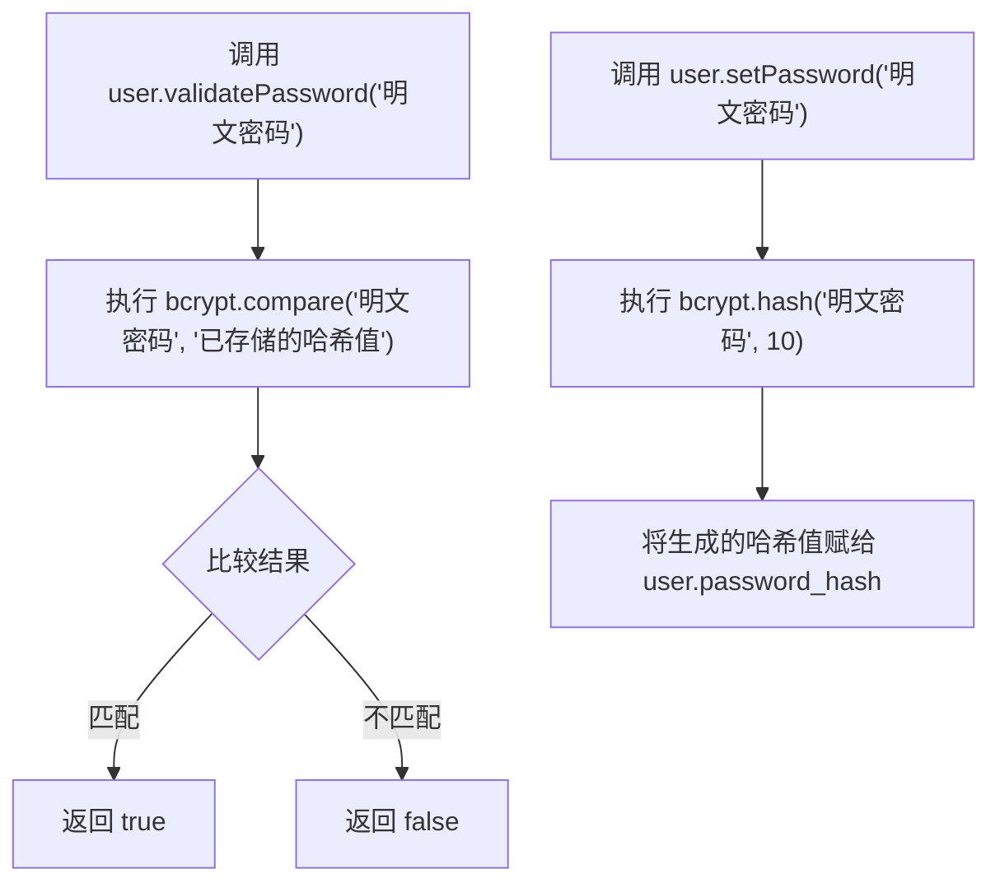
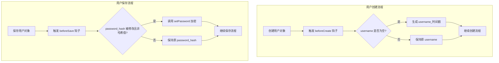

# 用户模型

<cite>
**Referenced Files in This Document**   
- [User.js](file://server/models/User.js)
- [Study.js](file://server/models/Study.js)
- [AnalysisTask.js](file://server/models/AnalysisTask.js)
- [index.js](file://server/models/index.js)
</cite>

## 目录
1. [字段定义](#字段定义)
2. [索引配置](#索引配置)
3. [关联关系](#关联关系)
4. [实例方法](#实例方法)
5. [模型钩子](#模型钩子)

## 字段定义

CervixDetectAI系统中的User模型定义了用户的核心属性，包含以下字段：

- **id**: BIGINT类型，作为主键，自动递增。
- **username**: STRING(50)类型，不允许为空，具有唯一性约束。
- **email**: STRING(100)类型，不允许为空，具有唯一性约束，并通过`isEmail: true`验证器确保邮箱格式正确。
- **password_hash**: STRING(255)类型，存储加密后的密码，不允许为空。
- **real_name**: STRING(100)类型，存储用户真实姓名，允许为空。
- **phone**: STRING(20)类型，存储用户手机号码，允许为空。
- **avatar_url**: STRING(500)类型，存储用户头像的URL地址，允许为空。
- **role**: ENUM枚举类型，可选值为'admin'、'doctor'、'user'，不允许为空，默认值为'user'。
- **status**: ENUM枚举类型，可选值为'active'、'disabled'，不允许为空，默认值为'active'。
- **last_login_at**: DATE类型，记录用户最后登录时间，允许为空。
- **last_login_ip**: STRING(45)类型，记录用户最后登录的IP地址，允许为空。

**Section sources**
- [User.js](file://server/models/User.js#L9-L59)

## 索引配置

User模型配置了多个数据库索引以优化查询性能：

- **唯一索引 (Unique Index)**:
  - 在`username`字段上创建唯一索引，确保用户名的全局唯一性。
  - 在`email`字段上创建唯一索引，确保邮箱地址的全局唯一性。

- **普通索引 (Regular Index)**:
  - 在`status`字段上创建索引，优化基于用户状态（如激活/禁用）的查询。
  - 在`created_at`字段上创建索引，优化基于用户创建时间的范围查询。

这些索引配置在模型定义的`indexes`数组中声明，有效提升了用户数据的检索效率。

**Section sources**
- [User.js](file://server/models/User.js#L64-L78)

## 关联关系

User模型通过Sequelize的关联功能与其他核心模型建立了明确的关系：

- **一对多关系 (hasMany)**:
  - `User.hasMany(Study)`: 一个用户可以创建多个病例（Study），通过`Study`模型中的`user_id`外键关联。
  - `User.hasMany(AnalysisTask)`: 一个用户可以发起多个分析任务（AnalysisTask），通过`AnalysisTask`模型中的`user_id`外键关联。

- **其他关联**:
  - `User.hasMany(UserAvatar)`: 一个用户可以拥有多个头像记录（UserAvatar），支持头像历史管理。
  - `User.hasMany(Patient)`: 一个用户（如医生）可以创建多个患者记录。

这些关联关系在`server/models/index.js`文件中集中定义，形成了系统数据模型的核心网络。

**Diagram sources**
- [index.js](file://server/models/index.js#L20-L21)
- [Study.js](file://server/models/Study.js#L28-L37)
- [AnalysisTask.js](file://server/models/AnalysisTask.js#L28-L37)

**Section sources**
- [index.js](file://server/models/index.js#L18-L25)

## 实例方法

User模型定义了两个关键的实例方法，用于处理用户密码相关的安全逻辑：

- **validatePassword(password)**:
  - 该方法用于验证用户提供的明文密码是否与存储的哈希值匹配。
  - 内部使用`bcrypt.compare`函数进行安全的密码比对，返回一个布尔值表示验证结果。

- **setPassword(password)**:
  - 该方法用于生成密码的哈希值并赋值给`password_hash`字段。
  - 内部使用`bcrypt.hash`函数，采用10轮哈希算法对明文密码进行加密。

这些方法封装了密码处理的复杂性，确保了密码在存储和验证过程中的安全性。

**Diagram sources**
- [User.js](file://server/models/User.js#L83-L91)

**Section sources**
- [User.js](file://server/models/User.js#L83-L91)

## 模型钩子

User模型利用Sequelize的钩子（Hooks）机制，在数据持久化前后自动执行特定逻辑：

- **beforeCreate Hook**:
  - 在创建新用户记录之前触发。
  - 如果用户未提供用户名（`username`），则自动生成一个基于时间戳的唯一用户名（如`user_1712345678`）。
  - 确保了每个用户都有一个有效的用户名。

- **beforeSave Hook**:
  - 在保存用户记录（创建或更新）之前触发。
  - 检查`password_hash`字段是否被修改且不是以`$2`开头（bcrypt哈希的标识）。
  - 如果条件满足，则自动调用`setPassword`方法对新密码进行哈希加密。
  - 这个钩子确保了密码在存储前始终是加密的，即使在更新用户信息时修改了密码。

这些钩子机制实现了业务逻辑的自动化，保证了数据的完整性和安全性。

**Diagram sources**
- [User.js](file://server/models/User.js#L93-L106)

**Section sources**
- [User.js](file://server/models/User.js#L93-L106)