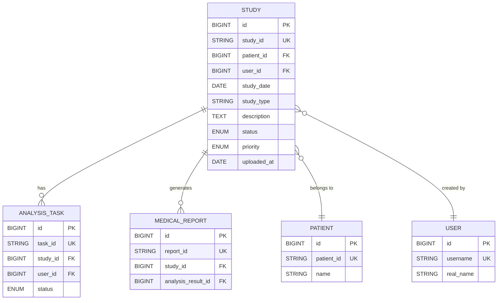

# 病例模型

<cite>
**本文档引用的文件**
- [Study.js](file://server/models/Study.js)
- [Patient.js](file://server/models/Patient.js)
- [User.js](file://server/models/User.js)
- [AnalysisTask.js](file://server/models/AnalysisTask.js)
- [MedicalReport.js](file://server/models/MedicalReport.js)
- [index.js](file://server/models/index.js)
</cite>

## 目录
1. [字段定义](#字段定义)
2. [索引配置](#索引配置)
3. [模型关联关系](#模型关联关系)
4. [创建钩子逻辑](#创建钩子逻辑)

## 字段定义

病例（Study）模型包含以下字段，用于存储宫颈检测相关的病例信息：

- **id**：`BIGINT` 类型，主键，自增，唯一标识每条病例记录。
- **study_id**：`STRING(50)` 类型，不可为空，唯一约束，存储病例的全局唯一标识符。
- **patient_id**：`BIGINT` 类型，不可为空，外键引用 `patients` 表的 `id` 字段，`ON UPDATE CASCADE`，`ON DELETE RESTRICT`，关联患者信息。
- **user_id**：`BIGINT` 类型，不可为空，外键引用 `users` 表的 `id` 字段，`ON UPDATE CASCADE`，`ON DELETE RESTRICT`，关联创建病例的用户。
- **study_date**：`DATE` 类型，不可为空，存储检查的日期。
- **study_type**：`STRING(50)` 类型，不可为空，存储检查类型（如宫颈细胞学检查、阴道镜检查等）。
- **description**：`TEXT` 类型，可为空，存储病例的描述信息。
- **department**：`STRING(100)` 类型，可为空，存储科室信息。
- **doctor_name**：`STRING(100)` 类型，可为空，存储医生姓名。
- **clinical_diagnosis**：`TEXT` 类型，可为空，存储临床诊断信息。
- **symptoms**：`TEXT` 类型，可为空，存储症状描述。
- **status**：`ENUM('pending', 'uploaded', 'processing', 'completed', 'failed')` 类型，不可为空，默认值为 `'pending'`，表示病例的处理状态。
- **priority**：`ENUM('normal', 'urgent', 'emergency')` 类型，不可为空，默认值为 `'normal'`，表示病例的优先级。
- **uploaded_at**：`DATE` 类型，不可为空，默认值为 `DataTypes.NOW`，记录病例上传的时间。

**Section sources**
- [Study.js](file://server/models/Study.js#L8-L85)

## 索引配置

为优化查询性能，病例模型配置了以下索引：

- **唯一索引**：在 `study_id` 字段上创建唯一索引，确保病例ID的全局唯一性。
- **单字段索引**：在 `patient_id` 和 `user_id` 字段上分别创建索引，加速基于患者和用户的查询。
- **复合索引**：
  - 在 `patient_id` 和 `study_date` 字段上创建复合索引，优化按患者和日期范围查询的性能。
  - 在 `status` 和 `created_at` 字段上创建复合索引，优化按状态和创建时间排序或筛选的查询效率。

**Section sources**
- [Study.js](file://server/models/Study.js#L89-L105)

## 模型关联关系

病例模型（Study）与其他核心模型建立了明确的关联关系，形成完整的数据链路：

- **与患者模型（Patient）**：`Study.belongsTo(Patient, { foreignKey: 'patient_id', as: 'patient' })`，表示一个病例属于一个患者，通过 `patient_id` 外键关联。
- **与用户模型（User）**：`Study.belongsTo(User, { foreignKey: 'user_id', as: 'creator' })`，表示一个病例由一个用户创建，通过 `user_id` 外键关联。
- **与分析任务模型（AnalysisTask）**：`Study.hasMany(AnalysisTask, { foreignKey: 'study_id', as: 'analysis_tasks' })`，表示一个病例可以关联多个分析任务。
- **与医疗报告模型（MedicalReport）**：`Study.hasMany(MedicalReport, { foreignKey: 'study_id', as: 'reports' })`，表示一个病例可以生成多份医疗报告。

这些关联关系在 `server/models/index.js` 文件中通过 Sequelize 的 `belongsTo` 和 `hasMany` 方法定义，确保了数据的一致性和完整性。

**Diagram sources**
- [Study.js](file://server/models/Study.js#L18-L37)
- [index.js](file://server/models/index.js#L35-L40)

## 创建钩子逻辑

在创建病例记录时，系统通过 `beforeCreate` 钩子自动为 `study_id` 字段生成唯一的序列号。该逻辑的实现步骤如下：

1. 获取当前日期，格式化为 `YYYYMMDD` 的字符串（例如 `20231015`）。
2. 使用 Sequelize 的 `count` 方法查询数据库中当天（即 `study_id` 以 `S${dateStr}` 开头）已存在的病例数量。
3. 将查询到的数量加一，并格式化为6位数字的序列号（不足位数用0填充）。
4. 将前缀 `S`、日期字符串和序列号拼接，形成最终的 `study_id`（例如 `S20231015000001`）。

此机制确保了每个工作日内生成的病例ID具有连续性和唯一性，便于管理和追溯。

**Section sources**
- [Study.js](file://server/models/Study.js#L111-L127)