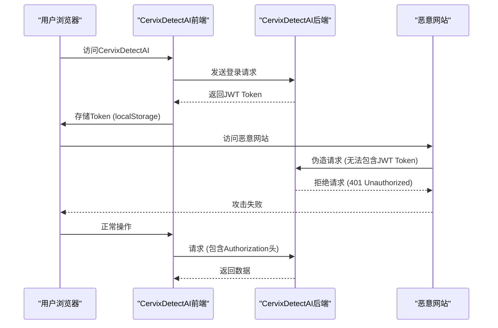
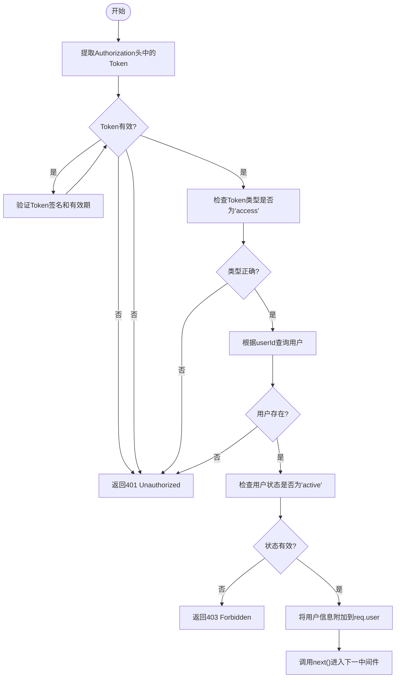
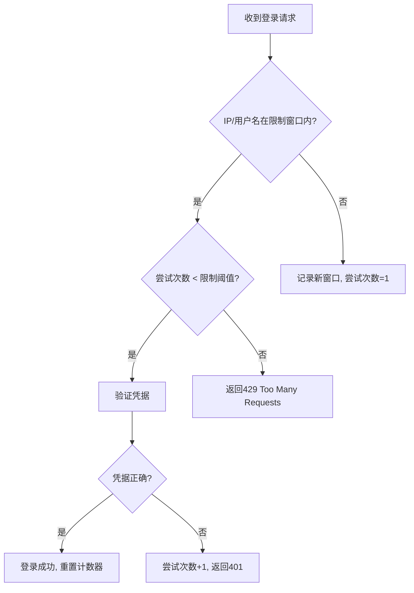

# Web攻击防护

> **Referenced Files in This Document**   
> - [server/middleware/auth.js](file://server/middleware/auth.js)
> - [server/utils/jwt.js](file://server/utils/jwt.js)
> - [server/routes/sms-auth.js](file://server/routes/sms-auth.js)
> - [src/pages/LoginPage.vue](file://src/pages/LoginPage.vue)
> - [src/pages/RegisterPage.vue](file://src/pages/RegisterPage.vue)
> - [src/stores/authStore.ts](file://src/stores/authStore.ts)
> - [server/routes/auth.js](file://server/routes/auth.js)

## Table of Contents
1. [XSS攻击防护](#xss攻击防护)
2. [CSRF攻击防护](#csrf攻击防护)
3. [认证与授权安全](#认证与授权安全)
4. [速率限制与防暴力破解](#速率限制与防暴力破解)
5. [安全审计检查清单](#安全审计检查清单)

## XSS攻击防护

CervixDetectAI系统通过前端Vue框架的自动HTML转义机制和后端输入验证相结合的方式，有效防范跨站脚本（XSS）攻击。

在前端层面，系统采用Vue 3框架，该框架默认会对所有通过双大括号语法（`{{ }}`）插入的动态内容进行HTML转义。这意味着即使攻击者尝试注入恶意脚本，如``，这些内容也会被安全地转义为纯文本显示，而不会作为可执行的JavaScript代码运行。这种自动转义机制是Vue框架内置的安全特性，为系统提供了第一道防线。

在后端层面，系统通过严格的输入验证和过滤来进一步增强安全性。虽然在当前代码库中未发现显式的HTML标签过滤逻辑，但系统在关键接口中实施了输入验证。例如，在用户注册和登录接口中，对邮箱格式进行了正则表达式验证，确保输入符合标准邮箱格式。此外，系统在处理短信验证码发送时，对手机号进行了严格的格式验证，防止恶意输入。

**Section sources**
- [src/pages/LoginPage.vue](file://src/pages/LoginPage.vue#L36-L51)
- [src/pages/RegisterPage.vue](file://src/pages/RegisterPage.vue#L12-L27)
- [server/routes/auth.js](file://server/routes/auth.js#L38-L44)
- [server/routes/sms-auth.js](file://server/routes/sms-auth.js#L38-L43)

## CSRF攻击防护

CervixDetectAI系统通过基于Token的认证机制（JWT）天然地抵御跨站请求伪造（CSRF）攻击。

系统采用JSON Web Token（JWT）作为主要的认证方式。JWT是一种无状态的认证机制，客户端在登录成功后会收到一个加密的Token，后续所有请求都将此Token放在HTTP请求头的`Authorization`字段中（格式为`Bearer <token>`）。由于现代浏览器的同源策略（Same-Origin Policy）限制，第三方网站无法读取或修改其他源的HTTP请求头，因此攻击者无法获取用户的JWT Token，也就无法伪造经过认证的请求。

尽管JWT本身具备抗CSRF能力，系统仍建议在混合渲染场景或需要额外保护的情况下，结合使用SameSite Cookie策略。通过将认证相关的Cookie设置为`SameSite=Strict`或`SameSite=Lax`，可以防止浏览器在跨站请求中自动发送这些Cookie，从而进一步降低CSRF攻击的风险。

**Diagram sources **
- [server/utils/jwt.js](file://server/utils/jwt.js#L54-L60)
- [src/stores/authStore.ts](file://src/stores/authStore.ts#L49-L51)

**Section sources**
- [server/utils/jwt.js](file://server/utils/jwt.js#L54-L60)
- [src/stores/authStore.ts](file://src/stores/authStore.ts#L49-L51)

## 认证与授权安全

系统通过中间件`auth.js`中的`authenticate`函数实现严格的Token验证，确保只有经过认证的用户才能访问受保护的资源。

`authenticate`中间件的工作流程如下：首先从HTTP请求头中提取`Authorization`字段的JWT Token；然后调用`verifyToken`函数验证Token的签名和有效期；接着检查Token的类型是否为`access`（访问令牌），以区分于`refresh`（刷新令牌）；最后，根据Token中包含的用户ID查询数据库，获取用户信息并验证其账户状态是否为`active`。只有所有这些检查都通过，请求才会被传递给下一个处理函数，否则将返回相应的错误状态码。

此外，系统还实现了`authorize`中间件，用于基于角色的访问控制（RBAC）。该中间件检查已认证用户的角色是否在允许的列表中，从而实现细粒度的权限管理。

**Diagram sources **
- [server/middleware/auth.js](file://server/middleware/auth.js#L8-L65)

**Section sources**
- [server/middleware/auth.js](file://server/middleware/auth.js#L8-L65)
- [server/utils/jwt.js](file://server/utils/jwt.js#L43-L48)

## 速率限制与防暴力破解

当前系统在敏感接口上存在速率限制缺失的风险，建议立即实施限流保护以防御暴力破解和短信轰炸攻击。

分析代码发现，系统在短信验证码发送接口（`/api/auth/sms/send-code`）中已经实现了较为完善的速率限制策略，包括：
- **发送间隔限制**：同一手机号60秒内只能发送一次验证码
- **每日发送上限**：同一手机号每天最多发送10次验证码
- **类型验证**：严格验证验证码类型（登录、注册、重置密码）

然而，对于传统的邮箱/密码登录接口（`/api/auth/login`），系统目前缺乏类似的速率限制机制。这使得攻击者可以利用自动化工具对特定用户账户进行无限次的密码尝试，从而实施暴力破解攻击。同样，注册接口也存在被滥用的风险。

建议在`/api/auth/login`和`/api/auth/register`等敏感接口上添加速率限制。可以采用基于IP地址或用户名的限流策略，例如：
- 每个IP地址每分钟最多尝试5次登录
- 每个用户名每小时最多尝试10次登录
- 连续失败5次后，账户锁定15分钟

**Section sources**
- [server/routes/sms-auth.js](file://server/routes/sms-auth.js#L53-L92)
- [server/routes/auth.js](file://server/routes/auth.js#L112-L189)

## 安全审计检查清单

为确保CervixDetectAI系统的安全性，建议执行以下安全审计和测试：

1. **XSS攻击模拟测试**
   - 在所有用户输入字段（如用户名、邮箱、姓名）中尝试注入``等恶意脚本
   - 验证前端是否正确转义并显示为纯文本
   - 检查HTTP响应头是否包含`Content-Security-Policy`等安全策略

2. **CSRF攻击模拟测试**
   - 创建一个恶意HTML页面，尝试通过表单提交向`/api/auth/logout`等接口发送POST请求
   - 验证请求是否因缺少JWT Token而被拒绝
   - 检查Cookie是否设置了`SameSite`属性

3. **认证安全测试**
   - 尝试使用过期或无效的JWT Token访问受保护的API
   - 验证系统是否正确返回401状态码
   - 尝试使用`refresh`类型的Token访问需要`access` Token的接口
   - 验证系统是否正确拒绝

4. **速率限制测试**
   - 对`/api/auth/login`接口进行自动化脚本攻击，尝试100次错误密码
   - 验证系统是否实施了速率限制（当前应失败，证明需要添加）
   - 对`/api/auth/sms/send-code`接口进行高频调用测试
   - 验证60秒间隔和每日10次的限制是否生效

5. **输入验证测试**
   - 在手机号字段输入非数字字符或超长字符串
   - 验证系统是否返回400 Bad Request
   - 在邮箱字段输入格式错误的邮箱地址
   - 验证系统是否正确识别并拒绝

6. **安全配置审查**
   - 检查`.env`文件中的`JWT_SECRET`是否为强随机密钥，而非默认值
   - 验证生产环境中是否启用了HTTPS
   - 检查服务器是否配置了适当的安全HTTP头（如`X-Content-Type-Options`, `X-Frame-Options`）

**Section sources**
- [server/middleware/auth.js](file://server/middleware/auth.js#L8-L65)
- [server/routes/sms-auth.js](file://server/routes/sms-auth.js#L26-L164)
- [server/routes/auth.js](file://server/routes/auth.js#L112-L189)
- [src/pages/LoginPage.vue](file://src/pages/LoginPage.vue#L34-L82)
- [src/stores/authStore.ts](file://src/stores/authStore.ts#L36-L63)