# 安全考虑

> **本文档引用的文件**
> - [jwt.js](file://server/utils/jwt.js)
> - [auth.js](file://server/routes/auth.js)
> - [auth.js](file://server/middleware/auth.js)
> - [.env](file://server/.env)
> - [database.js](file://server/config/database.js)
> - [User.js](file://server/models/User.js)
> - [api.ts](file://src/services/api.ts)
> - [authStore.ts](file://src/stores/authStore.ts)

## 目录
1. [JWT双Token机制](#jwt双token机制)
2. [数据验证与注入防护](#数据验证与注入防护)
3. [Web攻击防护机制](#web攻击防护机制)
4. [敏感信息保护](#敏感信息保护)
5. [生产环境安全配置](#生产环境安全配置)

## JWT双Token机制

CervixDetectAI系统采用JWT双Token机制（accessToken和refreshToken）来实现安全的用户认证和会话管理。该机制通过分离短期访问令牌和长期刷新令牌，有效平衡了安全性与用户体验。

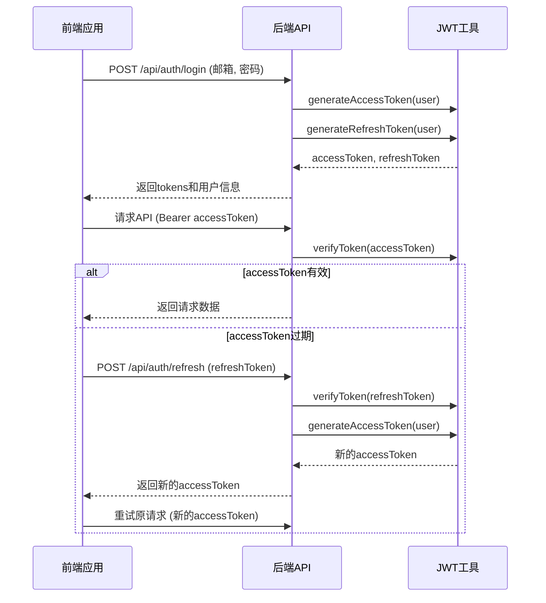

**图示来源**
- [jwt.js](file://server/utils/jwt.js#L12-L38)
- [auth.js](file://server/routes/auth.js#L160-L162)
- [auth.js](file://server/routes/auth.js#L195-L241)
- [api.ts](file://src/services/api.ts#L93-L95)

### 访问令牌(accessToken)实现

访问令牌用于短期API请求认证，具有较短的有效期以降低安全风险。系统通过`generateAccessToken`函数生成包含用户关键信息的JWT令牌。

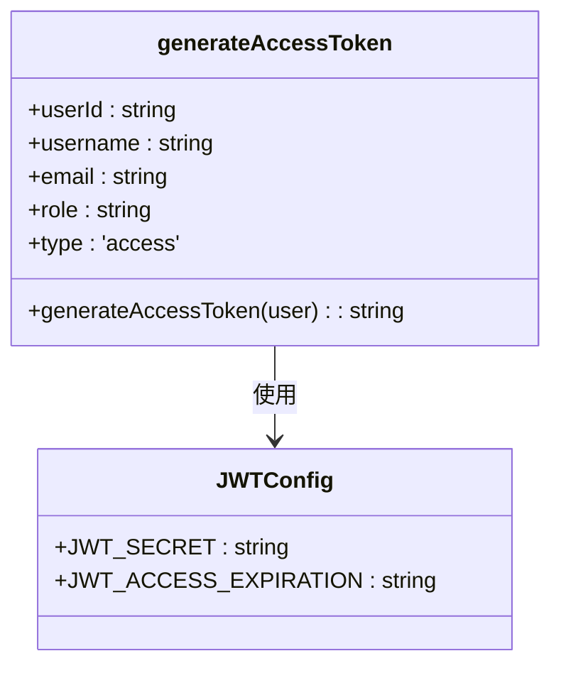

**图示来源**
- [jwt.js](file://server/utils/jwt.js#L12-L23)

### 刷新令牌(refreshToken)实现

刷新令牌用于在访问令牌过期后获取新的访问令牌，避免用户频繁重新登录。刷新令牌具有较长的有效期，但仅用于特定的刷新接口。

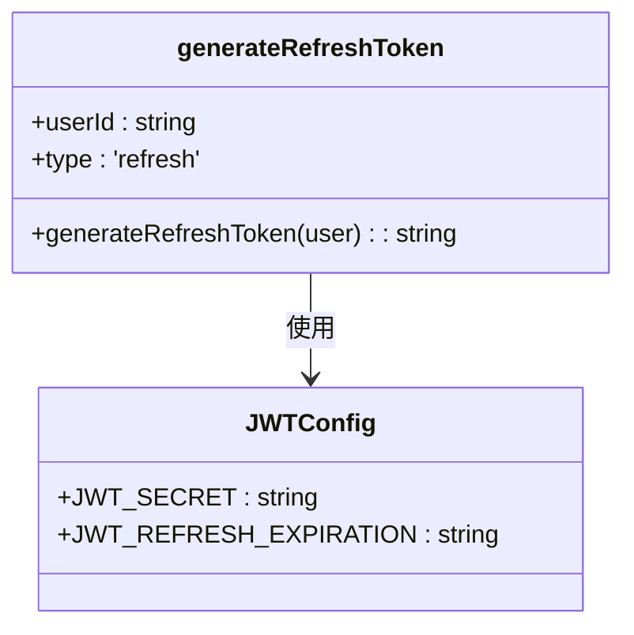

**图示来源**
- [jwt.js](file://server/utils/jwt.js#L29-L37)

### Token刷新机制

系统实现了自动化的Token刷新机制，当前端检测到accessToken过期时，会自动使用refreshToken获取新的accessToken，确保用户体验的连续性。

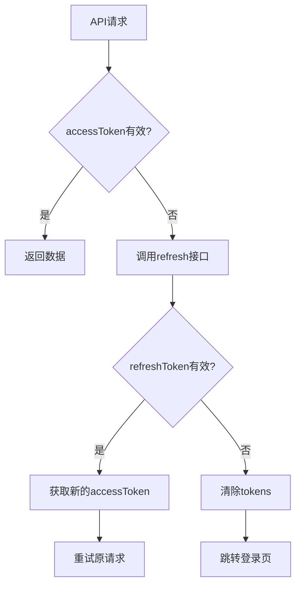

**图示来源**
- [auth.js](file://server/routes/auth.js#L195-L241)
- [api.ts](file://src/services/api.ts#L51-L57)

**本节来源**
- [jwt.js](file://server/utils/jwt.js#L12-L67)
- [auth.js](file://server/routes/auth.js#L195-L271)
- [api.ts](file://src/services/api.ts#L51-L57)

## 数据验证与注入防护

系统通过多层次的数据验证机制防止SQL注入和其他数据注入攻击，确保用户输入的安全性。

### Sequelize模型验证

用户模型（User）在数据库层面实现了严格的字段验证，包括邮箱格式验证和唯一性约束，从源头防止无效或恶意数据的注入。

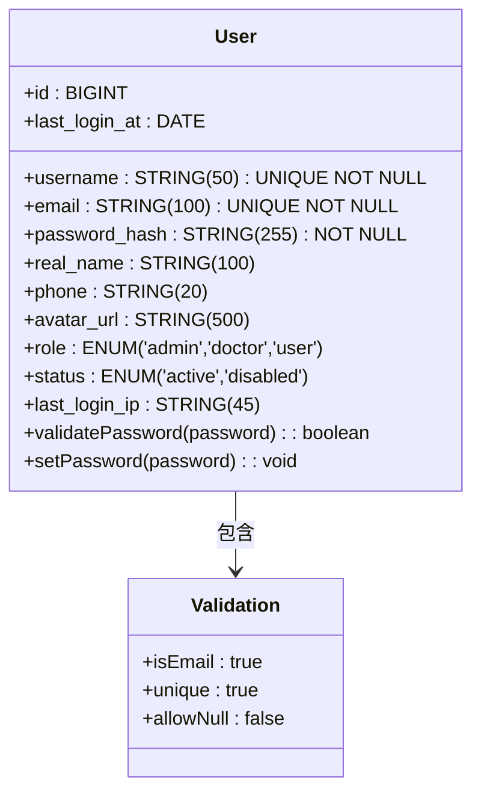

**图示来源**
- [User.js](file://server/models/User.js#L9-L52)

### 请求参数校验

在API路由层面，系统对所有关键请求参数进行严格的校验，包括必填字段检查、长度验证和格式验证，有效防止恶意输入。

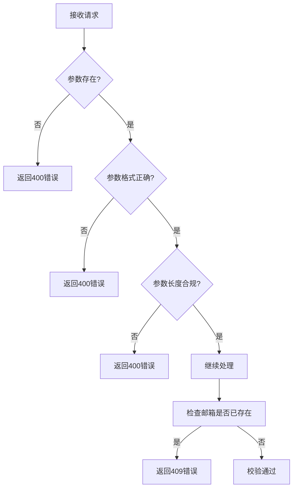

**图示来源**
- [auth.js](file://server/routes/auth.js#L21-L44)
- [auth.js](file://server/routes/auth.js#L116-L122)

### 密码安全处理

系统采用bcrypt算法对用户密码进行哈希处理，确保即使数据库泄露，攻击者也无法轻易获取原始密码。

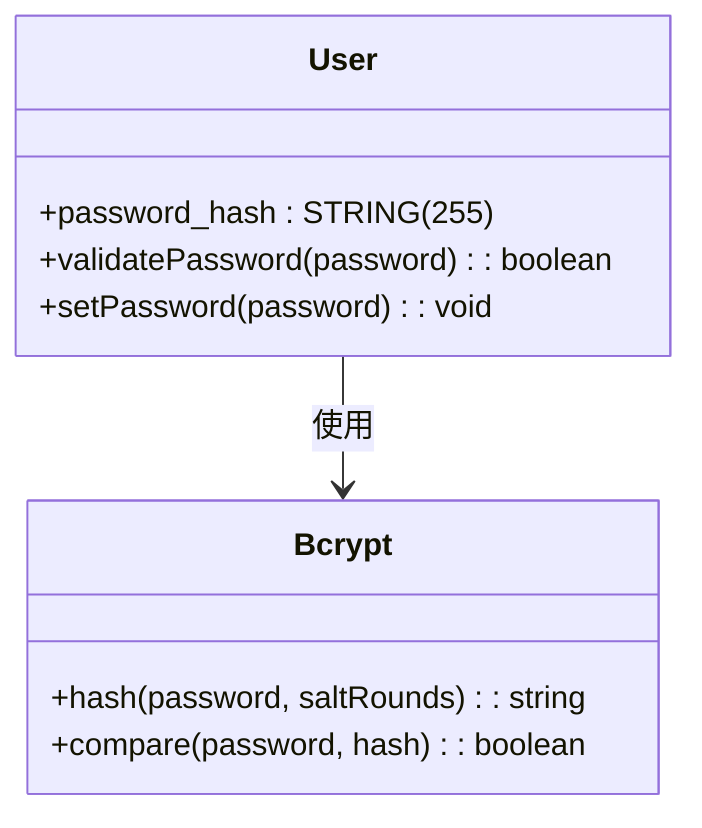

**图示来源**
- [User.js](file://server/models/User.js#L83-L91)
- [User.js](file://server/models/User.js#L101-L105)

**本节来源**
- [User.js](file://server/models/User.js#L23-L25)
- [auth.js](file://server/routes/auth.js#L29-L35)
- [auth.js](file://server/routes/auth.js#L134-L139)

## Web攻击防护机制

系统通过中间件和输入过滤机制防范常见的Web攻击，包括XSS和CSRF等。

### 认证中间件防护

认证中间件（authenticate）在每个受保护的路由前执行，验证JWT令牌的有效性，防止未授权访问。

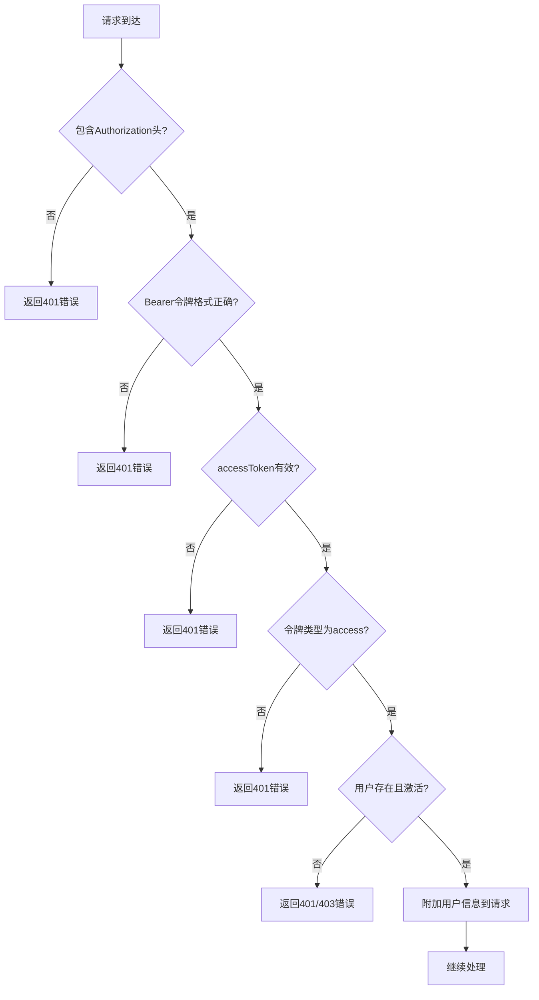

**图示来源**
- [auth.js](file://server/middleware/auth.js#L8-L64)

### 角色授权中间件

系统实现了基于角色的访问控制（RBAC），通过authorize中间件确保用户只能访问其权限范围内的资源。

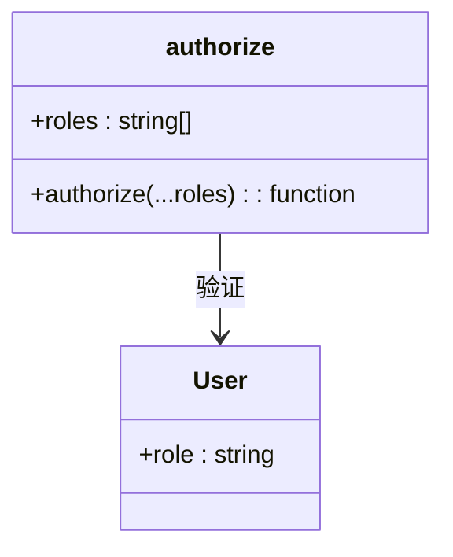

**图示来源**
- [auth.js](file://server/middleware/auth.js#L71-L88)

### 输入过滤与验证

系统对所有用户输入进行严格的过滤和验证，防止XSS等攻击。例如，在用户注册和登录时对邮箱格式进行正则验证。

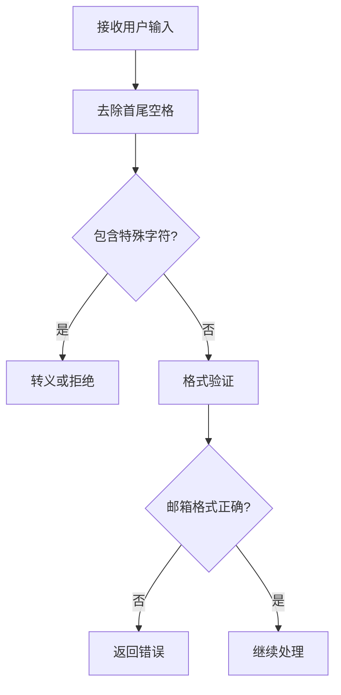

**图示来源**
- [auth.js](file://server/routes/auth.js#L38-L43)

**本节来源**
- [auth.js](file://server/middleware/auth.js#L8-L124)
- [auth.js](file://server/routes/auth.js#L38-L43)

## 敏感信息保护

系统通过环境变量和配置文件管理敏感信息，确保密钥和密码等机密数据的安全。

### 环境变量配置

所有敏感信息均存储在`.env`文件中，通过环境变量加载，避免硬编码在源代码中。

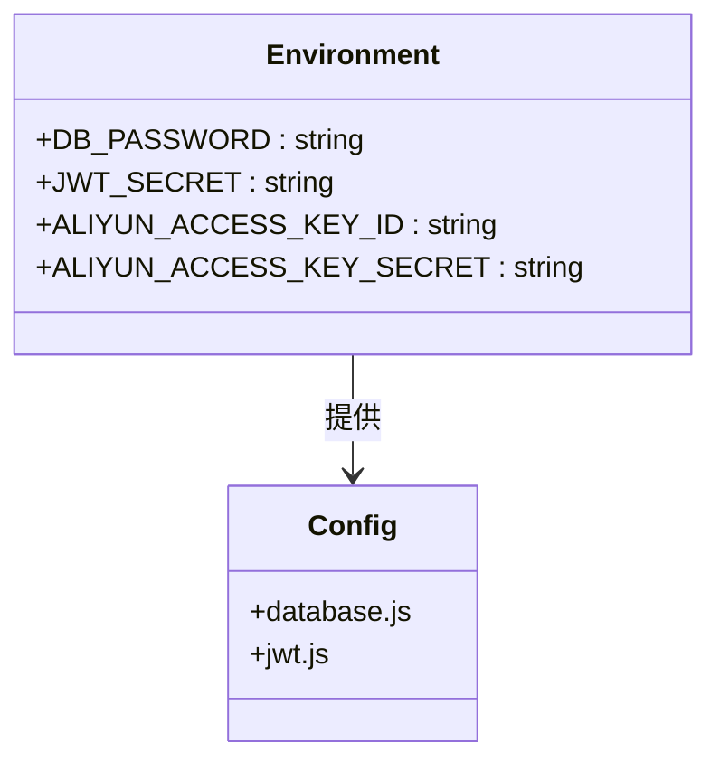

**图示来源**
- [.env](file://server/.env)
- [database.js](file://server/config/database.js#L6-L8)
- [jwt.js](file://server/utils/jwt.js#L5-L7)

### 敏感信息清单

系统中保护的敏感信息包括：

| 信息类型 | 环境变量 | 用途 |
|---------|---------|------|
| 数据库密码 | DB_PASSWORD | 数据库连接认证 |
| JWT密钥 | JWT_SECRET | JWT令牌签名 |
| 阿里云AccessKey ID | ALIYUN_ACCESS_KEY_ID | 阿里云服务认证 |
| 阿里云AccessKey Secret | ALIYUN_ACCESS_KEY_SECRET | 阿里云服务认证 |

**本节来源**
- [.env](file://server/.env)
- [database.js](file://server/config/database.js)
- [jwt.js](file://server/utils/jwt.js)

## 生产环境安全配置

为确保生产环境的安全性，系统提供了详细的配置建议和最佳实践。

### JWT配置最佳实践

生产环境中应使用强密钥和合理的过期策略：

```env
# JWT配置
JWT_SECRET=your-secret-key-change-in-production-min-128-bits
JWT_ACCESS_EXPIRATION=1h
JWT_REFRESH_EXPIRATION=7d
```

**本节来源**
- [.env](file://server/.env#L25-L27)
- [README.md](file://README.md#L474-L475)

### 数据库安全配置

数据库连接应使用专用账户，并限制权限：

```env
# 数据库配置
DB_HOST=localhost
DB_PORT=3306
DB_USER=app_user
DB_PASSWORD=strong_password
DB_NAME=cervix_detect_ai
```

**本节来源**
- [.env](file://server/.env#L18-L22)
- [database.js](file://server/config/database.js)

### 生产环境部署建议

1. **禁用调试信息**：在生产环境中禁用详细的错误堆栈信息
2. **使用HTTPS**：确保所有API通信通过HTTPS加密
3. **定期轮换密钥**：定期更新JWT密钥和云服务密钥
4. **监控和日志**：实施安全监控和日志审计
5. **备份策略**：定期备份数据库和关键配置

**本节来源**
- [README.md](file://README.md#L463-L485)
- [.env](file://server/.env)