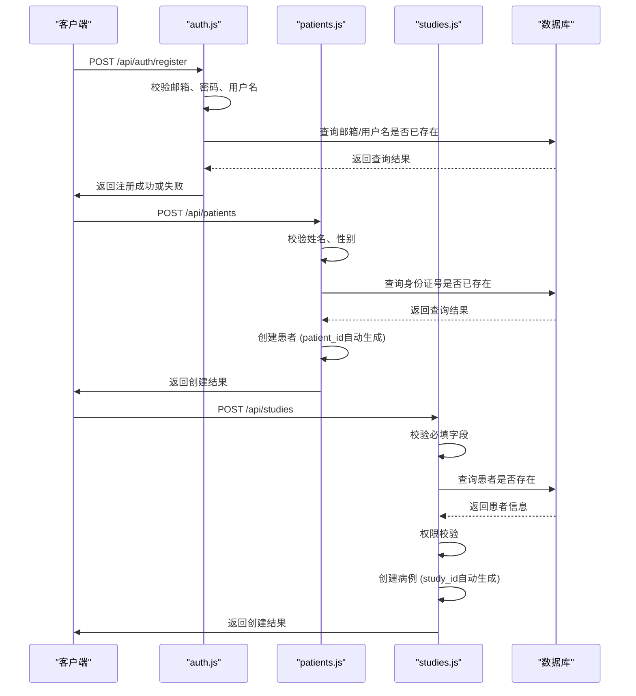

# 数据验证

<cite>
**本文档中引用的文件**  
- [User.js](file://server/models/User.js)
- [Patient.js](file://server/models/Patient.js)
- [Study.js](file://server/models/Study.js)
- [auth.js](file://server/routes/auth.js)
- [patients.js](file://server/routes/patients.js)
- [studies.js](file://server/routes/studies.js)
- [sms-auth.js](file://server/routes/sms-auth.js)
- [auth.js](file://server/middleware/auth.js)
</cite>

## 目录
1. [引言](#引言)
2. [模型层数据验证机制](#模型层数据验证机制)
3. [API路由层请求参数校验](#api路由层请求参数校验)
4. [安全防护与攻击向量拦截](#安全防护与攻击向量拦截)
5. [统一错误响应格式](#统一错误响应格式)
6. [添加新验证规则的最佳实践](#添加新验证规则的最佳实践)

## 引言
CervixDetectAI系统通过多层次的数据验证机制确保数据完整性、安全性和用户体验。该机制覆盖从数据库模型定义到API接口请求处理的全链路，结合Sequelize ORM的字段约束、自定义验证规则以及中间件层的显式校验逻辑，有效防止非法数据写入数据库，并抵御常见安全威胁如SQL注入和XSS攻击。本文系统性地描述该验证体系的设计与实现。

## 模型层数据验证机制

CervixDetectAI使用Sequelize ORM在模型定义层面实施严格的数据类型、长度、唯一性及自定义格式约束，确保数据库层面的数据一致性。

### 用户模型（User.js）验证规则
用户模型定义了邮箱、用户名等关键字段的约束：
- **数据类型与长度**：`email`字段为`STRING(100)`，`username`为`STRING(50)`。
- **唯一性约束**：`email`和`username`字段均设置`unique: true`，防止重复注册。
- **自定义验证**：`email`字段通过`validate: { isEmail: true }`确保符合邮箱格式。
- **枚举值控制**：`role`字段限定为`'admin', 'doctor', 'user'`，`status`字段限定为`'active', 'disabled'`。

### 患者模型（Patient.js）验证规则
患者模型对敏感信息和业务标识进行严格校验：
- **业务ID唯一性**：`patient_id`字段设置`unique: true`，并通过`beforeCreate` Hook自动生成全局唯一ID。
- **必填字段**：`name`和`gender`字段设置`allowNull: false`。
- **枚举值**：`gender`字段限定为`'male', 'female', 'other'`。
- **身份证号唯一性**：虽然`id_card`字段未在模型中设为唯一，但在业务逻辑层（`patients.js`）通过查询确保其唯一性。

### 病例模型（Study.js）验证规则
病例模型确保医疗数据的准确性和关联性：
- **业务ID唯一性**：`study_id`字段设置`unique: true`，并通过`beforeCreate` Hook按日期生成序列化编号。
- **外键约束**：`patient_id`和`user_id`字段均设置`references`，确保关联记录存在，`onDelete: 'RESTRICT'`防止误删关联数据。
- **枚举值控制**：`status`字段限定为`'pending', 'uploaded', 'processing', 'completed', 'failed'`，`priority`字段限定为`'normal', 'urgent', 'emergency'`。
- **默认值**：`status`和`priority`字段设置`defaultValue`，保证数据完整性。

**Section sources**
- [User.js](file://server/models/User.js#L1-L109)
- [Patient.js](file://server/models/Patient.js#L1-L103)
- [Study.js](file://server/models/Study.js#L1-L131)

## API路由层请求参数校验

在API路由层，系统对请求参数进行显式校验，作为模型层验证的前置防线，提升错误反馈的及时性和准确性。

### 认证接口（auth.js）校验
用户注册和登录接口实施严格的参数检查：
- **必填字段**：`/register`和`/login`接口均校验`email`和`password`是否为空。
- **密码强度**：注册时检查密码长度是否至少6位。
- **邮箱格式**：使用正则表达式`/^[^\s@]+@[^\s@]+\.[^\s@]+$/`验证邮箱格式。
- **唯一性检查**：注册时查询数据库，确保邮箱和用户名未被占用。

### 患者管理接口（patients.js）校验
患者创建和更新接口包含业务逻辑校验：
- **必填字段**：创建患者时校验`name`和`gender`。
- **身份唯一性**：创建和更新患者时，若提供`id_card`，则检查其是否已存在。
- **权限控制**：非管理员用户只能操作自己创建的患者记录。

### 病例创建接口（studies.js）校验
创建病例接口确保数据完整且符合业务规则：
- **必填字段**：校验`patient_id`, `study_date`, `study_type`是否存在。
- **关联存在性**：通过`Patient.findByPk(patient_id)`验证患者是否存在。
- **权限校验**：非管理员用户只能为自己的患者创建病例。

**Diagram sources**
- [auth.js](file://server/routes/auth.js#L1-L306)
- [patients.js](file://server/routes/patients.js#L1-L358)
- [studies.js](file://server/routes/studies.js#L1-L96)

**Section sources**
- [auth.js](file://server/routes/auth.js#L1-L306)
- [patients.js](file://server/routes/patients.js#L1-L358)
- [studies.js](file://server/routes/studies.js#L1-L96)

## 安全防护与攻击向量拦截

系统通过中间件和业务逻辑层的前置校验，有效阻止SQL注入和XSS等攻击向量。

### JWT认证中间件（auth.js）防护
认证中间件`authenticate`在业务逻辑前执行，提供基础安全屏障：
- **令牌验证**：提取并验证JWT令牌的有效性、类型和过期时间。
- **用户状态检查**：拒绝已禁用（`disabled`）或未激活账户的访问。
- **输入净化**：通过`verifyToken`函数解析令牌，避免直接处理原始输入。

### 业务逻辑层输入过滤
在关键业务操作中，系统对输入进行深度校验：
- **手机号注册防护**：在`sms-auth.js`中，注册时检查手机号、邮箱是否已被占用，并验证邮箱格式。
- **防止XSS**：虽然未在代码中显式展示，但框架（如Express）通常会处理基础的XSS防护，且敏感字段（如`description`）在前端展示时应进行HTML转义。
- **参数化查询**：Sequelize ORM自动使用参数化查询，从根本上防止SQL注入。

**Section sources**
- [auth.js](file://server/middleware/auth.js#L1-L125)
- [sms-auth.js](file://server/routes/sms-auth.js#L296-L333)

## 统一错误响应格式

系统采用统一的JSON响应格式，提升API的可预测性和用户体验。

### 响应结构
所有API响应遵循`{ success: boolean, message: string, data?: any }`结构：
- **`success: false`**：表示操作失败。
- **`message`**：提供清晰、用户友好的错误详情，如“邮箱或密码错误”、“患者不存在”。
- **HTTP状态码**：配合语义化的HTTP状态码（如400、401、403、404、409、500），便于客户端处理。

### 优势
- **提升用户体验**：用户能立即理解失败原因，无需猜测。
- **增强系统健壮性**：标准化的错误处理流程减少异常情况下的系统崩溃风险。
- **简化客户端开发**：前端可以统一处理所有API的错误响应，无需为每个接口编写特殊逻辑。

**Section sources**
- [auth.js](file://server/routes/auth.js#L118-L121)
- [patients.js](file://server/routes/patients.js#L31-L33)
- [studies.js](file://server/routes/studies.js#L61-L64)

## 添加新验证规则的最佳实践

为系统添加新的数据验证规则时，应遵循分层防御和代码复用原则。

### 1. 优先在模型层定义约束
对于数据类型、长度、唯一性、外键等通用约束，应在Sequelize模型中定义。这能确保无论通过何种途径（API、脚本）写入数据，都能被统一校验。

### 2. 在路由层实现业务逻辑校验
涉及业务规则（如权限、状态流转、唯一性检查）的校验，应在API路由层实现。利用`async/await`进行数据库查询，并返回清晰的错误信息。

### 3. 复用中间件进行通用校验
将通用的校验逻辑（如ID格式、日期范围）封装成Express中间件，在多个路由中复用，避免代码重复。

### 4. 使用自定义验证函数
对于复杂校验（如手机号归属地、身份证号校验码），可编写独立的验证函数，并在模型的`validate`属性或路由层调用。

### 5. 保持错误信息一致性
所有错误信息应使用中文，并保持语气一致、描述准确，避免技术术语暴露给最终用户。