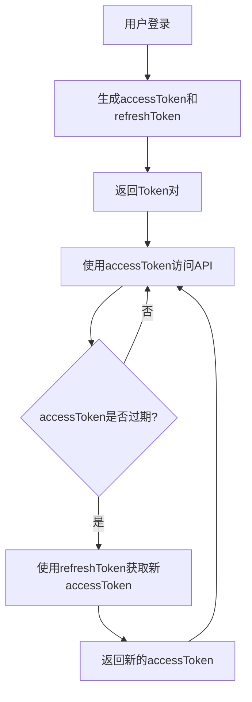
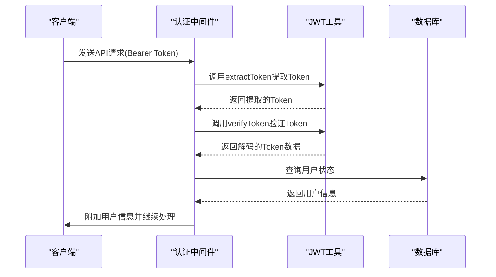
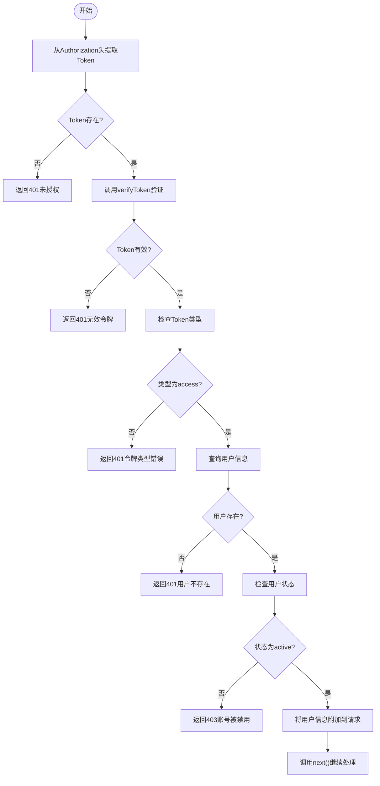
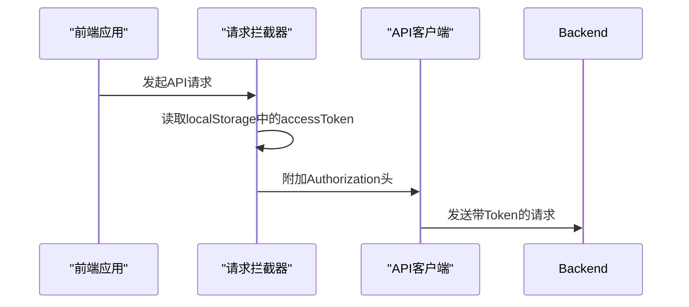
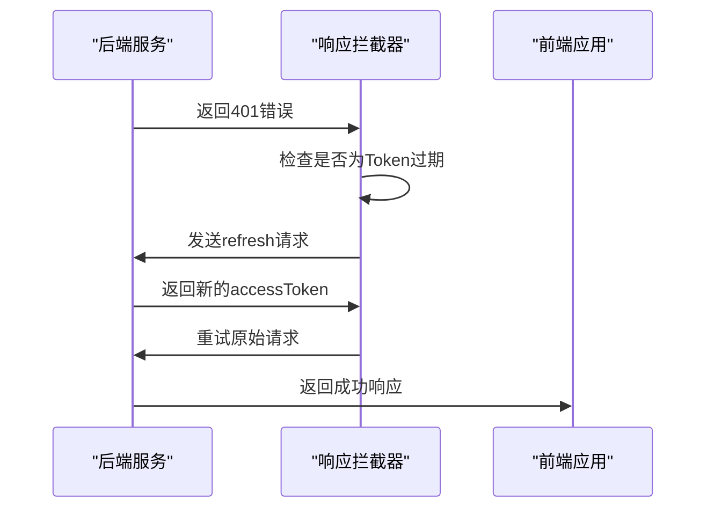
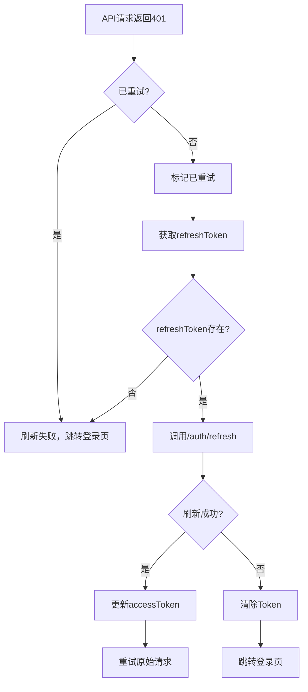

# 认证安全

> **本文档中引用的文件**   
> - [auth.js](file://server/middleware/auth.js)
> - [api.ts](file://src/services/api.ts)
> - [jwt.js](file://server/utils/jwt.js)
> - [auth.js](file://server/routes/auth.js)
> - [User.js](file://server/models/User.js)

## 目录
1. [引言](#引言)
2. [双Token认证机制](#双token认证机制)
3. [阿里云AI验证码机制](#阿里云ai验证码机制)
4. [Token验证流程](#token验证流程)
5. [前端拦截器实现](#前端拦截器实现)
6. [异常处理流程](#异常处理流程)
7. [安全建议](#安全建议)
8. [结论](#结论)

## 引言
CervixDetectAI系统采用JWT双Token认证机制，通过accessToken和refreshToken的组合实现安全的用户会话管理。该机制不仅提高了系统的安全性，还优化了用户体验。本文档深入分析该认证机制的实现细节，包括Token的生成、验证、刷新以及异常处理流程。

## 双Token认证机制

### accessToken与refreshToken策略
CervixDetectAI系统采用双Token认证机制，其中包含两种不同类型的JWT令牌：

- **accessToken**：短期有效的访问令牌，用于常规API请求的身份验证。根据系统配置，其有效期通常设置为1小时（可由环境变量`JWT_ACCESS_EXPIRATION`配置）。
- **refreshToken**：长期有效的刷新令牌，用于在accessToken过期后获取新的访问令牌。其有效期通常设置为7天（可由环境变量`JWT_REFRESH_EXPIRATION`配置）。

这种双Token机制有效防止了会话劫持攻击。即使攻击者获取了短期的accessToken，其有效期也很短，降低了安全风险。而refreshToken虽然有效期较长，但仅用于获取新的accessToken，不直接用于访问受保护的资源。

**Diagram sources**
- [jwt.js](file://server/utils/jwt.js#L5-L7)
- [auth.js](file://server/routes/auth.js#L160-L179)

**Section sources**
- [jwt.js](file://server/utils/jwt.js#L11-L38)
- [auth.js](file://server/routes/auth.js#L160-L179)

## 阿里云AI验证码机制

### 验证码安全验证
系统引入阿里云 Web端验证码2.0，构建双层安全防御体系：
- **登录/注册防护**：必须通过"一点即过"智能验证（Smart Captcha）才能提交表单，有效防止机器脚本撞库。
- **短信发送防护**：在发送短信验证码前，强制进行"图像复原"验证（Puzzle Captcha），大幅降低短信接口被滥刷风险。
- **双层验证闭环**：结合 AI 验证码与短信验证码，确保操作主体为真实用户。

### 验证场景配置
系统针对不同风险场景配置了差异化的验证策略：

| 场景 | 验证类型 | 场景ID (SceneId) | 触发时机 |
|------|----------|-------------------|----------|
| 登录/注册 | 一点即过 (Immediate) | `u1g43fza` | 点击登录/注册按钮时 |
| 短信发送 | 图像复原 (Puzzle) | `1dynwu1h` | 请求发送验证码前 |

### SDK 动态加载
为了防止前端代码篡改并确保使用最新安全策略：
- **动态引入**：验证码 SDK (`AliyunCaptcha.js`) 直接从阿里云 CDN (`https://o.alicdn.com/captcha-frontend/aliyunCaptcha/AliyunCaptcha.js`) 动态加载。
- **版本控制**：始终使用云端最新版本，实时同步阿里云的安全规则库更新。

## Token验证流程

### authenticate中间件分析
服务器端的认证流程由`server/middleware/auth.js`中的`authenticate`中间件处理。该中间件负责验证每个受保护API请求的合法性。

**Diagram sources**
- [auth.js](file://server/middleware/auth.js#L8-L57)
- [jwt.js](file://server/utils/jwt.js#L54-L60)

**Section sources**
- [auth.js](file://server/middleware/auth.js#L8-L64)
- [jwt.js](file://server/utils/jwt.js#L43-L48)

### 详细验证步骤
Token验证流程包含以下关键步骤：

1. **从请求头提取Token**：中间件首先从HTTP请求头的`Authorization`字段中提取Bearer Token。
2. **调用verifyToken解码**：使用`jsonwebtoken`库的`verify`方法对Token进行解码和验证，验证其签名的有效性。
3. **校验Token类型**：检查解码后Token的`type`字段，确保其为`access`类型，防止refreshToken被误用。
4. **查询数据库用户状态**：根据Token中的`userId`查询数据库，验证用户是否存在且状态为`active`。

**Diagram sources**
- [auth.js](file://server/middleware/auth.js#L8-L57)
- [jwt.js](file://server/utils/jwt.js#L43-L48)

**Section sources**
- [auth.js](file://server/middleware/auth.js#L8-L64)

## 前端拦截器实现

### 请求拦截器
前端通过`src/services/api.ts`中的axios拦截器自动处理认证逻辑。请求拦截器会在每个API请求发送前自动附加Authorization头。

**Diagram sources**
- [api.ts](file://src/services/api.ts#L18-L25)

**Section sources**
- [api.ts](file://src/services/api.ts#L18-L29)

### 响应拦截器
响应拦截器负责处理401错误并自动触发refreshToken机制。

**Diagram sources**
- [api.ts](file://src/services/api.ts#L32-L63)

**Section sources**
- [api.ts](file://src/services/api.ts#L32-L63)

## 异常处理流程

### Token过期处理
当accessToken过期时，系统会自动触发刷新机制。前端拦截器捕获401错误后，使用存储在localStorage中的refreshToken向`/auth/refresh`端点发起请求。

**Diagram sources**
- [api.ts](file://src/services/api.ts#L38-L58)
- [auth.js](file://server/routes/auth.js#L195-L242)

**Section sources**
- [api.ts](file://src/services/api.ts#L38-L58)
- [auth.js](file://server/routes/auth.js#L195-L242)

### 刷新失败降级
当refreshToken也过期或无效时，系统会执行降级处理：

1. 清除localStorage中存储的所有Token
2. 重定向用户到登录页面
3. 要求用户重新进行身份验证

此机制确保了系统的安全性，防止过期或无效的Token被继续使用。

## 安全建议

### 密钥管理
- **密钥长度**：JWT密钥应至少为128位（16字节），推荐使用256位或更长的密钥以提高安全性。
- **密钥存储**：密钥应通过环境变量`JWT_SECRET`配置，绝不应硬编码在代码中。生产环境中应使用强随机生成的密钥。

### 传输安全
- **HTTPS强制传输**：所有包含Token的通信必须通过HTTPS加密传输，防止中间人攻击和Token泄露。
- **避免URL参数传递**：Token不应通过URL参数传递，以防止被日志记录或浏览器历史记录保存。

### 存储方案
- **HttpOnly Cookie可选方案**：虽然当前系统使用localStorage存储Token，但可考虑使用HttpOnly Cookie作为更安全的替代方案，以防止XSS攻击窃取Token。
- **SameSite属性**：如果使用Cookie，应设置`SameSite=Strict`或`SameSite=Lax`属性，防止CSRF攻击。

### 其他安全措施
- **Token黑名单**：实现Token黑名单机制，允许在用户登出或怀疑Token泄露时使特定Token失效。
- **刷新Token轮换**：每次使用refreshToken获取新accessToken时，同时生成新的refreshToken，旧的refreshToken立即失效。

## 结论
CervixDetectAI的JWT双Token认证机制通过合理的Token生命周期管理和自动刷新机制，实现了安全性和用户体验的平衡。前端拦截器与后端中间件的协同工作确保了认证流程的无缝衔接。通过遵循本文档中的安全建议，可以进一步增强系统的安全性，有效防止会话劫持等常见安全威胁。