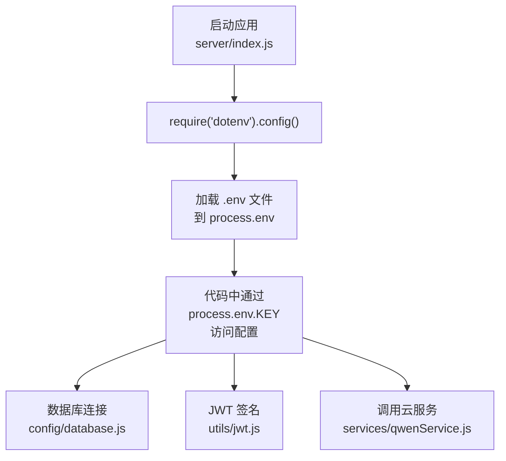

# 配置安全

> **Referenced Files in This Document**   
> - [server/.env](file://server/.env)
> - [server/config/database.js](file://server/config/database.js)
> - [server/utils/jwt.js](file://server/utils/jwt.js)
> - [server/services/qwenService.js](file://server/services/qwenService.js)
> - [server/middleware/auth.js](file://server/middleware/auth.js)
> - [server/config/sequelize.js](file://server/config/sequelize.js)
> - [server/index.js](file://server/index.js)
> - [.env](file://.env)

## 目录

1. [敏感配置项清单](#敏感配置项清单)
2. [环境变量加载机制](#环境变量加载机制)
3. [生产环境安全配置建议](#生产环境安全配置建议)
4. [前端配置安全](#前端配置安全)

## 敏感配置项清单

根据 `server/.env` 文件，CervixDetectAI 项目中包含以下敏感信息，这些信息绝不能硬编码在源代码中或提交至版本控制系统（如 Git）。

**Section sources**

- [server/.env](file://server/.env#L1-L34)

### 数据库凭证 (Database Credentials)

数据库连接信息是核心敏感数据，泄露可能导致数据被窃取、篡改或勒索。

- **`DB_USER`**: 数据库用户名，当前为 `root`。
- **`DB_PASSWORD`**: 数据库密码。
- **`DB_HOST`**: 数据库主机地址，当前为 `localhost`。
- **`DB_PORT`**: 数据库端口，当前为 `3306`。
- **`DB_NAME`**: 数据库名称，当前为 `cervix_detect_ai`。

### JWT 密钥 (JWT Secret)

用于生成和验证 JSON Web Tokens (JWT) 的密钥。一旦泄露，攻击者可以伪造任意用户的身份令牌，实现未授权访问。

- **`JWT_SECRET`**: JWT 签名密钥，当前为 `your-secret-key-change-in-production-min-128-bits`。这是一个占位符，必须在生产环境中替换为强随机密钥。

### 云服务密钥 (Cloud Service Keys)

用于调用第三方云服务的 API 密钥，通常与计费和核心功能绑定。

- **阿里云短信服务 (Aliyun SMS)**:
  - `ALIYUN_ACCESS_KEY_ID`: 访问密钥 ID。
  - `ALIYUN_ACCESS_KEY_SECRET`: 访问密钥密钥。
- **通义千问大模型 (Qwen AI)**:
  - `QWEN_API_KEY`: 大模型 API 密钥，当前为。

## 环境变量加载机制

项目通过 `dotenv` 库实现环境变量的安全加载，确保了不同环境（开发、测试、生产）的配置隔离。



**Diagram sources**

- [server/index.js](file://server/index.js#L2)
- [server/config/database.js](file://server/config/database.js#L2)
- [server/utils/jwt.js](file://server/utils/jwt.js#L5)
- [server/services/qwenService.js](file://server/services/qwenService.js#L37)

**Section sources**

- [server/index.js](file://server/index.js#L2)
- [server/config/database.js](file://server/config/database.js#L2)
- [server/utils/jwt.js](file://server/utils/jwt.js#L5)
- [server/services/qwenService.js](file://server/services/qwenService.js#L37)

### 工作流程

1. **应用启动**: 服务入口文件 `server/index.js` 在最开始处执行 `require('dotenv').config()`。
2. **加载配置**: `dotenv` 库会自动查找并读取项目根目录下的 `server/.env` 文件，将其内容解析并注入到 Node.js 的全局 `process.env` 对象中。
3. **按需使用**: 项目中的各个模块（如数据库配置、JWT 工具、云服务客户端）通过 `process.env.DB_PASSWORD`、`process.env.JWT_SECRET` 等方式安全地获取配置值，而无需在代码中暴露明文。

### 环境隔离

通过 `NODE_ENV` 环境变量，项目可以加载不同的配置逻辑。例如，在 `config/database.js` 中，代码会根据 `NODE_ENV` 的值选择 `development` 或 `production` 配置块，从而连接到不同环境的数据库。

## 生产环境安全配置建议

为了确保生产环境的安全，必须对 `server/.env` 文件进行严格的安全加固。

**Section sources**

- [server/.env](file://server/.env#L1-L34)

### 1. 生成强随机密钥

所有密钥必须使用强随机算法生成，避免使用弱口令或可预测的字符串。

- **JWT 密钥**: 使用以下命令生成一个 256 位（32 字节）的强密钥：
  ```bash
  openssl rand -base64 32
  ```

  将生成的字符串替换 `JWT_SECRET` 的值。

### 2. 限制数据库用户权限

生产数据库的用户应遵循最小权限原则。

- 创建一个专用的数据库用户（如 `cervix_app`），而非使用 `root` 账户。
- 仅授予该用户对 `cervix_detect_ai` 数据库的 `SELECT`, `INSERT`, `UPDATE`, `DELETE` 权限，禁止 `DROP`, `CREATE`, `ALTER` 等高危操作。

### 3. 使用密钥管理服务 (KMS/Secret Manager)

避免将密钥存储在服务器的文件系统中，应使用专业的密钥管理服务。

- **推荐方案**: 将 `DB_PASSWORD`, `JWT_SECRET`, `QWEN_API_KEY` 等密钥存储在 AWS KMS, Azure Key Vault, Hashicorp Vault 或阿里云 KMS 中。
- **运行时获取**: 应用在启动时通过安全的 API 调用从密钥管理服务获取密钥，并注入到 `process.env` 中。

### 4. 定期轮换 API 密钥

定期更换云服务的 API 密钥，以降低密钥泄露带来的长期风险。

- 为阿里云和通义千问的 API 密钥设置轮换周期（如每 90 天）。
- 轮换时，先创建新密钥，更新应用配置，测试无误后，再禁用旧密钥。

## 前端配置安全

前端项目也存在 `.env` 文件，但其用途与后端有本质区别，应严格区分。

**Section sources**

- [.env](file://.env#L1-L8)

### 前端 .env 文件内容

位于项目根目录的 `.env` 文件仅包含非敏感的前端配置：

- **`VITE_API_BASE_URL`**: 前端请求后端 API 的基础路径，当前为 `/api`。
- **`VITE_MAX_FILE_SIZE`**: 前端允许上传的最大文件大小。
- **`VITE_SUPPORTED_IMAGE_FORMATS`**: 前端支持的图像文件格式。

### 安全提醒

- **绝不包含后端密钥**: 前端 `.env` 文件中**绝对不能**出现 `DB_PASSWORD`, `JWT_SECRET`, `QWEN_API_KEY` 等后端敏感信息。这些信息一旦泄露，将导致严重的安全事件。
- **配置隔离**: 前端只负责配置如何与后端通信，所有涉及权限、数据访问和第三方服务调用的敏感逻辑和密钥都必须严格保留在后端。
