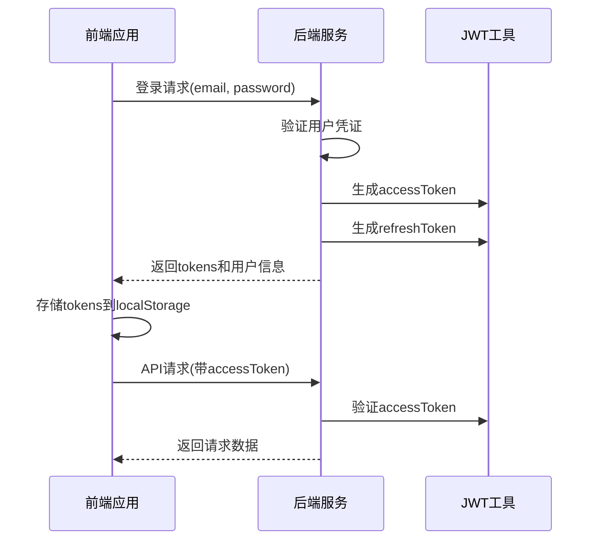
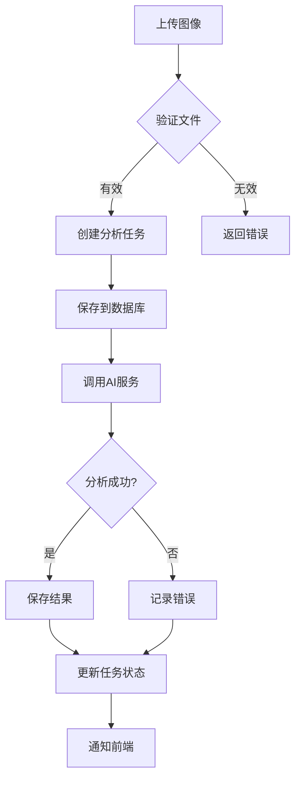

# 开发指南

<cite>
**本文档引用文件**   
- [README.md](file://README.md)
- [eslint.config.js](file://eslint.config.js)
- [server/utils/jwt.js](file://server/utils/jwt.js)
- [server/config/database.js](file://server/config/database.js)
- [server/middleware/auth.js](file://server/middleware/auth.js)
- [server/routes/auth.js](file://server/routes/auth.js)
- [src/boot/axios.ts](file://src/boot/axios.ts)
- [src/stores/authStore.ts](file://src/stores/authStore.ts)
- [src/pages/UploadPage.vue](file://src/pages/UploadPage.vue)
- [server/routes/analyze.js](file://server/routes/analyze.js)
- [server/services/qwenService.js](file://server/services/qwenService.js)
</cite>

## 目录
1. [开发环境设置](#开发环境设置)
2. [代码规范](#代码规范)
3. [提交规范](#提交规范)
4. [调试技巧](#调试技巧)
5. [测试策略建议](#测试策略建议)
6. [关键开发注意事项](#关键开发注意事项)

## 开发环境设置

### IDE推荐
推荐使用 Visual Studio Code 作为主要开发环境，配合以下插件以提升开发效率：
- Volar（Vue 3 支持）
- ESLint
- Prettier
- Quasar for VSCode
- TypeScript Vue Plugin (Volar)
- DotENV

### 依赖安装
1. **前端依赖安装**：
```bash
npm install
# 或使用 yarn
yarn install
```

2. **后端依赖安装**：
```bash
cd server
npm install
```

### 环境变量配置
1. **前端环境变量**：复制 `.env.example` 为 `.env` 并配置：
```env
VITE_API_BASE_URL=http://localhost:3000/api
```

2. **后端环境变量**：在 `server/.env` 文件中配置：
```env
# 数据库配置
DB_HOST=localhost
DB_PORT=3306
DB_USER=root
DB_PASSWORD=your_password
DB_NAME=cervix_detect_ai

# JWT密钥
JWT_SECRET=your-secret-key-change-in-production
JWT_REFRESH_SECRET=your-refresh-secret-key-change-in-production

# 服务器端口
PORT=3000
```

### 服务启动
1. **启动前端开发服务器**：
```bash
npm run dev
# 或使用 yarn
yarn dev
```
前端将运行在: `http://localhost:9000`

2. **启动后端服务器**：
```bash
npm start
# 或使用开发模式（带自动重启）
npm run dev
```
后端将运行在: `http://localhost:3000`

**Section sources**
- [README.md](file://README.md#L152-L235)

## 代码规范

### ESLint配置
项目使用 ESLint 进行代码质量检查，配置文件位于 `eslint.config.js`，主要规则包括：
- 遵循 Vue 3 和 TypeScript 最佳实践
- 强制使用类型导入（type-imports）
- 禁止在生产环境中使用 debugger
- 遵循 Quasar 框架的编码规范

### 代码风格
1. **命名规范**：
   - 变量和函数使用 camelCase
   - 组件名称使用 PascalCase
   - 常量使用 UPPER_CASE

2. **TypeScript类型使用**：
   - 所有变量和函数参数都应有明确的类型定义
   - 使用接口（interface）定义复杂对象结构
   - 避免使用 any 类型

3. **Vue组件规范**：
   - 使用 `<script setup>` 语法糖
   - 组件 props 需要明确的类型和验证
   - 使用 Pinia 进行状态管理

**Section sources**
- [eslint.config.js](file://eslint.config.js#L1-L83)

## 提交规范

### Git提交消息格式
采用 Angular 提交规范，格式如下：
```
<type>(<scope>): <subject>
<BLANK LINE>
<body>
<BLANK LINE>
<footer>
```

### 类型（type）选项
- `feat`：新增功能
- `fix`：bug修复
- `docs`：文档更新
- `style`：代码格式调整（不影响代码运行）
- `refactor`：代码重构（既不修复bug也不新增功能）
- `test`：测试相关
- `chore`：构建过程或辅助工具的变动

### 示例
```
feat(auth): 添加短信验证码登录功能
fix(upload): 修复大文件上传超时问题
docs: 更新数据库初始化文档
```

## 调试技巧

### 前端调试
1. **Vue DevTools**：安装 Vue DevTools 浏览器扩展，可调试组件状态、props、events等
2. **Pinia状态调试**：通过 Vue DevTools 查看和修改 store 状态
3. **网络请求调试**：使用浏览器开发者工具的 Network 面板监控 API 请求
4. **控制台日志**：使用 `console.log` 输出关键变量和流程信息

### 后端调试
1. **Express应用调试**：
```bash
# 使用 nodemon 启动，支持热重载
npx nodemon server/index.js
```

2. **数据库调试**：
- 使用 MySQL 客户端工具（如 MySQL Workbench）连接数据库
- 查看日志输出中的 SQL 查询语句
- 检查数据库连接状态

3. **API接口调试**：
- 使用 Postman 或 curl 测试 API 接口
- 查看服务器启动日志中的路由映射
- 检查错误处理中间件的输出

**Section sources**
- [src/boot/axios.ts](file://src/boot/axios.ts#L1-L38)
- [server/index.js](file://server/index.js#L43-L93)

## 测试策略建议

### 单元测试
1. **前端单元测试**：
   - 使用 Vitest 测试 Vue 组件和业务逻辑
   - 测试 Pinia store 的 actions 和 getters
   - 模拟 API 调用进行隔离测试

2. **后端单元测试**：
   - 使用 Jest 测试 Express 路由和中间件
   - 测试 Sequelize 模型的方法
   - 模拟数据库操作进行测试

### 集成测试
1. **API集成测试**：
   - 测试完整的 API 请求-响应流程
   - 验证 JWT 认证机制
   - 测试文件上传和处理流程

2. **端到端测试**：
   - 使用 Cypress 或 Playwright 测试用户操作流程
   - 测试从登录到病例上传分析的完整流程
   - 验证前端界面与后端服务的集成

### 测试覆盖率
- 目标测试覆盖率不低于 80%
- 重点测试核心业务逻辑和错误处理路径
- 定期审查测试用例的有效性

## 关键开发注意事项

### JWT双Token机制处理
项目采用 accessToken + refreshToken 双Token机制，需注意：

1. **Token生成**：
   - accessToken 有效期1小时，用于常规API请求
   - refreshToken 有效期7天，用于刷新accessToken

2. **认证流程**：


3. **Token刷新**：
   - 当accessToken过期时，使用refreshToken获取新的accessToken
   - refreshToken也过期时，需要用户重新登录

**Diagram sources**
- [server/utils/jwt.js](file://server/utils/jwt.js#L1-L68)
- [server/middleware/auth.js](file://server/middleware/auth.js#L1-L124)
- [server/routes/auth.js](file://server/routes/auth.js#L108-L271)

**Section sources**
- [server/utils/jwt.js](file://server/utils/jwt.js#L1-L68)
- [src/stores/authStore.ts](file://src/stores/authStore.ts#L1-L219)

### 文件上传安全性
1. **文件类型验证**：
   - 仅允许 JPG、PNG、TIFF 等医学影像格式
   - 通过 MIME 类型和文件扩展名双重验证

2. **文件大小限制**：
   - 最大文件大小限制为 20MB
   - 在前端和后端都进行大小验证

3. **存储安全**：
   - 上传文件存储在独立的 `uploads` 目录
   - 避免直接暴露文件路径
   - 定期清理临时文件

4. **恶意文件防护**：
   - 对上传的图像文件进行基本的病毒扫描
   - 验证文件头信息确保是合法的图像文件

**Section sources**
- [server/routes/analyze.js](file://server/routes/analyze.js#L25-L33)
- [src/pages/UploadPage.vue](file://src/pages/UploadPage.vue#L27-L30)

### 数据库字符集使用utf8mb4
1. **数据库创建**：
```sql
CREATE DATABASE cervix_detect_ai CHARACTER SET utf8mb4 COLLATE utf8mb4_unicode_ci;
```

2. **配置文件设置**：
```javascript
// server/config/database.js
dialectOptions: {
  charset: 'utf8mb4',
  collate: 'utf8mb4_unicode_ci',
}
```

3. **优势**：
   - 支持完整的 Unicode 字符，包括 emoji
   - 避免中文字符存储乱码问题
   - 兼容性好，支持各种语言字符

4. **注意事项**：
   - 确保 MySQL 服务器支持 utf8mb4
   - 检查连接字符串中的字符集设置
   - 在迁移旧数据时注意字符编码转换

**Section sources**
- [README.md](file://README.md#L93-L95)
- [server/config/database.js](file://server/config/database.js#L1-L61)

### AI分析流程注意事项
1. **异步处理机制**：
   - 图像上传后立即返回任务ID，不阻塞请求
   - 使用后台任务处理耗时的AI分析
   - 通过轮询获取任务状态和结果

2. **错误处理**：
   - 捕获并记录AI服务调用异常
   - 提供友好的错误提示给用户
   - 实现重试机制应对临时性故障

3. **性能优化**：
   - 对AI响应结果进行缓存
   - 限制并发分析任务数量
   - 监控分析任务的执行时间



**Diagram sources**
- [server/routes/analyze.js](file://server/routes/analyze.js#L44-L377)
- [server/services/qwenService.js](file://server/services/qwenService.js#L1-L160)

**Section sources**
- [server/routes/analyze.js](file://server/routes/analyze.js#L1-L378)
- [src/pages/UploadPage.vue](file://src/pages/UploadPage.vue#L330-L482)