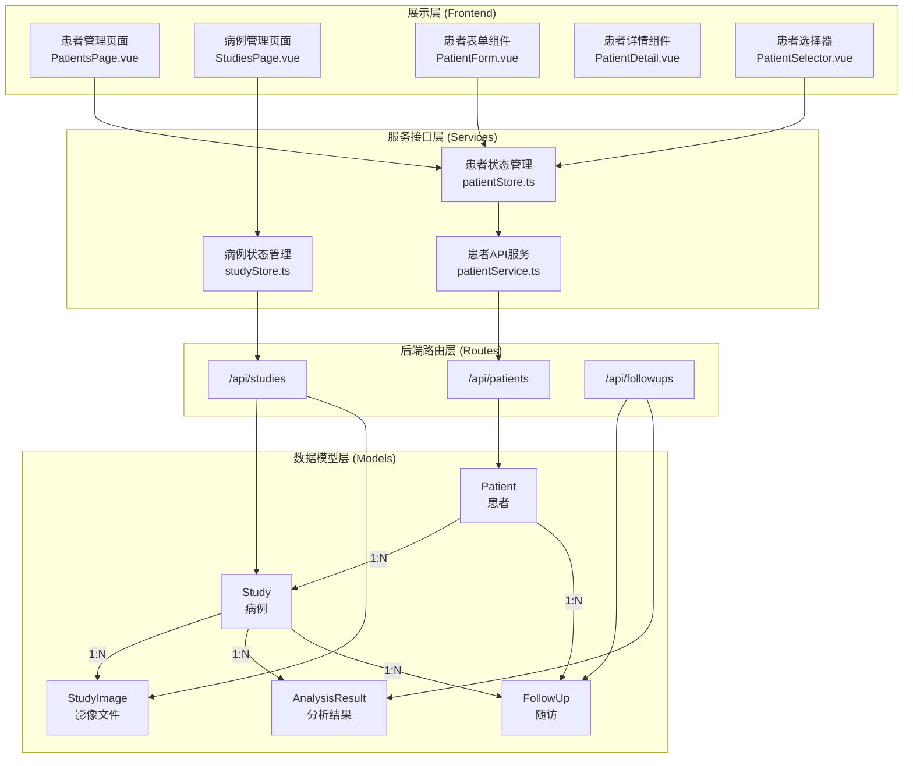
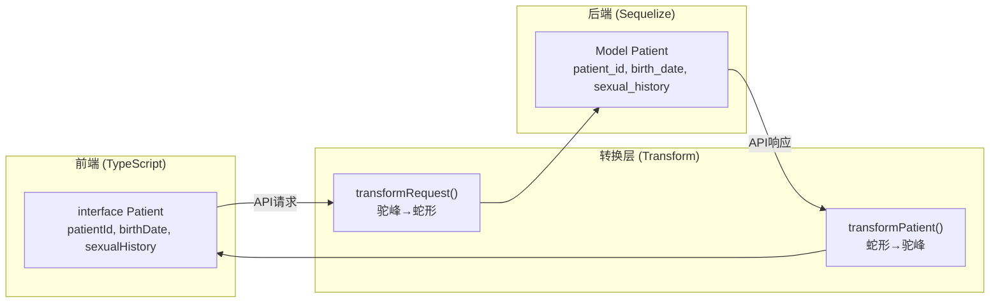
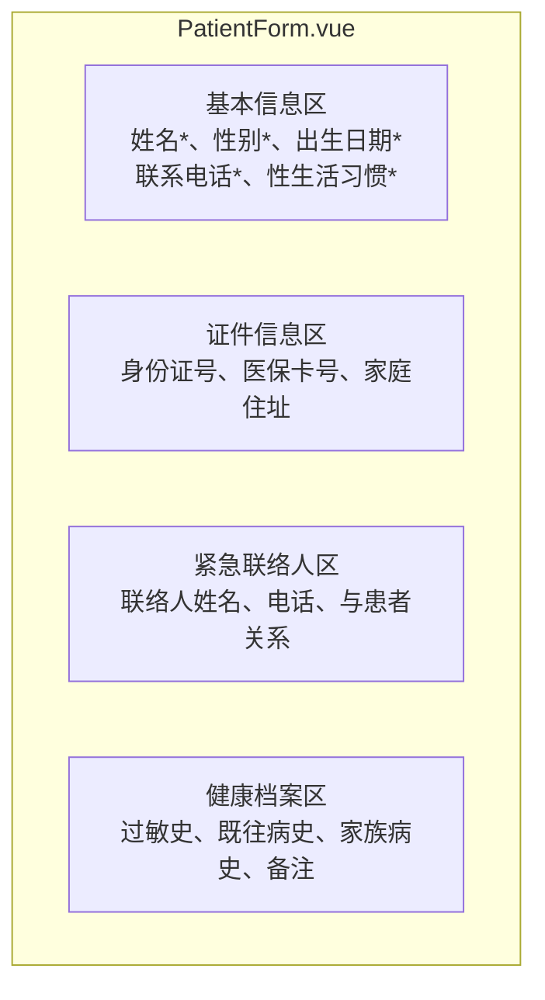
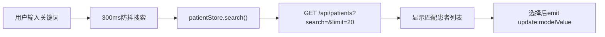
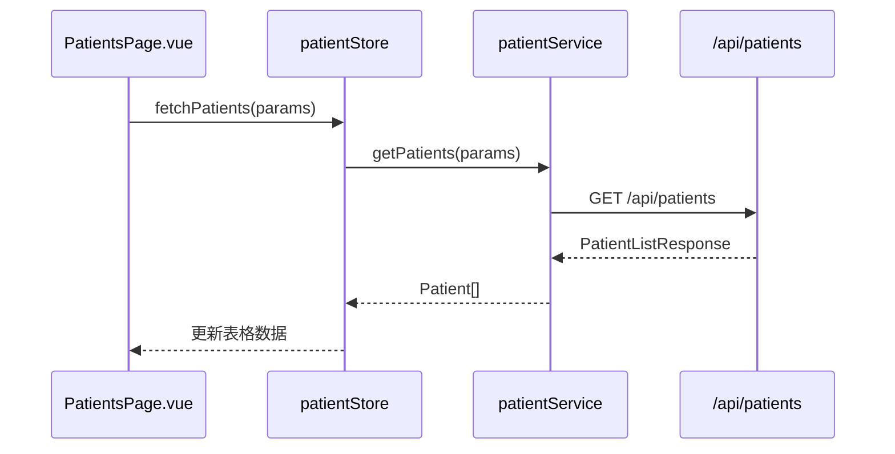

# 患者与病例管理

患者与病例管理是宫颈癌筛查AI辅助诊断系统的核心业务模块，负责管理患者基本健康信息与医学影像检查记录，并为后续的AI分析、随访追踪提供数据基础。

> **本文档引用文件**
> - [server/models/index.js](file://server/models/index.js)
> - [src/pages/PatientsPage.vue](file://src/pages/PatientsPage.vue)
> - [src/pages/StudiesPage.vue](file://src/pages/StudiesPage.vue)
> - [src/components/patients/PatientForm.vue](file://src/components/patients/PatientForm.vue)
> - [src/components/patients/PatientDetail.vue](file://src/components/patients/PatientDetail.vue)
> - [src/components/patients/PatientSelector.vue](file://src/components/patients/PatientSelector.vue)
> - [server/models/Patient.js](file://server/models/Patient.js)
> - [server/models/Study.js](file://server/models/Study.js)
> - [server/models/FollowUp.js](file://server/models/FollowUp.js)

## 目录

1. [系统架构概览](#系统架构概览)
2. [数据模型设计](#数据模型设计)
3. [前后端数据映射](#前后端数据映射)
4. [API接口规范](#api接口规范)
5. [前端组件架构](#前端组件架构)
6. [权限控制策略](#权限控制策略)

## 系统架构概览

患者与病例管理系统由数据模型层、业务逻辑层、服务接口层和展示层四部分组成。

## 数据模型设计

### 患者模型（Patient）

患者模型存储患者的基本信息、联系方式、健康档案和紧急联络人信息。

| 字段名 | 数据类型 | 说明 | 约束 |
|--------|----------|------|------|
| id | BIGINT | 主键 | autoIncrement |
| patient_id | STRING(50) | 患者唯一编号 | unique |
| name | STRING(100) | 姓名 | 必填 |
| gender | ENUM | 性别（male/female/other） | 必填 |
| birth_date | DATEONLY | 出生日期 | 可选 |
| phone | STRING(20) | 联系电话 | 可选 |
| sexual_history | ENUM | 性生活史 | 默认none |
| id_card | STRING(50) | 身份证号 | 加密存储 |
| medical_card_no | STRING(50) | 医保卡号 | 可选 |
| address | STRING(500) | 家庭住址 | 可选 |
| emergency_contact | STRING(100) | 紧急联络人 | 可选 |
| emergency_phone | STRING(20) | 紧急联络电话 | 可选 |
| emergency_relation | STRING(50) | 紧急联系人关系 | 可选 |
| allergy_history | TEXT | 过敏史 | 可选 |
| medical_history | TEXT | 既往病史 | 可选 |
| family_history | TEXT | 家族病史 | 可选 |
| notes | TEXT | 备注信息 | 可选 |
| created_by | BIGINT | 创建用户ID | 外键关联users表 |

### 病例模型（Study）

病例模型记录每次医学检查的详细信息。

| 字段名 | 数据类型 | 说明 | 约束 |
|--------|----------|------|------|
| id | BIGINT | 主键 | autoIncrement |
| study_id | STRING(50) | 病例唯一编号 | unique |
| patient_id | BIGINT | 患者ID | 必填，外键 |
| user_id | BIGINT | 创建用户ID | 外键（可为null） |
| study_date | DATE | 检查日期 | 必填 |
| study_type | STRING(50) | 检查类型 | 必填 |
| description | TEXT | 检查描述 | 可选 |
| department | STRING(100) | 科室 | 可选 |
| doctor_name | STRING(100) | 医生姓名 | 可选 |
| clinical_diagnosis | TEXT | 临床诊断 | 可选 |
| symptoms | TEXT | 症状描述 | 可选 |
| status | ENUM | 状态 | pending/uploaded/processing/completed/failed |
| priority | ENUM | 优先级 | normal/urgent/emergency |
| uploaded_at | DATE | 上传时间 | 默认NOW |

### 随访模型（FollowUp）

随访模型支持创建、管理宫颈癌筛查后的定期随访计划。

| 字段名 | 数据类型 | 说明 |
|--------|----------|------|
| follow_up_id | STRING(50) | 随访编号 |
| patient_id | BIGINT | 患者ID |
| study_id | BIGINT | 关联病例ID（可选） |
| created_by | BIGINT | 创建医生ID |
| assigned_doctor_id | BIGINT | 分配医生ID |
| planned_date | DATEONLY | 计划日期 |
| recommended_interval_months | INTEGER | 推荐间隔月数 |
| risk_level_snapshot | ENUM | 风险等级快照 |
| ai_flagged_high_attention | BOOLEAN | AI标记高关注 |
| doctor_marked_high_attention | BOOLEAN | 医生标记高关注 |
| status | ENUM | 状态（pending/overdue/completed/cancelled） |

## 前后端数据映射

前端采用TypeScript进行类型定义，后端使用Sequelize ORM框架。

## API接口规范

### 患者管理API

| 方法 | 路径 | 功能 | 认证 |
|------|------|------|------|
| POST | /api/patients | 创建患者 | 必填 |
| GET | /api/patients | 获取患者列表（分页） | 必填 |
| GET | /api/patients/:id | 获取患者详情 | 必填 |
| PUT | /api/patients/:id | 更新患者信息 | 必填 |
| DELETE | /api/patients/:id | 删除患者（软删除） | 必填 |
| GET | /api/patients/:id/studies | 获取患者的所有病例 | 必填 |

### 病例管理API

| 方法 | 路径 | 功能 | 认证 |
|------|------|------|------|
| POST | /api/studies | 创建病例 | 必填 |
| POST | /api/studies/:id/images | 上传影像文件 | 必填 |
| GET | /api/studies | 获取病例列表（分页） | 必填 |
| GET | /api/studies/:id | 获取病例详情 | 必填 |
| PUT | /api/studies/:id | 更新病例信息 | 必填 |
| DELETE | /api/studies/:id | 删除病例（软删除） | 必填 |
| DELETE | /api/studies/:id/images/:imageId | 删除影像文件 | 必填 |

## 前端组件架构

### 患者表单组件（PatientForm）

患者表单组件提供完整的新增和编辑功能。

### 患者选择器组件（PatientSelector）

患者选择器组件用于在其他页面快速选择已有患者。

### 前端状态管理

## 权限控制策略

系统采用基于角色的权限控制（RBAC）策略。

| 操作 | 普通用户 | 管理员 |
|------|----------|--------|
| 查看患者列表 | 全部患者 | 全部患者 |
| 创建患者 | 仅为自己创建 | 无限制 |
| 更新患者 | 仅更新自己创建的 | 无限制 |
| 删除患者 | 仅删除自己创建的 | 无限制 |
| 创建病例 | 仅为自己创建的患者创建 | 无限制 |
| 查看病例 | 仅查看自己创建的+匿名病例 | 全部 |
| 上传影像 | 仅为自己创建的病例上传 | 无限制 |

## 相关文档

- [[患者管理API|患者管理API]] — API 接口详解
- [[病例管理API详解|病例管理API详解]] — 病例 CRUD 接口
- [[影像管理API|影像管理API]] — 影像上传与处理
- [[用户认证系统]] — 认证中间件如何保护患者和病例API
