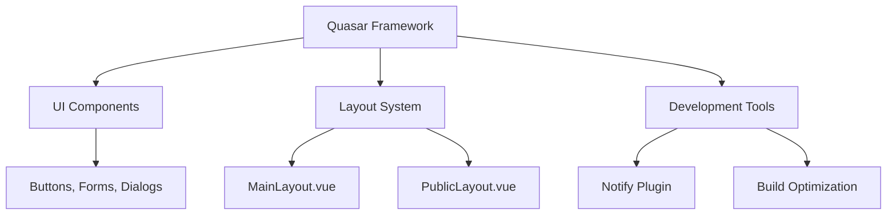
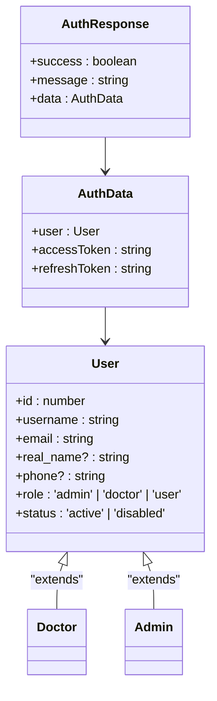
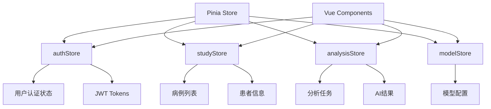
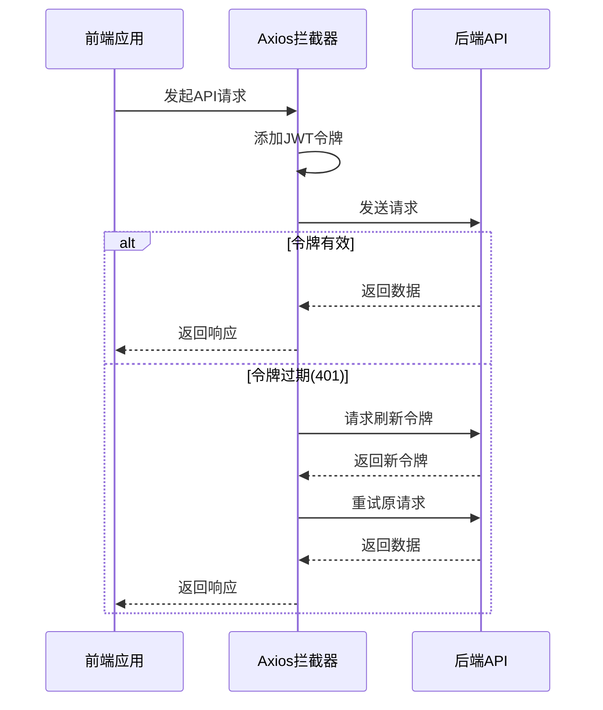
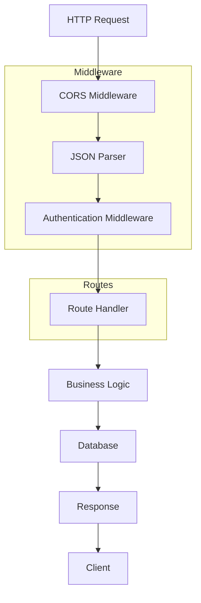
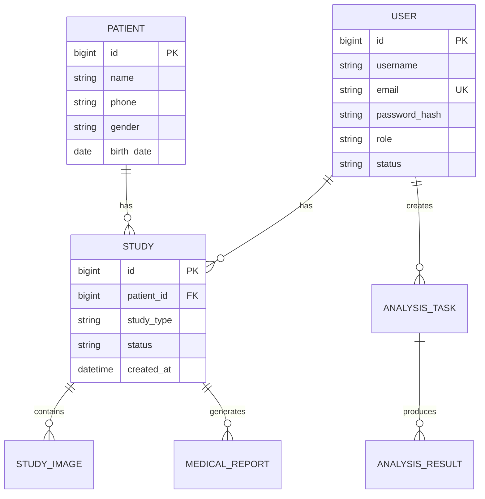
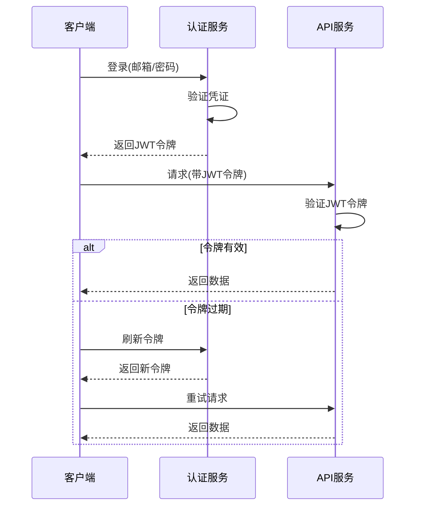
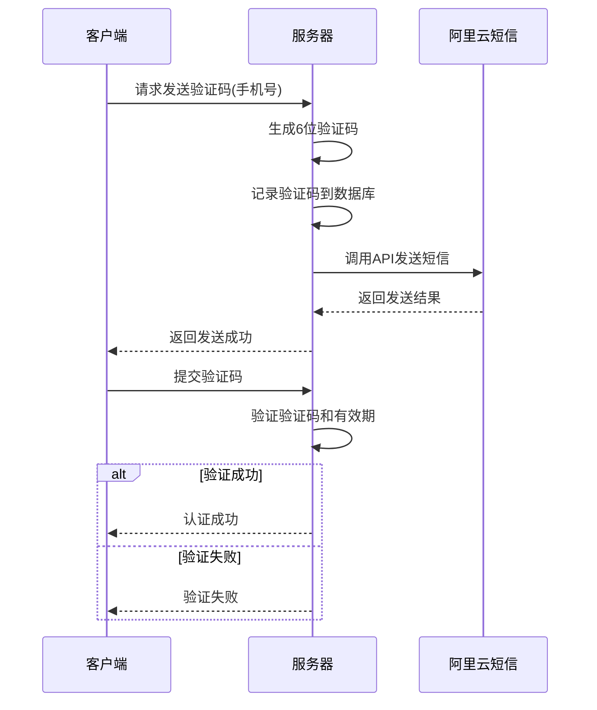
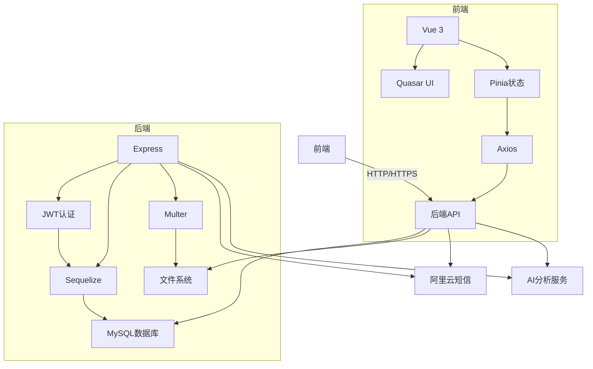

# 技术栈

> **本文档引用的文件**   
> - [package.json](file://package.json)
> - [server/package.json](file://server/package.json)
> - [quasar.config.ts](file://quasar.config.ts)
> - [tsconfig.json](file://tsconfig.json)
> - [src/boot/axios.ts](file://src/boot/axios.ts)
> - [src/stores/authStore.ts](file://src/stores/authStore.ts)
> - [src/stores/index.ts](file://src/stores/index.ts)
> - [src/router/index.ts](file://src/router/index.ts)
> - [src/services/api.ts](file://src/services/api.ts)
> - [server/index.js](file://server/index.js)
> - [server/config/database.js](file://server/config/database.js)
> - [server/config/sequelize.js](file://server/config/sequelize.js)
> - [server/middleware/auth.js](file://server/middleware/auth.js)
> - [server/utils/jwt.js](file://server/utils/jwt.js)
> - [server/routes/auth.js](file://server/routes/auth.js)
> - [server/models/User.js](file://server/models/User.js)
> - [server/services/sms.service.js](file://server/services/sms.service.js)

## 目录
1. [项目概述](#项目概述)
2. [前端技术体系](#前端技术体系)
   - [Vue 3](#vue-3)
   - [Quasar 框架](#quasar-框架)
   - [TypeScript](#typescript)
   - [Pinia 状态管理](#pinia-状态管理)
   - [Vite 构建工具](#vite-构建工具)
   - [Axios HTTP 客户端](#axios-http-客户端)
3. [后端技术体系](#后端技术体系)
   - [Node.js](#nodejs)
   - [Express 框架](#express-框架)
   - [Sequelize ORM](#sequelize-orm)
   - [MySQL 数据库](#mysql-数据库)
   - [JWT 认证机制](#jwt-认证机制)
   - [Multer 文件上传](#multer-文件上传)
   - [阿里云短信服务](#阿里云短信服务)
4. [技术选型考量](#技术选型考量)
5. [系统架构与协同工作](#系统架构与协同工作)

## 项目概述

CervixDetectAI 是一个基于人工智能的宫颈癌检测医疗应用，采用现代化的全栈技术架构。项目分为前端和后端两个主要部分，前端使用 Vue 3 生态系统构建用户界面，后端使用 Node.js 和 Express 构建 RESTful API 服务。整个系统通过 JWT 进行身份认证，使用 MySQL 存储数据，并集成了阿里云短信服务进行用户验证。

**Section sources**
- [README.md](file://README.md#L281-L351)

## 前端技术体系

### Vue 3

Vue 3 作为项目的核心前端框架，提供了响应式数据绑定、组件化开发和虚拟 DOM 等现代前端开发特性。Vue 3 的 Composition API 使得代码组织更加灵活，特别适合复杂医疗应用的业务逻辑组织。项目中的所有页面组件（如 LoginPage.vue、DashboardPage.vue 等）都基于 Vue 3 构建，利用其响应式系统实现用户界面的动态更新。

**Section sources**
- [package.json](file://package.json#L23)
- [src/pages/LoginPage.vue](file://src/pages/LoginPage.vue)

### Quasar 框架

Quasar 框架为项目提供了丰富的 UI 组件库和开箱即用的开发工具。通过 `quasar.config.ts` 配置文件，项目集成了 Material Icons 和 Roboto 字体，确保了跨平台的一致性体验。Quasar 的布局系统（MainLayout.vue 和 PublicLayout.vue）为应用提供了统一的页面结构，而 Notify 插件则用于显示用户操作反馈。

**Diagram sources**
- [quasar.config.ts](file://quasar.config.ts#L20-L31)
- [src/layouts/MainLayout.vue](file://src/layouts/MainLayout.vue)
- [src/layouts/PublicLayout.vue](file://src/layouts/PublicLayout.vue)

**Section sources**
- [quasar.config.ts](file://quasar.config.ts#L1-L128)
- [package.json](file://package.json#L22)

### TypeScript

TypeScript 为项目提供了静态类型检查，增强了代码的可维护性和开发体验。通过 `tsconfig.json` 文件继承 Quasar 的 TypeScript 配置，项目启用了严格模式（strict: true），确保了类型安全。在状态管理（如 authStore.ts）和 API 服务（api.ts）中，TypeScript 接口定义了清晰的数据结构，减少了运行时错误。

**Diagram sources**
- [tsconfig.json](file://tsconfig.json#L1-L3)
- [src/stores/authStore.ts](file://src/stores/authStore.ts#L6-L18)

**Section sources**
- [tsconfig.json](file://tsconfig.json#L1-L3)
- [package.json](file://package.json#L37)

### Pinia 状态管理

Pinia 作为 Vue 3 的官方状态管理库，用于管理应用的全局状态。项目通过 `src/stores` 目录组织了多个 store，包括 authStore.ts（认证状态）、studyStore.ts（病例数据）和 analysisStore.ts（AI 分析任务）。`index.ts` 文件初始化 Pinia 实例，并在应用启动时注入。状态管理确保了用户认证信息、病例数据等关键状态在组件间的同步和一致性。

**Diagram sources**
- [src/stores/index.ts](file://src/stores/index.ts#L1-L32)
- [src/stores/authStore.ts](file://src/stores/authStore.ts#L1-L46)
- [src/stores/example-store.ts](file://src/stores/example-store.ts#L1-L21)

**Section sources**
- [src/stores/index.ts](file://src/stores/index.ts#L1-L32)
- [src/stores/authStore.ts](file://src/stores/authStore.ts#L1-L218)
- [package.json](file://package.json#L21)

### Vite 构建工具

Vite 作为现代化的前端构建工具，提供了快速的开发服务器和高效的生产构建。项目通过 Quasar CLI 集成 Vite，在 `quasar.config.ts` 中配置了浏览器兼容性目标（ES2022、Firefox115、Chrome115、Safari14），确保了在现代浏览器中的最佳性能。Vite 的热模块替换（HMR）功能极大地提升了开发效率，使得代码修改能够即时反映在浏览器中。

**Section sources**
- [quasar.config.ts](file://quasar.config.ts#L35-L37)
- [package-lock.json](file://package-lock.json#L8184-L8396)

### Axios HTTP 客户端

Axios 作为 HTTP 客户端，负责前端与后端 API 的通信。通过 `src/boot/axios.ts` 配置文件，项目创建了预配置的 axios 实例，设置了基础 URL 和请求头。拦截器机制实现了自动添加 JWT 认证令牌和处理 401 错误时的令牌刷新，确保了 API 调用的安全性和可靠性。`src/services/api.ts` 文件封装了所有 API 调用，提供了清晰的接口抽象。

**Diagram sources**
- [src/boot/axios.ts](file://src/boot/axios.ts#L1-L37)
- [src/services/api.ts](file://src/services/api.ts#L1-L335)

**Section sources**
- [src/boot/axios.ts](file://src/boot/axios.ts#L1-L37)
- [src/services/api.ts](file://src/services/api.ts#L1-L335)
- [package.json](file://package.json#L20)

## 后端技术体系

### Node.js

Node.js 作为后端运行时环境，提供了非阻塞 I/O 和事件驱动的架构，适合处理大量并发请求。项目后端基于 Node.js 20+ 版本运行，利用其现代 JavaScript 特性和性能优化。`server/package.json` 文件指定了 Node.js 的版本要求，确保了运行环境的一致性。Node.js 的生态系统为项目提供了丰富的第三方包支持，加速了开发进程。

**Section sources**
- [server/package.json](file://server/package.json#L43-L45)
- [server/index.js](file://server/index.js#L1-L94)

### Express 框架

Express 作为轻量级的 Node.js Web 框架，为项目提供了路由、中间件和请求处理等核心功能。后端通过 `server/index.js` 文件初始化 Express 应用，配置了 CORS、JSON 解析和静态文件服务。路由系统（`server/routes/` 目录）将 API 请求分发到相应的控制器，如 auth.js（认证）、studies.js（病例管理）和 analyze.js（AI 分析）。Express 的中间件机制实现了请求的预处理和后处理。

**Diagram sources**
- [server/index.js](file://server/index.js#L33-L75)
- [server/routes/auth.js](file://server/routes/auth.js#L1-L306)

**Section sources**
- [server/package.json](file://server/package.json#L27)
- [server/index.js](file://server/index.js#L3-L94)

### Sequelize ORM

Sequelize 作为 Node.js 的 ORM（对象关系映射）工具，简化了数据库操作。项目通过 `server/config/database.js` 和 `server/config/sequelize.js` 配置了 MySQL 数据库连接，定义了数据模型之间的关系。`server/models/` 目录下的各个模型文件（如 User.js、Patient.js）定义了数据库表结构和业务逻辑。Sequelize 的迁移功能（`server/scripts/`）确保了数据库模式的版本控制和一致性。

**Diagram sources**
- [server/config/database.js](file://server/config/database.js#L1-L61)
- [server/config/sequelize.js](file://server/config/sequelize.js#L1-L53)
- [server/models/User.js](file://server/models/User.js#L1-L109)

**Section sources**
- [server/package.json](file://server/package.json#L31)
- [server/config/database.js](file://server/config/database.js#L1-L61)
- [server/config/sequelize.js](file://server/config/sequelize.js#L1-L53)

### MySQL 数据库

MySQL 作为关系型数据库管理系统，为项目提供了可靠的数据存储。通过 Sequelize ORM，项目实现了对 MySQL 数据库的高效访问。`database.js` 配置文件指定了数据库连接参数，包括主机、端口、用户名和密码。数据库设计遵循规范化原则，通过外键约束维护数据完整性。连接池配置（max: 20, min: 5）优化了数据库连接的性能和资源利用率。

**Section sources**
- [server/config/database.js](file://server/config/database.js#L5-L11)
- [server/package.json](file://server/package.json#L30)

### JWT 认证机制

JWT（JSON Web Token）作为认证机制，实现了无状态的用户身份验证。项目通过 `server/utils/jwt.js` 文件封装了 JWT 的生成、验证和提取功能。访问令牌（access token）有效期为 1 小时，刷新令牌（refresh token）有效期为 7 天，平衡了安全性和用户体验。`server/middleware/auth.js` 中间件负责验证 JWT 令牌，确保只有经过认证的用户才能访问受保护的 API 端点。

**Diagram sources**
- [server/utils/jwt.js](file://server/utils/jwt.js#L1-L68)
- [server/middleware/auth.js](file://server/middleware/auth.js#L1-L124)
- [server/routes/auth.js](file://server/routes/auth.js#L1-L306)

**Section sources**
- [server/utils/jwt.js](file://server/utils/jwt.js#L1-L68)
- [server/middleware/auth.js](file://server/middleware/auth.js#L1-L124)
- [server/package.json](file://server/package.json#L28)

### Multer 文件上传

Multer 作为 Express 的中间件，处理 multipart/form-data 类型的文件上传。项目使用 Multer 处理宫颈图像的上传，将文件存储在服务器的 `uploads/` 目录中。配置了文件大小限制（50MB）和文件类型验证，确保了上传的安全性。上传的文件信息被记录在数据库中，与相应的病例（Study）关联，支持后续的 AI 分析。

**Section sources**
- [server/package.json](file://server/package.json#L29)
- [server/index.js](file://server/index.js#L40-L41)

### 阿里云短信服务

阿里云短信服务用于实现手机号码的验证功能，支持短信登录、注册和密码重置。项目通过 `@alicloud/dypnsapi20170525` SDK 集成了阿里云的短信 API。`server/services/sms.service.js` 封装了短信发送逻辑，生成 6 位数字验证码并记录在 `sms_codes` 表中。`server/routes/sms-auth.js` 提供了发送验证码和验证验证码的 API 端点，实现了安全的手机号码验证流程。

**Diagram sources**
- [server/services/sms.service.js](file://server/services/sms.service.js#L1-L127)
- [server/routes/sms-auth.js](file://server/routes/sms-auth.js#L105-L147)
- [server/models/SmsCode.js](file://server/models/SmsCode.js#L1-L73)

**Section sources**
- [server/package.json](file://server/package.json#L18)
- [server/services/sms.service.js](file://server/services/sms.service.js#L1-L127)
- [server/models/SmsCode.js](file://server/models/SmsCode.js#L1-L73)

## 技术选型考量

CervixDetectAI 项目的技术选型基于性能、可维护性和安全性三个核心考量。前端选择 Vue 3 和 Quasar 的组合，因为它们提供了优秀的开发体验和跨平台支持，TypeScript 的引入增强了代码的可维护性。后端采用 Node.js 和 Express，得益于其高性能的非阻塞 I/O 模型和丰富的生态系统。Sequelize ORM 简化了数据库操作，而 JWT 认证机制实现了无状态的安全认证。阿里云短信服务的选择基于其在中国市场的可靠性和合规性。这些技术的组合确保了系统能够高效处理医疗影像数据，同时保障患者信息的安全。

**Section sources**
- [package.json](file://package.json)
- [server/package.json](file://server/package.json)

## 系统架构与协同工作

CervixDetectAI 的全栈技术体系通过清晰的分层架构协同工作。前端通过 Vue 3 组件呈现用户界面，Pinia 管理应用状态，Axios 与后端 API 通信。后端 Express 服务器处理 HTTP 请求，通过 JWT 中间件验证用户身份，调用 Sequelize ORM 操作 MySQL 数据库。文件上传通过 Multer 处理，短信验证通过阿里云服务实现。整个系统通过 RESTful API 进行通信，数据流清晰，各组件职责分明，形成了一个高效、安全、可扩展的医疗 AI 应用架构。

**Diagram sources**
- [server/index.js](file://server/index.js#L1-L94)
- [src/main.ts](file://src/main.ts)
- [server/routes/](file://server/routes/)

**Section sources**
- [server/index.js](file://server/index.js#L1-L94)
- [src/App.vue](file://src/App.vue#L1-L16)