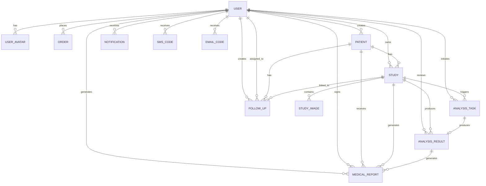

# 关系图

> **Referenced Files in This Document**   
> - [index.js](file://server/models/index.js)
> - [User.js](file://server/models/User.js)
> - [Patient.js](file://server/models/Patient.js)
> - [Study.js](file://server/models/Study.js)
> - [StudyImage.js](file://server/models/StudyImage.js)
> - [AnalysisTask.js](file://server/models/AnalysisTask.js)
> - [AnalysisResult.js](file://server/models/AnalysisResult.js)
> - [MedicalReport.js](file://server/models/MedicalReport.js)

## 目录

1. [数据库实体关系概述](#数据库实体关系概述)
2. [核心模型关系详解](#核心模型关系详解)
3. [外键与别名规范](#外键与别名规范)
4. [关联查询实现示例](#关联查询实现示例)
5. [实体关系图（ERD）](#实体关系图（erd））

## 数据库实体关系概述

本系统基于Sequelize ORM框架构建了完整的医疗数据分析平台数据库模型。各实体间通过外键和关联方法建立了清晰的关系网络，支持复杂的医疗数据管理与分析流程。核心实体包括用户（User）、患者（Patient）、检查（Study）、影像（StudyImage）、分析任务（AnalysisTask）、分析结果（AnalysisResult）和医疗报告（MedicalReport），形成了从数据采集到结果输出的完整闭环。

**Section sources**

- [index.js](file://server/models/index.js#L1-L79)

## 核心模型关系详解

系统中的模型关系设计遵循医疗业务逻辑，确保数据的完整性和可追溯性。主要关系类型包括一对多（1:N）和一对一（1:1）关联。

### User与Patient的1:N创建关系

用户（User）与患者（Patient）之间存在一对多的创建关系。系统中的医生或管理员用户可以创建多个患者记录。此关系通过`created_by`外键实现，该外键指向`users`表的主键`id`，并使用`as: 'created_patients'`别名。同时，Patient模型通过`belongsTo`关系反向关联到User，使用`as: 'creator'`别名，确保了双向查询能力。

**Section sources**

- [index.js](file://server/models/index.js#L19-L20)
- [index.js](file://server/models/index.js#L30-L31)

### Study与StudyImage的1:N影像集合关系

检查（Study）与影像（StudyImage）之间存在典型的一对多影像集合关系。一个检查可以包含多张医学影像，如DICOM、JPEG或PNG格式的图片。此关系通过`study_id`外键建立，使用`as: 'images'`别名。当删除一个检查时，其所有关联的影像也会被级联删除（`onDelete: 'CASCADE'`），保证了数据一致性。

**Section sources**

- [index.js](file://server/models/index.js#L37-L38)
- [index.js](file://server/models/index.js#L43-L44)

### AnalysisTask与AnalysisResult的1:1结果绑定

分析任务（AnalysisTask）与分析结果（AnalysisResult）之间存在一对一的结果绑定关系。每个分析任务完成后会生成唯一的结果记录。此关系通过`task_id`外键实现，该外键在`AnalysisResult`表中具有唯一性约束（`unique: true`），确保了1:1的绑定。使用`as: 'result'`和`as: 'task'`别名，支持从任一方向进行关联查询。

**Section sources**

- [index.js](file://server/models/index.js#L48-L49)
- [index.js](file://server/models/index.js#L51-L52)

### MedicalReport与AnalysisResult的1:N报告生成关系

医疗报告（MedicalReport）与分析结果（AnalysisResult）之间存在一对多的报告生成关系。一个分析结果可以生成多份不同类型的报告，如初步报告、最终报告或补充报告。此关系通过`analysis_result_id`外键建立，使用`as: 'reports'`别名。这种设计支持报告的版本管理和多级审核流程。

**Section sources**

- [index.js](file://server/models/index.js#L54-L55)
- [index.js](file://server/models/index.js#L58-L64)

## 外键与别名规范

系统严格遵循外键命名规范，所有外键均采用`[关联表名]_id`的命名方式，如`study_id`、`user_id`、`patient_id`等。这种命名方式清晰地表明了外键的来源，提高了代码的可读性和可维护性。

### 外键约束

外键不仅建立了表间关系，还定义了数据完整性约束。例如，`Study`表中的`patient_id`外键设置了`onUpdate: 'CASCADE'`和`onDelete: 'RESTRICT'`，这意味着更新患者ID时会级联更新所有相关检查，但禁止删除仍有检查记录的患者，防止了数据孤岛的产生。

### 别名（as）在查询中的使用

别名（`as`）是Sequelize中实现关联查询的关键。通过为每个关联指定别名，可以在查询时使用`include`选项精确地加载相关数据。例如，通过`{ model: Study, as: 'study' }`可以加载分析任务关联的检查信息。别名使得复杂的多表关联查询变得简洁明了，避免了命名冲突。

**Section sources**

- [index.js](file://server/models/index.js#L15-L65)

## 关联查询实现示例

Sequelize的关联功能使得跨表查询变得简单高效。通过`include`选项，可以一次性获取主模型及其关联模型的数据。

### 获取检查的所有影像

通过`study.images`可以轻松获取一个检查关联的所有影像。在查询时，使用`include`选项指定`as: 'images'`的关联，Sequelize会自动执行JOIN操作，返回包含影像数据的完整检查对象。

```javascript
// 示例代码路径
// server/routes/studies.js
```

**Section sources**

- [index.js](file://server/models/index.js#L37-L38)

### 获取分析结果的相关报告

通过`analysis_result.reports`可以获取一个分析结果生成的所有报告。查询时，使用`include`选项加载`as: 'reports'`的关联，能够一次性获取结果及其所有报告，支持报告的列表展示和历史追溯。

```javascript
// 示例代码路径
// server/routes/reports.js
```

**Section sources**

- [index.js](file://server/models/index.js#L54-L55)

## 实体关系图（ERD）

以下 ER 图展示完整数据模型关系，箭头方向表示外键所在侧（无箭头一端为一，无箭头一端为一，无箭头一端为一）。



**Diagram sources **

- [index.js](file://server/models/index.js#L15-L65)

**Section sources**

- [models/index.js](file://server/models/index.js#L1-L104) — 完整关联定义
- [User.js](file://server/models/User.js#L6-L81)
- [UserAvatar.js](file://server/models/UserAvatar.js#L5-L60)
- [Patient.js](file://server/models/Patient.js#L6-L103)
- [Study.js](file://server/models/Study.js#L6-L131)
- [StudyImage.js](file://server/models/StudyImage.js#L6-L104)
- [AnalysisTask.js](file://server/models/AnalysisTask.js#L6-L109)
- [AnalysisResult.js](file://server/models/AnalysisResult.js#L6-L127)
- [MedicalReport.js](file://server/models/MedicalReport.js#L6-L170)
- [SmsCode.js](file://server/models/SmsCode.js#L5-L50)
- [EmailCode.js](file://server/models/EmailCode.js#L5-L60)
- [Order.js](file://server/models/Order.js#L5-L60)
- [FollowUp.js](file://server/models/FollowUp.js#L5-L60)
- [Notification.js](file://server/models/Notification.js#L5-L60)
