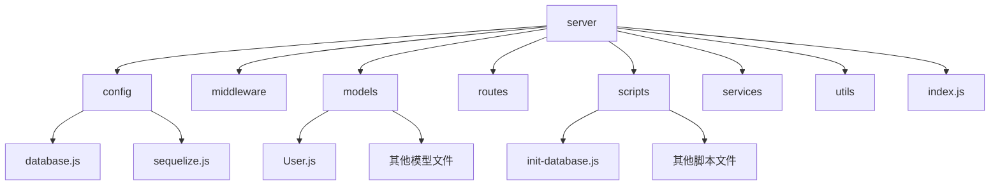
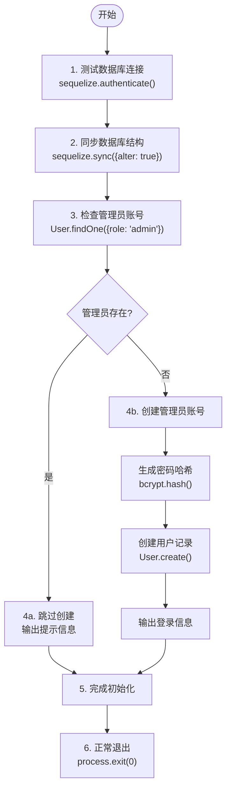
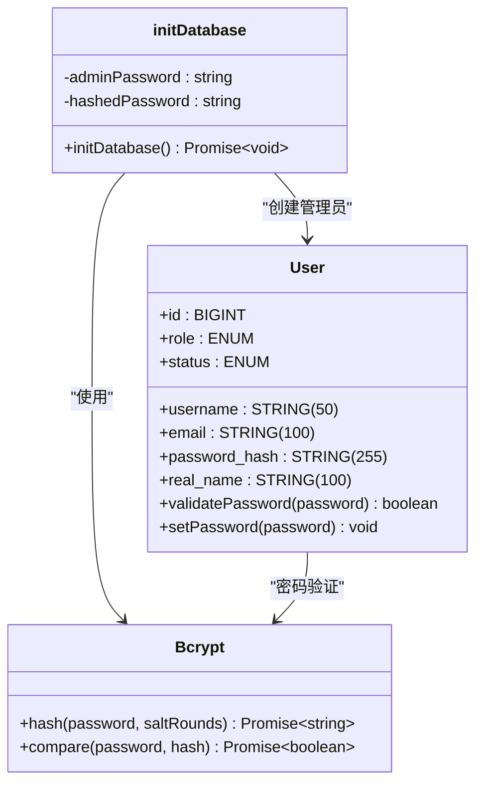
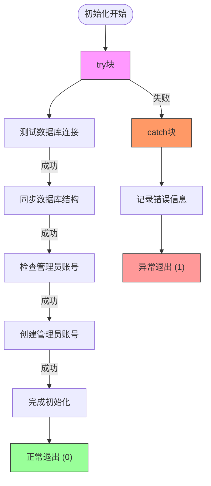
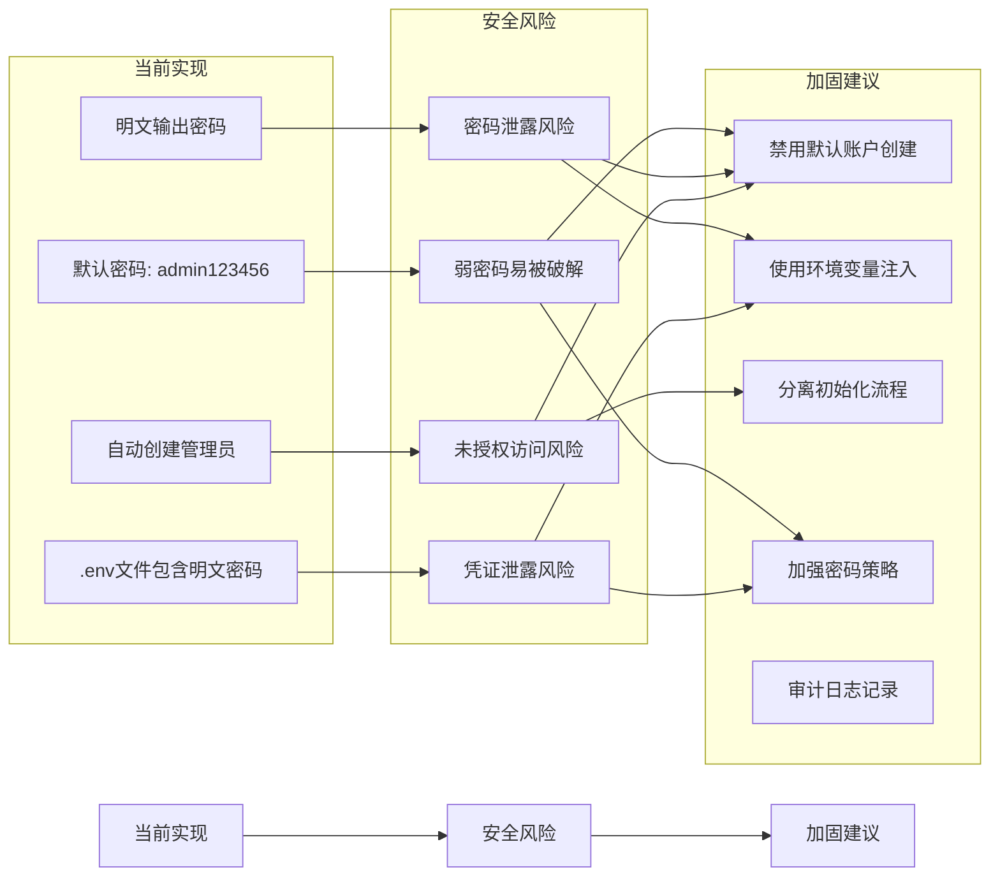

# 初始化脚本

<cite>
**Referenced Files in This Document**   
- [init-database.js](file://server/scripts/init-database.js)
- [sequelize.js](file://server/config/sequelize.js)
- [User.js](file://server/models/User.js)
- [.env](file://server/.env)
</cite>

## Table of Contents
1. [项目结构](#项目结构)
2. [核心组件](#核心组件)
3. [执行流程分析](#执行流程分析)
4. [安全设计分析](#安全设计分析)
5. [错误处理机制](#错误处理机制)
6. [生产环境安全加固建议](#生产环境安全加固建议)

## 项目结构

**Diagram sources**
- [server/config/sequelize.js](file://server/config/sequelize.js)
- [server/models/User.js](file://server/models/User.js)
- [server/scripts/init-database.js](file://server/scripts/init-database.js)

**Section sources**
- [server/config/sequelize.js](file://server/config/sequelize.js)
- [server/models/User.js](file://server/models/User.js)
- [server/scripts/init-database.js](file://server/scripts/init-database.js)

## 核心组件

初始化脚本的核心组件包括数据库连接配置、用户模型定义和初始化逻辑。`sequelize.js`文件负责创建Sequelize实例并导出数据库连接，`User.js`定义了用户数据模型及其相关方法，而`init-database.js`则实现了数据库初始化的完整流程。

**Section sources**
- [server/config/sequelize.js](file://server/config/sequelize.js)
- [server/models/User.js](file://server/models/User.js)
- [server/scripts/init-database.js](file://server/scripts/init-database.js)

## 执行流程分析

**Diagram sources**
- [server/scripts/init-database.js](file://server/scripts/init-database.js#L10-L49)

**Section sources**
- [server/scripts/init-database.js](file://server/scripts/init-database.js#L6-L58)

## 安全设计分析

**Diagram sources**
- [server/models/User.js](file://server/models/User.js#L6-L108)
- [server/scripts/init-database.js](file://server/scripts/init-database.js#L29-L39)

**Section sources**
- [server/models/User.js](file://server/models/User.js#L83-L91)
- [server/scripts/init-database.js](file://server/scripts/init-database.js#L29-L39)

## 错误处理机制

**Diagram sources**
- [server/scripts/init-database.js](file://server/scripts/init-database.js#L7-L53)

**Section sources**
- [server/scripts/init-database.js](file://server/scripts/init-database.js#L7-L53)

## 生产环境安全加固建议

**Diagram sources**
- [server/scripts/init-database.js](file://server/scripts/init-database.js)
- [server/.env](file://server/.env)

**Section sources**
- [server/scripts/init-database.js](file://server/scripts/init-database.js#L29-L44)
- [server/.env](file://server/.env#L18-L22)