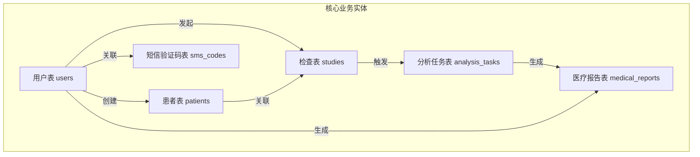
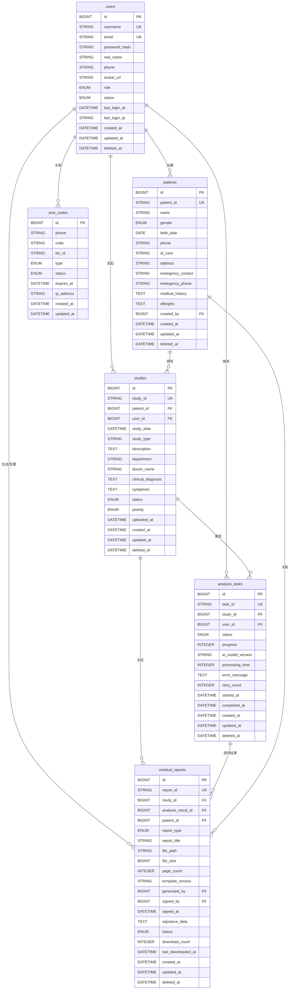

# 数据库设计

<cite>
**本文档引用的文件**
- [User.js](file://server/models/User.js)
- [Patient.js](file://server/models/Patient.js)
- [Study.js](file://server/models/Study.js)
- [AnalysisTask.js](file://server/models/AnalysisTask.js)
- [MedicalReport.js](file://server/models/MedicalReport.js)
- [SmsCode.js](file://server/models/SmsCode.js)
- [init-database.js](file://server/scripts/init-database.js)
- [database.js](file://server/config/database.js)
</cite>

## 目录
1. [引言](#引言)
2. [数据库总体结构](#数据库总体结构)
3. [核心表结构说明](#核心表结构说明)
4. [表间关系与ER图](#表间关系与erd图)
5. [数据库初始化流程](#数据库初始化流程)
6. [数据完整性与业务规则](#数据完整性与业务规则)
7. [索引策略与性能优化](#索引策略与性能优化)
8. [结论](#结论)

## 引言
本文件全面记录CervixDetectAI系统的MySQL数据库设计。系统采用Sequelize ORM进行模型定义，数据库名称为`cervix_detect_ai`，使用`utf8mb4_unicode_ci`字符集以支持中文存储和排序。数据库设计遵循规范化原则，确保数据一致性、完整性和可扩展性，支持宫颈癌AI辅助诊断系统的用户管理、患者信息、影像检查、AI分析任务及医疗报告生成等核心功能。

## 数据库总体结构
系统共定义8个核心数据表，分别对应不同的业务实体。所有表均启用时间戳（`created_at`, `updated_at`）和软删除（`deleted_at`）机制，确保数据可追溯性和安全性。数据库配置支持开发与生产环境分离，连接池配置合理，提升并发处理能力。

**Diagram sources**
- [database.js](file://server/config/database.js#L4-L61)
- [User.js](file://server/models/User.js#L6-L61)
- [Patient.js](file://server/models/Patient.js#L5-L69)
- [Study.js](file://server/models/Study.js#L5-L75)
- [AnalysisTask.js](file://server/models/AnalysisTask.js#L5-L78)
- [MedicalReport.js](file://server/models/MedicalReport.js#L5-L116)
- [SmsCode.js](file://server/models/SmsCode.js#L5-L50)

**Section sources**
- [database.js](file://server/config/database.js#L1-L62)

## 核心表结构说明

### 用户表 (users)
存储系统所有用户信息，包括管理员、医生和普通用户。

**字段定义：**
- `id`: BIGINT, 主键，自增
- `username`: VARCHAR(50), 唯一，非空
- `email`: VARCHAR(100), 唯一，非空，格式验证
- `password_hash`: VARCHAR(255), 非空，bcrypt加密存储
- `real_name`: VARCHAR(100), 可为空
- `phone`: VARCHAR(20), 可为空
- `avatar_url`: VARCHAR(500), 可为空
- `role`: ENUM('admin','doctor','user'), 非空，默认'user'
- `status`: ENUM('active','disabled'), 非空，默认'active'
- `last_login_at`: DATETIME, 最后登录时间
- `last_login_ip`: VARCHAR(45), 登录IP

**业务规则：**
- 用户名和邮箱全局唯一
- 密码在保存前自动加密
- 未提供用户名时，自动生成`user_时间戳`格式
- 管理员账号由初始化脚本创建

**Section sources**
- [User.js](file://server/models/User.js#L6-L108)

### 患者表 (patients)
存储患者基本信息及病史。

**字段定义：**
- `id`: BIGINT, 主键，自增
- `patient_id`: VARCHAR(50), 唯一，非空，自动生成
- `name`: VARCHAR(100), 非空
- `gender`: ENUM('male','female','other'), 非空
- `birth_date`: DATE, 可为空
- `phone`: VARCHAR(20), 可为空
- `id_card`: VARCHAR(50), 身份证号（加密存储）
- `address`: VARCHAR(500), 可为空
- `emergency_contact`: VARCHAR(100), 紧急联系人
- `emergency_phone`: VARCHAR(20), 紧急联系电话
- `medical_history`: TEXT, 病史
- `allergies`: TEXT, 过敏信息
- `created_by`: BIGINT, 外键，关联users.id

**业务规则：**
- `patient_id`格式为`P时间戳+3位随机数`
- 患者由特定用户创建，外键约束防止用户删除
- 姓名、电话字段建立索引便于查询

**Section sources**
- [Patient.js](file://server/models/Patient.js#L5-L102)

### 检查表 (studies)
记录每一次宫颈影像检查的元数据。

**字段定义：**
- `id`: BIGINT, 主键，自增
- `study_id`: VARCHAR(50), 唯一，非空，自动生成
- `patient_id`: BIGINT, 外键，关联patients.id
- `user_id`: BIGINT, 外键，关联users.id
- `study_date`: DATETIME, 检查日期，非空
- `study_type`: VARCHAR(50), 检查类型
- `description`: TEXT, 描述
- `department`: VARCHAR(100), 科室
- `doctor_name`: VARCHAR(100), 医生姓名
- `clinical_diagnosis`: TEXT, 临床诊断
- `symptoms`: TEXT, 症状
- `status`: ENUM('pending','uploaded','processing','completed','failed'), 状态
- `priority`: ENUM('normal','urgent','emergency'), 优先级
- `uploaded_at`: DATETIME, 上传时间

**业务规则：**
- `study_id`按日期生成，格式`SYYYYMMDD+6位序列号`
- 一个患者可有多次检查
- 检查状态机管理整个生命周期
- 按患者ID和检查日期建立复合索引

**Section sources**
- [Study.js](file://server/models/Study.js#L5-L130)

### 分析任务表 (analysis_tasks)
记录AI模型对检查的分析任务。

**字段定义：**
- `id`: BIGINT, 主键，自增
- `task_id`: VARCHAR(50), 唯一，非空，自动生成
- `study_id`: BIGINT, 外键，关联studies.id
- `user_id`: BIGINT, 外键，关联users.id
- `status`: ENUM('PENDING','PROCESSING','SUCCESS','FAILED'), 任务状态
- `progress`: INT(0-100), 进度百分比
- `ai_model_version`: VARCHAR(50), 模型版本
- `processing_time`: INT, 处理耗时（毫秒）
- `error_message`: TEXT, 错误信息
- `retry_count`: INT, 重试次数
- `started_at`: DATETIME, 开始时间
- `completed_at`: DATETIME, 完成时间

**业务规则：**
- `task_id`包含时间戳和随机字符串
- 任务状态变化驱动系统行为
- 进度和耗时用于性能监控
- 错误信息保留便于调试

**Section sources**
- [AnalysisTask.js](file://server/models/AnalysisTask.js#L5-L108)

### 医疗报告表 (medical_reports)
存储生成的医疗诊断报告。

**字段定义：**
- `id`: BIGINT, 主键，自增
- `report_id`: VARCHAR(50), 唯一，非空，自动生成
- `study_id`: BIGINT, 外键，关联studies.id
- `analysis_result_id`: BIGINT, 外键，关联analysis_results.id
- `patient_id`: BIGINT, 外键，关联patients.id
- `report_type`: ENUM('preliminary','final','supplementary'), 报告类型
- `report_title`: VARCHAR(255), 报告标题
- `file_path`: VARCHAR(500), PDF文件路径
- `file_size`: BIGINT, 文件大小（字节）
- `page_count`: INT, 页数
- `template_version`: VARCHAR(50), 模板版本
- `generated_by`: BIGINT, 外键，关联users.id
- `signed_by`: BIGINT, 外键，可为空，关联users.id
- `signed_at`: DATETIME, 签名时间
- `signature_data`: TEXT, 电子签名数据
- `status`: ENUM('draft','pending_review','approved','rejected'), 报告状态
- `download_count`: INT, 下载次数
- `last_downloaded_at`: DATETIME, 最后下载时间

**业务规则：**
- `report_id`按日期生成，格式`RYYYYMMDD+6位序列号`
- 报告可由不同用户生成和签署
- 签名后状态变为`approved`
- 下载统计用于审计

**Section sources**
- [MedicalReport.js](file://server/models/MedicalReport.js#L5-L169)

### 短信验证码表 (sms_codes)
管理短信验证码的生命周期。

**字段定义：**
- `id`: BIGINT, 主键，自增
- `phone`: VARCHAR(20), 手机号，非空
- `code`: VARCHAR(6), 验证码，非空
- `biz_id`: VARCHAR(100), 阿里云短信业务ID
- `type`: ENUM('login','register','reset_password'), 验证类型
- `status`: ENUM('pending','used','expired'), 状态
- `expires_at`: DATETIME, 过期时间，非空
- `ip_address`: VARCHAR(45), 请求IP

**业务规则：**
- 验证码有效期通常为5-10分钟
- 使用后状态更新为`used`
- 超时自动标记为`expired`
- 按手机号和验证码建立复合索引

**Section sources**
- [SmsCode.js](file://server/models/SmsCode.js#L5-L73)

## 表间关系与ERD图
以下ER图展示了核心表之间的关系。

**Diagram sources**
- [User.js](file://server/models/User.js#L6-L61)
- [Patient.js](file://server/models/Patient.js#L5-L69)
- [Study.js](file://server/models/Study.js#L5-L75)
- [AnalysisTask.js](file://server/models/AnalysisTask.js#L5-L78)
- [MedicalReport.js](file://server/models/MedicalReport.js#L5-L116)
- [SmsCode.js](file://server/models/SmsCode.js#L5-L50)

## 数据库初始化流程
`init-database.js`脚本负责数据库的初始化和默认数据创建。

**执行流程：**
1. **连接测试**：验证与MySQL数据库的连接
2. **结构同步**：调用`sequelize.sync({ alter: true })`同步模型定义到数据库
3. **管理员检查**：查询是否存在`role='admin'`的用户
4. **创建管理员**：若不存在，则创建默认管理员账号
   - 用户名：admin
   - 邮箱：admin@cervixdetectai.com
   - 密码：admin123456（bcrypt加密存储）
5. **完成退出**：输出成功信息并退出进程

**安全提示：**
- 生产环境必须修改默认密码
- 脚本通过`.env`文件读取数据库配置
- 使用bcrypt对密码进行安全哈希

**Section sources**
- [init-database.js](file://server/scripts/init-database.js#L6-L58)

## 数据完整性与业务规则
数据库设计通过多种机制确保数据完整性：

**主键与唯一约束：**
- 所有表均有`id`主键
- `users`表的`username`和`email`唯一
- `patients`表的`patient_id`唯一
- `studies`表的`study_id`唯一
- `analysis_tasks`表的`task_id`唯一
- `medical_reports`表的`report_id`唯一

**外键约束：**
- `patients.created_by` → `users.id` (RESTRICT)
- `studies.patient_id` → `patients.id` (CASCADE)
- `studies.user_id` → `users.id` (RESTRICT)
- `analysis_tasks.study_id` → `studies.id` (RESTRICT)
- `medical_reports.study_id` → `studies.id` (RESTRICT)
- `medical_reports.generated_by` → `users.id` (RESTRICT)
- `medical_reports.signed_by` → `users.id` (SET NULL)

**枚举类型约束：**
- 用户角色：admin, doctor, user
- 用户状态：active, disabled
- 检查状态：pending, uploaded, processing, completed, failed
- 任务状态：PENDING, PROCESSING, SUCCESS, FAILED
- 报告状态：draft, pending_review, approved, rejected
- 验证码类型：login, register, reset_password

**业务规则实现：**
- 自动生成ID（patient_id, study_id, task_id, report_id）
- 密码自动加密（beforeSave Hook）
- 时间戳自动管理（Sequelize配置）
- 软删除机制（paranoid: true）

**Section sources**
- [User.js](file://server/models/User.js#L43-L52)
- [Patient.js](file://server/models/Patient.js#L23-L24)
- [Study.js](file://server/models/Study.js#L72-L80)
- [AnalysisTask.js](file://server/models/AnalysisTask.js#L39-L42)
- [MedicalReport.js](file://server/models/MedicalReport.js#L103-L106)
- [SmsCode.js](file://server/models/SmsCode.js#L29-L32)

## 索引策略与性能优化
合理的索引设计是系统高性能的关键。

**主要索引：**
- **唯一索引**：`username`, `email`, `patient_id`, `study_id`, `task_id`, `report_id`
- **单列索引**：`status`, `created_at`, `patient_id`, `user_id`, `study_id`, `phone`
- **复合索引**：`patient_id + study_date`, `status + created_at`, `phone + code`

**性能优化措施：**
- 连接池配置（max: 20, min: 5）避免连接风暴
- 查询使用外键字段作为过滤条件
- 频繁查询字段（如状态、创建时间）建立索引
- 大文本字段（如病史、诊断）避免在WHERE中使用
- 软删除避免物理删除，保留审计轨迹

**Section sources**
- [User.js](file://server/models/User.js#L64-L78)
- [Patient.js](file://server/models/Patient.js#L73-L86)
- [Study.js](file://server/models/Study.js#L89-L105)
- [AnalysisTask.js](file://server/models/AnalysisTask.js#L81-L94)
- [MedicalReport.js](file://server/models/MedicalReport.js#L120-L144)
- [SmsCode.js](file://server/models/SmsCode.js#L53-L68)

## 结论
CervixDetectAI的数据库设计结构清晰、关系明确，充分考虑了数据完整性、安全性和性能需求。通过Sequelize ORM实现了模型与数据库的映射，自动化脚本确保了环境的一致性。该设计支持系统的可扩展性和维护性，为宫颈癌AI辅助诊断提供了坚实的数据基础。