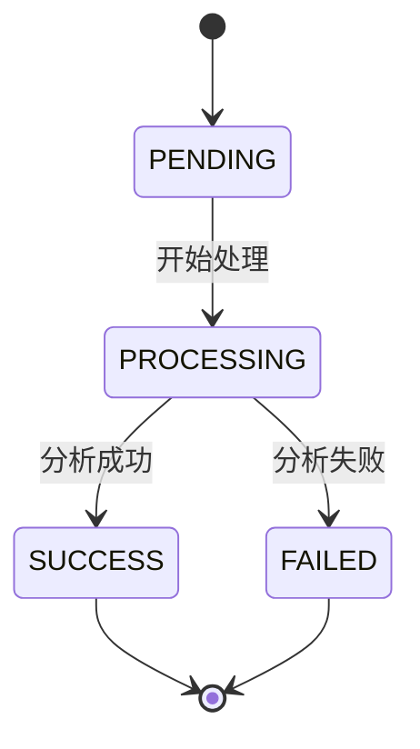
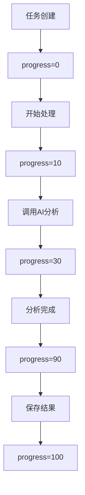
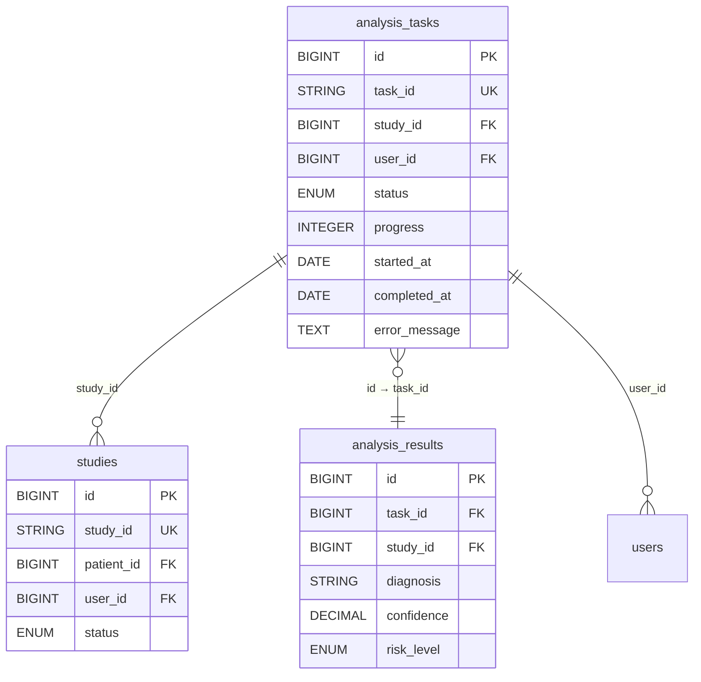
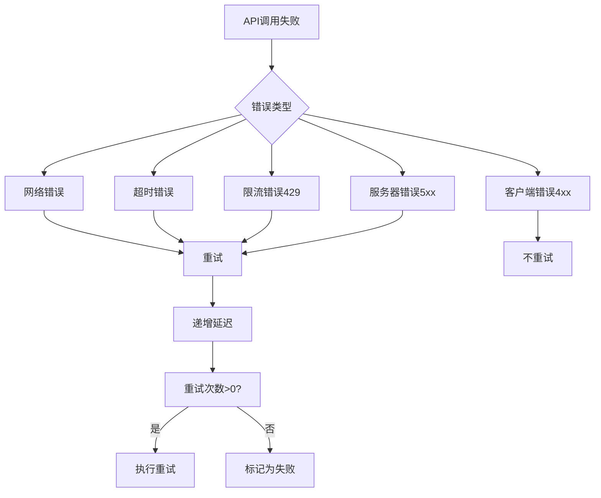
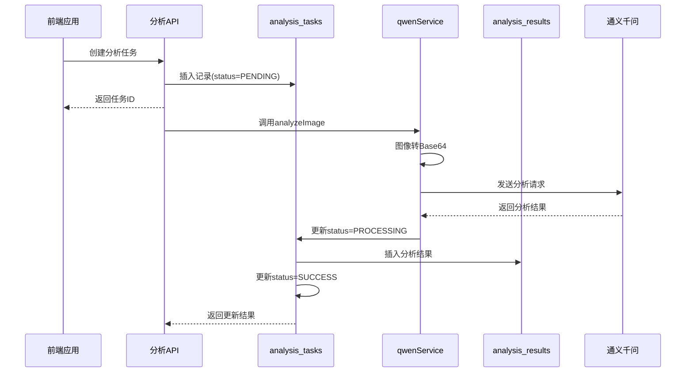
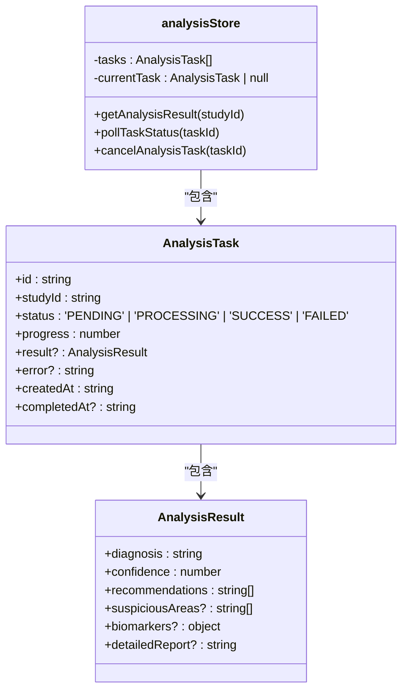

# 分析任务表 (analysis_tasks)

> **本文档引用的文件**
> - [AnalysisTask.js](file://server/models/AnalysisTask.js)
> - [qwenService.js](file://server/services/qwenService.js)
> - [analyze.js](file://server/routes/analyze.js)
> - [analysis-tasks.js](file://server/routes/analysis-tasks.js)
> - [Study.js](file://server/models/Study.js)
> - [AnalysisResult.js](file://server/models/AnalysisResult.js)
> - [analysisStore.ts](file://src/stores/analysisStore.ts)

## 目录
1. [简介](#简介)
2. [表结构与字段说明](#表结构与字段说明)
3. [状态机生命周期管理](#状态机生命周期管理)
4. [进度实时更新机制](#进度实时更新机制)
5. [关联关系分析](#关联关系分析)
6. [任务失败重试策略](#任务失败重试策略)
7. [AI分析流程驱动机制](#ai分析流程驱动机制)
8. [前端状态管理](#前端状态管理)
9. [结论](#结论)

## 简介
分析任务表（analysis_tasks）是宫颈细胞学AI分析系统的核心数据表，负责管理所有AI分析任务的全生命周期。该表记录了从任务创建、处理、完成到失败的完整状态流转，通过与病例表（studies）和分析结果表（analysis_results）的关联，实现了AI分析流程的闭环管理。本文档详细阐述了该表的状态机管理、进度更新、关联关系和重试策略，并结合qwenService.js说明如何通过此表驱动整个AI分析流程。

## 表结构与字段说明
分析任务表包含以下核心字段：

| 字段名 | 类型 | 约束 | 说明 |
|--------|------|------|------|
| id | BIGINT | 主键，自增 | 任务记录的唯一标识 |
| task_id | STRING(50) | 非空，唯一 | 任务的唯一标识符，由系统自动生成 |
| study_id | BIGINT | 非空，外键 | 关联的病例ID，引用studies表 |
| user_id | BIGINT | 非空，外键 | 提交任务的用户ID，引用users表 |
| status | ENUM | 非空，默认PENDING | 任务状态：PENDING/PROCESSING/SUCCESS/FAILED |
| progress | INTEGER | 非空，默认0，范围0-100 | 任务处理进度百分比 |
| result_id | BIGINT | 外键 | 分析结果ID，引用analysis_results表 |
| started_at | DATE | 可为空 | 任务开始处理时间 |
| completed_at | DATE | 可为空 | 任务完成时间 |
| error_message | TEXT | 可为空 | 任务失败原因描述 |
| created_at | DATE | 系统自动生成 | 记录创建时间 |

**Section sources**
- [AnalysisTask.js](file://server/models/AnalysisTask.js#L8-L77)

## 状态机生命周期管理
分析任务表实现了完整的状态机生命周期管理，通过status字段的四个状态值（PENDING、PROCESSING、SUCCESS、FAILED）来控制任务的流转。

**Diagram sources**
- [AnalysisTask.js](file://server/models/AnalysisTask.js#L39-L41)
- [analyze.js](file://server/routes/analyze.js#L249-L272)

当任务创建时，status默认为PENDING；当开始处理时，更新为PROCESSING；处理成功后变为SUCCESS；处理失败则变为FAILED。这种状态机设计确保了任务状态的清晰和可追踪性。

**Section sources**
- [AnalysisTask.js](file://server/models/AnalysisTask.js#L39-L41)
- [analyze.js](file://server/routes/analyze.js#L249-L272)

## 进度实时更新机制
progress字段实现了任务处理进度的实时更新，范围为0-100的整数，表示任务完成的百分比。

**Diagram sources**
- [analyze.js](file://server/routes/analyze.js#L250-L273)

在任务处理过程中，progress字段会根据处理阶段逐步更新：创建时为0，开始处理时更新为10，调用AI分析时更新为30，分析完成时更新为90，最终保存结果时更新为100。这种渐进式的进度更新机制为用户提供了良好的体验反馈。

**Section sources**
- [analyze.js](file://server/routes/analyze.js#L250-L273)

## 关联关系分析
分析任务表与系统中的其他核心表建立了明确的关联关系，形成了完整的数据链路。

**Diagram sources**
- [AnalysisTask.js](file://server/models/AnalysisTask.js#L18-L37)
- [Study.js](file://server/models/Study.js#L18-L37)
- [AnalysisResult.js](file://server/models/AnalysisResult.js#L13-L33)

分析任务表通过study_id外键关联studies表，实现与病例数据的绑定；通过user_id外键关联users表，记录提交用户信息；同时与analysis_results表建立一对一关系，存储分析结果。这种关联设计确保了数据的一致性和完整性。

**Section sources**
- [AnalysisTask.js](file://server/models/AnalysisTask.js#L18-L37)
- [Study.js](file://server/models/Study.js#L18-L37)
- [AnalysisResult.js](file://server/models/AnalysisResult.js#L13-L33)

## 任务失败重试策略
系统实现了完善的任务失败重试策略，确保在临时性故障时能够自动恢复。

**Diagram sources**
- [qwenService.js](file://server/services/qwenService.js#L199-L215)

在qwenService.js中，shouldRetry方法定义了重试条件：网络错误、超时、API限流（429）和服务器错误（5xx）都会触发重试，而客户端错误（4xx）则不会重试。重试采用递增延迟策略，确保系统不会因频繁重试而加重负担。

**Section sources**
- [qwenService.js](file://server/services/qwenService.js#L199-L215)

## AI分析流程驱动机制
分析任务表是整个AI分析流程的核心驱动器，通过与qwenService.js的协同工作，实现了从任务创建到结果生成的完整流程。

**Diagram sources**
- [analyze.js](file://server/routes/analyze.js#L239-L337)
- [qwenService.js](file://server/services/qwenService.js#L85-L177)

当用户上传图像时，系统首先在analysis_tasks表中创建一条PENDING状态的任务记录，然后异步调用qwenService进行AI分析。在分析过程中，不断更新任务状态和进度，最终将结果保存到analysis_results表并更新任务状态为SUCCESS。

**Section sources**
- [analyze.js](file://server/routes/analyze.js#L239-L337)
- [qwenService.js](file://server/services/qwenService.js#L85-L177)

## 前端状态管理
前端通过analysisStore.ts对分析任务状态进行统一管理，实现了与后端数据的同步。

**Diagram sources**
- [analysisStore.ts](file://src/stores/analysisStore.ts#L17-L26)
- [analysisStore.ts](file://src/stores/analysisStore.ts#L4-L15)

前端定义了AnalysisTask接口，与后端任务表结构对应，并通过Vuex store进行状态管理。通过轮询机制获取任务最新状态，实现前端界面的实时更新。

**Section sources**
- [analysisStore.ts](file://src/stores/analysisStore.ts#L17-L26)
- [analysisStore.ts](file://src/stores/analysisStore.ts#L4-L15)

## 结论
分析任务表作为AI分析系统的核心，通过完善的状态机设计、进度更新机制、关联关系和重试策略，实现了对AI分析任务的全生命周期管理。该表与qwenService.js等服务组件紧密协作，驱动了从任务创建到结果生成的完整流程，为系统提供了可靠的任务管理和错误处理能力。这种设计模式确保了系统的稳定性、可追踪性和用户体验。