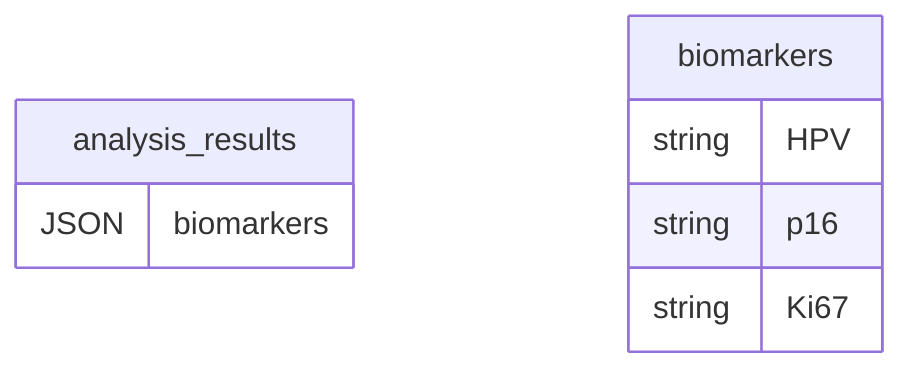
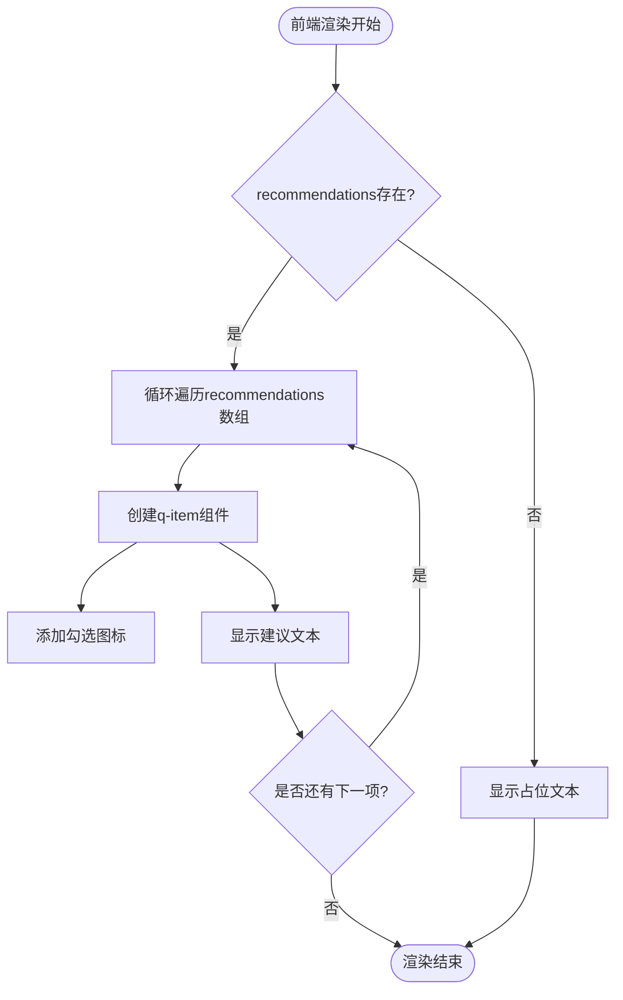
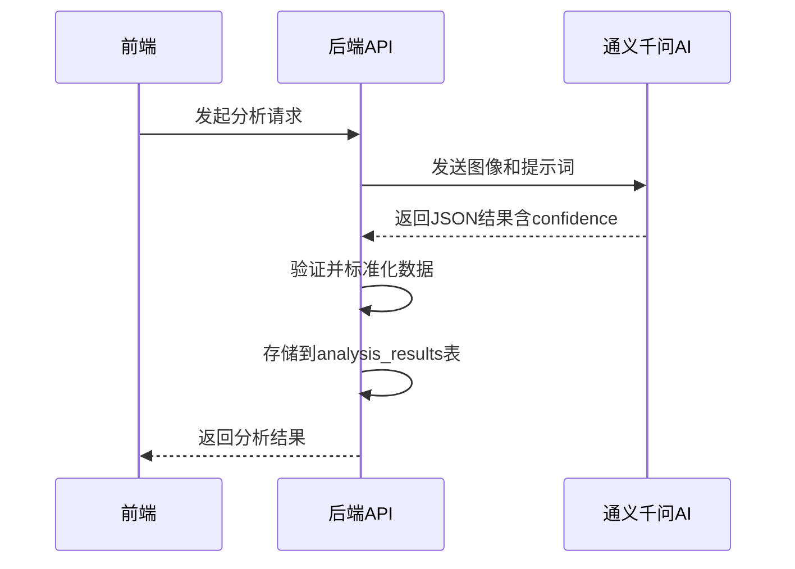
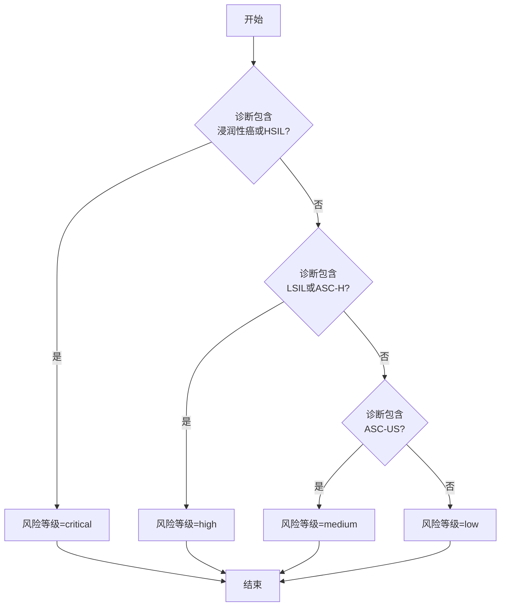
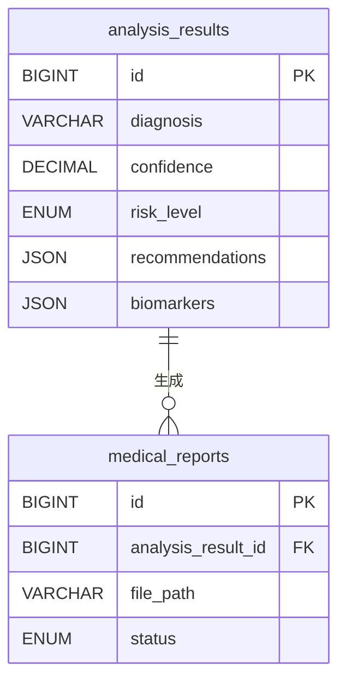
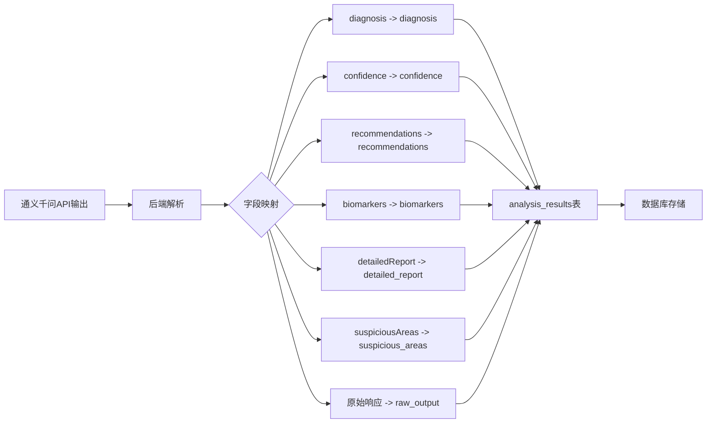

# 分析结果表 (analysis_results)

> **本文档引用文件**   
> - [AnalysisResult.js](file://server/models/AnalysisResult.js)
> - [qwenService.js](file://server/services/qwenService.js)
> - [analyze.js](file://server/routes/analyze.js)
> - [analysis-tasks.js](file://server/routes/analysis-tasks.js)
> - [reports.js](file://server/routes/reports.js)
> - [StudyDetailPage.vue](file://src/pages/StudyDetailPage.vue)
> - [analysisStore.ts](file://src/stores/analysisStore.ts)
> - [database-feature-expansion.md](file://.qoder/quests/database-feature-expansion.md)

## 目录
1. [表结构概览](#表结构概览)
2. [JSON字段数据结构设计](#json字段数据结构设计)
3. [置信度计算逻辑](#置信度计算逻辑)
4. [风险等级分级标准](#风险等级分级标准)
5. [与医疗报告表的关联](#与医疗报告表的关联)
6. [通义千问API输出映射](#通义千问api输出映射)

## 表结构概览

`analysis_results` 表是系统中存储AI分析详细结果的核心数据表，其字段设计如下：

| 字段名 | 数据类型 | 约束 | 说明 |
|--------|--------|------|------|
| id | BIGINT | PRIMARY KEY, AUTO_INCREMENT | 结果唯一标识 |
| task_id | BIGINT | NOT NULL, FOREIGN KEY, UNIQUE | 关联任务ID（一对一） |
| study_id | BIGINT | NOT NULL, FOREIGN KEY | 关联病例ID |
| diagnosis | VARCHAR(255) | NOT NULL | 诊断结论 |
| confidence | DECIMAL(5,4) | NOT NULL | 置信度（0-1） |
| risk_level | ENUM('low', 'medium', 'high', 'critical') | NOT NULL | 风险等级 |
| recommendations | JSON | NOT NULL | 医疗建议列表 |
| suspicious_areas | JSON | NULL | 可疑区域坐标数据 |
| biomarkers | JSON | NULL | 生物标志物数据（HPV、p16、Ki67等） |
| detailed_report | TEXT | NULL | 详细报告文本 |
| heatmap_url | VARCHAR(500) | NULL | 热力图文件路径 |
| annotated_image_url | VARCHAR(500) | NULL | 标注图像路径 |
| raw_output | JSON | NULL | AI模型原始输出（用于调试） |
| reviewed_by | BIGINT | NULL, FOREIGN KEY | 审核医生ID |
| reviewed_at | DATETIME | NULL | 审核时间 |
| review_comments | TEXT | NULL | 审核意见 |
| created_at | DATETIME | NOT NULL | 创建时间 |
| updated_at | DATETIME | NOT NULL | 更新时间 |

**索引设计**：
- 主键索引：id
- 外键索引：task_id, study_id, reviewed_by
- 普通索引：diagnosis, risk_level

**业务逻辑**：
- recommendations、suspicious_areas、biomarkers存储为JSON格式
- 支持通过任务ID、病例ID、诊断结果、风险等级等字段进行高效查询

**Section sources**
- [AnalysisResult.js](file://server/models/AnalysisResult.js#L5-L123)
- [database-feature-expansion.md](file://.qoder/quests/database-feature-expansion.md#L255-L303)

## JSON字段数据结构设计

### 生物标志物 (biomarkers) 数据结构

`biomarkers` 字段存储生物标志物的检测结果，采用JSON格式存储，支持动态扩展。其标准结构如下：

```json
{
  "HPV": "阴性/阳性",
  "p16": "阴性/阳性",
  "Ki67": "低/中/高"
}
```

该字段在前端展示时，通过条件渲染显示检测到的标志物。例如，在 `StudyDetailPage.vue` 中，通过 `v-if="analysisResult.biomarkers?.HPV"` 判断是否显示HPV检测结果。



**Diagram sources **
- [AnalysisResult.js](file://server/models/AnalysisResult.js#L60-L64)
- [StudyDetailPage.vue](file://src/pages/StudyDetailPage.vue#L106-L133)

### 处理建议 (recommendations) 数据结构

`recommendations` 字段存储医疗建议列表，采用JSON数组格式存储。其标准结构为字符串数组：

```json
["建议进行阴道镜检查", "建议3个月后复查", "建议HPV分型检测"]
```

该字段在前端通过 `v-for="(rec, index) in analysisResult.recommendations"` 进行循环渲染，每个建议项显示为一个带勾选图标的列表项。



**Diagram sources **
- [AnalysisResult.js](file://server/models/AnalysisResult.js#L50-L54)
- [StudyDetailPage.vue](file://src/pages/StudyDetailPage.vue#L172-L196)

**Section sources**
- [AnalysisResult.js](file://server/models/AnalysisResult.js#L50-L64)
- [StudyDetailPage.vue](file://src/pages/StudyDetailPage.vue#L106-L196)

## 置信度计算逻辑

`confidence` 字段表示AI诊断的置信度，取值范围为0.0-1.0，数据类型为DECIMAL(5,4)，确保精度到小数点后四位。

置信度的计算完全由通义千问AI模型在分析图像时生成。在 `qwenService.js` 中，AI模型的响应被解析后，`confidence` 字段直接取自模型输出的 `confidence` 属性：

```javascript
return {
  diagnosis: result.diagnosis || '未知',
  confidence: typeof result.confidence === 'number' ? result.confidence : 0.5,
  // ...
};
```

如果模型未返回置信度或返回值无效，则默认值为0.5。该值随后被直接存储到数据库中。



**Diagram sources **
- [qwenService.js](file://server/services/qwenService.js#L165-L166)
- [analyze.js](file://server/routes/analyze.js#L295-L296)

**Section sources**
- [AnalysisResult.js](file://server/models/AnalysisResult.js#L38-L45)
- [qwenService.js](file://server/services/qwenService.js#L165-L166)

## 风险等级分级标准

`risk_level` 字段表示诊断结果的风险等级，枚举值为 'low', 'medium', 'high', 'critical'。该等级并非直接由AI模型输出，而是由后端根据诊断结论（diagnosis）自动计算得出。

在 `analyze.js` 路由处理中，通过分析诊断结论的文本内容来确定风险等级：

```javascript
let riskLevel = 'low';
if (result.diagnosis.includes('浸润性癌') || result.diagnosis.includes('HSIL')) {
  riskLevel = 'critical';
} else if (result.diagnosis.includes('LSIL') || result.diagnosis.includes('ASC-H')) {
  riskLevel = 'high';
} else if (result.diagnosis.includes('ASC-US')) {
  riskLevel = 'medium';
}
```

分级标准如下：
- **critical (危急)**：包含“浸润性癌”或“HSIL”（高度鳞状上皮内病变）
- **high (高)**：包含“LSIL”（低度鳞状上皮内病变）或“ASC-H”（非典型鳞状细胞-不能排除HSIL）
- **medium (中)**：包含“ASC-US”（非典型鳞状细胞-意义不明）
- **low (低)**：其他情况



**Diagram sources **
- [analyze.js](file://server/routes/analyze.js#L281-L289)

**Section sources**
- [AnalysisResult.js](file://server/models/AnalysisResult.js#L46-L49)
- [analyze.js](file://server/routes/analyze.js#L281-L289)

## 与医疗报告表的关联

`analysis_results` 表与 `medical_reports` 表通过 `analysis_result_id` 字段建立外键关联，实现从AI分析结果到最终医疗报告的生成。

在 `MedicalReport.js` 模型中，定义了与 `analysis_results` 的关联：

```javascript
analysis_result_id: {
  type: DataTypes.BIGINT,
  allowNull: false,
  references: {
    model: 'analysis_results',
    key: 'id',
  },
  onUpdate: 'CASCADE',
  onDelete: 'RESTRICT',
},
```

当生成报告时，系统会查找最新的分析结果，并将其内容整合到报告中：

```javascript
const reportContent = {
  analysis_result: {
    risk_level: result.risk_level,
    confidence_score: result.confidence_score,
    primary_diagnosis: result.primary_diagnosis,
    recommendations: result.recommendations,
    biomarkers: result.biomarkers,
    suspicious_areas: result.suspicious_areas,
  },
};
```



**Diagram sources **
- [MedicalReport.js](file://server/models/MedicalReport.js#L28-L37)
- [reports.js](file://server/routes/reports.js#L152-L159)

**Section sources**
- [MedicalReport.js](file://server/models/MedicalReport.js#L28-L37)
- [reports.js](file://server/routes/reports.js#L116-L161)

## 通义千问API输出映射

通义千问API的输出与 `analysis_results` 表字段存在明确的映射关系。在 `qwenService.js` 中，AI模型的原始JSON输出被解析并映射到数据库字段。

通义千问API的提示词（SYSTEM_PROMPT）要求返回特定格式的JSON：

```json
{
  "diagnosis": "诊断分类",
  "confidence": 0.95,
  "suspiciousAreas": [],
  "biomarkers": {},
  "recommendations": [],
  "detailedReport": "详细报告文本"
}
```

后端服务将这些字段映射到数据库：

| 通义千问API输出字段 | analysis_results表字段 | 映射逻辑 |
|-------------------|---------------------|--------|
| diagnosis | diagnosis | 直接映射，空值时为'未知' |
| confidence | confidence | 直接映射，无效时为0.5 |
| recommendations | recommendations | 直接映射，空值时为默认建议 |
| biomarkers | biomarkers | 直接映射，空值时为默认值 |
| detailedReport | detailed_report | 直接映射，空值时为错误信息 |
| (无) | risk_level | 根据diagnosis内容计算得出 |
| (无) | suspicious_areas | 映射自suspiciousAreas |
| (无) | raw_output | 存储原始API响应 |



**Diagram sources **
- [qwenService.js](file://server/services/qwenService.js#L163-L177)
- [analyze.js](file://server/routes/analyze.js#L291-L302)

**Section sources**
- [qwenService.js](file://server/services/qwenService.js#L163-L177)
- [analyze.js](file://server/routes/analyze.js#L291-L302)