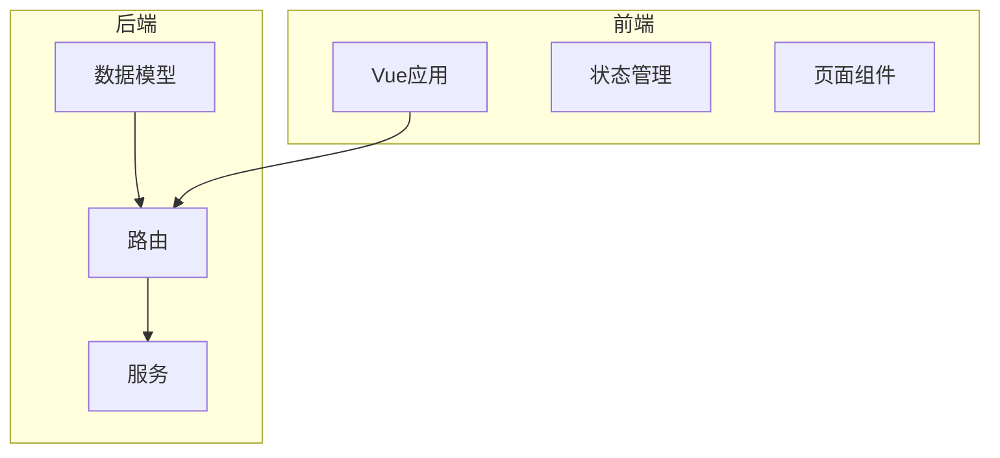
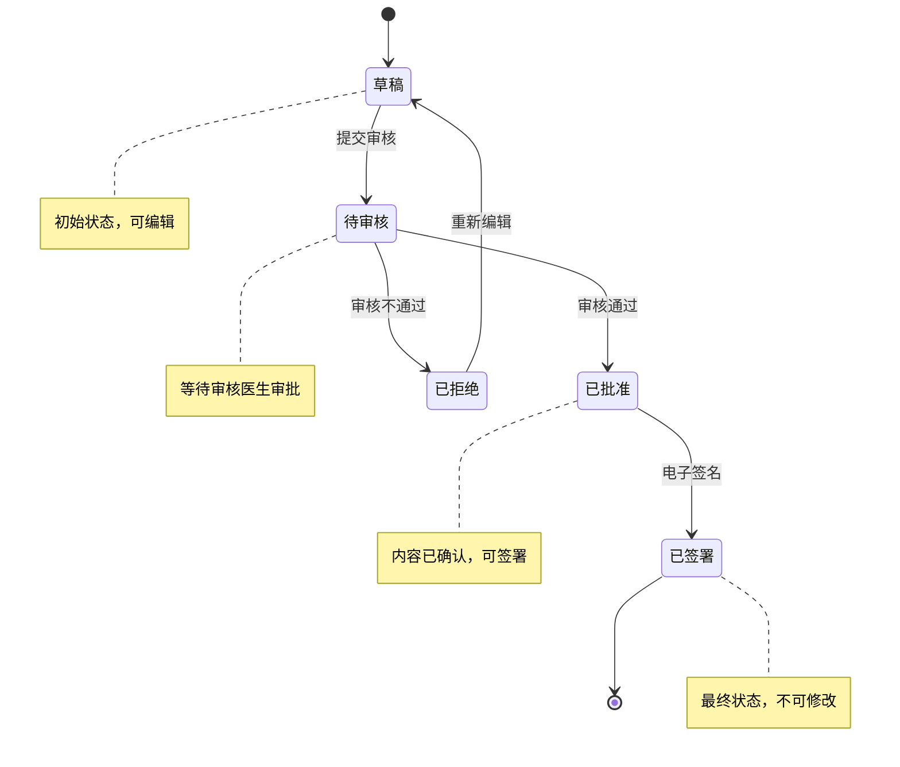
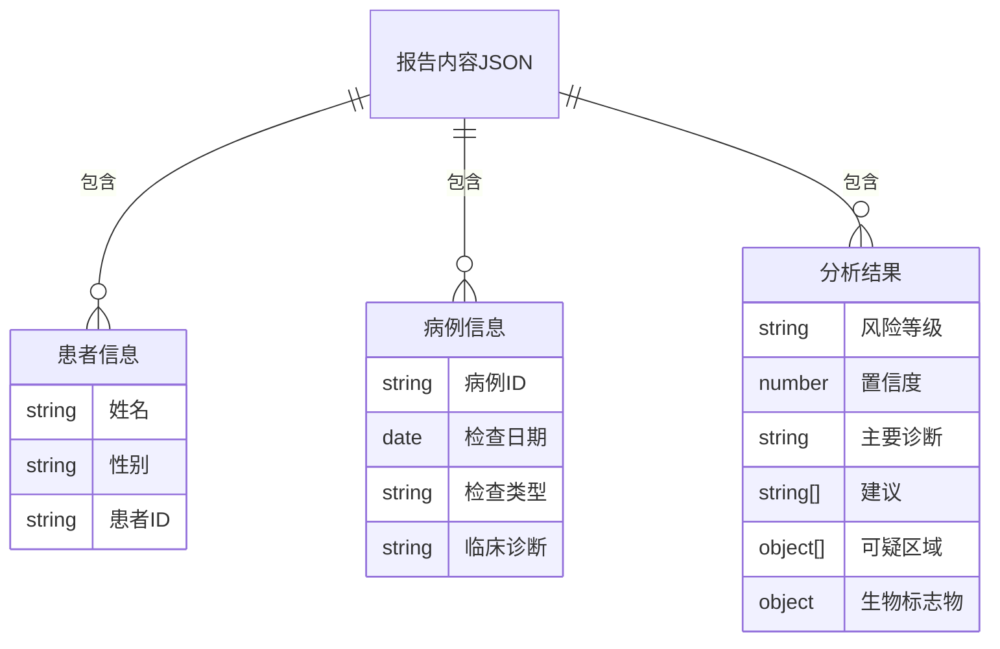
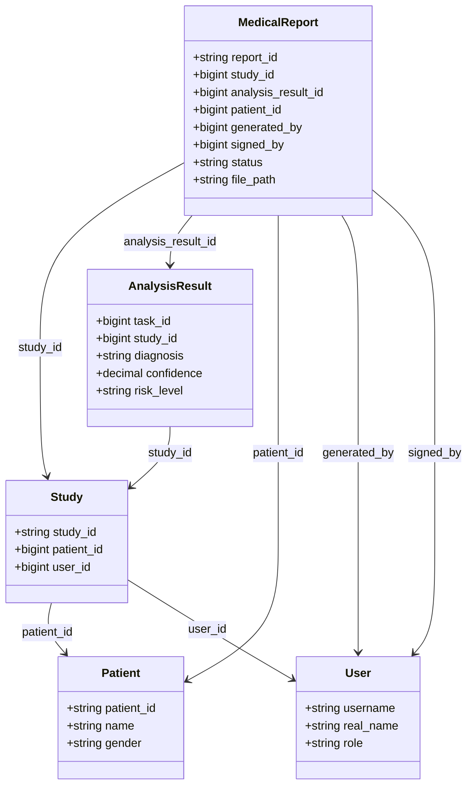
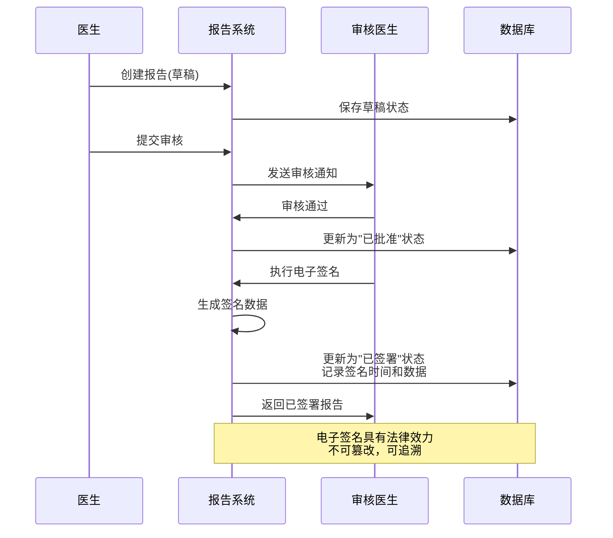
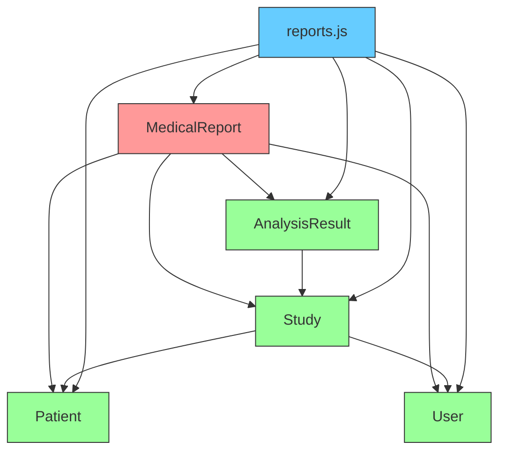

# 医疗报告表 (medical_reports)

<cite>
**本文档引用的文件**
- [MedicalReport.js](file://server/models/MedicalReport.js)
- [reports.js](file://server/routes/reports.js)
- [AnalysisResult.js](file://server/models/AnalysisResult.js)
- [Study.js](file://server/models/Study.js)
- [User.js](file://server/models/User.js)
- [Patient.js](file://server/models/Patient.js)
</cite>

## 目录
1. [项目结构](#项目结构)
2. [核心组件](#核心组件)
3. [状态流转分析](#状态流转分析)
4. [报告内容JSON结构](#报告内容json结构)
5. [关联分析](#关联分析)
6. [电子签名与法律合规性](#电子签名与法律合规性)
7. [PDF生成与存储策略](#pdf生成与存储策略)
8. [依赖关系分析](#依赖关系分析)

## 项目结构



**图表来源**
- [MedicalReport.js](file://server/models/MedicalReport.js#L1-L170)
- [reports.js](file://server/routes/reports.js#L1-L488)

**本节来源**
- [MedicalReport.js](file://server/models/MedicalReport.js#L1-L170)
- [reports.js](file://server/routes/reports.js#L1-L488)

## 核心组件

医疗报告系统的核心组件包括医疗报告模型(MedicalReport)、分析结果模型(AnalysisResult)、病例模型(Study)和用户模型(User)。这些组件通过外键关联形成完整的医疗数据链。

**本节来源**
- [MedicalReport.js](file://server/models/MedicalReport.js#L1-L170)
- [AnalysisResult.js](file://server/models/AnalysisResult.js#L1-L127)
- [Study.js](file://server/models/Study.js#L1-L131)
- [User.js](file://server/models/User.js#L1-L109)

## 状态流转分析

医疗报告的状态流转是系统的核心业务逻辑，从草稿到最终签署的完整流程如下：



**图表来源**
- [MedicalReport.js](file://server/models/MedicalReport.js#L102-L106)
- [reports.js](file://server/routes/reports.js#L338-L349)

**本节来源**
- [MedicalReport.js](file://server/models/MedicalReport.js#L102-L106)
- [reports.js](file://server/routes/reports.js#L338-L349)

## 报告内容JSON结构

医疗报告的内容以JSON格式存储，包含患者信息、病例信息和分析结果三个主要部分：



**图表来源**
- [reports.js](file://server/routes/reports.js#L140-L161)
- [AnalysisResult.js](file://server/models/AnalysisResult.js#L46-L64)

**本节来源**
- [reports.js](file://server/routes/reports.js#L140-L161)
- [AnalysisResult.js](file://server/models/AnalysisResult.js#L46-L64)

## 关联分析

医疗报告与系统中其他实体的关联关系如下：



**图表来源**
- [MedicalReport.js](file://server/models/MedicalReport.js#L18-L92)
- [Study.js](file://server/models/Study.js#L13-L37)
- [AnalysisResult.js](file://server/models/AnalysisResult.js#L13-L27)
- [Patient.js](file://server/models/Patient.js#L13-L22)
- [User.js](file://server/models/User.js#L14-L47)

**本节来源**
- [MedicalReport.js](file://server/models/MedicalReport.js#L18-L92)
- [Study.js](file://server/models/Study.js#L13-L37)
- [AnalysisResult.js](file://server/models/AnalysisResult.js#L13-L27)
- [Patient.js](file://server/models/Patient.js#L13-L22)
- [User.js](file://server/models/User.js#L14-L47)

## 电子签名与法律合规性

电子签名流程确保了医疗报告的法律效力和安全性：



**图表来源**
- [MedicalReport.js](file://server/models/MedicalReport.js#L83-L96)
- [reports.js](file://server/routes/reports.js#L345-L348)

**本节来源**
- [MedicalReport.js](file://server/models/MedicalReport.js#L83-L96)
- [reports.js](file://server/routes/reports.js#L345-L348)

## PDF生成与存储策略

PDF报告的生成和存储遵循以下策略：

```mermaid
flowchart TD
A[创建或更新报告] --> B{状态为"已签署"?}
B --> |是| C[生成PDF报告]
C --> D[确定存储路径<br/>reports/YYYYMMDD/]
D --> E[生成文件名<br/>报告ID.pdf]
E --> F[保存PDF文件]
F --> G[更新数据库<br/>file_path字段]
G --> H[返回成功]
B --> |否| I[不生成PDF]
I --> H
style C fill:#f9f,stroke:#333
style D fill:#f9f,stroke:#333
style E fill:#f9f,stroke:#333
style F fill:#f9f,stroke:#333
style G fill:#f9f,stroke:#333
```

**图表来源**
- [MedicalReport.js](file://server/models/MedicalReport.js#L56-L64)
- [reports.js](file://server/routes/reports.js#L413-L428)

**本节来源**
- [MedicalReport.js](file://server/models/MedicalReport.js#L56-L64)
- [reports.js](file://server/routes/reports.js#L413-L428)

## 依赖关系分析

系统各组件之间的依赖关系如下：



**图表来源**
- [MedicalReport.js](file://server/models/MedicalReport.js#L18-L92)
- [reports.js](file://server/routes/reports.js#L5-L6)
- [Study.js](file://server/models/Study.js#L13-L37)
- [AnalysisResult.js](file://server/models/AnalysisResult.js#L13-L27)
- [Patient.js](file://server/models/Patient.js#L13-L22)
- [User.js](file://server/models/User.js#L14-L47)

**本节来源**
- [MedicalReport.js](file://server/models/MedicalReport.js#L18-L92)
- [reports.js](file://server/routes/reports.js#L5-L6)
- [Study.js](file://server/models/Study.js#L13-L37)
- [AnalysisResult.js](file://server/models/AnalysisResult.js#L13-L27)
- [Patient.js](file://server/models/Patient.js#L13-L22)
- [User.js](file://server/models/User.js#L14-L47)