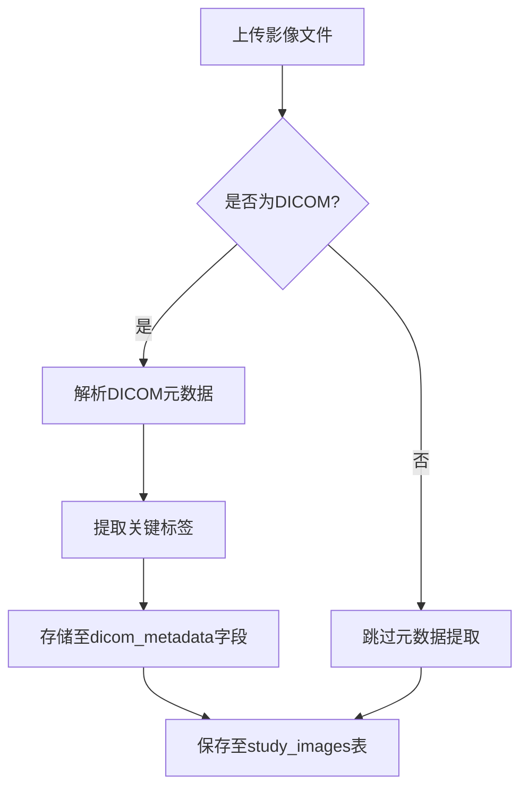
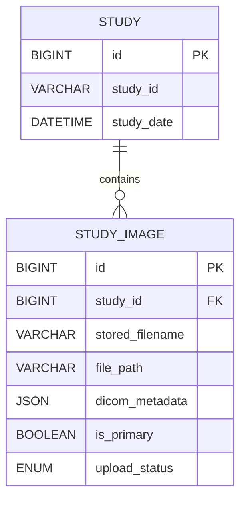

# 影像文件表 (study_images)

<cite>
**本文档中引用的文件**  
- [StudyImage.js](file://server/models/StudyImage.js)
- [studies.js](file://server/routes/studies.js)
- [analyze.js](file://server/routes/analyze.js)
</cite>

## 目录
1. [简介](#简介)
2. [表结构与字段说明](#表结构与字段说明)
3. [DICOM元数据提取与存储](#dicom元数据提取与存储)
4. [UUID命名避免冲突](#uuid命名避免冲突)
5. [缩略图生成策略](#缩略图生成策略)
6. [DICOM标准兼容性](#dicom标准兼容性)
7. [文件路径安全访问控制](#文件路径安全访问控制)
8. [数据完整性与索引设计](#数据完整性与索引设计)
9. [上传状态管理](#上传状态管理)
10. [主影像标记机制](#主影像标记机制)

## 简介
`study_images` 表是宫颈癌AI辅助诊断系统中用于存储医学影像文件的核心数据表。该表不仅记录了影像的基本属性（如文件名、大小、格式等），还支持DICOM标准元数据的存储与解析，确保医学影像数据的完整性和可追溯性。通过合理的字段设计和业务逻辑集成，实现了高效、安全、可扩展的医学影像管理能力。

**Section sources**
- [StudyImage.js](file://server/models/StudyImage.js#L4-L100)

## 表结构与字段说明
`study_images` 表包含以下关键字段：

| 字段名 | 类型 | 是否可为空 | 默认值 | 说明 |
|--------|------|------------|--------|------|
| id | BIGINT | 否 | - | 主键，自增 |
| study_id | BIGINT | 否 | - | 关联病例ID，外键引用 `studies.id`，级联更新/删除 |
| original_filename | STRING(255) | 否 | - | 原始文件名 |
| stored_filename | STRING(255) | 否 | - | 存储文件名（UUID） |
| file_path | STRING(500) | 否 | - | 文件存储路径 |
| thumbnail_path | STRING(500) | 是 | NULL | 缩略图路径 |
| file_size | BIGINT | 否 | - | 文件大小（字节） |
| mime_type | STRING(50) | 否 | - | MIME类型 |
| file_format | STRING(20) | 否 | - | 文件格式（DICOM/JPEG/PNG等） |
| width | INTEGER | 是 | NULL | 图像宽度 |
| height | INTEGER | 是 | NULL | 图像高度 |
| series_number | INTEGER | 是 | NULL | DICOM序列号 |
| instance_number | INTEGER | 是 | NULL | DICOM实例号 |
| dicom_metadata | JSON | 是 | NULL | DICOM元数据（JSON格式） |
| is_primary | BOOLEAN | 否 | false | 是否为主影像 |
| upload_status | ENUM('pending', 'completed', 'failed') | 否 | 'pending' | 上传状态 |

**Section sources**
- [StudyImage.js](file://server/models/StudyImage.js#L4-L100)

## DICOM元数据提取与存储
系统在接收到医学影像文件后，会自动解析其DICOM元数据，并将关键标签以JSON格式存储于 `dicom_metadata` 字段中。该字段支持结构化查询，便于后续进行影像特征分析、设备信息追溯和质量控制。

虽然当前代码中未直接体现DICOM解析逻辑，但 `dicom_metadata` 字段的存在表明系统具备扩展DICOM处理的能力。未来可通过集成 `dcmjs` 或 `cornerstone` 等库实现自动提取患者ID、设备型号、扫描参数等关键信息。



**Diagram sources**
- [StudyImage.js](file://server/models/StudyImage.js#L71-L75)

## UUID命名避免冲突
为防止文件名重复导致的覆盖问题，系统采用UUID作为存储文件名。在 `analyze.js` 路由中，通过 `uuidv4()` 生成唯一文件名：

```javascript
const { v4: uuidv4 } = require('uuid');
// ...
filename: function (req, file, cb) {
  const ext = path.extname(file.originalname);
  const filename = `${uuidv4()}${ext}`;
  cb(null, filename);
}
```

此策略确保每个上传的文件都拥有全局唯一的存储名称，极大提升了系统的稳定性和安全性。

**Section sources**
- [analyze.js](file://server/routes/analyze.js#L6-L22)

## 缩略图生成策略
系统支持为上传的影像生成缩略图，路径存储于 `thumbnail_path` 字段。该字段允许为空，表明缩略图生成为可选操作。实际生成逻辑可能由异步任务或中间件完成，未在当前代码中直接体现。

建议后续集成图像处理库（如 `sharp` 或 `graphicsmagick`）在文件上传后自动生成缩略图，并更新 `thumbnail_path` 字段，以提升前端展示效率。

**Section sources**
- [StudyImage.js](file://server/models/StudyImage.js#L36-L39)

## DICOM标准兼容性
尽管当前上传接口主要支持JPEG、PNG等常见格式，但表结构设计已充分考虑DICOM标准兼容性：
- 支持存储DICOM特有的 `series_number` 和 `instance_number`
- `file_format` 字段预留 'DICOM' 枚举值
- `dicom_metadata` 字段可完整保存DICOM标签树

未来可通过扩展文件解析模块，实现对 `.dcm` 文件的直接支持，并自动填充相关字段，从而完全兼容DICOM标准。

**Section sources**
- [StudyImage.js](file://server/models/StudyImage.js#L61-L75)

## 文件路径安全访问控制
文件路径通过 `file_path` 字段存储，且路径为相对路径（如 `/uploads/studies/filename.jpg`）。系统通过以下机制保障访问安全：
1. **权限校验**：在访问病例或影像前，检查用户角色和所有权
2. **路径隔离**：所有文件统一存储于 `uploads/studies` 目录下，避免路径穿越
3. **删除同步**：删除数据库记录时同步删除物理文件

例如，在删除影像时：
```javascript
const filePath = path.join(__dirname, '..', image.file_path);
if (fs.existsSync(filePath)) {
  fs.unlinkSync(filePath);
}
await image.destroy();
```

**Section sources**
- [studies.js](file://server/routes/studies.js#L507-L513)

## 数据完整性与索引设计
表结构通过外键约束和索引设计保障数据完整性：
- `study_id` 外键引用 `studies.id`，级联更新/删除
- 创建复合索引 `idx_study_series_instance`（study_id, series_number, instance_number），优化按序列查询性能
- `created_at` 自动记录创建时间



**Diagram sources**
- [StudyImage.js](file://server/models/StudyImage.js#L13-L22)
- [StudyImage.js](file://server/models/StudyImage.js#L92-L98)

## 上传状态管理
`upload_status` 字段采用枚举类型，支持三种状态：
- `pending`：上传中
- `completed`：上传完成
- `failed`：上传失败

该字段可用于监控上传进度、重试失败任务或清理临时文件。例如，在异步处理任务中，成功保存后会将状态更新为 `completed`。

**Section sources**
- [StudyImage.js](file://server/models/StudyImage.js#L81-L85)

## 主影像标记机制
`is_primary` 字段用于标识某张影像是否为该病例的主影像（如最具代表性的视图）。前端可据此优先展示主影像，或在生成报告时作为默认配图。

在批量上传场景中，系统可自动将第一张上传的影像标记为主影像，或由医生手动指定。

**Section sources**
- [StudyImage.js](file://server/models/StudyImage.js#L76-L80)