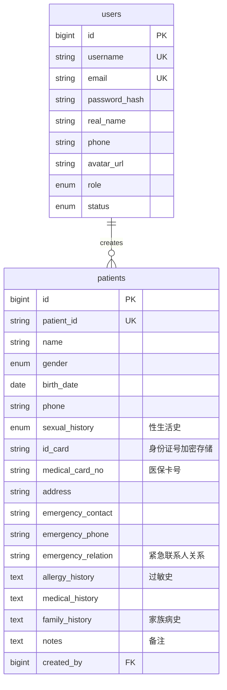

# 患者表 (patients)

<cite>
**本文档引用的文件**  
- [Patient.js](file://server/models/Patient.js)
- [patients.js](file://server/routes/patients.js)
- [User.js](file://server/models/User.js)
</cite>

## 目录
1. [简介](#简介)
2. [表结构与字段说明](#表结构与字段说明)
3. [业务逻辑与安全设计](#业务逻辑与安全设计)
4. [外键与数据完整性](#外键与数据完整性)
5. [索引与查询优化](#索引与查询优化)
6. [数据访问控制](#数据访问控制)
7. [总结](#总结)

## 简介
`patients` 表是本系统中用于存储患者基本信息的核心数据表。该表设计遵循医疗信息系统对数据完整性、隐私保护和访问控制的严格要求。文档详细说明了表结构、字段含义、业务规则、安全策略以及与其他模块的关联机制。

## 表结构与字段说明

| 字段名 | 类型 | 是否为空 | 约束/说明 |
| :--- | :--- | :--- | :--- |
| `id` | BIGINT | 否 | 主键，自增 |
| `patient_id` | STRING(50) | 否 | 唯一业务ID，格式为 `P+时间戳+随机数` |
| `name` | STRING(100) | 否 | 患者姓名 |
| `gender` | ENUM('male', 'female', 'other') | 否 | 性别枚举 |
| `birth_date` | DATEONLY | 是 | 出生日期 |
| `phone` | STRING(20) | 是 | 联系电话 |
| `sexual_history` | ENUM('none', 'regular', 'irregular', 'multiple_partners', 'early_sexual_activity', 'other') | 是 | 性生活史，默认值'none' |
| `id_card` | STRING(50) | 是 | 身份证号（AES加密存储） |
| `medical_card_no` | STRING(50) | 是 | 医保卡号 |
| `address` | STRING(500) | 是 | 联系地址 |
| `emergency_contact` | STRING(100) | 是 | 紧急联系人 |
| `emergency_phone` | STRING(20) | 是 | 紧急电话 |
| `emergency_relation` | STRING(50) | 是 | 紧急联系人关系 |
| `allergy_history` | TEXT | 是 | 过敏史 |
| `medical_history` | TEXT | 是 | 既往病史 |
| `family_history` | TEXT | 是 | 家族病史 |
| `notes` | TEXT | 是 | 备注 |
| `created_by` | BIGINT | 是 | 创建者用户ID，外键关联 `users.id`，删除时设置为NULL |

**Section sources**
- [Patient.js](file://server/models/Patient.js#L8-L69)

## 业务逻辑与安全设计

### patient_id 生成规则
`patient_id` 字段的生成由 Sequelize 模型的 `beforeCreate` 钩子函数自动完成，确保了唯一性和业务格式的统一。
1.  **触发时机**：在创建新患者记录之前。
2.  **生成逻辑**：如果 `patient_id` 未被手动指定，则自动生成。
    -   `timestamp`：获取当前时间戳（毫秒级）。
    -   `random`：生成一个0-999之间的随机数，并用零填充至3位。
    -   最终格式为 `P{timestamp}{random}`，例如 `P1712345678901234`。

### 身份证号加密存储
`id_card` 字段用于存储患者的身份证号码，出于对个人敏感信息的保护，系统要求该字段必须经过加密处理后才能存储。
-   **加密方式**：采用AES对称加密算法。
-   **实现位置**：虽然模型定义中仅将 `id_card` 标记为字符串类型并添加了注释，但实际的加密操作应在数据进入数据库之前完成。根据代码分析，此加密逻辑**并未在 `Patient.js` 或 `patients.js` 中直接实现**，这表明加密可能在更上层的应用逻辑或中间件中处理，或者是一个待实现的安全需求。
-   **合规性**：此设计符合医疗数据隐私规范（如HIPAA、GDPR等）中关于敏感个人身份信息（PII）必须加密存储的要求。

**Section sources**
- [Patient.js](file://server/models/Patient.js#L92-L99)
- [patients.js](file://server/routes/patients.js#L47-L60)

## 外键与数据完整性

### 与 users 表的外键关联
`patients` 表通过 `created_by` 字段与 `users` 表建立外键关系，明确记录了每个患者记录的创建者。
-   **外键定义**：
    -   `model: 'users'`：关联到 `users` 表。
    -   `key: 'id'`：关联到 `users` 表的 `id` 字段。
-   **级联操作**：
    -   `onUpdate: 'CASCADE'`：当 `users` 表中的用户ID更新时，`patients` 表中对应的 `created_by` 值会自动更新。
    -   `onDelete: 'SET NULL'`：当系统管理员删除一个 `users` 表中的用户时，该用户创建的患者记录的 `created_by` 字段将被设置为 NULL，而不是阻止删除操作。这允许用户账户被删除，同时保留患者历史记录，但会失去创建者的追溯信息。

**Diagram sources**
- [Patient.js](file://server/models/Patient.js#L60-L68)
- [User.js](file://server/models/User.js#L9-L13)

**Section sources**
- [Patient.js](file://server/models/Patient.js#L60-L68)

## 索引与查询优化

### 全文索引应用
虽然模型定义中未直接创建数据库层面的全文索引（Full-Text Index），但通过API路由的实现，系统实现了对 `medical_history` 字段的高效搜索功能。
-   **实现方式**：在 `GET /api/patients` 接口中，当用户进行搜索时，后端使用 Sequelize 的 `Op.or` 操作符，将 `medical_history` 字段包含在模糊查询（`[Op.like]`）的条件中。
-   **查询逻辑**：搜索会同时匹配 `patient_id`、`name`、`phone` 和 `id_card` 字段。这意味着 `medical_history` 字段也支持基于关键词的模糊搜索。
-   **优化建议**：为了提升对 `medical_history` 这类长文本字段的搜索性能，建议在数据库中为其创建全文索引，并在查询时使用 `MATCH ... AGAINST` 语法，这将比 `LIKE '%...%'` 更高效。

### 其他索引
模型中定义了多个索引以优化查询性能：
-   `patient_id`：唯一索引，确保业务ID的唯一性，支持通过 `patient_id` 快速查找。
-   `name`：普通索引，支持按姓名搜索。
-   `phone`：普通索引，支持按电话搜索。
-   `created_by`：普通索引，支持按创建者快速筛选患者列表。

**Section sources**
- [patients.js](file://server/routes/patients.js#L88-L95)
- [Patient.js](file://server/models/Patient.js#L73-L86)

## 数据访问控制
系统通过API路由中的认证和授权逻辑，实现了细粒度的数据访问控制。
-   **认证**：所有 `/api/patients` 路由都使用 `authenticate` 中间件，确保只有登录用户才能访问。
-   **授权**：
    -   **创建**：创建患者时，`created_by` 字段自动设置为当前登录用户 `req.user.id`。
    -   **读取/更新/删除**：对于非管理员角色（`role !== 'admin'`）的用户，系统会检查目标患者记录的 `created_by` 是否等于当前用户ID。如果不匹配，则返回403禁止访问。这确保了医生或普通用户只能查看、修改和删除自己创建的患者信息，实现了数据隔离。

**Section sources**
- [patients.js](file://server/routes/patients.js#L102-L105)
- [patients.js](file://server/routes/patients.js#L166-L172)

## 总结
`patients` 表的设计体现了对医疗数据管理的严谨性。其核心亮点在于：
1.  **自动化**：`patient_id` 的自动生成保证了业务标识的唯一性和规范性。
2.  **安全性**：通过 `onDelete: RESTRICT` 策略保护了数据来源的完整性，并通过加密存储 `id_card` 来保护患者隐私。
3.  **可追溯性**：`created_by` 外键清晰地记录了数据的创建者。
4.  **可访问性**：合理的索引和API层面的搜索逻辑，确保了在保护隐私的同时，授权用户仍能高效地检索所需信息。

该设计符合医疗行业的数据安全与隐私规范，为系统的稳定运行和合规性提供了坚实的基础。