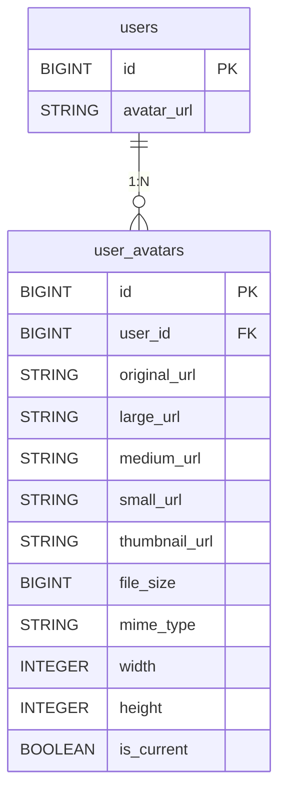
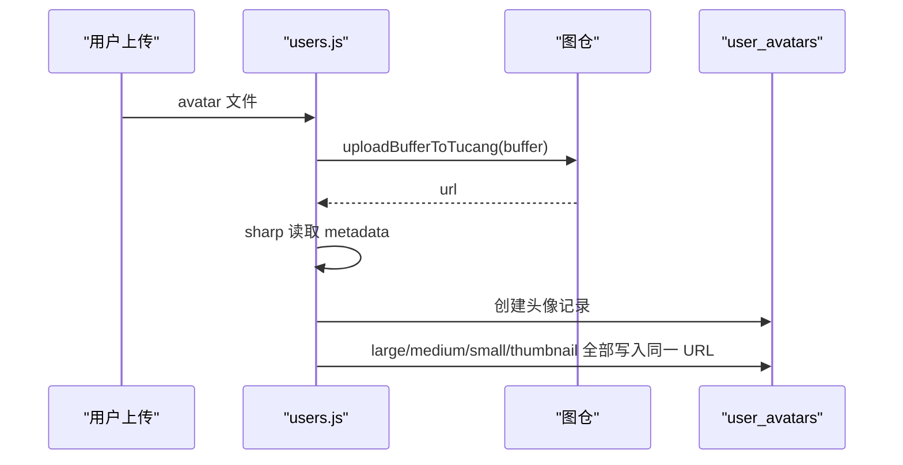

# 用户头像表 (user_avatars)

> **本文档引用文件**
> - [UserAvatar.js](file://server/models/UserAvatar.js)
> - [users.js](file://server/routes/users.js)
> - [User.js](file://server/models/User.js)

## 更新摘要

- 表结构仍保留多尺寸 URL 字段
- 当前业务实现改为图仓单 URL 复用，不再生成本地多尺寸文件
- `width`、`height`、`mime_type` 等元数据仍由上传时写入

## 一、表用途

`user_avatars` 用于记录用户头像历史与当前有效头像。它与 `users.avatar_url` 配合使用：

- `users.avatar_url`：当前头像快捷字段
- `user_avatars`：头像明细记录与历史追踪

## 二、字段定义

| 字段名 | 类型 | 约束 | 说明 |
| :--- | :--- | :--- | :--- |
| `id` | BIGINT | PK, AUTO_INCREMENT | 主键 |
| `user_id` | BIGINT | NOT NULL, FK | 关联用户 |
| `original_url` | STRING(500) | NOT NULL | 图仓原始地址 |
| `thumbnail_url` | STRING(500) | NULL | 当前实现与 `original_url` 相同 |
| `large_url` | STRING(500) | NULL | 当前实现与 `original_url` 相同 |
| `small_url` | STRING(500) | NULL | 当前实现与 `original_url` 相同 |
| `medium_url` | STRING(500) | NULL | 当前实现与 `original_url` 相同 |
| `file_size` | BIGINT | NOT NULL | 文件大小 |
| `mime_type` | STRING(50) | NOT NULL | MIME 类型 |
| `width` | INTEGER | NOT NULL | 原图宽度 |
| `height` | INTEGER | NOT NULL | 原图高度 |
| `is_current` | BOOLEAN | NOT NULL, DEFAULT true | 是否当前头像 |
| `created_at` | DATETIME | NOT NULL | 创建时间 |

## 三、关系示意



## 四、写入流程



## 五、SQL 示例

```sql
INSERT INTO user_avatars (
  user_id,
  original_url,
  large_url,
  medium_url,
  small_url,
  thumbnail_url,
  file_size,
  mime_type,
  width,
  height,
  is_current,
  created_at
) VALUES (
  1,
  'https://img1.tucang.cc/example.png',
  'https://img1.tucang.cc/example.png',
  'https://img1.tucang.cc/example.png',
  'https://img1.tucang.cc/example.png',
  'https://img1.tucang.cc/example.png',
  102400,
  'image/png',
  512,
  512,
  true,
  NOW()
);
```

## 六、设计说明

- 当前字段设计偏“兼容优先”
- 若未来接入真实多尺寸远程资源，直接替换对应字段值即可
- 当前不建议再基于此表推断“系统一定生成了四套头像文件”
