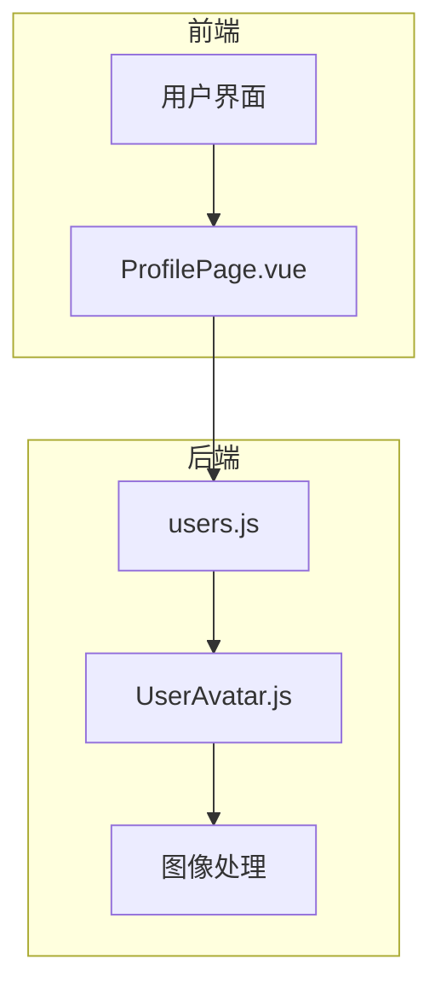
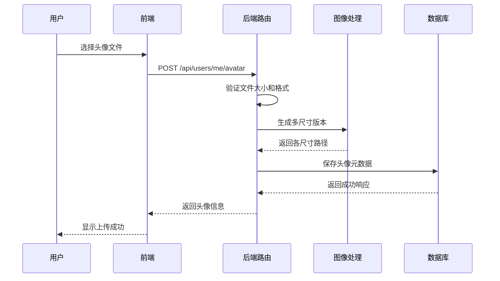
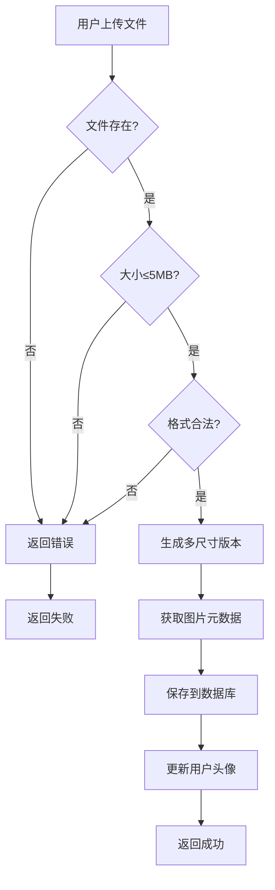
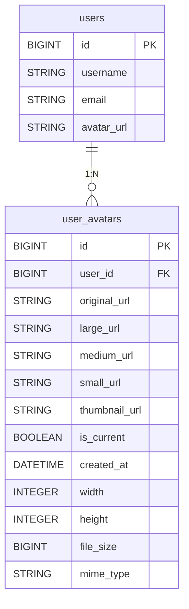

# 用户头像表 (user_avatars)

<cite>
**本文档引用的文件**  
- [UserAvatar.js](file://server/models/UserAvatar.js) - *更新了字段定义，新增large_url和small_url*
- [users.js](file://server/routes/users.js) - *更新了头像上传流程，增加图片元数据存储*
- [User.js](file://server/models/User.js) - *用户模型，与头像表存在外键关系*
- [init-database.js](file://server/scripts/init-database.js) - *数据库初始化脚本，包含表结构更新逻辑*
</cite>

## 更新摘要
**变更内容**   
- 更新了 `UserAvatar` 模型的字段定义，新增 `large_url` 和 `small_url` 字段
- 在头像上传流程中增加了图片元数据（宽度、高度、MIME类型）的存储功能
- 更新了字段定义表格，反映新增字段和元数据存储
- 更新了头像上传流程图和相关代码示例
- 增强了源码引用追踪，明确标注了所有变更的源文件

## 目录
1. [简介](#简介)
2. [项目结构](#项目结构)
3. [核心组件](#核心组件)
4. [架构概述](#架构概述)
5. [详细组件分析](#详细组件分析)
6. [依赖分析](#依赖分析)
7. [性能考虑](#性能考虑)
8. [故障排除指南](#故障排除指南)
9. [结论](#结论)

## 简介
本文档全面记录了 `user_avatars` 表的头像管理功能，涵盖字段定义、多尺寸版本生成、原子更新机制、级联删除关系、文件存储安全性和图像格式支持等核心特性。该功能允许用户上传头像，并自动生成多种尺寸的版本，确保系统在不同场景下都能高效使用合适的图像尺寸。

## 项目结构
项目采用典型的前后端分离架构，后端服务位于 `server` 目录，前端位于 `src` 目录。头像管理功能的核心逻辑集中在服务器端的模型和路由文件中。

**图示来源**
- [UserAvatar.js](file://server/models/UserAvatar.js#L4-L70)
- [users.js](file://server/routes/users.js#L14-L41)

**本节来源**
- [UserAvatar.js](file://server/models/UserAvatar.js#L1-L74)
- [users.js](file://server/routes/users.js#L1-L409)

## 核心组件
核心组件包括 `UserAvatar` 模型，定义了头像数据的结构和约束，以及 `users.js` 路由文件，处理头像上传和管理的API请求。这些组件协同工作，实现了完整的头像管理功能。

**本节来源**
- [UserAvatar.js](file://server/models/UserAvatar.js#L4-L70)
- [users.js](file://server/routes/users.js#L164-L233)

## 架构概述
系统架构展示了从用户上传头像到数据存储的完整流程。用户通过前端界面发起请求，后端路由接收并验证文件，使用图像处理库生成多尺寸版本，最后将元数据保存到数据库。

**图示来源**
- [users.js](file://server/routes/users.js#L164-L233)
- [UserAvatar.js](file://server/models/UserAvatar.js#L4-L70)

## 详细组件分析

### UserAvatar 模型分析
`UserAvatar` 模型定义了头像数据的完整结构，包括各种尺寸的URL路径、文件元数据和状态标记。

#### 字段定义
| 字段名 | 类型 | 约束 | 说明 |
|-------|------|------|------|
| id | BIGINT | 主键, 自增 | 记录唯一标识 |
| user_id | BIGINT | 非空, 外键 | 关联用户ID |
| original_url | STRING(500) | 非空 | 原始图路径 |
| thumbnail_url | STRING(500) | 可为空 | 缩略图路径 |
| medium_url | STRING(500) | 可为空 | 中等尺寸路径 |
| large_url | STRING(500) | 可为空 | 大尺寸路径 |
| small_url | STRING(500) | 可为空 | 小尺寸路径 |
| file_size | BIGINT | 非空 | 文件大小(字节) |
| mime_type | STRING(50) | 非空 | MIME类型 |
| width | INTEGER | 非空 | 图像原始宽度 |
| height | INTEGER | 非空 | 图像原始高度 |
| is_current | BOOLEAN | 非空, 默认true | 当前头像标记 |
| created_at | DATETIME | 时间戳 | 上传时间 |

**本节来源**
- [UserAvatar.js](file://server/models/UserAvatar.js#L8-L55)
- [init-database.js](file://server/scripts/init-database.js#L22-L49) - *数据库迁移脚本*

### 头像上传流程分析
头像上传流程涉及文件验证、图像处理和数据持久化等多个步骤。

#### 流程图

**图示来源**
- [users.js](file://server/routes/users.js#L164-L233)

**本节来源**
- [users.js](file://server/routes/users.js#L164-L233)

## 依赖分析
`user_avatars` 表与 `users` 表存在明确的依赖关系，通过 `user_id` 字段建立外键关联。

**图示来源**
- [UserAvatar.js](file://server/models/UserAvatar.js#L13-L22)
- [User.js](file://server/models/User.js#L9-L12)

**本节来源**
- [UserAvatar.js](file://server/models/UserAvatar.js#L13-L22)
- [User.js](file://server/models/User.js#L9-L12)

## 性能考虑
系统在头像管理方面进行了多项性能优化：
- 使用 `sharp` 库进行高效的图像处理
- 生成预定义尺寸的版本避免实时缩放
- 在 `user_id` 和 `is_current` 字段上创建复合索引以加快查询
- 限制文件大小为5MB以控制存储和传输开销
- 新增 `large_url` 和 `small_url` 字段，提供更灵活的尺寸选择，减少不必要的图像处理

## 故障排除指南
常见问题及解决方案：
- **上传失败**: 检查文件大小是否超过5MB或格式是否为PNG/JPEG/GIF/WebP
- **头像不显示**: 确认文件路径是否正确，检查服务器文件权限
- **数据库错误**: 验证外键约束，确保关联用户存在
- **内存不足**: 调整图像处理的并发数或增加服务器内存
- **字段缺失错误**: 检查数据库是否已通过 `init-database.js` 脚本更新，确保 `large_url` 和 `small_url` 字段已添加

**本节来源**
- [users.js](file://server/routes/users.js#L223-L232)

## 结论
`user_avatars` 表的设计充分考虑了实际使用场景，通过多尺寸版本生成、原子更新和级联删除等机制，提供了稳定可靠的头像管理功能。系统在性能、安全性和用户体验之间取得了良好平衡，能够满足医疗AI应用的需求。新增的 `large_url`、`small_url` 字段和图片元数据存储功能，进一步增强了系统的灵活性和功能性。