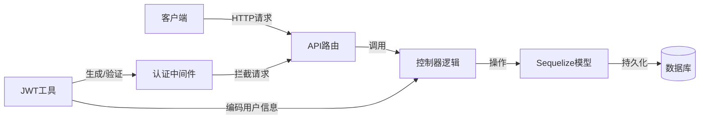
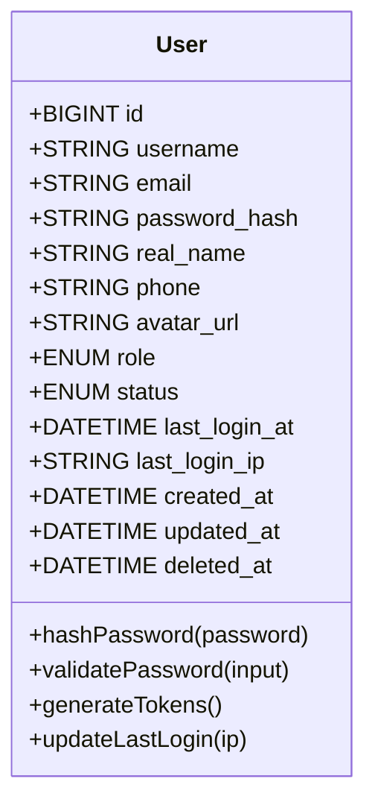
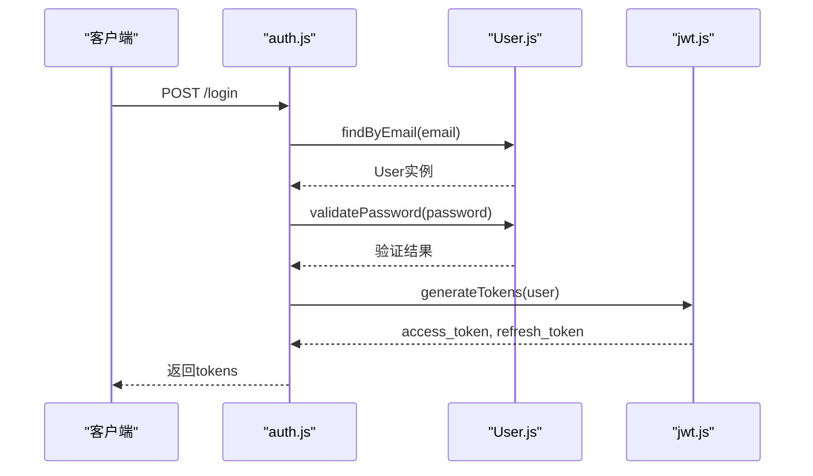
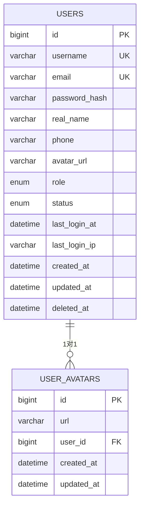
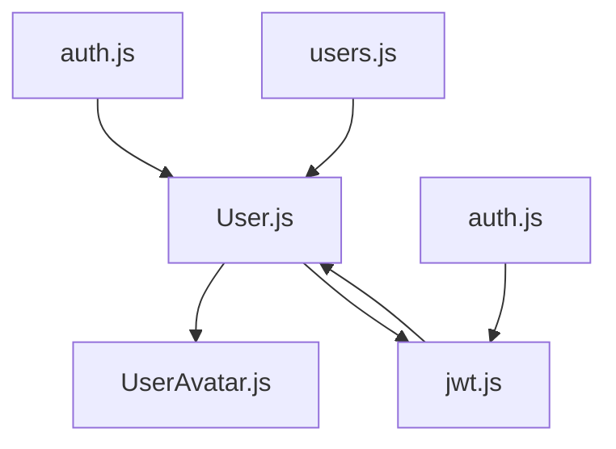

# 用户表 (users)

<cite>
**本文档中引用的文件**  
- [User.js](file://server/models/User.js)
- [UserAvatar.js](file://server/models/UserAvatar.js)
- [auth.js](file://server/middleware/auth.js)
- [auth.js](file://server/routes/auth.js)
- [users.js](file://server/routes/users.js)
- [jwt.js](file://server/utils/jwt.js)
- [database.js](file://server/config/database.js)
- [sequelize.js](file://server/config/sequelize.js)
</cite>

## 目录
1. [简介](#简介)
2. [项目结构](#项目结构)
3. [核心组件](#核心组件)
4. [架构概览](#架构概览)
5. [详细组件分析](#详细组件分析)
6. [依赖分析](#依赖分析)
7. [性能考虑](#性能考虑)
8. [故障排除指南](#故障排除指南)
9. [结论](#结论)

## 简介
本文件全面记录了CervixDetectAI系统中`users`表的结构与业务逻辑。该表是系统用户管理的核心，承载着用户身份认证、权限控制和安全审计等关键功能。文档详细说明了字段定义、索引设计、密码处理机制、JWT双token认证流程、软删除实现方式、角色权限体系以及与其他数据表的关联关系。

## 项目结构
`users`表相关的代码主要分布在模型层、路由层、中间件和工具函数中，体现了清晰的分层架构。

```mermaid
graph TB
subgraph "Models"
User[User.js]
UserAvatar[UserAvatar.js]
end
subgraph "Routes"
AuthRoute[auth.js]
UsersRoute[users.js]
end
subgraph "Middleware"
AuthMiddleware[auth.js]
end
subgraph "Utils"
JWT[jwt.js]
end
User --> UserAvatar : "hasOne"
AuthRoute --> User : "认证逻辑"
UsersRoute --> User : "CRUD操作"
AuthMiddleware --> JWT : "验证token"
JWT --> User : "查找用户"
```

**图表来源**  
- [User.js](file://server/models/User.js#L1-L100)
- [auth.js](file://server/routes/auth.js#L1-L50)
- [jwt.js](file://server/utils/jwt.js#L1-L30)

**本节来源**  
- [server/models](file://server/models)
- [server/routes](file://server/routes)
- [server/middleware](file://server/middleware)
- [server/utils](file://server/utils)

## 核心组件
`users`表的核心功能由Sequelize模型定义驱动，配合JWT认证机制和中间件实现完整的用户生命周期管理。

**本节来源**  
- [User.js](file://server/models/User.js#L1-L150)
- [jwt.js](file://server/utils/jwt.js#L1-L50)

## 架构概览
系统采用基于Sequelize ORM的模型-视图-控制器（MVC）模式，`users`表作为核心数据实体，通过API路由暴露操作接口，由认证中间件保护，并利用JWT进行无状态会话管理。



**图表来源**  
- [User.js](file://server/models/User.js#L1-L20)
- [auth.js](file://server/middleware/auth.js#L1-L40)
- [jwt.js](file://server/utils/jwt.js#L1-L25)

## 详细组件分析

### 用户模型分析
`User`模型定义了用户数据的结构、约束和行为，是整个用户系统的基础。

#### 字段定义


**图表来源**  
- [User.js](file://server/models/User.js#L15-L80)

#### 业务逻辑实现


**图表来源**  
- [auth.js](file://server/routes/auth.js#L20-L60)
- [User.js](file://server/models/User.js#L85-L120)
- [jwt.js](file://server/utils/jwt.js#L15-L40)

#### 软删除与关联关系


**图表来源**  
- [User.js](file://server/models/User.js#L30-L50)
- [UserAvatar.js](file://server/models/UserAvatar.js#L10-L25)

**本节来源**  
- [User.js](file://server/models/User.js#L1-L200)
- [UserAvatar.js](file://server/models/UserAvatar.js#L1-L40)
- [auth.js](file://server/routes/auth.js#L1-L80)
- [jwt.js](file://server/utils/jwt.js#L1-L50)

## 依赖分析
`User`模型与其他组件存在明确的依赖关系，形成了完整的用户管理生态。



**图表来源**  
- [User.js](file://server/models/User.js#L1-L10)
- [auth.js](file://server/routes/auth.js#L5-L10)
- [jwt.js](file://server/utils/jwt.js#L5-L10)

**本节来源**  
- [User.js](file://server/models/User.js)
- [auth.js](file://server/routes/auth.js)
- [jwt.js](file://server/utils/jwt.js)

## 性能考虑
- `username`和`email`字段的唯一索引确保了登录查询的高效性
- `status`和`created_at`的普通索引优化了用户状态筛选和时间范围查询
- 使用bcrypt进行密码哈希，平衡了安全性与计算开销
- JWT的无状态特性减少了数据库查询频率，提升了认证性能

## 故障排除指南
常见问题包括：
- 用户无法登录：检查密码哈希是否正确生成，验证JWT密钥配置
- Token失效：确认refresh token机制是否正常工作
- 头像关联失败：验证外键约束和级联更新设置
- 软删除数据未过滤：确保在Sequelize查询中正确使用`paranoid: true`选项

**本节来源**  
- [User.js](file://server/models/User.js#L100-L150)
- [auth.js](file://server/middleware/auth.js#L20-L50)
- [jwt.js](file://server/utils/jwt.js#L30-L60)

## 结论
`users`表的设计体现了现代Web应用的安全性和可维护性要求。通过合理的字段定义、索引策略和业务逻辑封装，实现了安全的用户认证、灵活的权限控制和可靠的审计追踪。Sequelize ORM的使用简化了数据库操作，而JWT双token机制则提供了良好的用户体验和安全性平衡。