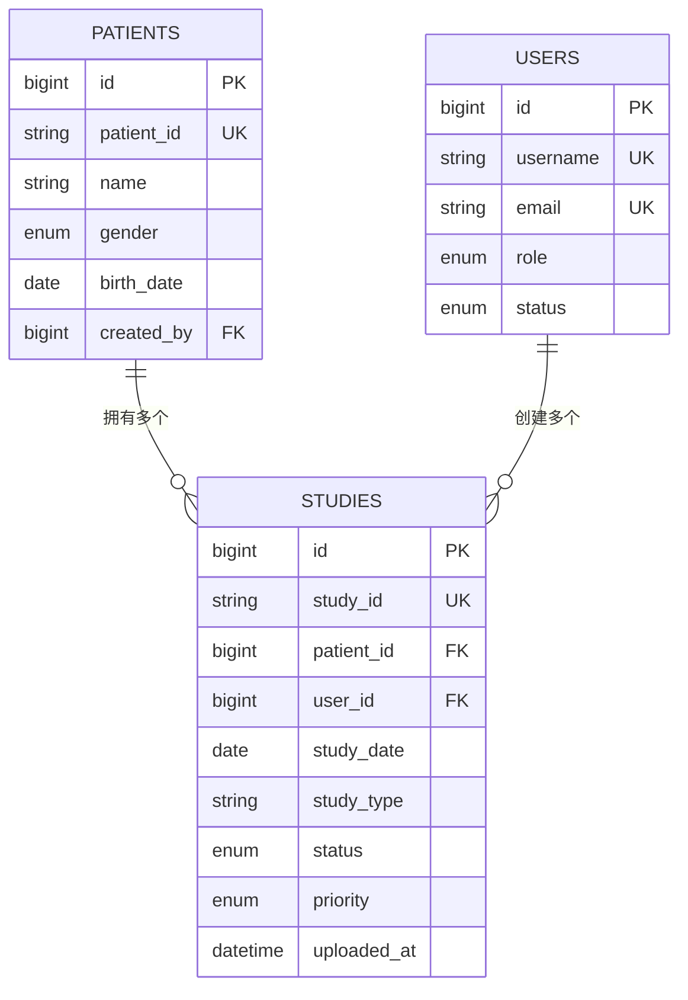
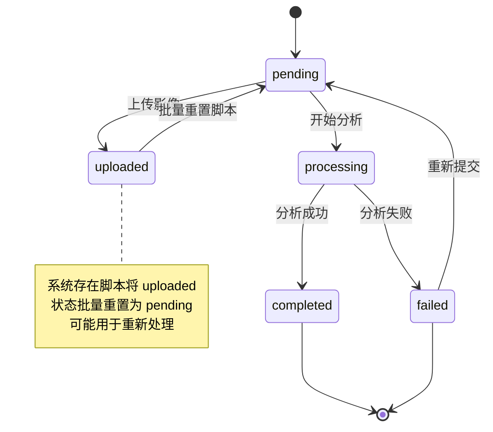

# 病例表 (studies)

> **本文档引用文件**  
> - [Study.js](file://server/models/Study.js)
> - [studies.js](file://server/routes/studies.js)
> - [Patient.js](file://server/models/Patient.js)
> - [User.js](file://server/models/User.js)
> - [update-study-status.js](file://server/scripts/update-study-status.js)
> - [update-status.sql](file://server/scripts/update-status.sql)

## 目录
1. [简介](#简介)
2. [表结构详解](#表结构详解)
3. [状态管理机制](#状态管理机制)
4. [优先级与处理队列](#优先级与处理队列)
5. [外键关系分析](#外键关系分析)
6. [索引优化策略](#索引优化策略)
7. [状态流转业务流程图](#状态流转业务流程图)

## 简介
`studies` 表是宫颈癌AI检测系统中的核心数据实体之一，用于存储医学检查病例的完整信息。该表不仅记录了患者检查的基本元数据，还通过状态机机制实现了对病例处理流程的精细化控制。本文档深入解析其字段设计、状态流转逻辑、外键关联以及性能优化策略，为系统维护和功能扩展提供技术参考。

## 表结构详解

`studies` 表定义了完整的医学检查记录结构，主要字段如下：

| 字段名 | 类型 | 是否为空 | 默认值 | 说明 |
|--------|------|----------|--------|------|
| id | BIGINT | 否 | 自增 | 主键 |
| study_id | STRING(50) | 否 | 无 | 唯一检查编号（自动生成） |
| patient_id | BIGINT | 否 | 无 | 外键，关联患者表 |
| user_id | BIGINT | 否 | 无 | 外键，创建者用户 |
| study_date | DATE | 否 | 无 | 检查日期 |
| study_type | STRING(50) | 否 | 无 | 检查类型（如宫颈细胞学检查） |
| description | TEXT | 是 | NULL | 描述信息 |
| department | STRING(100) | 是 | NULL | 科室 |
| doctor_name | STRING(100) | 是 | NULL | 医生姓名 |
| clinical_diagnosis | TEXT | 是 | NULL | 临床诊断 |
| symptoms | TEXT | 是 | NULL | 症状描述 |
| status | ENUM | 否 | pending | 状态机：pending/uploaded/processing/completed/failed |
| priority | ENUM | 否 | normal | 优先级：normal/urgent/emergency |
| uploaded_at | DATE | 否 | NOW() | 上传时间 |

**Section sources**
- [Study.js](file://server/models/Study.js#L8-L85)

## 状态管理机制

`status` 字段采用枚举类型实现状态机控制，定义了五个关键状态：
- `pending`：待处理（初始状态）
- `uploaded`：影像已上传
- `processing`：正在分析
- `completed`：已完成
- `failed`：失败

状态流转由业务逻辑驱动，通过API接口和后台脚本共同维护。例如，在创建新病例时，默认状态为 `pending`；当影像文件上传完成后，可手动或自动更新为 `uploaded`。

特别地，系统中存在一个维护脚本 `update-study-status.js`，其功能是将所有 `uploaded` 状态的病例批量更新为 `pending`，这表明系统可能在特定场景下需要重置处理流程。

**Section sources**
- [Study.js](file://server/models/Study.js#L71-L75)
- [studies.js](file://server/routes/studies.js#L95)
- [update-study-status.js](file://server/scripts/update-study-status.js#L23-L27)

## 优先级与处理队列

`priority` 字段定义了病例处理的紧急程度，包含三个级别：
- `normal`：普通（默认）
- `urgent`：紧急
- `emergency`：特急

该字段直接影响病例在分析队列中的调度顺序。高优先级的病例（如 `emergency`）将在任务调度器中被优先取出并分配给AI分析引擎，确保关键病例得到及时处理。此机制支持医院在高峰期或突发事件中灵活调整资源分配策略。

虽然当前代码中未直接体现优先级排序逻辑，但可通过查询参数在获取病例列表时进行排序，从而实现前端或调度服务的优先级感知。

**Section sources**
- [Study.js](file://server/models/Study.js#L76-L80)

## 外键关系分析

`studies` 表通过外键与 `patients` 和 `users` 表建立强关联：

- `patient_id` → `patients.id`：表示该检查所属的患者。外键约束设置为 `ON UPDATE CASCADE, ON DELETE RESTRICT`，确保患者信息更新时同步，但防止误删患者导致病例丢失。
- `user_id` → `users.id`：表示创建该病例的用户。同样采用 `CASCADE/RESTRICT` 策略，保障数据一致性。

此外，系统权限控制在路由层实现：非管理员用户只能操作自己创建的病例（通过 `user_id` 匹配），确保数据隔离与安全。

**Diagram sources**
- [Study.js](file://server/models/Study.js#L18-L37)
- [Patient.js](file://server/models/Patient.js#L60-L69)
- [User.js](file://server/models/User.js#L43-L47)

## 索引优化策略

为提升查询性能，`studies` 表定义了多个索引，特别是复合索引的设计显著优化了常见查询场景：

- 单字段索引：`study_id`（唯一）、`patient_id`、`user_id`
- 复合索引：
  - `(patient_id, study_date)`：支持按患者查询历史检查记录
  - `(status, created_at)`：支持按状态和时间排序获取待处理病例（如分页查询）

其中，`(status, created_at)` 复合索引对于任务调度器至关重要，能够高效检索出所有 `pending` 状态且按创建时间排序的病例，确保先进先出（FIFO）或优先级混合调度的实现。

**Section sources**
- [Study.js](file://server/models/Study.js#L89-L105)

## 状态流转业务流程图

**Diagram sources**
- [Study.js](file://server/models/Study.js#L72)
- [update-status.sql](file://server/scripts/update-status.sql#L3)
- [update-study-status.js](file://server/scripts/update-study-status.js#L23-L27)